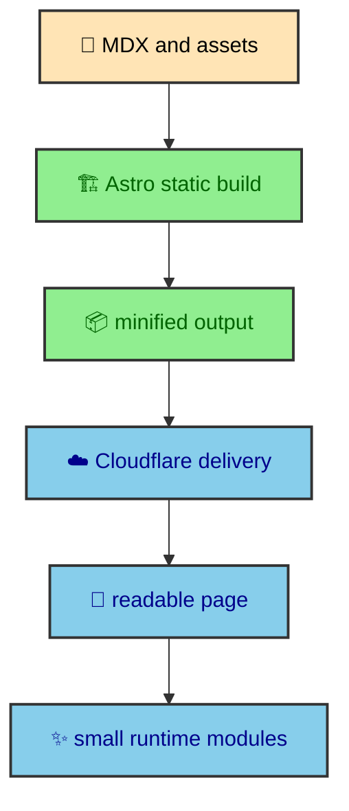

Performance on this site is not treated as a final cleanup step. It is part of the way the site is assembled. Astro builds pages as static HTML, Vite shapes the generated assets, CSS is loaded through a controlled import order, images are transformed ahead of delivery, and the runtime only improves pages that already exist. That combination matters because the site is a journal, a portfolio, and a visual system at the same time.

---

## The performance shape

The performance strategy has three layers. The first layer is generation. Astro turns MDX, layouts, images, fonts, Mermaid diagrams, and custom content loaders into a static site. The second layer is delivery. The generated files are minified and served from Cloudflare Workers Static Assets. The third layer is interaction. Small browser modules keep theme state, overlays, article navigation, and diagram expansion comfortable after the page has loaded.

Those layers are deliberately separate. Static generation should decide what content exists. Build optimization should reduce the weight of that content without changing meaning. Runtime enhancement should make an already-readable document easier to use. When those responsibilities stay separate, the site stays fast without becoming fragile.

The diagram is intentionally plain. The important thing is that the browser is near the end of the chain, not the beginning. The browser receives a document that already has headings, article content, code blocks, images, Mermaid SVGs, navigation context, and metadata. JavaScript can improve the experience, but it is not responsible for inventing the page.

---

## Static output first

The site uses `output: "static"` in `astro.config.mjs`. That one setting shapes almost every performance decision. The journal route creates static paths from the content manifest. The Atlas widget fetches current data during the build through an Astro content loader. Mermaid diagrams are rendered during the integration pipeline and inserted as SVG. Images are transformed by Astro's Sharp service before deployment. Even the HTML minifier runs after Astro has finished writing pages to `dist/`.

Static output changes the performance problem. The site does not need a server to assemble article pages on request. It does not need a client application to fetch MDX and render it in the browser. It can spend build time preparing documents so each request is mostly a file delivery event.

That is why many features in this codebase look slightly more elaborate than their visible UI suggests. The manifest builder does more than list posts because it prepares all route context ahead of time. The Mermaid integration does more than run a renderer because it prepares diagrams, emits SVG image assets, and records theme-specific metadata before the reader arrives. The Atlas loader does more than fetch one score because it turns outside data into a stable content entry the homepage can render like any other source.

The repository proves this division of work, but it does not prove raw speed. It contains no recorded Lighthouse run, Web Vitals dataset, navigation timing benchmark, or bundle budget. A page should still be valid before JavaScript runs, yet that architectural property must not be presented as a measured performance result.

> Current evidence boundary. The deterministic build proves that static pages and assets can be generated, and the artifact check enforces the 500 KiB raw JavaScript file budget. Performance claims still need measurements, so passing the budget should be treated as a guardrail rather than a speed result.

---

## Navigation should feel ready

The navigation layer is where static output gets an application-like transition. `BaseLayout.astro` imports Astro's `ClientRouter`, and the shared `<main>` uses a named transition with a fade animation. Internal page changes can swap content without a full visual reset, while the site still keeps the simplicity of static generation.

The prefetch strategy is intentionally conservative. `astro.config.mjs` uses `prefetchAll: false` and `defaultStrategy: "tap"`. The site can warm likely next pages when a reader shows intent, but it does not ask the browser to crawl the whole journal in the background. That matters for a vault-style section because a tree of related pages can grow quickly. Whether this improves timing remains unmeasured in the repository.

Theme code also participates in perceived performance. A page that swaps quickly but flashes the wrong theme feels broken. The inline theme bootstrap runs before the module scripts, while `theme_manager.ts` reapplies the theme during Astro lifecycle events. `astro:before-swap` applies the current theme to the incoming document, and `astro:after-swap` clears transition suppression after the page is ready. The reader sees continuity instead of a color reset.

The navigation article in this section goes deeper into that lifecycle. The short version is that speed is not only about fewer bytes. It is also about visual confidence. Header, footer, theme state, and content transitions need to agree with each other so the page feels ready as soon as it appears.

---

## Generated files stay intentional

The second performance layer is output weight. This is where Vite, Oxc, Tailwind, DaisyUI, the custom HTML minifier, SVG compression, and Mermaid asset emission all meet.

The project uses Vite production minification through Oxc and enables CSS minification. Tailwind 4 and DaisyUI 5 are loaded from `global.css`, but DaisyUI is not allowed to emit every component it knows about. The include list names the components used by the site, such as buttons, cards, navbar, swap, badge, menu, modal, table, and a few others. That list is a performance decision and a design-system decision at the same time. A smaller component vocabulary produces less CSS and fewer accidental UI dialects.

The custom HTML minifier runs at `astro:build:done`. It walks generated HTML files under `dist/`, skips the built asset folder, and minifies document HTML after Astro and the integrations have done their work. It protects `<pre>`, `<code>`, and `<kbd>` fragments because this site publishes code-heavy articles. Preserving those fragments is more important than squeezing a few extra bytes from the wrong place.

Mermaid has its own output strategy. Static SVG images keep diagrams visible inside the article without browser rendering. Standalone SVG assets are useful because the reader can open a larger version and the browser can cache the heavy diagram payload independently. The performance work follows the shape of the content instead of applying one generic optimizer to everything.

---

## Images and fonts get priority

Images and fonts are handled as first-class assets because readers feel them immediately. The config uses Astro's Sharp image service with `limitInputPixels: true`. Article images use `Picture` where responsive variants make sense. The Atlas homepage section uses manual `<picture>` sources because the mobile and desktop crops have different design jobs.

Font loading has the same intentional shape. Astro's font configuration registers Inter and Montserrat through Fontsource and Fira Code through a local subsetted WOFF2 file. The CSS theme maps those font variables into `--font-sans`, `--font-display`, `--font-reading`, and `--font-mono`. Display and reading fonts affect the first impression, so they are part of the page foundation. The code font is important, but it only matters when a reader reaches code blocks, so it does not need the same priority.

This is where the site avoids a common trap. Asset performance is not only about making files smaller. It is about choosing which files deserve early attention. A publication header image can be a Largest Contentful Paint candidate. A background image deep in the homepage can load lazily. A reading font affects nearly every article. A monospace font is important for code samples but should not hold the whole page hostage.

The image and font article expands that logic component by component.

---

## Where the work belongs

The main rule of this section is simple. Put the expensive work as early as the project can honestly do it.

If the value can be known from MDX, frontmatter, or the filesystem, the manifest should compute it during the build. If a diagram can be rendered before deployment, the integration should render it before deployment. If an image can be transformed into formats and widths ahead of time, Astro should do that. If a theme can be applied before first paint, the bootstrap should apply it before the module runtime arrives.

Runtime code still has a role. It handles things that depend on the reader's browser, such as current theme toggles, viewport scroll position, dialog focus, local timezone formatting, and diagram popovers. Those are interaction details. They should not be confused with publication data.

That separation gives the site a practical performance posture. Build-time systems can be richer because they do not run on every page view. Runtime modules can stay small because they only handle user-facing behavior that genuinely needs the browser. CSS can stay organized because global tokens and partials decide visual rules before component-specific code appears.

---

## Reading path

The pages in this section follow the same layered model.

`navigation` explains why internal page changes feel quick while the site stays static. It covers Astro `ClientRouter`, view transitions, tap prefetching, theme continuity, and reduced motion.

`file_optimization` explains the generated output. It covers Vite, Oxc, DaisyUI's include list, Tailwind output, the custom HTML minifier, SVG compression, Mermaid SVG assets, and Cloudflare delivery.

`image_and_font_strategy` explains the assets that shape first paint and first read. It covers Astro's image service, `Picture`, manual responsive backgrounds, font registration, font variables, and priority choices.

Together, those articles describe a site that is built to be quick before it is built to feel fancy. The visual details still matter, but they ride on top of a static publishing model, a constrained CSS vocabulary, and runtime modules that know their place.

---

## Performance rule

The site should feel fast because the build has done the expensive work. Runtime code should improve the interaction after the page exists, not become the reason the page can be read.

That rule appears everywhere in this section. The browser gets static HTML, optimized assets, and small enhancement scripts. It should not receive avoidable rendering work.
