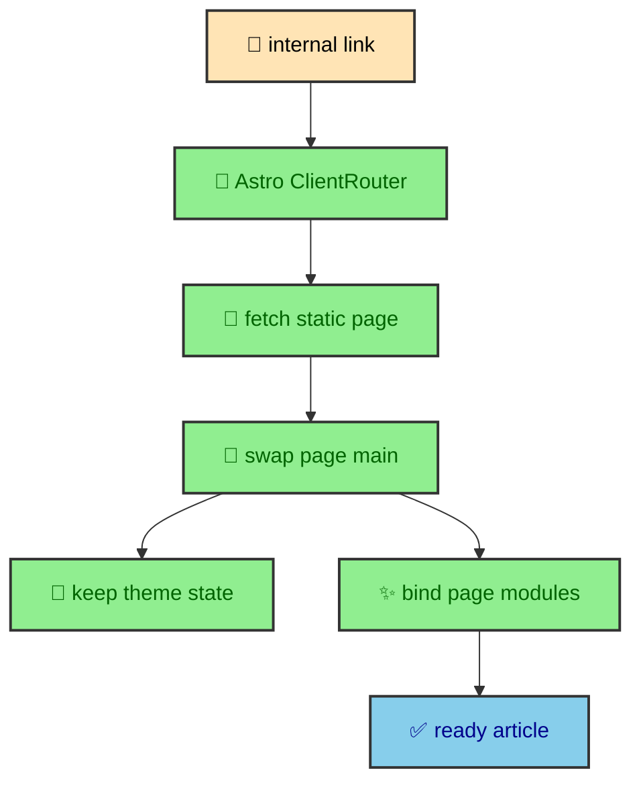
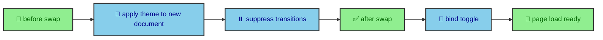

The site is static, but internal navigation should not feel like a stack of unrelated documents. The build produces real pages, then Astro's router, view transitions, conservative prefetching, and theme lifecycle hooks make movement between those pages feel settled. This article explains that layer. The goal is not to hide the static nature of the site. The goal is to make static pages feel ready when the reader chooses them.

---

## Static routes with a client bridge

Astro generates the journal as ordinary static routes. The dynamic route at `src/pages/thejournal/[...slug].astro` receives a list of paths from the manifest and renders every published entry at build time. A reader can open any article directly, refresh it, share it, or browse with JavaScript disabled. That foundation is important because the router is an enhancement, not the publishing engine.

`BaseLayout.astro` adds the client bridge by importing `ClientRouter` from `astro:transitions`. When the reader follows an internal link, Astro can swap the new page into the current document instead of performing a full browser navigation. That makes movement through the vault feel closer to an application while preserving the strengths of static output.

The shared `<main>` receives `transition:name="page-main"` and `transition:animate="fade"`. The header, footer, theme bootstrap, module imports, and overlay slot live around that region. The result is a stable document shell with a content area that can change cleanly.



This design gives the site a useful split. The serverless host only needs to deliver files. The router only needs to coordinate movement between files. The article itself still comes from the build.

---

## Tap prefetching

`astro.config.mjs` sets prefetching to a conservative strategy. Prefetching means the browser can start fetching a likely next page before the reader fully navigates there, usually after an intent signal such as a tap.

```ts
prefetch: {
  prefetchAll: false,
  defaultStrategy: "tap",
}
```

The site applies `data-astro-prefetch` where it helps navigation without asking the browser to fetch everything. Vault tree nodes, pagination cards, and key navigation links can warm the next page after a tap or similar intent signal. That choice matches the shape of the journal. A vault can contain many sibling and child entries, and fetching every possible target would waste bandwidth on pages the reader may never open.

Tap prefetching is a modest feature, but it has a large effect on how navigation feels. The browser can begin work after intent appears. The page the reader is currently on keeps priority. The site does not need a custom predictive system or a large client bundle.

This is also why the article components do not try to own navigation themselves. Cards, tree links, dock buttons, and pagination controls can mark their links with the prefetch attribute and let Astro handle the behavior. That keeps navigation policy close to the router instead of scattering fetch logic through components.

---

## View transitions

The page transition is intentionally quiet. A journal should not turn every route change into a performance. The fade on `main#main-content` gives the reader enough visual continuity to understand that the page changed, while the surrounding document keeps its shape.

The transition target is also the right size. If the whole document were treated as a transition object, the header, footer, overlays, and theme script would feel tied to every article change. If only tiny fragments transitioned, the page could feel patched together. The main region is the natural boundary because it contains the article or page-specific content, while the shell keeps the site identity stable.

Reduced motion belongs to CSS. The transition partial handles motion policy, including user preference. That keeps accessibility behavior declarative and close to the visual rule it modifies.

The key principle is that navigation animation should support orientation. It should not become content. The site uses just enough transition to soften the route swap and then gets out of the reader's way.

---

## Theme lifecycle

Theme code listens to Astro lifecycle events. `astro:before-swap` applies the current theme to the incoming document and suppresses transitions. `astro:after-swap` reapplies the theme and removes the no-JS class. `astro:page-load` binds the toggle for the new page.



The theme lifecycle is a performance detail because flashes are perceived as slowness. A route swap that paints light mode for a moment before returning to dark mode feels late, even if the network and JavaScript timing are technically good.

The inline bootstrap in `BaseLayout.astro` runs before module loading. It reads `localStorage.theme`, falls back to `prefers-color-scheme`, updates `html[data-theme]`, sets `color-scheme`, removes `.no-js`, and updates the theme color meta tag. That gives the first paint the correct palette.

The module runtime in `theme_manager.ts` then owns persistence and navigation. It uses a fixed storage key, reads the system preference when storage has no value, and binds the toggle with a `data-bound` guard. During an Astro swap, the manager applies the theme to the incoming document before the swap is visible. After the swap, it applies the theme again to the live document and clears transition suppression after two animation frames.

That double application is not accidental. The incoming document and the current document are different objects during the navigation lifecycle. Applying the theme to both keeps the route change visually consistent.

---

## Runtime rebinding

Client-side navigation means some modules need to bind to the new page after each swap. The site handles that through Astro lifecycle events instead of through component-level guessing.

The theme manager listens to `astro:page-load` and binds the theme toggle. The On This Page runtime destroys old instances on `astro:before-swap` and mounts new instances on `astro:page-load`. Overlay behavior is registered with a global guard, then resets scroll lock around route changes. The Mermaid shell is a custom element, so each element connects when it appears in the swapped page.

This pattern is small, but it is one of the main reasons the site can feel fast without becoming messy. Modules that depend on document content treat navigation as a lifecycle. Modules that are global protect themselves from duplicate registration. Components can render the right HTML and let the runtime attach behavior when the document is ready.

---

## Link surfaces

Navigation speed is also influenced by which surfaces are easy to reach. The journal layout has a desktop sidebar, a mobile dock, breadcrumbs, previous and next pagination, and vault tree links. Those are not only information architecture features. They reduce the amount of searching a reader has to do between route changes.

Because route context comes from the manifest, those link surfaces stay consistent. A previous link points to the previous published entry in traversal order. A vault child knows its parent tree. A mobile dock can open the same article navigation that appears as a sidebar on large screens. The router then makes movement through those links feel quick.

The result is a publishing system where navigation behavior and content structure support each other. Pages are nearby, paths are predictable, and the browser can swap a static document into a stable shell. The repository does not measure whether those choices reduce navigation time.

---

## Why it stays static

It is worth naming what this navigation layer does not do. It does not turn the site into a client-rendered application. It does not ask the browser to fetch article data, parse MDX, calculate pagination, or render Mermaid from source. Those responsibilities remain in the build.

That matters for direct visits. A reader can land on a deep article from search, a message, or a bookmark and receive a complete page. The same route can then participate in client-side navigation once the reader moves around the site. Static output gives every page independence. Astro's router gives the session continuity.

This combination is especially useful for a long vault. The reader may jump from a catalog card to a child article, then to the next page, then back to a section index. Each route has its own generated HTML, but the session feels connected because the shell, theme, and transition behavior stay stable.

---

## Measure the navigation claim

The navigation design combines a static foundation, Astro client-side swaps, tap prefetching, a transition boundary around main content, and theme lifecycle hooks. Those mechanisms are verified in source and selected browser tests. The word "instant" is not, because no cold-load or prefetched navigation timing has been recorded.

That stack fits the site because the journal wants both traits. It wants the durability of static pages and the comfort of smooth reading sessions. The implementation does not ask the browser to become a full app shell. It gives the browser enough structure to make a static site feel alive.

The intended outcome is continuity while every route remains a static URL. A useful follow-up would measure one cold direct visit and one prefetched route swap on representative mobile and desktop conditions, then publish the timing and loaded chunks beside this design explanation.
