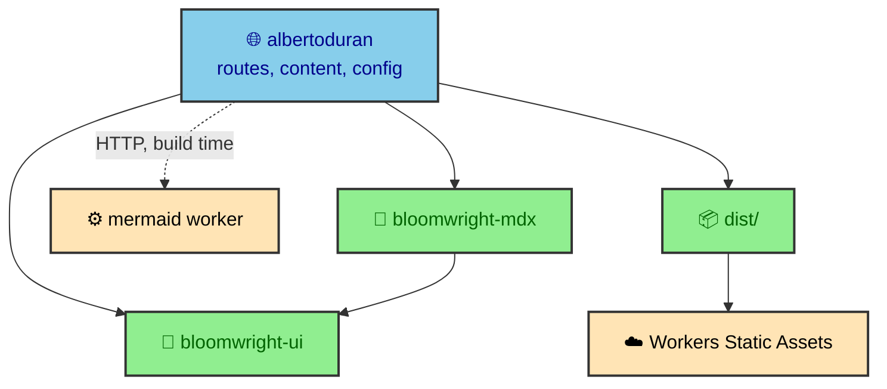

Before the fences, the render Worker, or the browser enhancements make much sense, you need the ground rules. This site is four repositories that collapse into one deployed thing. Three of them are code you install, one is a service you call, and the output is a single folder of static files. This section explains where the code lives now, how the workspace reproduces it, and what the production host expects, so the rest of the vault reads as architecture instead of scattered notes.

---

## The system, not the folder list

These pages are organized by system rather than by the `src/` folder tree, because the reusable code moved into packages that a folder list would miss. Four repositories, with the dependency arrows pointing one way and never back.

The `bloomwright/` section covers the two packages in depth, including what each is allowed to know. This section stays at the system level. Where the remaining code lives, how it is built, and how it ships.

---

## What each page here answers

The four platform pages trace the system from repository to reader.

- `repository_shape` walks what is left in `src/` after extraction, and traces one publication change through the boundaries that remain.
- `workspace` covers the Node 22 devcontainer, how `github:` dependencies resolve, and what a source-shipped package costs a consumer.
- `delivery` covers the path from `dist/` to Cloudflare Workers Static Assets, and separates what is configuration from what is an unverified platform capability.

Read `repository_shape` first if you want to locate code. Read `workspace` if you are booting the project or co-developing a package. Read `delivery` if you want to understand why so much work happens during the build.

---

## One deployed artifact

The four repositories converge on one output. Astro builds the app into a `dist/` directory, and Cloudflare Workers Static Assets serves that directory. There is no application server assembling pages at request time. The packages contribute code, the Worker contributes rendered diagrams during the build, and all of it settles into finished files before anything deploys.

That convergence is the reason the build does so much. Content validation, manifest policy, diagram rendering, chart rendering, image optimization, and HTML minification all run before deploy, because the production host serves files and nothing else. The `delivery` page picks up what that host actually receives, and the `rendering/` and `authoring/` sections cover the work that fills the folder.

---

## Why this comes first

Everything else in the vault sits on these three answers. Where the code lives, how it runs locally, and what production expects. Authoring depends on the content collection and the route surface. Rendering depends on build-time integrations and the Worker. The interface depends on the shared layout and the runtime boundary. Evidence depends on deterministic builds and a production preview.

The system has leaks, and later sections name them. But the ownership is visible. A new publication belongs in the content tree, a new route belongs in `src/pages`, a new build transformation is now usually a package concern, and a new browser enhancement belongs in `src/runtime`. Placing work where its information lives is the rule this whole site is organized around.
