Code examples are part of the article, not a widget that should wake up after the page loads. A reader scanning a technical post needs syntax color, line numbers, wrapping, and dark-theme support before any client script has a chance to run. This site does that work during the Astro build, then wraps the result in a small DaisyUI shell that fits the journal.

---

## Build-time highlighting

Astro uses Shiki for Markdown code highlighting. Shiki is a syntax highlighter that turns source code into themed HTML spans during the build, using the same grammar engine many editors rely on. In this project, the configuration lives in `astro.config.mjs` under the `markdown` key, beside the other build rules that shape article content.

```ts
markdown: {
  shikiConfig: {
    themes: {
      light: "one-light",
      dark: "one-dark-pro",
    },
    defaultColor: "light",
    transformers: [
      {
        line(node, line) {
          node.properties["data-line"] = line;
        },
      },
    ],
  },
}
```

This setup means fenced code blocks are transformed during the build. The browser receives HTML with token spans and theme variables already present. There is no client-side highlighter to download, parse, or execute for ordinary article reading.

That choice fits the rest of the publication system. The site already treats MDX, Mermaid diagrams, route data, and image metadata as build-time work. Code highlighting belongs in the same bucket because the source is known before deployment.

---

## Dual themes

The Shiki config declares a light theme and a dark theme. Light output uses `one-light`. Dark output uses `one-dark-pro`. The `defaultColor` is set to `"light"`, so the unqualified token colors start from the light theme.

Shiki stores dark-theme token data in CSS custom properties such as `--shiki-dark`. The journal CSS then activates those values when the page theme is dark.

```css
[data-theme="dark"] .mockup-code span {
  color: var(--shiki-dark) !important;
  font-style: var(--shiki-dark-font-style) !important;
  text-decoration: var(--shiki-dark-text-decoration) !important;
}
```

That keeps the highlighted HTML static while allowing the theme to change at runtime. The code block does not need to rerender when the reader switches themes. CSS picks the correct token values.

### Why light is the default

Defaulting to light gives the initial HTML a safe baseline. If a browser reads the page before theme attributes settle, the token colors are still legible against the normal light code background. Once the theme manager applies `data-theme="dark"`, the CSS overrides take over.

This matches the general theme strategy of the site. The build emits content that can stand on its own. Runtime code then improves the experience by syncing the chosen theme across the shell.

---

## Line numbers

The Shiki transformer adds `data-line` to every rendered line. It does not modify the code text itself, which keeps copy behavior separate from presentation.

```ts
transformers: [
  {
    line(node, line) {
      node.properties["data-line"] = line;
    },
  },
],
```

The CSS reads that attribute and displays it before each line, so numbering stays in the visual layer while the source remains clean.

```css
.mockup-code .line::before {
  content: attr(data-line) !important;
  display: inline-block !important;
  width: 3.5rem !important;
  min-width: 3.5rem !important;
  padding-right: 1.25rem !important;
  text-align: right !important;
  user-select: none;
  opacity: 0.4;
}
```

This separation is useful. The source remains copyable as source, while the visual layer adds reference numbers for readers. When an article says "look at line 7", the number is a presentation aid, not part of the code sample.

---

## The CodeBlock wrapper

The MDX route maps `pre` to `CodeBlock`, which lives at `src/components/ui/mdx/CodeBlock.astro`. The component is intentionally small because Shiki has already done the heavy rendering work.

```astro
<div class="not-prose">
  <div
    class="mockup-code my-8 border border-base-300 shadow-2xl text-sm bg-base-200"
  >
    <div class="overflow-x-auto">
      <slot />
    </div>
  </div>
</div>
```

Shiki already owns the token spans. The wrapper owns the article chrome. It opts out of prose typography with `not-prose`, applies DaisyUI `mockup-code`, adds a border and shadow, then gives the code an overflow container.

```mermaid
flowchart LR
    Fence[📝 Fenced code] --> Shiki[🎨 Shiki HTML]
    Shiki --> Pre[📦 pre override]
    Pre --> Wrapper[🧱 CodeBlock wrapper]
    Wrapper --> Css[🎛️ Code CSS]
    Css --> Article[🌐 Journal article]

    classDef source fill:#FFE4B5,stroke:#333,stroke-width:2px,color:black
    classDef build fill:#90EE90,stroke:#333,stroke-width:2px,color:darkgreen
    classDef component fill:#87CEEB,stroke:#333,stroke-width:2px,color:darkblue
    classDef output fill:#E6E6FA,stroke:#333,stroke-width:2px,color:darkblue

    class Fence source
    class Shiki,Pre build
    class Wrapper,Css component
    class Article output
```



The small wrapper is a good sign. The component does not need parsing logic, copy buttons, or theme scripts to satisfy the current design. It lets the build and CSS do their jobs.

---

## Code block CSS

Most of the behavior lives in `src/styles/ui/mdx/_code-block.css`. That file styles DaisyUI's `mockup-code` class and the Shiki output inside it, while leaving the Astro component mostly structural.

The core line rule uses `pre-wrap` and `break-word`, which lets long code wrap inside the available width. That is an intentional choice for an article layout. Horizontal scrolling still exists at the wrapper level, but short screens should not force every long example into a tiny sideways reading exercise.

```css
.mockup-code .line {
  display: block !important;
  white-space: pre-wrap !important;
  word-break: break-word !important;
  padding-left: 3.5rem !important;
  padding-right: 1.25rem !important;
  text-indent: -3.5rem !important;
  line-height: 1.5 !important;
}
```

The negative text indent pairs with left padding to keep wrapped lines aligned after the line number. Without that pairing, a wrapped line would restart under the number column and become harder to read.

### DaisyUI chrome

DaisyUI's `mockup-code` class gives the block its terminal-like header dots. The project overrides those dots differently for light and dark themes so they remain visible without competing with the code.

```css
[data-theme="light"] .mockup-code::before {
  content: "";
  opacity: 1 !important;
  box-shadow:
    1.2em 0 0 rgb(var(--shadow-color-base) / 0.1),
    2.8em 0 0 rgb(var(--shadow-color-base) / 0.1),
    4.4em 0 0 rgb(var(--shadow-color-base) / 0.1) !important;
}
```

The dark theme uses a stronger neutral shadow. Both variants keep the decorative dots in CSS rather than adding extra markup to every code block.

---

## Fonts and tokens

The code CSS sets `font-family` for code-like elements to the monospace token. That keeps inline code, fenced blocks, keyboard text, and sample output visually related.

```css
.prose-journal code,
.prose-journal pre,
kbd,
samp {
  font-family: var(--font-mono);
  font-variant-ligatures: common-ligatures contextual;
}
```

`astro.config.mjs` registers a subsetted Fira Code file through `fontProviders.local()`, which makes the code font part of the local build instead of another external request.

```ts
{
  provider: fontProviders.local(),
  name: "Fira Code",
  cssVariable: "--font-fira-code",
  options: {
    variants: [
      {
        src: ["./src/assets/fonts/FiraCodeNerdFontMono-Regular-subset.woff2"],
        weight: "400",
        style: "normal",
      },
    ],
  },
}
```

The local font setup avoids a network dependency for code text. The primary reading fonts still get their own provider configuration, while code samples use a monospace face that supports the shapes developers expect in examples.

The CSS also enables common ligatures and contextual alternates. That is a taste choice, but it fits the use case. Code should look like code from the developer's editor, while still behaving like static article content.

---

## Inline code and block code

Inline code and block code serve different reading jobs. Inline code needs to sit inside a sentence without pulling attention away from the paragraph. Block code needs enough structure to be scanned on its own.

The typography CSS styles inline `code` with a small background, secondary color, padding, and rounded corners. It excludes `pre code`, so code inside a full block does not receive inline styling on top of Shiki output.

```css
.prose-journal :where(code):not(.not-prose, .not-prose *, svg *, pre code) {
  color: var(--color-secondary);
  background: color-mix(
    in oklab,
    var(--color-secondary) 12%,
    var(--color-base-200)
  );
  padding: 0.15rem 0.4rem;
  border-radius: 0.375rem;
}
```

That separation prevents the common nested-style problem where inline code rules accidentally paint over syntax-highlighted tokens. The article can use both forms freely because the selectors know which context they are styling.

---

## Minifier protection

The site uses a custom HTML minifier integration, and code blocks are one of the places where aggressive minification can damage content. Whitespace inside `<pre>` matters. Inline `<code>` and `<kbd>` fragments also need to keep their structure.

The minifier protects those fragments with `ignoreCustomFragments`. The exact implementation lives in the custom minifier integration, but the policy is simple. Page weight should shrink without rewriting the examples readers came to inspect.

This is the kind of build rule that belongs near publishing, not in author docs alone. A writer should not have to remember that a minifier can alter a code sample. The build should protect the known fragile regions.

---

## Authoring rules for code samples

Good rendering still depends on clean source. The build can highlight a code fence, but it cannot infer the best language label or decide whether an example is too wide to be useful.

- Always add a language identifier to fenced code blocks, such as `ts`, `astro`, `css`, `bash`, or `json`.
- Keep examples focused on the concept being explained, because long unrelated setup makes line numbers less helpful.
- Prefer real snippets from the project when documenting the site, and trim only the lines that distract from the point.
- Use inline code for filenames, function names, and short values that belong inside a sentence.
- Use a fenced block when spacing, indentation, or multiple lines matter to understanding.

Those rules make the renderer look better because they make the article clearer first. Pretty code cannot rescue a vague example. It can only make a useful example easier to inspect.

---

## Why this belongs in the build

Code blocks are a good example of the site's publishing philosophy. The author writes a plain fenced block. Astro and Shiki turn it into highlighted HTML. The route wraps it in `CodeBlock`. CSS gives it line numbers, theme-aware colors, and article spacing. The minifier protects the generated fragment. By the time the reader opens the page, the code sample is already complete.

That matters because code is article content, not runtime decoration. A reader should be able to view, select, copy, and understand examples without waiting for a browser-side highlighter. The build has the source language, the theme configuration, and the full article context, so the build is the right place to do the expensive work.

The final result still feels interactive because the wrapper and styles provide chrome, labels, and readable structure. But the interaction is light. The page ships with highlighted, numbered, theme-aware examples as static HTML. That is exactly the kind of work a publishing build should be happy to do.

This also keeps code samples consistent across the vault. A post about deployment, a post about Mermaid, and a post about runtime behavior all use the same highlighting pipeline and CSS treatment. The author chooses the example. The build gives every example the same reading surface.

That consistency matters for a technical journal. Readers learn the code block language once, then move through the site without each article inventing a new code presentation.
