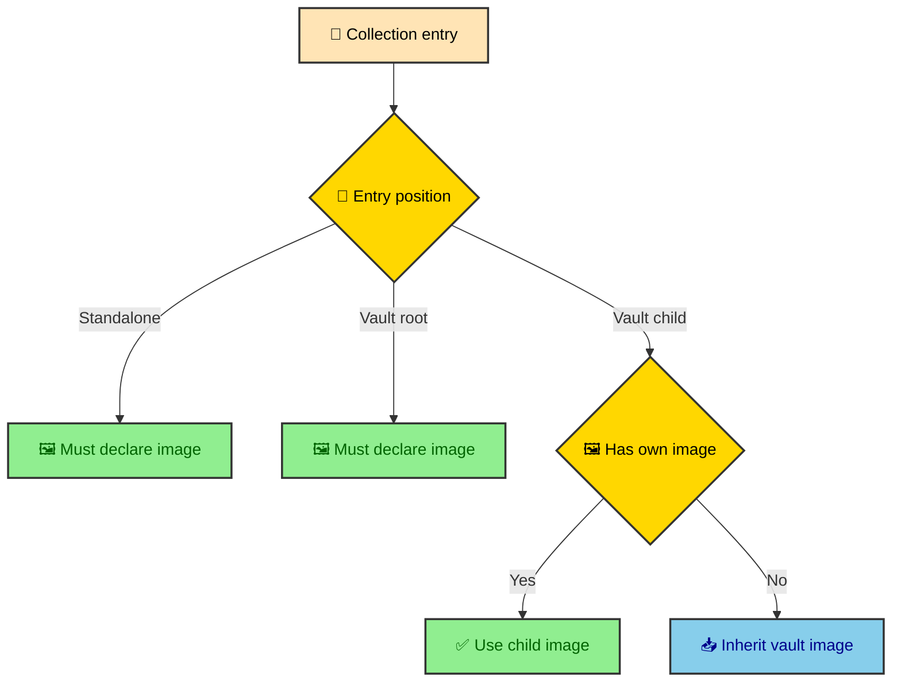

A schema is a promise with a narrow job. It says which frontmatter fields an author can use and which values are valid enough to enter the build. It does not know whether a folder should become a vault, whether an image can be inherited, or whether a draft index should hide a whole subtree. This article separates those jobs so the journal can stay strict without making the schema carry the whole site.

---

## The collection boundary

The journal collection lives in `src/content.config.ts`. That file is the first public contract between an MDX author and the build. If an entry cannot satisfy the schema, it should fail early, before the manifest builder tries to place it in navigation or before a page route tries to render it.

Astro content collections are a good fit here because they handle a practical middle ground. They load files from disk, validate frontmatter with Zod, and give the route layer typed collection entries. Zod is the validation library that turns a loose YAML object into a checked data shape. The collection does not need to understand every site rule to be useful.

The journal uses a glob loader rather than a custom loader for MDX source. A glob is a filename pattern, so this loader is simply saying which files under `src/thejournal/` can become candidates. The setup is intentionally small because the source already lives in predictable local folders.

```ts
const thejournal = defineCollection({
  loader: glob({
    pattern: "**/[^_]*.{md,mdx}",
    base: "./src/thejournal",
  }),
  schema: ({ image }) =>
    z.object({
      title: z.string(),
      github: z.string().optional(),
      image: image().optional(),
      description: z.string().default("Without description available."),
      pubDate: z.coerce.date(),
      updatePubDate: z.coerce.date().optional(),
      tags: z.array(z.string()).default([]),
      order: z.number().default(100),
      draft: z.boolean().optional(),
    }),
});
```

The loader says which files are candidates. The schema says which metadata shape those candidates must have. Everything after that belongs to the processor layer.

---

## The glob pattern

The glob pattern is doing more than collecting files. It defines a small authoring convention for public and private content inside `src/thejournal/`.

```ts
pattern: "**/[^_]*.{md,mdx}"
```

The `**/` part allows files at any depth under the journal folder. The `{md,mdx}` part accepts both Markdown and MDX. The `[^_]*` basename rule excludes files whose name starts with `_`, which gives the repository a simple way to keep fragments, notes, or experiments near related articles without letting them become publication candidates.

That underscore rule matters because vaults are directory-driven. A folder can contain a public `index.mdx`, several public child entries, and private supporting files. The author can keep context nearby while the collection loader stays predictable.

### Candidate does not mean published

A file that matches the glob has only entered the collection. It has not earned a route. Draft filtering, vault requirements, image policy, read time, and pagination are all later decisions.

That distinction is easy to miss because a content collection feels like a list of pages. In this project, it is better to think of it as a list of candidates. The manifest builder turns candidates into published entries.

---

## The frontmatter fields

The active schema keeps the author contract compact. It supports enough metadata for cards, headers, routing context, and sorting without asking every post to repeat values the build can infer.

| Field | Schema rule | Where it shows up |
| ---- | ---- | ---- |
| `title` | Required string. | Article header, manifest labels, sidebars, and cards. |
| `github` | Optional string. | Repository button in the article header when present. |
| `image` | Optional image metadata. | Header image, card image, and social metadata when required by policy. |
| `description` | String with a default. | Metadata summary, cards, and layout manifest. |
| `pubDate` | Required date after coercion. | Article header and sorting contexts. |
| `updatePubDate` | Optional date after coercion. | Updated article metadata when an entry changes later. |
| `tags` | String array with default `[]`. | Header tags and journal discovery surfaces. |
| `order` | Number with default `100`. | Manual ordering inside vaults and nested sections. |
| `draft` | Optional boolean. | Publication exclusion and draft subtree behavior. |

The schema uses `z.coerce.date()` for dates. That lets YAML strings like `2026-06-17` become `Date` objects for the rest of the build. Components can format dates without reparsing frontmatter.

Defaults also keep authoring quiet. A missing `description` receives a fallback. Missing `tags` become an empty array. Missing `order` becomes `100`, which lets most entries sort naturally while still allowing a section index or important article to move earlier.

---

## The update date rule

The schema adds a refinement around `updatePubDate`. If an entry declares an update date, it must also declare a publication date. The current schema already requires `pubDate`, but the refinement keeps the relationship explicit and gives a clearer error when someone changes the schema later.

```ts
.refine(
  (data) => {
    if (data.updatePubDate && !data.pubDate) {
      return false;
    }
    return true;
  },
  {
    message:
      "updatePubDate requires pubDate to be set. Add a pubDate field to this entry.",
    path: ["updatePubDate"],
  },
)
```

The rule is small, but it captures an editorial truth. An update date only makes sense as the second point in a timeline. If the first point is missing, the article metadata would tell a half-story.

### Why the schema stays conservative

It would be possible to add more policy here. The schema could try to require images for some entries, reject drafts inside certain folders, or validate that every nested section has an index. That would make `content.config.ts` aware of the filesystem rules that the manifest already owns.

The project keeps the schema conservative because frontmatter validation and publication policy change for different reasons. A new optional field belongs in the schema. A new vault rule belongs in the manifest. Mixing those concerns would make simple author metadata changes feel riskier than they are.

---

## Why image is optional

The `image` field is optional at schema level, even though standalone publications and vault roots must have images. That sounds contradictory until you look at vault children.

Vault child entries can inherit the image from the vault root. This keeps a long section from repeating the same image in every file. It also lets a vault root define the visual identity for the section while individual child pages stay focused on text.

The manifest builder can make that call because it knows where the entry lives. Position in the tree turns a loose metadata field into a publishing rule.



That is why `image().optional()` is correct. Optional in the schema means optional in the raw frontmatter contract. It does not mean every published context can reach the UI without an image. The manifest finishes that decision after it knows the entry type.

---

## Draft is metadata, scope is policy

The schema treats `draft` as a boolean. That is all it should do. A file either declares `draft: true`, declares `draft: false`, or omits the field.

The meaning of that draft flag depends on location. A standalone draft hides one page. A draft vault root hides the entire vault. A draft nested index hides that section and everything below it. The schema cannot make that distinction because it validates one entry at a time.

The manifest builder can see the full list of entries, so it can turn draft metadata into scoped publication behavior. That makes the draft rule stronger than a simple per-entry filter while keeping the author-facing field simple.

---

## The second collection

`content.config.ts` also defines `atlasData`, a loader-backed collection powered by `src/utils/atlas_loader.ts`. It is not part of the MDX journal, but it explains an important project habit. The site uses content collections for both file-based writing and build-time data.

```ts
const atlasData = defineCollection({
  loader: atlas_loader,
  schema: z.object({
    standing: z.string(),
    record: z.string(),
    points: z.number(),
    homeTeam: z.string(),
    awayTeam: z.string(),
    rawDate: z.string(),
    stadium: z.string(),
    city: z.string(),
  }),
});
```

The journal collection starts from files. The Atlas collection starts from a custom loader. Both end as typed build inputs. That pattern lets the site keep browser code small because external or structured data can settle during the static build.

The useful lesson for the journal is that content collections are not the whole publishing system. They are the typed input boundary. The site can then build stronger domain rules on top of that boundary.

---

## Authoring checklist

When adding a new journal entry, the schema gives the first checklist. The manifest gives the second. Keeping those lists separate makes failures easier to read.

- Add `title` and `pubDate` before expecting the file to load as a valid collection entry.
- Add `description` when the default fallback would make a card or metadata preview unhelpful.
- Add `tags` when the article belongs to a discoverable topic, and keep them lowercase for consistency.
- Add `order` when the entry belongs in a specific vault sequence instead of alphabetical fallback order.
- Add `image` for standalone entries and vault roots, while letting child entries inherit when the shared vault image is enough.
- Add `draft: true` when the entry or section should stay out of every published surface.

The schema catches malformed data. The manifest catches broken publication structure. A healthy journal needs both because valid frontmatter can still describe an invalid content tree.

---

## What to change with care

Schema changes ripple outward. Adding a field is usually straightforward, but changing defaults or required fields can alter every source file in the collection. The safest path is to decide which layer owns the new behavior before touching code.

If the change describes what an author can write, start in `src/content.config.ts`. If the change describes when a page can publish, how a vault sorts, or how entries relate to each other, start in `src/content/processors/thejournal-manifest.ts`.

That boundary keeps the collection readable. It also keeps the manifest honest. Each layer has a narrow job, and narrow jobs are easier to test when the next content migration arrives.
