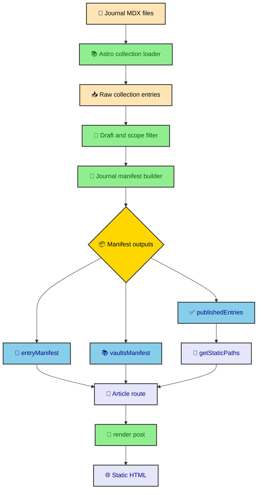

The journal looks calm from the outside. A reader opens an article, sees a title, a reading time, a vault sidebar, a table of contents, and maybe a diagram or chart. Under that page, the site has already made dozens of decisions about whether the file should publish, where it lives, what image it owns, and which page comes next. This section explains that pipeline so the journal can keep growing without becoming a memory test.

---

## The publication problem

The hard part of this journal is not rendering Markdown. Astro already does that well. The harder part is making a folder of MDX files behave like a structured publication system, where a single entry can appear as a route, a navigation item, a card, a breadcrumb target, and a pagination neighbor.

That means the site needs one source of truth between content loading and page rendering. Without that middle layer, every component would invent a small version of publishing policy. One component would filter drafts. Another would guess vault membership. A third would build previous and next links from whatever array it received. That kind of drift is quiet until the day a draft page leaks into navigation.

The publication system solves the problem by treating the journal as a build-time data product. MDX files are source material. The content collection validates frontmatter. The manifest builder applies site rules. The route layer consumes a prepared context instead of recalculating policy.

> The useful boundary is simple. Astro loads content, the manifest decides what publication means, and the route turns that decision into a page.

That split keeps the authoring experience plain. Writers still create ordinary `.mdx` files under `src/thejournal/`. The build does the fussy work after that, which is exactly where fussy work belongs.

---

## The build path

The publication pipeline starts with source files and ends as static HTML. The route may look dynamic because it uses `/thejournal/[...slug]/`, but the build has already enumerated every path before deployment.



The important detail is that `publishedEntries`, `entryManifest`, and `vaultsManifest` come from the same published set. The route generator, article header, sidebar, breadcrumb, and pagination controls are not each asking the filesystem a different question.

### The current route contract

The catch-all route imports all three outputs from `@content/processors/thejournal`. It uses `publishedEntries` to generate static paths, `entryManifest` to retrieve article context, and `vaultsManifest` to render vault navigation when the entry belongs to one.

```ts
export async function getStaticPaths() {
  return publishedEntries.map((entry) => ({
    params: { slug: entry.id },
    props: { post: entry },
  }));
}
```

That contract keeps `src/pages/thejournal/[...slug].astro` small. The route still assembles a lot of UI, but it does not own publishing rules. When a page appears, disappears, inherits an image, or gets linked in sequence, that decision has already happened.

---

## The three outputs

The processor exports three shapes because the page layer has three different jobs. A single array would force the route and components to keep reshaping the same data. Separate outputs make each read path obvious.

| Output | Shape | Primary reader |
| ---- | ---- | ---- |
| `publishedEntries` | Filtered Astro collection entries. | `getStaticPaths()` and `render(post)`. |
| `entryManifest` | Flat lookup keyed by entry ID. | Article route, header, pagination, and path lookup. |
| `vaultsManifest` | Nested vault tree keyed by vault ID. | Vault sidebar, breadcrumbs, and mobile vault overlay. |

`publishedEntries` keeps the original collection entry available because Astro's `render(post)` expects that object. `entryManifest` holds the site-specific context that components need, including read time, image inheritance, vault ID, previous ID, and next ID. `vaultsManifest` preserves the nested folder shape that a flat collection cannot express.

This division also gives the build a good failure point. If a vault folder is missing an index, the manifest builder can throw before the route ever renders. If a standalone article has no image, the manifest can stop the build before a card or social preview gets broken output.

### Why IDs and file paths both matter

The collection entry ID becomes the public route slug. The normalized file path tells the manifest where the entry lives inside the source tree. Those values often look similar, but they answer different questions.

The route ID answers, "What URL should Astro generate?" The file path answers, "Which folder owns this entry?" That second answer is what lets the builder require vault indexes, group nested sections, and inherit a vault root image for child entries.

When those concepts stay separate, the journal can change policy without making the route parse local file paths. The route receives a prepared context and renders the page. Small mercy, large payoff.

---

## Where policy belongs

The schema in `src/content.config.ts` defines what authors can write in frontmatter. It knows about fields like `title`, `pubDate`, `image`, `tags`, and `draft`. It should not know what a vault is, how nested groups sort, or which pages belong to the previous and next chain.

That site-specific policy lives in `src/content/processors/thejournal-manifest.ts`. The file handles the rules that depend on location, body content, or the full set of entries.

- Draft standalone entries stay out of the manifest and route generation.
- Draft index files create excluded scopes for the folder beneath them.
- Every vault root and nested vault section must have an index file.
- Vault roots and nested vault sections must contain child publications beyond their own index file.
- Standalone entries and vault roots must declare an image.
- Vault children can inherit the image from the vault root.
- Read time is measured once and stored in entry context.
- Previous and next links follow the same order as the vault explorer.

Those rules are not display preferences. They are publishing guarantees. Putting them in the manifest means the route, header, sidebar, and catalog can trust the context they receive.

### A route should not become a policy engine

It is tempting to put small checks in the route because the route already has the data. That works once. Then a catalog page needs the same check, a sidebar needs a slightly different check, and the test suite has to catch differences that should not exist.

The manifest builder is the pressure valve. It centralizes the decisions that need to stay consistent across every journal surface. Components then become easier to read because they are rendering known states instead of negotiating whether the page is valid.

---

## Authoring stays ordinary

The publication system does not ask writers to write component-heavy MDX for common article needs. Most authoring stays close to Markdown. The route supplies component overrides when it renders the compiled entry.

```ts
const components = {
  pre: CodeBlock,
  h2: HeadingAnchor,
  h3: HeadingAnchor,
  table: ProseTable,
  div: MermaidDiagramWrapper,
};
```

That map is a small but important piece of the system. It lets a fenced code block become a Shiki-highlighted DaisyUI code panel. It lets normal `##` and `###` headings become copyable anchors. It lets Markdown tables become keyboard-scrollable regions. It lets Mermaid output become an expandable diagram shell without authors importing a component.

The writer gets simple source. The reader gets the site's UI. The build gets one place to wire those choices together.

Charts are the main exception to this no-import path. A data visualization needs values and an ECharts option object, so chart articles import `EChart` and the relevant option builder directly in MDX. That still follows the publication boundary because the component renders static SVG at build time before any browser enhancement is considered.

---

## The section map

This `publications/` section is split by ownership boundary. Each article looks at a layer that can be changed independently, as long as its contract with the next layer stays intact.

| Article | Main question |
| ---- | ---- |
| `collections` | Which frontmatter fields can authors write, and what does the schema validate. |
| `manifest_rules` | Which content rules become build-time policy before pages render. |
| `static_generation` | How the catch-all route turns published entries into static pages. |
| `mdx_rendering` | How `render(post)`, component overrides, and opt-in MDX components shape article HTML. |
| `codeblocks` | How fenced code becomes theme-aware highlighted output. |

Read them in that order if you are changing the publishing model. The collection article starts with the author contract. The manifest article explains the build policy. Static generation shows how those decisions become routes. The rendering and code block articles cover the final MDX presentation layer.

If you are changing the publishing model, keep the same direction of ownership. Collection schema should describe author input. The manifest should describe publication policy. The route should assemble a prepared page. The renderer should map ordinary MDX to local components. Keeping those responsibilities separate is what lets the site grow without turning every article into custom page code.

---

## What this buys the site

The practical benefit is boring in the best way. A new publication can be added by creating a file, filling frontmatter, and writing the article. If the file violates a journal rule, the build should complain with enough detail to fix the source.

That is better than discovering a broken breadcrumb after deploy. It is better than relying on a mental checklist for vault indexes. It is better than asking every component to defend itself against invalid content. Publishing rules become executable, and the UI can focus on readers.

The tradeoff is that the manifest builder becomes an important piece of infrastructure. It deserves tests, careful naming, and conservative changes. When content policy changes, update the manifest first, then check every surface that consumes the context. The rest of this section exists to make that work less mysterious.
