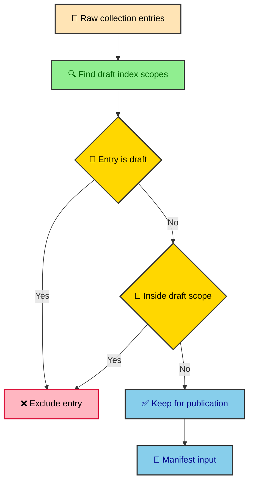

The manifest builder is the place where a folder of valid MDX files becomes a publication system. Astro can tell us that an entry has a title and a date. It cannot tell us that a draft index should hide a section, that every vault folder needs an index, or that a child article can borrow the vault image. Those are house rules, and this file turns them into build-time facts.

---

## The manifest boundary

`src/content/processors/thejournal-manifest.ts` sits between collection loading and route rendering. It receives collection entries, filters out unpublished material, maps each entry into site-specific context, builds vault trees, links pagination, enforces image rules, and exposes lookup helpers.

The public processor in `src/content/processors/thejournal.ts` keeps that boundary short. It loads entries, delegates policy to the manifest builder, and exports the prepared results.

```ts
async function loadManifest(): Promise<
  [Record<string, EntryContext>, Record<string, VaultContext>, JournalEntry[]]
> {
  const rawEntries = await getCollection("thejournal");
  const publishedEntries = filterPublishedJournalEntries(rawEntries);
  const [entryManifest, vaultsManifest] =
    buildJournalManifest(publishedEntries);

  return [entryManifest, vaultsManifest, publishedEntries];
}
```

The interesting part is that `buildJournalManifest()` also calls `filterPublishedJournalEntries()` internally. Passing an already filtered list keeps the exported `publishedEntries` aligned with route generation, while the builder remains defensive if someone calls it directly in a test or future tool.

That duplication is cheap compared with the cost of a leaked draft or a route list that disagrees with navigation. I will take the small guard.

---

## Filtering published entries

Draft filtering has two modes. A draft standalone entry removes only itself. A draft index creates a scope, and every entry whose ID lives under that scope is excluded.



The helper `getIndexScope()` looks for paths that end in `index.md` or `index.mdx`. A draft root like `building_albertoduran/index.mdx` creates the `building_albertoduran` scope. A draft nested section like `building_albertoduran/runtime/index.mdx` creates the `building_albertoduran/runtime` scope.

That gives the author a clean control surface. Set `draft: true` on one article to hide one article. Set it on a section index to hide the section while keeping source files in place. The build handles the rest.

### Why scopes use entry IDs

`isEntryInScope()` compares the entry ID to the scope string. The entry matches when it equals the scope or starts with the scope followed by a slash.

```ts
function isEntryInScope(
  entry: JournalManifestSourceEntry,
  scope: string,
): boolean {
  return entry.id === scope || entry.id.startsWith(`${scope}/`);
}
```

Using IDs here matches the route surface. If an entry is excluded by scope, it should also be absent from generated URLs and navigation. The file path is still useful for folder ownership, but draft scope is about public identity.

---

## Normalized paths and vault ownership

The manifest needs file paths because vault membership depends on the source tree. `normalizeJournalFilePath()` strips the `src/thejournal/` marker from a local path and returns a path relative to the journal root.

```ts
export function normalizeJournalFilePath(filePath?: string): string {
  if (!filePath) return "";

  const cleanSite = site.endsWith("/") ? site.slice(0, -1) : site;
  const marker = `src${cleanSite}/`;
  const index = filePath.indexOf(marker);

  if (index === -1) {
    return filePath;
  }

  return filePath.slice(index + marker.length);
}
```

The `site` constant is `"/thejournal/"`, so the marker becomes `src/thejournal/`. After normalization, a file like `src/thejournal/building_albertoduran/publications/index.mdx` becomes `building_albertoduran/publications/index.mdx`, which is the shape the vault builder expects.

`getVaultDirectory()` then checks the first path segment. If the normalized path has more than one segment, the first segment becomes the vault ID. A standalone entry at the journal root returns `null`. An entry under `building_albertoduran/` returns `building_albertoduran`.

This is why IDs and file paths both stay in `EntryContext`. The ID is for URLs. The normalized path is for source ownership and nested grouping.

---

## Mapping entries to context

`mapEntryToContext()` turns a collection entry into an `EntryContext`. That shape is the article route's main source of truth for title, dates, tags, image, read time, route ID, file path, and vault membership.

```ts
export interface EntryContext extends BaseContext {
  image?: ImageMetadata;
  description: string;
  github?: string;
  readTime: number;
  tags: string[];
  pubDate: Date;
  updatedDate?: Date;
  filepath: string;
  vaultId: string;
}
```

The mapping step also applies defaults from the journal policy side. If `description` is missing, the context receives `"Without description available."` If `tags` are missing, it receives an empty array. If `order` is missing, it receives `100`.

That keeps article components simple. `PublicationHeader.astro` can render `entry.title`, `entry.pubDate`, `entry.readTime`, and `entry.tags` without caring whether those values came directly from YAML or from the mapper.

### The read time calculation

Read time is computed before the article reaches the header. `measureReadTime()` trims the entry body, removes MDX noise, counts prose words, counts code fence lines, and converts both into minutes.

```ts
const wordsPerMinute = 200;
const codeLinesPerMinute = 40;

const totalMinutes =
  proseWords / wordsPerMinute + codeLines / codeLinesPerMinute;

return Math.max(1, Math.ceil(totalMinutes));
```

An empty body returns `0`. A non-empty body gets at least one minute. Code fences count by line rather than word because a code sample with short identifiers still takes time to read.

The supporting `stripMdxContent()` removes code fences, imports, exports, JSX-like tags, inline code, images, links, heading markers, emphasis markers, blockquote markers, and horizontal rules from the prose count. It does not need to be a full Markdown parser. It needs to give the header and cards a stable estimate.

The choice belongs in the manifest because read time is shared presentation data. If every card or header measured the body for itself, they could drift or waste work. The manifest measures once and publishes the number.

---

## Building nested vault structure

After entries become contexts, `buildJournalManifest()` groups them by vault. It creates a `rootVaults` bucket for each first-level folder, places the vault index first, checks that the folder is actually a multi-entry publication, and then asks `buildNestedStructure()` to turn the bucket into a tree.

Every vault root must have an index. Every nested section must also have an index. Each vault or nested section must contain at least one child publication beyond its own index file. If a folder contains entries but no index file, or if it contains only an index file, the builder throws a descriptive error.

```ts
if (!rootIndex || !isIndexFileForPath(rootIndex.filepath, vaultId)) {
  throw new Error(
    `[thejournal] Vault "${vaultId}" is missing a required root index. ` +
      `Add ${vaultId}/index.mdx or ${vaultId}/index.md before adding entries under this folder.`,
  );
}
```

This rule protects the reader experience. A folder without an index has no section title, no landing context, and no stable place in the vault explorer. The source tree might technically be navigable, but it would not be a coherent publication section.

The index-only rule protects the same boundary from the other side. A folder with only `index.mdx` is a standalone article wearing vault clothing. If there is no child entry to explore, the source should live at `src/thejournal/<slug>.mdx` instead of `src/thejournal/<slug>/index.mdx`.

### Entries and nested groups

The vault tree is made from two item types. A direct article is an `EntryContext`. A nested folder becomes a `NestedGroup` with an `index` and `items`.

```ts
export interface NestedGroup extends BaseContext {
  index: EntryContext;
  items: VaultItem[];
}

export type VaultItem = EntryContext | NestedGroup;
```

That shape matches the sidebar. A direct entry renders as a link. A nested group renders with its index entry as the section link and its children beneath it. The route does not need to rebuild the hierarchy because the manifest has already done it.

Items sort by `order`, then by title. The default order of `100` lets most entries fall into a predictable alphabetical order, while section indexes and curated reading paths can choose smaller order numbers.

---

## Linking previous and next

`linkVaultEntries()` walks the final nested tree and assigns `previous` and `next` IDs. It starts with the vault root index, then traverses items in the same order the reader sees in the vault explorer.

That detail matters. Pagination should not be a separate sequence from the sidebar. If a reader moves from one article to the next, the buttons should follow the mental map already visible in navigation.

```ts
function linkVaultEntries(vault: VaultContext) {
  let prevEntry: EntryContext = vault.index;

  const traverse = (items: VaultItem[]) => {
    for (const item of items) {
      let currentEntry: EntryContext;
      let children: VaultItem[] | undefined;
      if ("items" in item) {
        currentEntry = item.index;
        children = item.items;
      } else {
        currentEntry = item;
      }

      prevEntry.next = currentEntry.id;
      currentEntry.previous = prevEntry.id;
      prevEntry = currentEntry;

      if (children) {
        traverse(children);
      }
    }
  };

  traverse(vault.items);
}
```

The route then reads `entry.previous` and `entry.next` and resolves those IDs through `entryManifest`. Pagination remains a display concern because the sequence was already decided by content policy.

---

## Image enforcement and inheritance

The schema lets `image` be optional because it cannot know whether an entry is standalone, a vault root, or a vault child. The manifest can know, so it enforces the rule after the vault tree exists.

Standalone publications must declare an image. Vault root indexes must declare an image. Vault children can declare their own image, but when they omit it, the builder assigns the root image to the child context.

That rule keeps card and header components from juggling missing image states. If an entry reaches the route with an image, the route passes it into `BaseLayout` and `PublicationHeader`. If the entry should have had an image and did not, the build fails earlier.

The inheritance rule also gives a vault a visual identity. A long technical vault can share one image across child pages without repeating YAML in every file. When a child needs a distinct card or social preview, it can still provide its own image.

---

## Resolving context from a path

The manifest also exports `resolveJournalContext()`, which converts a path into an entry and optional vault. The helper strips the journal route prefix and trailing slash, then looks up the resulting ID.

```ts
export function resolveJournalContext(
  path: string,
  entryManifest: Record<string, EntryContext>,
  vaultsManifest: Record<string, VaultContext>,
): [EntryContext | null, VaultContext | null] {
  const cleanSite = site.replace(/\/$/, "");
  const id = path.replace(new RegExp(`^${cleanSite}/?`), "").replace(/\/$/, "");

  const entry = entryManifest[id] ?? null;
  if (!entry) {
    return [null, null];
  }

  const vaultId = entry.vaultId;
  const vault = vaultId ? (vaultsManifest[vaultId] ?? null) : null;

  return [entry, vault];
}
```

That helper is useful anywhere code starts from a route-like path instead of a collection entry. It returns `null` values instead of throwing because lookup callers often need to handle missing pages gracefully.

---

## Why this file deserves tests

The manifest builder is easy to underestimate because it does not render a visible component. It decides which pages exist, which images they use, how vaults nest, how long an article appears to take, and which pages connect in sequence.

That is enough responsibility to deserve focused tests. Good manifest tests should cover draft standalone entries, draft root scopes, draft nested scopes, missing vault indexes, missing images, inherited child images, read time for prose and code, and previous or next traversal through nested groups.

When those tests pass, the route can stay thin. When they fail, the error points to content policy instead of a visual component. That is the shape of a maintainable publishing system, even when the content tree gets large enough to make manual checking a bad hobby.
