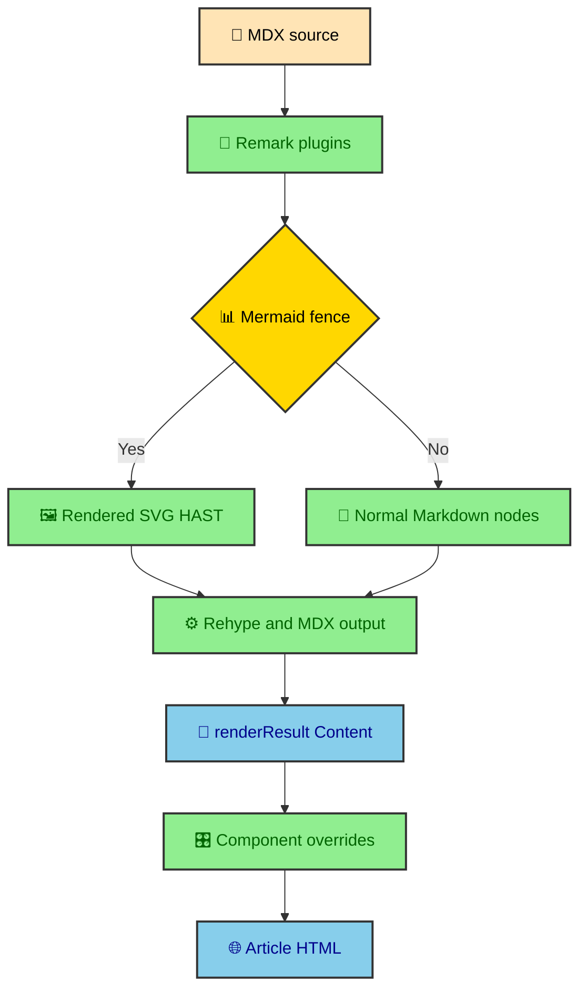

An MDX article starts as a file that a person can read in a text editor. MDX is Markdown with the option to use components, which makes it useful for technical writing that still needs article-specific UI. The rendered page is much richer. Headings copy links, tables scroll with keyboard access, code blocks have line numbers and theme-aware tokens, Mermaid diagrams ship as SVG, and ECharts can render data visuals during the build. The trick is to keep the authoring surface plain while using components only where they carry real meaning.

---

## The render call

The catch-all journal route receives a content collection entry from `getStaticPaths()`. It then renders that entry with the `render()` helper imported from `astro:content`.

```ts
import { render } from "astro:content";

const { post } = Astro.props;
const renderResult = await render(post);
```

This is the current Astro pattern used by the route. The code should not use stale examples that call `entry.render()`. The route needs the imported `render(post)` helper because `post` is the collection entry passed through static path props.

The returned object gives the route the pieces it needs for article assembly. Each piece has a separate job in the final page.

| Result piece            | How the route uses it                                                             |
| ----------------------- | --------------------------------------------------------------------------------- |
| `renderResult.Content`  | Renders the compiled MDX body inside `Article`.                                   |
| `renderResult.headings` | Feeds desktop and mobile table of contents after filtering to H2 and H3.          |
| Entry frontmatter       | Comes through the manifest context as title, dates, tags, image, and description. |

The split is practical. `renderResult.Content` is the body component. `renderResult.headings` is navigation data. The manifest context is publication metadata. Keeping those roles separate prevents the article body from becoming a data source for every header and navigation concern.

---

## Markdown processing order

MDX rendering runs through Markdown and MDX processing before the route receives `Content`. Remark plugins work on the Markdown syntax tree earlier in the pipeline. Rehype plugins and component rendering happen later, once the content is moving toward HTML. HAST, the HTML abstract syntax tree, is the tree-shaped representation used when the build needs to handle HTML-like nodes without treating them as raw strings.

That order matters most for Mermaid. The custom Mermaid remark plugin intercepts `mermaid` code fences before they become normal code blocks. It registers the diagram with the build-time diagram pipeline, replaces the fence with rendered SVG HAST, and attaches the attributes that the wrapper component needs later.



By the time the route renders the MDX body, a Mermaid diagram is no longer a code fence. It is article markup with an inline SVG and metadata for the diagram shell. That is why the code block override can focus on actual code blocks instead of trying to sort Mermaid from TypeScript after the fact.

---

## The component override map

The route passes a component map into the rendered MDX content. That map is where ordinary Markdown tags become journal-specific UI.

```ts
const components = {
  pre: CodeBlock,
  h2: HeadingAnchor,
  h3: HeadingAnchor,
  table: ProseTable,
  div: MermaidDiagramWrapper,
};
```

This map is the bridge between author-friendly source and site-specific HTML. Authors write normal Markdown. The route decides how common elements render inside the journal.

| MDX element | Replacement component   | Reason                                                       |
| ----------- | ----------------------- | ------------------------------------------------------------ |
| `pre`       | `CodeBlock`             | Wrap Shiki output in DaisyUI code chrome.                    |
| `h2`        | `HeadingAnchor`         | Add copyable section links to major headings.                |
| `h3`        | `HeadingAnchor`         | Preserve H3 semantics while reusing heading anchor behavior. |
| `table`     | `ProseTable`            | Add a keyboard-scrollable table region.                      |
| `div`       | `MermaidDiagramWrapper` | Upgrade only Mermaid diagram containers.                     |

The `div` override sounds broad, but the wrapper checks the class name before changing anything. Plain divs pass through unchanged. Only `.mermaid-diagram-container` gets the diagram shell.

### Imported chart components

ECharts follows a different path because a chart needs data and an option object. An author imports `EChart` from `@components/ui/mdx/EChart.astro` and usually imports a builder from `@integrations/echarts/options`. That is an opt-in MDX component, not a route-level override.

The difference is useful. Headings, tables, code blocks, and Mermaid fences are ordinary Markdown patterns that every article can use. Charts are data components with dimensions, captions, descriptions, render modes, and optional hydration. Keeping that import visible in the article makes the chart's data and choices reviewable beside the prose.

The implementation still respects the rendering contract. `EChart` renders static SVG during the build. Runtime enhancement can be requested with `hydrate`, but the chart remains readable before that enhancement runs.

---

## Heading anchors

`HeadingAnchor.astro` renders a heading with a copy-link button when the heading has an ID. It uses icons from `@data/icons`, shows a link state by default, and switches to a check state after copying the URL hash.

The client behavior lives in a custom element named `anchor-heading`. That element listens for clicks, writes the section URL to the clipboard when possible, and falls back to updating `window.location.hash` when clipboard access is unavailable.

The H3 case gets its semantic level from the MDX pipeline. `HeadingAnchor` defaults to rendering an `h2`, while generated `h3` nodes receive `as="h3"` before the route maps them to the shared component.

```astro
<HeadingAnchor {...props}><slot /></HeadingAnchor>
```

That transform exists for accessibility as much as convenience. Screen readers and outline tools should see the same heading hierarchy the author wrote in MDX.

---

## Tables as scroll regions

Plain Markdown tables can get wide. If the article column tries to contain every table without help, mobile pages become awkward and long labels can push the layout sideways.

`ProseTable.astro` wraps the table in a focusable figure. The wrapper gives overflow tables a proper keyboard target instead of relying on pointer scrolling alone.

```astro
<figure
  class="prose-table-wrapper not-prose"
  role="region"
  aria-label="Data table"
  tabindex="0"
>
  <table class="table">
    <slot />
  </table>
</figure>
```

The wrapper gives keyboard users a scrollable region when content overflows. The CSS in `src/styles/ui/mdx/_prose-table.css` keeps the table readable with DaisyUI table styling, uppercase header cells, and visible focus outlines.

The important part is that authors still write a normal Markdown table. The article renderer handles the behavior that a polished journal page needs.

---

## Mermaid diagram wrapping

The Mermaid wrapper is careful because every MDX `div` passes through it. It reads the `class` prop and only treats the slot as a diagram when the class list includes `.mermaid-diagram-container`.

```ts
const isDiagram =
  className?.split(" ").includes("mermaid-diagram-container") ?? false;
```

When the div is a diagram, the wrapper renders a `<mermaid-diagram-shell>` custom element. Inside that shell, the inline SVG remains visible for no-JS readers. The action grid adds an Open SVG link and a JavaScript-only Expand button.

The Open SVG link uses `data-diagram-src` and `data-diagram-dark-src`. The runtime diagram shell can switch the target when the site theme changes, so the reader opens the light or dark standalone SVG that matches the page.

### Popover expansion

The wrapper also creates a Popover API dialog with a generated ID. It does not duplicate the SVG into the popover at build time. Instead, runtime code clones the inline SVG into the popover when the reader expands the diagram.

That keeps the generated HTML smaller while preserving no-JS behavior. The article already has the inline diagram. JavaScript only adds a larger inspection surface.

The wrapper derives a simple title from diagram metadata or the first Mermaid keyword it finds in the SVG HTML. That title becomes the popover label, which gives assistive tech a better target than a generic unnamed dialog.

---

## Article typography

`Article.astro` owns the prose wrapper around rendered MDX. The project uses `src/styles/thejournal/article/_typography.css` instead of Tailwind Typography so article spacing, headings, inline code, blockquotes, lists, images, and horizontal rules can match the local design system.

The typography CSS deliberately avoids styling content inside `.not-prose`, diagram SVGs, and component-controlled UI. That matters because the article mixes prose with custom components. A code block or diagram shell should not inherit paragraph spacing just because it appears inside MDX.

The main prose class also uses the reading font and responsive type sizes. This keeps long-form posts readable while letting component wrappers opt out where they need tighter control.

---

## What authors can rely on

The rendering pipeline gives authors a small set of reliable behaviors. They can write standard Markdown and expect the site to handle the common presentation upgrades.

- Use `##` for major sections, because the route extracts H2 headings into article navigation.
- Use `###` for subsections that should appear under those major sections.
- Use fenced code blocks with language identifiers so Shiki can highlight them correctly.
- Use Markdown tables when the content is tabular, because the table override will handle overflow.
- Use Mermaid code fences for workflows or architecture diagrams, and let the build render SVG output.
- Import `EChart` only when the article needs a data visualization with measured values.
- Avoid importing other local UI components unless the article needs a special interactive or visual element.

That last point is the real gift of the pipeline. MDX can embed components, but most posts should not need to. A journal is easier to maintain when ordinary article structure gets first-class treatment.

---

## Why the renderer stays invisible

The best version of the rendering pipeline is almost invisible to authors. They write clean MDX, and the site turns repeated article patterns into consistent, accessible HTML. That invisibility is not accidental. It comes from centralizing the component override map in the route instead of asking every article to import wrappers by hand.

This keeps the authoring surface close to Markdown. A table remains a Markdown table. A heading remains a heading. A code fence remains a fence. A Mermaid diagram remains a Mermaid code block. The renderer applies the local presentation rules when the entry is rendered.

The benefit for readers is consistency. Code blocks, anchors, tables, diagrams, and prose spacing behave the same across the vault. The benefit for maintainers is that presentation rules live in components and CSS instead of being copied through article source.

That is the rendering contract. MDX carries meaning. The route supplies component overrides. The build emits article-ready HTML. Runtime modules may enhance diagrams or navigation, but the article itself is already readable.

That contract lets the site improve presentation globally. Change the table wrapper, code block wrapper, or heading anchor component once, and ordinary MDX entries inherit the improvement without rewriting article source.
