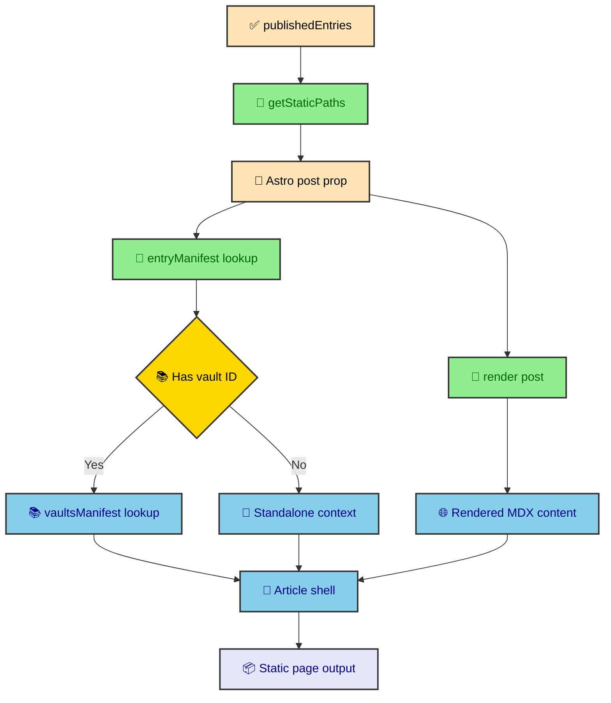

The journal route looks like it can answer any slug at runtime, but it cannot. By the time the site deploys, every article route has already been listed, rendered, and written as static output. The catch-all file is still useful because it gives all journal entries one assembly point. This article follows that file from `getStaticPaths()` to the finished article shell.

---

## One route for many article shapes

`src/pages/thejournal/[...slug].astro` serves standalone articles, vault roots, nested vault section indexes, and child entries. Those pages have different navigation needs, but they share enough layout to belong in one route.

A standalone article needs a header, MDX content, and the table of contents. A vault child also needs a vault explorer, breadcrumbs, and previous or next links. A vault root needs to act as both an article and the landing page for its section.

The route can support those shapes because the manifest already prepared the context. It does not inspect the filesystem. It does not decide whether a draft should publish. It does not calculate the vault tree. It receives a collection entry from static path generation, renders the MDX, then looks up the site context by ID.



The design makes the catch-all route a compositor. It knows how to combine context and components into a page, but it avoids becoming the place where publication policy changes.

---

## Static paths

The route's `getStaticPaths()` is short because `publishedEntries` has already done the filtering work. The function only translates published entries into Astro route params.

```ts
export async function getStaticPaths() {
  return publishedEntries.map((entry) => ({
    params: { slug: entry.id },
    props: { post: entry },
  }));
}
```

Astro uses that returned array to decide which pages exist under `/thejournal/`. If an entry is absent from `publishedEntries`, it has no generated page. This includes standalone drafts, entries under a draft vault root, and entries under a draft nested index.

The `slug` param receives `entry.id`. The `post` prop receives the full collection entry because `render(post)` needs the collection object, not the manifest context.

### Why path generation stays boring

This function should remain boring. That is a feature. Sorting, filtering, and nested grouping already happened in the processor. `getStaticPaths()` is the place where the route accepts that decision and turns it into Astro path params.

When a missing page bug appears, the first question should be whether the entry is in `publishedEntries`. If it is not there, the route behaved correctly. The bug lives in draft policy, schema validation, or manifest generation.

---

## Rendering the entry

After Astro passes `post` into the page, the route renders the compiled MDX entry. That render step creates both the body component and heading metadata.

```ts
const { post } = Astro.props;
const renderResult = await render(post);
```

The project uses `render(post)` from `astro:content`. That detail matters because older Astro examples often used a per-entry render method. The current route renders through the imported function and then reads `renderResult.Content` and `renderResult.headings`.

The route also looks up the entry context. This second lookup connects the rendered MDX body to the manifest data used by the shell.

```ts
const entry = entryManifest[post.id];

if (!entry) {
  return Astro.redirect("/404");
}

const vaultContext = entry.vaultId ? vaultsManifest[entry.vaultId] : undefined;
```

The 404 redirect is a route-level guardrail. In normal builds, `publishedEntries` and `entryManifest` come from the same processor path, so a published post should have a manifest context. The route only renders when that prepared context exists, which keeps article assembly tied to the manifest contract.

---

## Article layout regions

The route assembles the article inside `BaseLayout` and `FlexShell`. The visible article is a set of regions that appear or disappear based on context and viewport width.

| Region | Component | When it appears |
| ---- | ---- | ---- |
| Header | `PublicationHeader` | Every article route. |
| Left sidebar | `VaultExplorer` | Desktop view when `vaultContext` exists. |
| Center content | `Article` with `renderResult.Content` | Every article route. |
| Right sidebar | `OnThisPage` | Desktop view for H2 and H3 navigation. |
| Pagination | `Pagination` | When `entry.previous` or `entry.next` resolves. |
| Mobile dock | Labels that open overlays | Smaller screens, with vault button only for vault entries. |

The center column is the stable part. It renders the header, article content, and pagination. The sidebars and overlays add navigation around that content without changing the source article.

```astro
<PublicationHeader entry={entry} vaultContext={vaultContext} />

<Article>
  <renderResult.Content components={components} />
</Article>

{
  hasNavigation && (
    <div class="mt-14">
      <Pagination prevEntry={prevEntry} nextEntry={nextEntry} />
    </div>
  )
}
```

The render call includes the component override map. That map belongs here because the route is the point where compiled MDX becomes site HTML.

---

## Vault explorer behavior

When an entry belongs to a vault, the route passes `vaultContext` and the current entry ID to `VaultExplorer`. The explorer renders the nested tree that the manifest already built.

The desktop sidebar is plain HTML plus CSS behavior. `SidebarBase.astro` and the tree components use native structure, including `<details>` behavior for expandable groups. That keeps the navigation readable even if runtime scripts fail.

This choice fits the static-first model. The vault tree is content navigation, so it should not depend on a client-side app booting. JavaScript can improve the page, but the reader should still be able to move through the vault with the generated HTML.

### Sidebar width as route configuration

The route defines the sidebar widths as constants. They are small layout knobs for the article shell, not rules about content structure.

```ts
const SIDEBAR_LEFT_WIDTH = "18rem";
const SIDEBAR_RIGHT_WIDTH = "16rem";
```

Those values are layout configuration, not content policy. Keeping them in the route makes the article shell easy to scan. The manifest decides what appears in the sidebars. The route decides how much room the sidebars get.

---

## Mobile overlays

The mobile dock opens overlay panels for vault navigation and table of contents. The route renders those panels through `<Fragment slot="overlays">`, which places them into the layout overlay slot instead of inside the main article flow.

```astro
<Fragment slot="overlays">
  {
    vaultContext && (
      <OverlayPanel
        toggleId={vaultModalToggleId}
        title="Vault Explorer"
        titleId={vaultModalTitleId}
        closeLabel="Close Vault Explorer"
      >
        <VaultNavContent vault={vaultContext} currentEntryId={entry.id} />
      </OverlayPanel>
    )
  }

  <OverlayPanel
    toggleId={otpModalToggleId}
    title="On This Page"
    titleId={otpModalTitleId}
    closeLabel="Close Table of Contents"
  >
    <OnThisPageContent headings={headings} preserveOverlayScroll />
  </OverlayPanel>
</Fragment>
```

That placement avoids a subtle layout trap. The article content lives inside a view-transition-aware page shell. Dialogs and overlays need to escape the main stacking context so they behave like app-level UI instead of content trapped inside the article column.

The route also keeps toggle IDs and title IDs close together. That makes the accessibility wiring visible when editing the page. Labels get `aria-controls` and `aria-haspopup`, while the panels get stable titles and close labels.

---

## Heading navigation

`renderResult.headings` contains headings extracted from the rendered MDX entry. The route filters that list to H2 and H3 entries, matching the levels shown in article navigation.

```ts
const headings = renderResult.headings.filter(
  (h) => h.depth > 1 && h.depth <= 3,
);
```

That filter matches the article structure. The H1 belongs to the page title in `PublicationHeader`, not to the MDX body. H2 headings become major sections. H3 headings provide useful subnavigation without turning the table of contents into a noisy outline.

The same filtered headings feed both desktop and mobile navigation. `OnThisPage` renders the right sidebar. `OnThisPageContent` renders the overlay body. They share input, so the two navigation surfaces cannot disagree about which sections exist.

---

## Pagination

The route resolves previous and next IDs from the entry context. It treats those IDs as manifest output rather than recalculating article order.

```ts
const prevEntry = entry.previous
  ? (entryManifest[entry.previous] ?? null)
  : null;
const nextEntry = entry.next ? (entryManifest[entry.next] ?? null) : null;
const hasNavigation = !!(prevEntry || nextEntry);
```

The route does not decide sequence. It only resolves the IDs that the manifest assigned while walking the vault tree. That preserves the same reading order in the sidebar and the bottom pagination controls.

This also means standalone articles do not receive accidental pagination. The manifest currently links vault entries inside their vault context. A standalone page can still render a header and table of contents, but it has no neighbor unless the manifest policy grows to support one.

---

## Metadata and layout props

The route builds a small `siteManifest` for `BaseLayout`. It uses the entry description, title, and label. If the entry has an image, the route passes that image too.

```ts
const siteManifest: SiteManifest = {
  description: entry.description,
  pageTitle: entry.title,
  label: entry.title,
};

const layoutProps = {
  siteManifest,
  ...(entry.image ? { image: entry.image } : {}),
};
```

This is another place where manifest policy pays off. By the time the route prepares layout props, image inheritance and image enforcement have already happened. The route does not need to know whether the image came from the child entry or the vault root.

The article header gets the same `entry` context, so metadata and visible UI agree. If the title, image, date, tags, or read time look wrong, trace the entry context first.

---

## Why the route stays thin

The catch-all route does a lot of visible work, but it should not become the whole publishing factory. It receives prepared entries from `publishedEntries`, looks up context in `entryManifest`, resolves vault data from `vaultsManifest`, renders MDX, filters headings, prepares layout metadata, and passes everything into the article components.

The important word is prepared. The route does not decide draft policy. It does not build the vault tree. It does not calculate image inheritance. It does not render Mermaid from source. It does not invent code block structure. Those decisions already happened in the content processor, integration pipeline, or MDX renderer.

That thinness is what lets one route serve standalone articles, vault roots, nested section indexes, and child entries. The shape of the page changes through context and components, not through a new route file for every publication type.

The result is a static generation path that feels flexible without being vague. Content policy lives upstream. The route assembles the page. Components and runtime modules handle presentation and enhancement.
