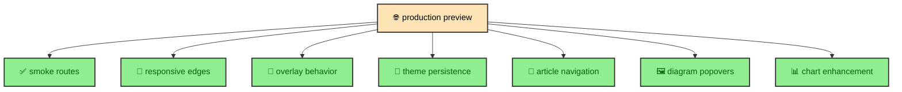

Some parts of the site only become real in a browser. Focus moves. The viewport changes. The page scrolls. Astro swaps routes. Dialogs open. Mermaid popovers clone SVGs. ECharts can replace a static chart surface after a chosen hydration trigger. End-to-end testing, often shortened to e2e, checks those flows through the same kind of browser session a reader uses. A static build can create the right files, but browser behavior needs a browser-shaped quality layer. That is why the project uses Playwright against production preview output.

---

## Preview runner

`tests/e2e/run-preview-tests.mjs` starts `astro preview` on `127.0.0.1:4325`, waits until the server responds, then runs Playwright with `PLAYWRIGHT_SKIP_WEBSERVER=true`. When Playwright exits, the wrapper stops the preview process.

The wrapper exists so e2e coverage sees built output. The site is deployed as static files, so `astro preview` is a better target for browser behavior than the development server. It exercises the generated routes, built assets, runtime modules, and production-shaped HTML.

The wait loop polls the preview URL until it receives an OK response or times out. The command keeps stdout and stderr inherited so local and CI runs show the underlying preview and Playwright output. The wrapper is small, but it makes the browser layer repeatable.

---

## Smoke routes

The smoke route list includes the homepage, profile page, journal index, a standalone journal entry, the `building_albertoduran` vault root, and a nested publication route. Each route loads, receives a title, shows `main#main-content`, shows the banner, shows the footer, and produces no captured browser console errors.

This is basic coverage, but it is still useful. The site has generated routes and static paths. Smoke coverage confirms that representative pages from each major area are reachable in the built preview.

The smoke layer also complements unit tests. A manifest test can prove paths are generated. A smoke route proves the browser can actually open representative generated pages and see the shared layout regions.

---

## Responsive layout

The responsive tests use viewport widths around important breakpoint edges: 390, 767, 768, 1023, 1024, 1279, 1280, and 1536. They visit core routes and check that the page avoids horizontal overflow and that `main#main-content` stays inside the viewport.

Additional layout checks protect specific design decisions. Top-level heroes keep eyebrow and heading geometry aligned across routes. The homepage hero waits for wide desktop before showing the side panel. The profile skills grid waits until desktop width before switching to three columns. Journal article sidebars wait until the content column can stay readable, while the mobile dock appears when sidebars are hidden.

These tests are accessibility and design checks at the same time. Horizontal overflow can make mobile pages hard to read. Premature sidebars can crush article content. Misaligned hero geometry can make top-level pages feel inconsistent. The browser layer proves those layout decisions against actual viewport sizes.

---

## Overlay behavior

The Atlas note modal test opens and closes the dialog through keyboard and pointer paths. It checks that the trigger has `aria-controls`, that the dialog starts hidden, that Enter and Space activate controls, that the close button works, and that the story content is visible when the modal opens.

The test also checks scroll lock. When the modal opens, the body receives `data-overlay-scroll-locked="true"`. Wheel events outside the dialog do not move the page. Wheel events inside the scroll area move the panel content. This validates the runtime contract described in the overlay article.

The same overlay primitive supports mobile article navigation panels. Browser coverage matters because focus, keyboard events, scroll containment, and actual viewport geometry are all live browser concerns.

---

## Why accessibility is browser-shaped

Accessibility is partly markup, but many accessibility behaviors are interactive. A dialog label can be inspected in static HTML. Focus movement, Escape close, keyboard activation, scroll lock, and route-swap cleanup require a browser session. The e2e suite covers those behaviors where they actually occur.

The same is true for responsive accessibility. A layout that fits desktop can become hard to use on a phone if it creates horizontal overflow or squeezes the reading column. Browser viewports make those conditions visible. That is why the tests check breakpoint edges instead of only one mobile and one desktop size.

The site uses semantic HTML and progressive enhancement, but Playwright confirms that the enhanced experience keeps those semantics usable.

---

## Article landmarks

Article tests cover landmarks, breadcrumbs, and navigation surfaces. The layout should expose a main content region, article content, sidebars or dock depending on width, and navigable links. The On This Page behavior can then track headings while the reader scrolls.

The tests also inspect generated catalog links. The journal index should link to known publication routes. This connects the manifest and route generation work to actual browser navigation. The unit layer proves manifest logic. The e2e layer confirms the generated site exposes those paths to readers.

These checks are part of how the site protects its publication experience. A journal can have correct content files and still feel broken if landmarks, sidebars, docks, or links are not present in the built page.

---

## Console and page errors

The e2e helper collects browser console errors and page errors during smoke coverage. That gives the suite a broad signal that runtime modules are not throwing while representative routes load.

This matters because the runtime layer is intentionally small but touches important browser APIs. Theme management reads storage and applies document state. Overlays handle global events. On This Page observes headings and scroll. Mermaid shell uses custom elements and popovers. ECharts hydration uses custom elements, dynamic imports, media queries, intersection observers, and resize observers. A representative console check helps keep those modules honest when pages load in preview.

The check is not a substitute for focused assertions, but it complements them. Focused assertions prove expected behavior. Console collection notices unexpected runtime failures during route loads.

---

## Theme and Astro navigation

Theme persistence needs browser coverage because it spans local storage, document attributes, a visual toggle, and Astro route swaps. The theme manager applies the stored or system theme before first paint, binds the DaisyUI toggle on page load, applies the theme to incoming documents during route swaps, and updates the live document after the swap.

Playwright can observe this as a reader would. It can choose a theme, navigate, and confirm the state persists. That is not a pure transformation. It is a browser session behavior, so it belongs in the e2e layer.

The same principle applies to view-transition-driven navigation. The site serves static pages, but Astro can swap internal routes. Runtime modules need to rebind or reconnect after those swaps. Browser coverage sees that lifecycle in motion.

---

## Mermaid, ECharts, and no-JS behavior

Mermaid popover behavior depends on custom elements, the Popover API, cloned SVG nodes, rewritten IDs, page CSS attachment, and theme-specific Open links. Unit tests cover the transform pipeline. Playwright covers the browser shell that expands the rendered diagram.

ECharts browser coverage checks the other visual path. The fixture route renders static SVG with JavaScript disabled, verifies file-backed chart assets, checks that `hydrate="load"` replaces a static surface with an enhanced ECharts surface, and confirms that `hydrate="media"` waits until the media query matches.

No-JS behavior is also part of the browser layer. The site is static-first, so important content should remain available without runtime enhancement. Browser coverage can load pages with JavaScript disabled and confirm that core content, diagrams, and charts remain visible.

This pairing is the heart of the site's frontend quality model. The build should produce complete pages. Runtime code should enrich those pages. Browser coverage checks both sides of that progressive enhancement contract.

---

## No-JS as a design promise

No-JS coverage is important because the site is built static-first. Article text, headings, links, code blocks, tables, inline diagrams, and static charts should not require client-side rendering. Runtime modules can add convenience, but the content should already be present.

That promise shapes the whole build. Mermaid renders during the build. ECharts renders SVG during the build. The manifest prepares route context. The Atlas widget has a build-time fallback display. Overlay content exists in the HTML. Browser tests with JavaScript disabled make that design promise observable.

The result is not anti-JavaScript. The site uses JavaScript where it helps. It simply does not make JavaScript the publishing substrate.

---

## Why preview matters

Running against preview keeps the browser tests close to the delivered site. The development server is optimized for authoring feedback. Preview serves the built output. For a static site, that distinction matters because HTML minification, generated assets, static paths, and integration output all belong to the production build.

The e2e suite therefore reads the site the way a deployed browser would. It opens URLs, measures viewport behavior, activates controls, and observes document state after the build has already done its work.

---

## The build lesson

Playwright is used where the browser is the source of truth. Responsive layout, focus movement, scroll lock, route swaps, theme persistence, and diagram popovers all depend on browser behavior. Running those checks against `astro preview` keeps them close to production output.

The e2e layer does not replace unit tests. It completes the quality stack by proving that the static site and its runtime enhancements behave as one experience in the environment readers actually use.

That final browser pass is what connects the built artifact back to the reader.
