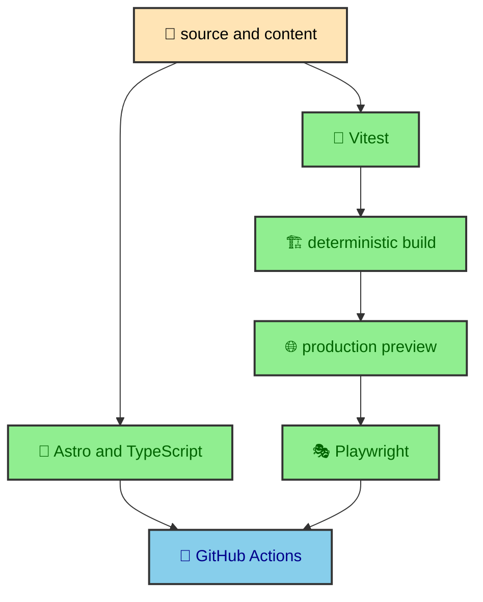

Quality is part of how this site is built, not a separate ritual after the code is done. The project has custom content manifests, build-time Mermaid rendering, a post-build HTML minifier, an external-data content loader, runtime overlays, theme persistence, responsive article layouts, and static deployment. The quality stack exists to keep those moving pieces aligned with the architecture.

---

## Why quality belongs in the architecture

The site is static, but it is not simple in the sense of being plain HTML files typed by hand. Astro collects content, the journal manifest decides route context, the Mermaid integration rewrites diagrams into SVG output, the Atlas loader fetches data during the build, and runtime modules enhance browser behavior. Each layer has its own contract.

The quality system follows those contracts. Type and Astro checks protect component and content shape. Unit tests protect pure transformation logic. Deterministic build flags make output reproducible. Playwright covers behavior that only exists in a real browser. CI runs the same gates before changes reach deployment.



The layers are not interchangeable. A unit test can prove a manifest rule. It cannot prove a mobile overlay traps focus in Chromium. A browser test can prove an overlay interaction. It should not be the only place a pure path-normalization rule is checked. The quality stack places each kind of confidence where it fits.

---

## Command map

The core scripts live in `package.json`.

```bash
npm run check
npm test
npm run build:test
npm run test:e2e
```

`npm run check` runs Astro and TypeScript diagnostics. `npm test` runs Vitest. `npm run build:test` creates a production-shaped build with deterministic fixture flags. `npm run test:e2e` runs that test build, starts Astro preview, and launches Playwright.

There are also supporting scripts. `npm run test:coverage` runs Vitest with coverage. `npm run lint` exists, although lint is not currently part of the CI gate because ESLint still needs a flat configuration before it becomes mandatory. `npm run dev`, `npm run build`, and `npm run preview` support local development and production output.

The scripts are direct on purpose. There is no hidden task runner that obscures which layer is running. The project can explain its quality story from the package scripts alone.

---

## Deterministic builds

Two environment flags make production-shaped builds stable for quality work.

```bash
ALBERTODURAN_TEST_MODE=true
MERMAID_RENDERER_FIXTURE=true
```

`ALBERTODURAN_TEST_MODE=true` makes the Atlas content loader use local fixture data instead of live ESPN responses. `MERMAID_RENDERER_FIXTURE=true` makes the Mermaid integration use fixture output instead of depending on live renderer behavior. Together, those flags keep the build focused on project behavior.

The flags do not change the architecture. They replace unstable external inputs with stable local inputs. The Atlas widget still receives an `atlasData` entry. Mermaid diagrams still move through the integration path. The homepage and article pages still render production-shaped output.

This is the right kind of determinism. It keeps quality gates repeatable while still exercising the same internal contracts the real site uses.

---

## Custom systems

The highest-value tests sit around the custom systems. The journal manifest decides which entries publish, which vaults exist, which images are required, how read time is measured, how paths resolve, and how previous and next links connect. Mermaid tests cover sanitation, ID rewriting, theme merging, inline color hoisting, dispatcher guards, and page CSS hoisting. The HTML minifier test protects code-oriented fragments. Atlas loader tests cover data normalization and fallback paths.

These are the places where generic framework confidence is not enough. Astro can build a page, but it does not know this site's vault rules. Mermaid can render a diagram, but it does not know this site's light and dark asset contract. A minifier can reduce HTML, but it does not know code samples are publication content unless the project enforces that rule.

The quality stack therefore spends energy where the site has made local architectural choices.

---

## Browser behavior

Playwright covers the pieces that only a browser can prove. That includes route smoke coverage, browser console cleanliness, hero geometry, responsive overflow, sidebar and dock breakpoints, catalog links, overlay focus, scroll lock, article landmarks, breadcrumbs, article navigation, theme persistence, Mermaid popovers, and no-JS behavior.

Those checks are part of the website's build story because the site is static but enhanced. A generated page can be structurally correct while a focus trap, route swap, or responsive layout still needs real browser behavior. Playwright runs against `astro preview`, not the development server, so the shape is close to production delivery.

This browser layer also validates design decisions. The article sidebars wait until the content column can stay readable. The home hero waits for wide desktop before showing its side panel. The profile skills grid waits until desktop width before switching to three columns. Those are layout contracts, not incidental screenshots.

---

## The quality boundary

The quality stack is not trying to prove every pixel of the site. It is trying to protect the decisions that make the site work. Static routing should come from the manifest. Diagrams should be rendered before the browser receives the page. Code blocks should survive minification. External Atlas data should become a local content entry. Runtime modules should enhance without replacing content.

That boundary keeps the suite meaningful. A publication paragraph does not need a browser test. A manifest rule that controls whether the publication exists does. A decorative color value does not need a unit test. A theme lifecycle that persists through Astro swaps benefits from browser coverage.

The quality system therefore mirrors the architecture. Build-time rules get build-time tests. Browser-only behavior gets browser tests. Type and content shape get static checks.

---

## Source of confidence

Each quality layer gives a different kind of confidence. `npm run check` says the source can be understood by Astro and TypeScript. Vitest says local rules behave with known inputs. The deterministic build says production output can be generated with stable fixtures. Playwright says a real browser can use representative pages. CI says the sequence is repeatable outside one developer's machine.

That variety matters because the site itself is layered. A single tool cannot represent the whole build. Astro checks do not know how focus moves inside a modal. Playwright does not need to prove every branch of the manifest builder. The HTML minifier is easier to reason about with direct input and output. Responsive overflow needs a viewport.

The quality map is useful because it shows where each kind of confidence comes from.

---

## CI gate

`.github/workflows/quality.yml` runs on pull requests and pushes to `dev` or `master`. It checks out the repository, sets up Node 22 with npm caching, installs dependencies with `npm ci`, runs Astro check, runs unit and integration tests, installs Playwright Chromium, runs the e2e suite, and uploads the Playwright report when present.

The workflow mirrors the local command map. That is useful because the same quality vocabulary appears in development and CI. A change that passes locally is moving through the same broad sequence that CI uses.

The workflow also matches the deployment model. The site builds statically and deploys to Cloudflare Pages. CI does not need a database, server process, or hidden runtime environment to validate the core behavior. It needs Node, dependencies, a production-shaped build, and a browser.

---

## Reading path

The quality section has three focused articles.

`testing_strategy` explains the command layers, deterministic flags, coverage posture, and CI flow.

`manifest_and_mermaid_tests` explains how Vitest protects custom build-time systems such as the journal manifest, Mermaid pipeline, HTML minifier, and Atlas loader.

`e2e_accessibility` explains how Playwright validates production preview behavior, responsive layouts, overlays, theme persistence, no-JS states, and Mermaid popovers.

Together, those entries explain how the site keeps custom architecture dependable without turning quality into a vague checklist.

---

## What this protects for readers

Readers never see the quality stack directly, but they feel the results. Article routes exist where links point. Vault sidebars match the publication tree. Code blocks keep their spacing. Mermaid diagrams appear without a client-side renderer. The homepage Atlas section has stable structure. Overlays focus correctly. The theme stays chosen across navigation.

That is the reason quality belongs in a journal about how the site was built. The tests and checks are not an internal hobby. They are part of the construction method that lets custom publishing features remain usable as the site grows.

---

## How it stays lightweight

The quality stack is broad, but it is not trying to create a heavy process around every edit. Fast checks cover source shape. Vitest handles the pure logic quickly. Browser coverage is reserved for behavior that deserves a browser. The deterministic build keeps external inputs from adding noise.

That balance fits a personal site with serious custom infrastructure. The project gets confidence in the parts that matter without pretending that every sentence, color, or spacing choice needs the same kind of gate.
