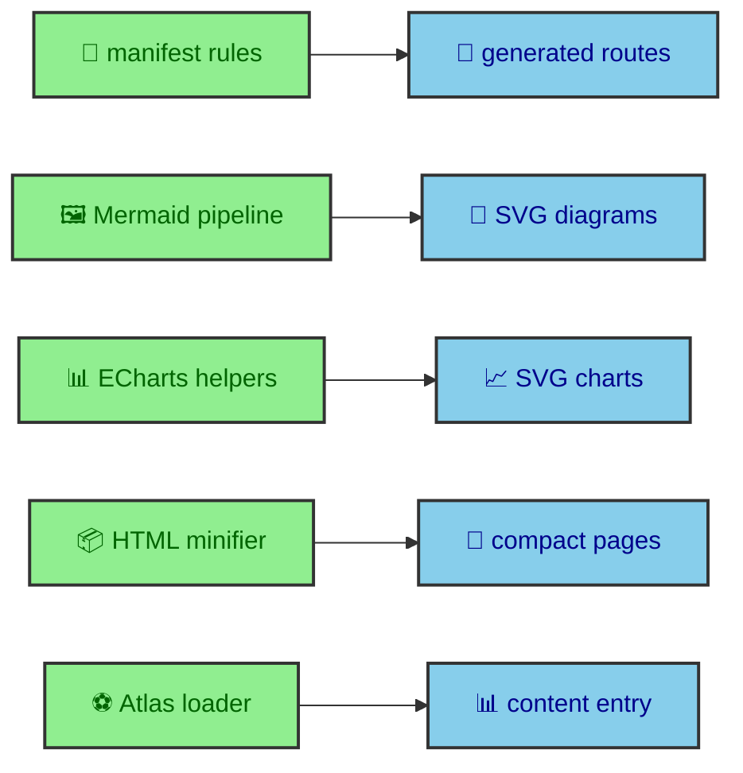

The riskiest parts of this site run before the browser opens. The journal manifest decides which pages exist. The Mermaid integration rewrites diagrams into SVG assets. ECharts turns MDX chart options into static SVG. The HTML minifier rewrites generated files. The Atlas loader turns outside data into a local content entry. These systems are custom enough that generic framework confidence is not enough.

---

## Build-time focus

Vitest is the right tool for these systems because they are mostly deterministic transformations. Given entries, the manifest should produce a route list, manifest map, vault tree, image inheritance, reading time, and pagination. Given SVG-like HTML, Mermaid utilities should sanitize, rewrite, merge, or hoist in predictable ways. Given chart inputs, ECharts helpers should render SVG, hash artifacts, serialize options, and build known chart shapes. Given source HTML, the minifier should preserve code fragments while reducing the rest. Given fixture data, the Atlas loader should store the expected content entry.

The common thread is that these checks protect project rules, not only library behavior. Astro, Mermaid, ECharts, and html-minifier-terser all do useful work, but the site has local expectations about how their output should fit the publishing system.

---

## Manifest tests

`tests/unit/thejournal-manifest.test.ts` covers the journal manifest builder. It checks that entries publish when `draft` is missing or false. It filters draft standalone entries from static entries and manifests. It filters an entire vault when the root index is draft. It filters a draft nested section and its descendants while preserving siblings.

The suite also checks traversal and route structure. It links pagination across published entries only. It requires images for standalone entries and vault roots. It rejects top-level vault folders without a root index. It rejects nested vault sections without an index. It builds nested vaults, inherits child images, sorts items, and links traversal.

The manifest also resolves entries and vault context from generated journal paths. It measures prose and code read time with a one-minute minimum. It rejects updated entries without an original publication date.

Those rules define the journal's publishing model. The route layer, catalog, sidebars, breadcrumbs, pagination, and article header all rely on the manifest telling the truth.

---

## Why the manifest is central

The manifest is the bridge between content files and site structure. It reads collection entries and turns them into published routes, vault trees, entry contexts, and navigation relationships. The dynamic journal route then uses that prepared context to render pages.

That means a manifest rule is not isolated. A draft filter changes which routes exist. Image inheritance changes publication headers and catalog cards. Section index requirements change whether a vault can be navigated. Pagination changes the previous and next links at the bottom of an article. Read time changes visible metadata.

Because the manifest sits upstream of so many components, it deserves focused coverage. A browser test can confirm that representative pages render, but unit tests can walk the manifest rules directly and document the publishing model.

---

## Mermaid tests

Mermaid tests are split across HAST utilities, transform behavior, and page CSS hoisting. `mermaid-hast.test.ts` checks that scripts are stripped, style attributes are sanitized, foreignObject breaks are collapsed, root IDs are updated, derived IDs are rewritten, and SVG reference attributes follow the new IDs.

`mermaid-transform.test.ts` checks theme transforms. It covers Worker SVG theme merging, Ink inline-color hoisting with final rewritten IDs, and dispatcher guards for placeholder services. The details matter because the integration supports multiple rendering paths and still needs a consistent final SVG contract.

`mermaid-page-css.test.ts` checks page CSS optimization. It verifies that SVG styles can be hoisted without restructuring the theme cascade across diagrams. The implementation uses CSSO with restructuring disabled because preserving cascade behavior is more important than an aggressive CSS rewrite.

These tests protect the diagram feature as a publishing feature. A Mermaid fence in MDX should become a readable inline SVG, theme-aware assets, and safe page CSS. The tests keep those expectations concrete.

---

## Why Mermaid gets special attention

Mermaid diagrams are not simple images in this site. A diagram begins as a code fence in MDX. The build pipeline finds it, renders SVG, sanitizes output, rewrites IDs, creates theme-specific assets, wraps the inline diagram, and may hoist page CSS. The runtime shell later uses those generated artifacts for theme-aware Open links and popover expansion.

That path has more moving parts than an ordinary image import. It crosses markdown processing, renderer services, SVG processing, CSS handling, asset output, and runtime hooks. Unit tests cover the parts that can be expressed as transformations before the browser arrives.

This lets diagrams remain author-friendly. Authors write Mermaid fences. The pipeline does the rest. The tests keep the pipeline's promises visible.

---

## ECharts tests

`tests/unit/echarts.test.ts` covers the chart pipeline that can be checked without opening a browser. It verifies render and hydration normalization, including the deferred `png-file` and `light` modes. It checks that server-side SVG output contains real SVG, that ARIA defaults merge correctly, and that chart input hashes stay stable when object keys arrive in a different order.

The suite also protects the artifact path. It checks that `svg-file` hashes include render mode, renderer version, ECharts version, dimensions, theme, option, and cache key. In development mode the artifact registration returns inline SVG. In build mode it records the asset and emits a hashed SVG file under `_app/charts/`.

Serialization gets direct coverage because enhanced charts pass options through HTML data attributes. The tests reject functions, non-finite numbers, and other values that cannot safely cross that boundary. The client preset tests then prove that known formatter callbacks can be rebuilt in the browser from named presets.

The option builder tests cover line, bar, pie, heatmap, correlation heatmap, scatter, histogram, treemap, Sankey, boxplot, candlestick, MACD, RSI, Bollinger Bands, depth, order book, and OHLC helpers. They also check deterministic finance math and histogram bins. That makes the builder catalog part of the tested publishing contract.

---

## HTML minifier tests

`tests/unit/html-minifier.test.ts` covers the custom HTML minifier. The minifier runs after Astro writes HTML files, collapses whitespace, removes comments, minifies inline JS and CSS, and skips built asset files. The key project-specific rule is that code-oriented fragments must be preserved.

The options ignore `<pre>`, `<code>`, and `<kbd>` fragments. That matters because code examples and keyboard tokens are publication content. The site can reduce generated HTML without letting the minifier damage the exact kind of content technical articles rely on.

The test gives that rule a permanent place in the quality stack. If the minifier options change later, the code-oriented content contract remains visible.

---

## Minification as content protection

The minifier exists for performance, but its test is about preserving meaning. A technical article can contain spaces, line breaks, keyboard tokens, and code markup that readers depend on. Reducing HTML should not flatten those fragments.

That is why the minifier test belongs in the same article as manifest and Mermaid tests. All three protect the publishing system. The manifest protects route meaning. Mermaid tests protect diagram meaning. The minifier test protects code-sample meaning after output optimization.

The site can then optimize generated files with more confidence because the content-sensitive exceptions are part of the tested contract.

---

## Atlas loader tests

`tests/unit/atlas-loader.test.ts` covers helper functions and loader behavior. It checks record formatting and parsing, ESPN app-state extraction with nested JSON braces, deterministic test data when `ALBERTODURAN_TEST_MODE` is enabled, normal next-match loading, standings fallback when the schedule record is empty, store behavior when no next match exists, and fetch failure handling.

The Atlas loader is part of the build because the homepage renders match data statically. The tests keep the transformation from outside API shape into local `AtlasData` explicit. The component should receive standing, record, points, teams, raw date, stadium, and city. It should not need to understand ESPN response structure.

The deterministic flag also appears here. Build-time data can still be tested if the loader can swap live input for fixture input while preserving the same output shape.

---

## External data as local content

The Atlas loader turns an outside API into a local content entry. That transformation is the part worth protecting. The homepage should not know ESPN's response shape. It should receive standing, record, points, teams, raw date, stadium, and city from `atlasData`.

The tests describe that boundary. Helper tests keep record parsing and app-state extraction explicit. Loader tests keep the content store behavior explicit. Fixture mode keeps the same loader contract available in deterministic builds.

This is the same pattern as the manifest and Mermaid tests. Outside or source-specific input enters the build. Project code normalizes it. The rest of the site reads the normalized result.

---

## Other focused tests

`navigation.test.ts` covers route helper behavior such as normalizing root and known section paths and detecting journal publication pages. `ribbon.test.ts` covers generated SVG ribbon dimensions and scoped references.

These tests are small, but they cover helpers that feed visible behavior. Navigation helpers affect route classification. Ribbon helpers affect decorative SVG output and ID safety. Keeping these helpers tested near their source prevents small utility assumptions from spreading unchecked.

The pattern is consistent. When a helper has a clear input and output, Vitest is the right layer. When behavior needs layout, focus, or browser events, Playwright is the right layer.

---

## Test data as documentation

The fixtures inside these tests do more than drive assertions. They document the shapes the build systems expect. Manifest fixtures show what standalone entries, vault roots, nested sections, drafts, images, and updated dates look like. Mermaid fixtures show the SVG patterns that need sanitation and rewriting. Atlas fixtures show the local content shape the homepage expects.

That documentation value matters for a project with custom publishing rules. A future reader can learn the system by reading the tests and seeing concrete examples of the data moving through it.

---

## Write the regression at the failure

The custom build-time systems are the places where the site expresses its own rules. The manifest expresses publishing structure. Mermaid transforms express diagram behavior. The minifier expresses content preservation. The Atlas loader expresses live-data normalization. SVG ribbon tests express decorative asset generation.

Vitest keeps those rules close to the code that implements them. That gives the website a dependable static build without making the browser layer responsible for proving build-time logic.
