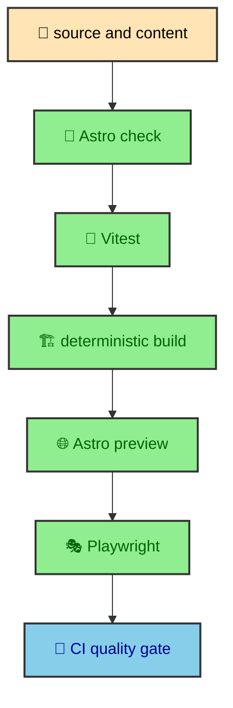

The testing strategy follows the shape of the site. Astro checks protect component and content typing. Vitest covers pure logic and custom build systems. Vitest is the fast test runner used for functions and build transformations. Playwright is the browser automation tool used for focus, layout, route swaps, and no-JS checks. A deterministic production build makes the generated site repeatable, and CI ties those layers together before changes reach the main branches.

---

## Practical layers

The project uses four practical layers.

```bash
npm run check
npm test
npm run build:test
npm run test:e2e
```

The command sequence narrows the risk from source shape to browser behavior.



`npm run check` runs Astro and TypeScript diagnostics. It is the broad static gate for component props, content shapes, imports, and TypeScript errors. It gives the project a fast way to confirm that the source still makes sense to Astro.

`npm test` runs Vitest unit and integration tests. This is where the project checks pure transformation rules, content manifest behavior, Mermaid utilities, HTML minification, Atlas loading, navigation helpers, and SVG ribbon helpers.

`npm run build:test` creates static output with deterministic environment flags. It exercises the production build path without depending on live sports data or live Mermaid renderer behavior.

`npm run test:e2e` combines the deterministic build with an Astro preview server and Playwright. It validates browser-visible behavior against production-shaped output.

The layers form a pyramid in practice. Fast source checks and unit tests cover broad logic. Browser tests cover fewer flows, but they cover the flows that need a browser.

---

## Deterministic flags

The test build uses two important flags.

```bash
ALBERTODURAN_TEST_MODE=true
MERMAID_RENDERER_FIXTURE=true
```

The Atlas widget gets its data from ESPN during normal builds. That is useful for the live site, but it is not a stable input for a quality gate. `ALBERTODURAN_TEST_MODE=true` makes the loader store `ATLAS_TEST_DATA` instead. The component still reads the same content collection entry, but the data is predictable.

Mermaid rendering has a similar need. The integration supports renderer behavior that can depend on external tools or complex rendering environments. `MERMAID_RENDERER_FIXTURE=true` lets the test build use fixture output while still exercising the project's transform and wrapping logic.

Those flags keep the build faithful to the architecture while removing outside variability. The site still builds static pages. The Atlas section still renders. Mermaid diagrams still move through the pipeline. The difference is that repeatable inputs make repeatable output.

---

## Vitest layer

Vitest covers the code that can be tested without a full browser. That includes manifest building, navigation helpers, Mermaid HAST utilities, Mermaid transform behavior, Mermaid page CSS hoisting, the custom HTML minifier, the Atlas loader, and SVG ribbon generation.

This is the right home for deterministic transformations. A manifest function can receive fixture entries and return published entries, route context, vault structure, and pagination links. A Mermaid utility can receive SVG-like HTML and return sanitized output. A ribbon helper can receive icon definitions and return dimensions with scoped IDs.

Keeping these checks in Vitest makes them fast and focused. The browser does not need to open a page to prove that a draft vault is filtered or that repeated SVG IDs are scoped. Those are build rules, so they belong close to the build code.

The test suite also documents the intended behavior. A future reader can open the tests and see which manifest rules, Mermaid transform rules, and loader rules are considered part of the site's contract.

---

## Production preview layer

Playwright runs against `astro preview` through `tests/e2e/run-preview-tests.mjs`. The wrapper starts preview on `127.0.0.1:4325`, waits until it responds, then runs Playwright with `PLAYWRIGHT_SKIP_WEBSERVER=true`. When Playwright exits, the wrapper stops preview.

That shape matters because the browser tests are meant to see production output, not the development server. The site is static, so preview is a close match for the way the built pages will be served. The tests can inspect routes, layout, focus behavior, scroll state, and runtime enhancement against generated files.

The e2e layer is smaller than the unit layer because it is more expensive and because it should focus on browser behavior. It covers smoke routes, responsive breakpoints, hero geometry, overlay interactions, theme persistence, article navigation, no-JS states, and Mermaid shell behavior.

---

## Coverage posture

`npm run test:coverage` exists for Vitest coverage reporting, but coverage is a supporting signal rather than the core design goal. The important question is whether the high-risk contracts are covered at the right layer.

For this site, high-risk means custom rules. The manifest decides which pages exist and how they relate. Mermaid transforms produce visible article diagrams. The minifier rewrites final HTML. The Atlas loader turns external data into content. Runtime modules control focus, theme continuity, and article navigation.

Line coverage can help reveal blind spots, but it cannot decide what matters. The strategy starts from architecture, then uses coverage as one way to see whether the tests are reaching enough of that architecture.

---

## Command responsibilities

The scripts are deliberately named by responsibility. `check` is about source validity. `test` is about unit and integration behavior. `build:test` is about generating production-shaped static output with stable inputs. `test:e2e` is about browser behavior against that output.

That naming helps the project stay honest about what each command proves. A successful Vitest run does not mean the responsive layout is comfortable. A successful Playwright run does not mean every manifest branch has focused coverage. A successful build means Astro produced output, but the deterministic fixture tests explain whether the custom systems behaved as intended.

Clear command responsibilities also make CI easier to read. The workflow can run the same sequence and expose which layer produced a result. The site does not need a mysterious all-in-one quality command to feel protected.

---

## Why not only build

For a static site, it can be tempting to treat `astro build` as the main quality gate. A successful build is important, but this project has too many local rules for build success to be enough by itself.

Astro can build pages even if a manifest traversal rule changes in a way that makes the publication order wrong. A minifier can produce smaller HTML while still harming code-oriented fragments if the preservation rule is removed. A page can render while an overlay focus loop feels wrong in a browser. A Mermaid SVG can exist while the theme-specific asset link is not updated correctly after a theme change.

The testing strategy exists because the site is more than generated files. It is generated files plus local publishing rules plus runtime enhancement. The quality layers map to that full shape.

---

## Local and CI symmetry

The command map works locally and in CI. A developer can run the same scripts that the workflow runs. CI then executes them in a clean environment with Node 22 and dependencies installed through `npm ci`.

That symmetry reduces surprises. The project does not rely on a private CI-only quality path. The same deterministic flags, preview wrapper, and Playwright flow can be understood from the repository. When a future contributor reads the scripts, they can see how the site expects to be validated.

This is part of making the build teachable. The testing strategy is not hidden in tribal knowledge. It is encoded in package scripts, fixture flags, test files, and the workflow.

---

## CI flow

The GitHub Actions workflow runs on pull requests and pushes to `dev` or `master`. It uses Node 22, installs dependencies with `npm ci`, runs `npm run check`, runs `npm test`, installs Playwright Chromium, runs `npm run test:e2e`, and uploads the Playwright report when present.

The workflow name is `Quality`, and the job is named `Check and test`. The naming is plain because the sequence is plain. Install, check, test, run browser coverage. That directness makes it easier for the project to keep local and CI behavior aligned.

The CI flow also respects the static deployment model. It does not provision a database or long-running backend. The site is validated as source, build logic, static output, and browser behavior.

---

## The build lesson

The testing strategy is not an external checklist. It is a map of the site's architecture. Checks cover source shape. Vitest covers local build logic. Deterministic flags make production-shaped builds repeatable. Playwright covers browser-only behavior. CI runs the sequence consistently.

That lets the site keep adding custom publishing features without losing confidence in the static foundation that makes it fast and maintainable.

The important habit is to choose the layer that matches the behavior. If a rule can be expressed as input and output, keep it in Vitest. If it depends on layout, focus, route swaps, or browser APIs, use Playwright. If it is source shape, let Astro and TypeScript check it. The quality stack stays useful because each layer has a job.

The strategy also keeps future additions easier to place. A new content processor should come with focused transformation tests. A new runtime interaction should come with browser coverage. A new component shape should pass the source checks and fit the existing preview flows. The architecture tells the test where to live.
