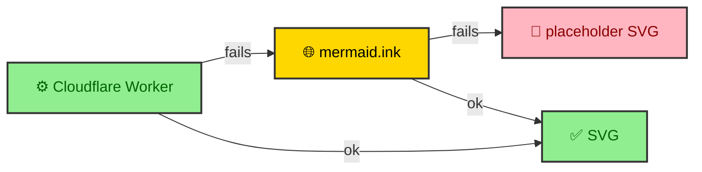

A build that depends on a network service has a new way to fail, and a diagram render is not worth failing a build over. So the app's render pipeline never bets everything on one renderer. It tries the Cloudflare Worker, and if that is unreachable it tries a public renderer, and if that fails too it emits a placeholder so the build finishes anyway. A missing diagram is a visible flaw on one page. A crashed build blocks every page, so the pipeline is built to always produce something.

---

## A chain, not a single call

The render function walks an ordered list of providers and returns the first one that succeeds. The Cloudflare Worker comes first because it is fast, batched, and consistent. The mermaid.ink public service comes second as a slower safety net. A placeholder generator comes last and cannot fail.

Each provider decides for itself whether it is enabled. The Worker turns itself off when no URL is configured or when a flag disables it, so a build with no Worker credentials falls straight through to the public service without erroring. A provider that throws is logged and skipped, and the chain moves on.

---

## mermaid.ink, the careful fallback

The public renderer needs more care than the Worker, because it is a shared service with no batching. The app talks to it one diagram at a time, and serializes those requests through a promise chain so they never overlap. Each successful fetch is followed by a 1.2 second pause before the next one starts, which keeps the site from hammering a service it does not own.

The request itself is a compressed URL. The pipeline builds a Mermaid config, prepends it to the diagram code as an init block, deflates the whole payload at maximum compression, and encodes it as base64url into a `pako:` URL. When the service returns a 503, the pipeline retries up to four times with exponential backoff, doubling the wait on each attempt. Any other error, or a fifth failure, gives up and lets the chain fall through. It is slow and deliberate, which is the right posture toward a free public dependency.

---

## The placeholder that cannot fail

If both renderers are exhausted, the pipeline returns a small inline SVG for every diagram and theme. It is a bordered box reading "Diagram unavailable," and it exists for one reason. It guarantees the render function always returns a result, so the build never throws at the point where a diagram would go. The build completes, the page ships, and the missing diagram is an obvious visual gap rather than a broken deployment.

The result also records which provider produced it. A batch carries the identity of the service that rendered it, so the build can tell whether its diagrams came from the Worker, the public fallback, or the placeholder. That provenance is how a degraded build announces itself instead of hiding.

---

## Fixture mode short-circuits the whole chain

There is a fourth path that is not a fallback at all. When the deterministic build sets its fixture flag, the app passes no render function to the integration. With no caller renderer, `bloomwright-ui` falls back to its own offline fixtures, and none of the providers above ever run. No Worker, no mermaid.ink, no network.

That is what makes the test suite trustworthy. The unit tests and the browser tests build production output without ever touching an external service, so a render outage on someone else's infrastructure can never turn a passing suite red. The same seam that lets a real Worker render in production lets the tests stay hermetic, which is what keeps a passing suite honest.
