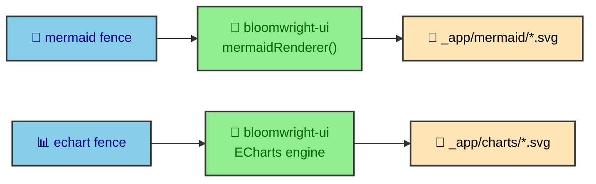

Open the network tab on any article here and you will not find a diagram library or a charting bundle loading. Both are gone before the page ships. A Mermaid flowchart arrives as an SVG file, an ECharts figure arrives as an SVG figure, and the reader's browser draws neither. This section is about where that work moved to, why it moved there, and how two very different rendering paths end up producing the same kind of static asset.

---

## Extract, then render

The site splits diagram work into two jobs that stay apart on purpose. One job notices that a fence exists. The other turns the fence into pixels. `bloomwright-mdx` does the noticing, emitting a component where a `mermaid` fence used to be, and rendering `daisyui` and `echart` fences inline. `bloomwright-ui` does the drawing, through its ECharts engine and its Mermaid renderer integration.

That separation is the reason the reader's browser stays quiet. By the time the HTML is written, every diagram is already an asset on disk. The `authoring/fences` page covers the noticing side from an author's chair. This section covers the drawing side, where the interesting engineering lives.

---

## Two asset namespaces

Rendered output lands in two folders under the build's asset root, and the split tells you which engine produced a file. Mermaid diagrams write to `_app/mermaid/`, one SVG per theme. ECharts figures write to `_app/charts/`, one SVG per chart. A file's path is its provenance.

The two paths differ in one large way. ECharts renders locally, inside the Node build, because a chart is data and a chart library can draw it without a browser. Mermaid cannot, so its path reaches out to an external service. That difference shapes almost everything in the pages that follow.

---

## Structure versus measured values

Having two rendering tools raises an obvious question for an author. Which one do you use? The rule is about the nature of the content, not personal taste. Mermaid draws structure. ECharts draws measured values.

If the point is a relationship, a flow, a sequence, or an ownership boundary, that is structure, and it belongs in Mermaid. If the point is a quantity, a trend, a distribution, or a correlation, those are measured values, and they belong in ECharts. A Sankey diagram sits right on the line and resolves cleanly under the rule. If the links carry measured weight, ECharts draws it. If they only show movement, Mermaid does.

Most pages in this vault have structure and no measured values, which is why they carry diagrams and almost no charts. Inventing numbers to justify a chart would break the rule and the honesty behind it.

---

## What this section covers

The rest of `rendering/` follows both paths to the end.

- `mermaid_pipeline` traces the build integration that scans, batches, caches, and emits diagrams.
- `why_a_worker` argues the decision to render Mermaid outside the build at all.
- `render_service` documents the Cloudflare Worker end to end.
- `fallbacks` covers what happens when the Worker is unreachable, down to the placeholder that keeps a build alive.
- `svg_transform` explains the HAST pass that makes a raw SVG safe and themeable.
- `echarts` covers the local server-side rendering path and its hydration modes.
- `chart_gallery` shows the published chart catalog, rendered in a real article.
