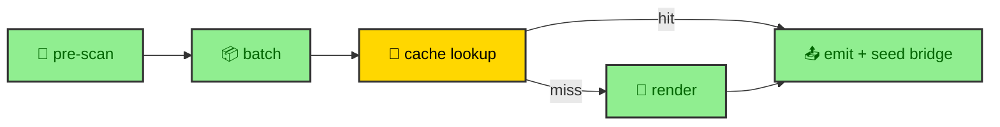

A Mermaid diagram on this site travels through five stages before it becomes a file, and only one of them ever touches the network. The `mermaidRenderer()` integration from `bloomwright-ui` owns the whole trip. It scans sources for diagrams, batches them, checks a disk cache, renders whatever is missing, and emits the results as themed SVG. Understanding those stages explains a surprising fact about a typical rebuild, which is that it renders nothing at all.

---

## The five stages

The integration runs during the Astro build and moves each diagram through the same sequence. Pre-scan finds the diagrams. Batching groups them. The cache lookup separates hits from misses. Rendering resolves the misses through the caller's port. Emit writes the SVG files and seeds a build-context bridge the component reads later.

Each stage has one responsibility, and the boundaries between them are where the app plugs in. The scan asks the app which sources are publishable. The render asks the app how to talk to a renderer. The `bloomwright/seams` page covers both of those sockets. Here the focus is what the pipeline itself does between them.

---

## Pre-scan respects what publishes

Pre-scan walks the sources and finds both `mermaid` fences and `defineMermaidDiagram()` calls, but it does not decide which ones matter. It hands the full set to the app's `selectSources` function, which returns only the publishable documents. A draft article's diagrams never survive that filter, so they never reach the batch, the cache, or the network.

This is the first place the publish rule earns its keep. Content policy and render policy agree because they run the same function. An unpublished diagram costs nothing, because the pipeline never learns it exists past the filter.

---

## Addressing decides cache hits

Every surviving diagram is keyed before anything renders. The key combines the diagram code with a renderer version, currently pinned at `v4.9`, through a `buildCacheKey(code, version)` call. The emitted asset path follows from that key, landing at `/_app/mermaid/{stableId}-{cacheKey}.svg` with a `-dark` sibling for the dark theme.

That scheme has one consequence worth stating plainly. A diagram whose code has not changed produces the same key, hits the cache, and skips the network entirely. So a normal rebuild, where the prose changed but the diagrams did not, renders zero diagrams. The Worker stays idle, and the build is fast because the expensive step almost never runs. Change the renderer and the version changes with it, so every old key misses and every diagram re-renders, with no cache to clear by hand.

---

## Batching protects the renderer

The misses that survive the cache are not fired off all at once. The pipeline groups them into chunks and spaces the chunks out in time. The defaults live in the package, a chunk size of fifteen diagrams with a long delay between chunks, because the downstream renderer has limits and a build that ignored them would be rejected or throttled.

Keeping that policy inside `bloomwright-ui` is deliberate. The renderer's batch limits are the renderer's concern, so the package owns the batching and the app owns only the render call. If a build has fifty new diagrams, the pipeline paces them rather than dumping them, which is the difference between a slow success and a fast failure.

---

## Two module instances, one store

The pipeline has a split personality that is easy to miss. The build hook writes the cache and emits the assets. The `MermaidDiagram` component reads the cache during prerender to find its SVG. Those are two different module instances in the same build, and they share nothing except the store.

That works only because both address the store the same way, with the same namespace, the same renderer version, and the same stable ids. Get any of those wrong and the reader misses everything the writer stored, and the diagram falls back to an error. The disk cache in `.astro/` is the neutral ground where the write path and the read path meet, which is why the addressing rules matter more than they look. They are the contract between two halves of the same build that never call each other directly.
