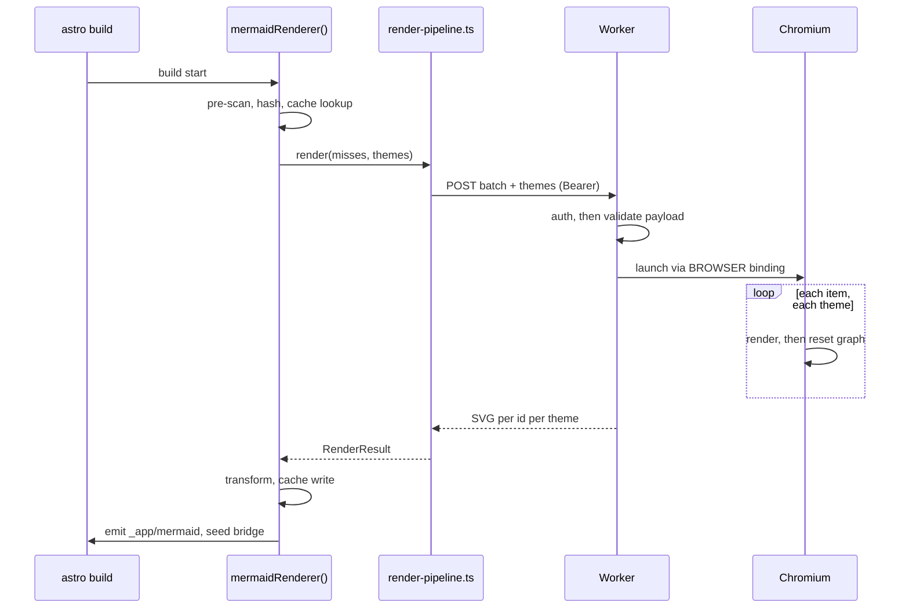

The render service is a readable, tested Cloudflare Worker of about 750 lines, and everything it does while a build waits can be traced. This page follows one build's round trip through it, names what happens inside the Worker between the request and the returned SVG, and ends on two real mismatches worth publishing rather than hiding.

---

## One round trip

Follow a single diagram that missed the cache. The build calls the app's render pipeline, which posts a batch to the Worker, which launches a browser, renders each item for each theme, and returns SVG. The build then transforms and caches the result and moves on.

---

## Before the call

Two things happen on the app side before any request goes out. The pipeline narrows the diagram set through the app's publish filter, so drafts never leave the machine, and it keys each diagram so cache hits skip the network. The interesting consequence is that a typical rebuild sends nothing, because everything hit the cache. The Worker is idle far more often than it runs.

When there are misses, the app posts one batched request carrying the diagram ids and code, the theme palettes, and a font family. It sends a Bearer token, sets a 90 second client timeout, and guards its own payload at 900 KiB, which sits just under the Worker's own limit. The `fallbacks` page covers what happens when this request does not come back.

---

## Inside the Worker, while the build waits

The Worker does its work in a strict order, and the order is a defense. It authenticates first, validates the entire payload second, and only then spends a browser launch. Nothing expensive happens until everything cheap has passed.

- **Authentication.** It reads a Bearer token, or a legacy `X-Auth-Token` header, and compares it to a configured `API_KEY`. If no key is configured it fails closed with a 500, unless an explicit `ALLOW_UNAUTHENTICATED` flag is set for local use. A missing secret never means an open door.
- **Validation before Chromium.** It checks the whole payload against published limits. At most 950,000 bytes, 50 items, 10 themes, 200,000 characters per diagram, and a font family that is a short string of safe characters. A payload that breaks a limit is rejected before a browser ever starts, so a bad request costs almost nothing.
- **One browser, sequential renders.** It launches a single Chromium through the `BROWSER` binding, loads a page carrying vendored Mermaid 11.4.1 and inlined Font Awesome 6.7.2, and renders every item for every theme on that one page. Between themes it resets only the graph host rather than reloading the several megabytes of Mermaid and Font Awesome assets, because reinjecting them per theme was what pushed batched requests past the render timeout.
- **Timeouts and security.** Each render runs under a timeout, 15 seconds by default and 45 at most. The Mermaid security level defaults to `strict`. Both are the Worker's own settings, not the caller's.

When it finishes, it closes the browser and returns. No Chromium survives a request.

---

## What it delivers

The Worker returns SVG grouped by diagram id and theme, and its failure model is the careful part. Failure is per theme, not per batch. A theme that fails to render comes back as a structured result carrying the error and a fallback SVG, under an HTTP 200, so one broken diagram cannot cost the build the 160 good ones around it. Every request and every render failure is logged with a request id, which is how a failing build can be traced without guesswork.

Back on the app side, the returned SVG goes through the HAST transform, into the disk cache, out to the themed asset files, and into the build-context bridge the `MermaidDiagram` component reads during prerender. The `svg_transform` page picks up there.

---

## Two mismatches worth naming

Documenting the Worker honestly means admitting where the app does not use it fully. Two mismatches are visible in about twenty lines of the app's render pipeline, and both are real.

The first is the endpoint. The Worker's preferred API is `POST /v2/render`, which returns the structured per-theme results described above. The app still posts the legacy batch shape to the Worker root, so it receives the flat legacy response instead of the richer structure it could use. The second is the security level. The app sends `securityLevel: "loose"` per theme, while the Worker's own default is `strict`. Both work, and saying so is more useful than describing a v2 contract the app does not yet call. Naming them here keeps the gap visible instead of letting it drift out of memory.
