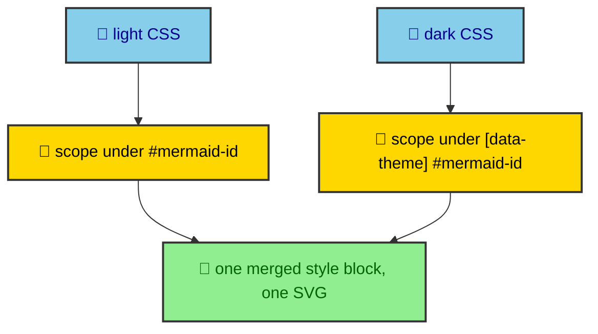

An SVG that comes back from a renderer is not ready to drop into a page. It carries scripts, global ids that collide with the next diagram, and CSS scoped to a render id the page has never heard of. Put two of them on one page untreated and they fight over ids and styles. So every rendered diagram goes through a HAST transform before it becomes an asset, a pass that makes the SVG safe to embed and able to switch themes without a second file. This page walks that transform and the palette that feeds it.

---

## Why a transform is needed at all

The problem is isolation. A Mermaid renderer assigns ids like `res-light-9193` and scopes the diagram's CSS to that id, which is fine for one diagram alone on a page. This site puts several diagrams on a page and serves a light and a dark variant of each. Without treatment, their ids collide, their styles leak, and a theme switch has nothing to switch to.

The transform parses the raw SVG string into a HAST tree and rewrites it into something a shared page can hold. It works on a tree rather than on text, so the edits are structural rather than fragile string replacement.

---

## The passes, in order

The transform runs a sequence of focused steps, each a small named function in `bloomwright-ui`'s HAST helpers.

- **Strip scripts.** `stripScripts` removes any script element, so an embedded SVG can never execute code in the article.
- **Sanitize style attributes.** Inline style attributes are cleaned so nothing smuggles behavior back in.
- **Rewrite ids.** `updateHastIds` rewrites the SVG's internal ids and every reference to them, so two diagrams on one page cannot claim the same id.
- **Collapse foreign-object line breaks.** `collapseForeignObjectLineBreaks` cleans up the line-wrapping markup Mermaid emits inside `foreignObject`, which otherwise renders inconsistently.
- **Scope and merge CSS.** The renderer's own scope prefix is stripped, then each theme's CSS is re-scoped and the themes are merged into a single style block.

The order matters. Scripts go before anything trusts the tree, ids are rewritten before CSS references them, and CSS scoping happens last because it depends on the ids being final.

---

## One asset, two themes

The clever part is how light and dark end up in one file instead of two. After scoping, the first theme's rules sit under the diagram's own id with no extra guard, so they apply by default. Every later theme's rules are scoped under a `[data-theme="X"]` selector combined with the diagram id. All of those blocks merge into a single style element inside one base SVG tree.

The payoff is that a theme switch is pure CSS. The reader flips the theme, the `data-theme` attribute changes on the page, and the already-loaded SVG restyles itself. No second asset loads, and no JavaScript redraws the diagram. The public fallback renderer needs an extra step here, because it returns inline colors rather than a clean style block, so the transform hoists those inline colors into CSS before scoping them the same way.

---

## A palette that survives the network

Theming starts long before the transform, with a palette that has to cross a network boundary to reach the Worker. That constraint shapes its type. A `MermaidPalette` is all hex strings, because Mermaid only accepts hex and because hex serializes cleanly into JSON. It names the surfaces, the brand and semantic colors, the borders, and the subtle backgrounds a diagram uses, and nothing in it is a live object or a CSS variable.

From a palette, `generateMermaidTheme` builds the `themeVariables` the renderer needs, choosing readable text colors by measuring contrast against each background rather than trusting the palette blindly. The app keeps two palettes, light and dark, and passes both to the renderer, which is why one render call can return both themes. The palette is serializable by design, so the same values that style a diagram in the build can travel to a Worker and come back as SVG that matches the site.

---

## The emitted assets

The transform's output is written as standalone SVG files under `_app/mermaid/`, one per theme, named by the diagram's stable id and cache key. Those files are the durable artifacts. They are what the cache stores, what the component references, and what a reader's browser actually loads. Everything upstream, the Worker call, the fallbacks, the HAST passes, exists to produce these two small files per diagram, which then sit in the build output like any other static asset.
