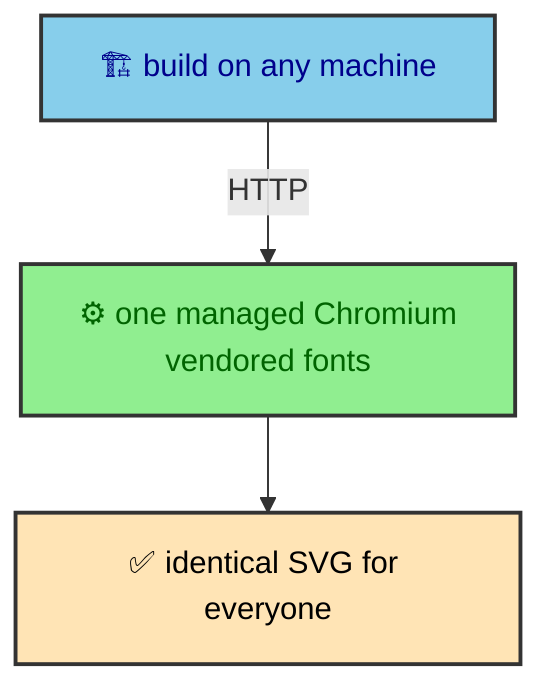

The first question anyone asks about this setup is fair. The site is a static build that deploys to Cloudflare, so why is there a separate Cloudflare Worker just to draw diagrams? It looks like one moving part too many. The answer is that every simpler option is worse, and the reasons are specific rather than architectural taste. Four constraints push diagram rendering out of the build and behind a network boundary, and each one rules out an alternative.

---

## Mermaid is a browser library

Mermaid does not compute a diagram from text in the abstract. It measures rendered text to size a node and wrap a label, and those measurements need a real layout engine and real font metrics. There is no faithful path that skips the browser. A DOM shim gets geometry wrong, so labels overflow, nodes misalign, and the output looks broken in ways that are hard to predict.

So rendering a Mermaid diagram means running a browser somewhere. That single fact is what makes this harder than rendering a chart, which is pure data a library can lay out with math alone.

---

## The deploy target has no server

The site is a static build on Cloudflare Workers Static Assets. There is nothing at request time to render into, because the whole point of the deployment is that pages are finished files by the time a reader arrives. If a diagram is going to be a browser render, that render has to happen earlier, at build time.

Build time is a laptop or a GitHub Actions runner. Neither is a place a browser wants to live, which leads straight to the third constraint.

---

## Neither machine should carry Chromium

The obvious move is to embed Puppeteer in the build and launch a local browser. It works, and it charges a heavy toll. Every install and every CI run pulls down a full browser, and worse, the SVG output starts to depend on whichever Chromium and whichever system fonts the building machine happens to have. Two developers building the same source would produce different diagrams, and a font missing on a CI runner would silently change every label.

The Worker removes that variance. Cloudflare Browser Rendering gives one managed Chromium behind a binding, and the Worker vendors its own Mermaid and inlines its own Font Awesome fonts. So text metrics are identical no matter who triggers the build, and no build machine has to carry a browser at all.

---

## It isolates the failure domain

The fourth constraint is about what happens when rendering breaks. An embedded browser that crashes takes the whole build down with it. An HTTP call that fails can degrade instead. When the Worker is unreachable, the app falls back to a public renderer, and when that fails too, it falls back to a placeholder SVG, and the build finishes either way.

That graceful degradation is only possible because the renderer sits on the other side of a boundary. You cannot catch a segfault from a library you embedded, but you can catch a failed fetch. The `fallbacks` page traces that chain in full.

---

## The reuse argument, and the bill

There is one more reason the boundary exists, and it is the deepest. Because rendering is an addressable service, `bloomwright-ui` ships no renderer of its own. It takes a render function from its caller. The Worker is one implementation of that port, and any future project can point at the same endpoint instead of solving diagram rendering again. The seam and the service justify each other.

None of this is free, and pretending otherwise would undercut the argument. A cold Chromium start costs a few seconds. The build now depends on a network service and a secret. And there is a per-render cost a local renderer would not have. All three are acceptable for one reason. This runs only at build time and is aggressively cached, so most builds render nothing, call nothing, and pay none of it. The cost lands on the rare build that actually changed a diagram, which is exactly the build that can afford to wait.
