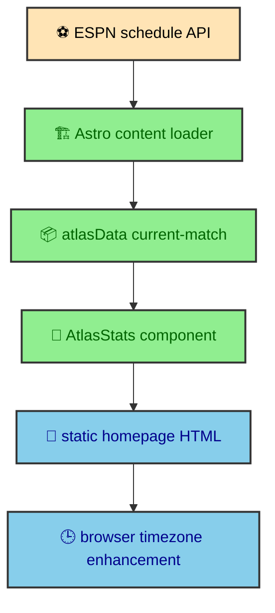

The Atlas widget is live enough to feel current and static enough to fit the architecture of the site. Schedule and standings data are fetched during the build through a custom Astro content loader. The homepage then renders that data like any other content entry. The browser only enhances the displayed match time for the reader's local timezone, which keeps the page from depending on a client-side sports API call.

---

## Content loader

`src/utils/atlas_loader.ts` defines the `atlasData` loader. It calls ESPN's schedule API for team ID `216`, extracts the next match, formats record data, calculates points, and stores one entry with ID `current-match`.

When `ALBERTODURAN_TEST_MODE=true`, the loader uses deterministic `ATLAS_TEST_DATA`. That keeps builds and e2e tests stable when ESPN changes or the network is unavailable.

The loader is registered as part of the Astro content layer, so the widget data becomes a content entry instead of an ad hoc fetch inside a component. That is the architectural choice that keeps the feature aligned with static generation. The homepage does not need to know how to contact ESPN. It asks Astro content for `atlasData` with the ID `current-match`.

The loader clears the store before writing the current entry. That makes the collection behave like a single current snapshot rather than an accumulating history. The component can rely on one known ID, and the rest of the page can treat the result as ordinary build data.

The data shape is deliberately small. It contains standing, record, points, home team, away team, raw date, stadium, and city. Those fields are exactly what the visual component needs. The loader translates scraped ESPN page data into a local display shape before the component renders.

The browser appears at the end because it only personalizes the time display. The match data is already in the HTML.

---

## Standings fallback

If the record summary and points are both zero, the loader fetches the ESPN standings page. `extractEspnAppState()` finds `window['__espnfitt__']` and uses brace matching to extract a JSON object from the HTML.

That fallback is specific, but it keeps the widget from showing a meaningless zero record when current standings are available elsewhere.

The fallback also demonstrates a local rule. External data is normalized before it reaches the component. The component should not contain knowledge about ESPN's page state object, standings headers, record indexes, or points indexes. It should receive an `AtlasData` object and render it.

`formatRecordSummary()` turns a compact record such as `7-2-1` into a readable phrase. `parseRecordSummary()` extracts wins and ties so points can be calculated as wins times three plus ties. `isZeroRecord()` identifies the placeholder state that triggers standings lookup. Those helpers keep the loader readable and keep the transformation close to the data source.

The standings extraction uses brace matching because the page embeds a JSON object inside script content. Once extracted, the loader looks for the Atlas row by team ID, reads the configured indexes from the standings headers, and returns a normalized record summary and points value.

This is still build-time work. The homepage does not ask the reader's browser to scrape a standings page. The build prepares a clean content entry, and the page serves that result.

---

## Component and runtime

`AtlasStats.astro` reads the content entry with `getEntry("atlasData", "current-match")`. It formats a Mexico City fallback time and uses manual AVIF and WebP background variants for responsive presentation.

The `atlas-schedule` custom element localizes the schedule time in the browser. Its active implementation is an inline script inside `AtlasStats.astro`. A second implementation exists at `src/runtime/elements/atlas-schedule.ts`, but the component and shared layout do not import that file.

The component combines three kinds of build output. The content entry supplies match data. Astro's image pipeline supplies optimized background and logo assets. The layout supplies a parallax section with glass panels. The result is a static homepage section with live-feeling content and controlled asset loading.

`AtlasStats.astro` uses `getImage()` to create mobile and desktop background variants in AVIF and WebP. Mobile receives a 640 by 960 crop. Desktop receives a 1920 by 810 crop. The component emits manual `<picture>` sources so the crop can change by viewport, not only by file width. That matters because the background is part of the composition.

The Atlas logo uses Astro `Picture` with generated formats and responsive widths. The data panels use `GlassPanel`, DaisyUI tokens, and utility classes. Standing, record, points, teams, date, stadium, and city are rendered directly from `buildData` with fallback dashes where appropriate.

---

## Timezone enhancement

The raw match date is stored as an ISO value. During the build, `AtlasStats.astro` formats it in the `America/Mexico_City` timezone. That gives the static HTML a meaningful fallback tied to the club's context.

The browser enhancement then formats the same raw date for the reader's locale. The inline custom element reads `#match-date`, checks `data-raw`, uses `Intl.DateTimeFormat().resolvedOptions().timeZone`, formats the date, and appends a simplified timezone label. If the value is missing or invalid, it leaves a safe display value.

The duplicate TypeScript module is a maintenance risk because a contributor can update it without changing production behavior. The sensible next step is to import one implementation from the component or remove the unused file, then keep a test around the chosen ownership boundary.

This is the right split because the build cannot know the reader's timezone. It can know the club context. The browser can know the reader context. Both use the same raw date, and neither needs to fetch new match data.

The enhancement is also small. It changes one text node. If JavaScript is disabled, the Mexico City fallback remains. If JavaScript is active, the reader sees the schedule in local terms.

---

## Visual composition

The widget is not only a data table. It is part of the homepage identity. `ParallaxHero` supplies a full-width section with a background slot and a foreground content slot. The Atlas background image fills the parallax layer. The logo and data panels sit above it.

The glass panels work because the theme system provides surface, border, and shadow tokens. The metric rows use consistent spacing and restrained hover scale. The teams section emphasizes whichever team name contains Atlas by applying the primary token. The modal trigger uses a full-width DaisyUI button that opens the Atlas story overlay.

This composition keeps the data legible while still letting the section feel personal. The build prepares the image variants and data. CSS handles the depth and glass treatment. Runtime code only adjusts the local time.

---

## Static data with a live edge

The Atlas widget sits between two extremes. It is not hardcoded forever, because the build can fetch current schedule data. It is not a client-side live scoreboard, because the page does not call a sports API after load. That middle path fits the site's publishing model.

For a portfolio homepage, the data does not need second-by-second freshness. It needs to be current enough at deployment time, stable enough for static hosting, and graceful enough to render with a clear fallback. A build-time content loader gives exactly that.

The deterministic data path also supports the quality stack. When the environment flag is enabled, the loader stores fixed data. That lets production-shaped builds and browser coverage exercise the component without depending on external network timing or changing sports schedules.

---

## Why this belongs in content

The Atlas loader could have been a helper imported directly into the homepage component. Keeping it in the content layer is cleaner because the widget becomes another piece of site content with a known entry ID. Astro already knows how to load content before rendering pages, so the schedule data can ride the same path as journal entries and other structured sources.

That placement also makes the component easier to read. `AtlasStats.astro` can focus on presentation. It asks for the current match entry, formats the visible fallback date, prepares image variants, and renders the section. It does not need to contain fetch URLs, standings parsing, record calculations, or test fixture branching.

The separation mirrors the rest of the project. The manifest prepares publication context before article layouts render. The Mermaid integration prepares diagrams before MDX pages display them. The Atlas loader prepares sports data before the homepage presents it. Each feature becomes easier to understand when data preparation and visual composition are separate.

---

## What the reader receives

The final page contains ordinary HTML for the widget. The standing, record, points, teams, stadium, and fallback date are already present. The background image sources are already generated. The modal trigger is already connected to an overlay. The runtime enhancement only adjusts the visible date text.

That output matters because the Atlas section is part of the first impression of the homepage. It can feel dynamic without making the reader wait for a client-side data request. The build absorbs the uncertainty of the external source, and the browser receives a composed section.

---

## Preserve the data boundary

The Atlas widget shows how changing data can belong in a static site. An ESPN web page is read during the build, then its response is normalized into a small content entry. The component renders static HTML with optimized images and a Mexico City time fallback. The browser enhances only the timezone label.

ESPN markup is an unstable external dependency, not a documented project API. Changes to extraction need a captured fixture and a graceful no-match result. Changes to localization must touch the inline implementation that production uses, at least until the duplicate module is resolved.
