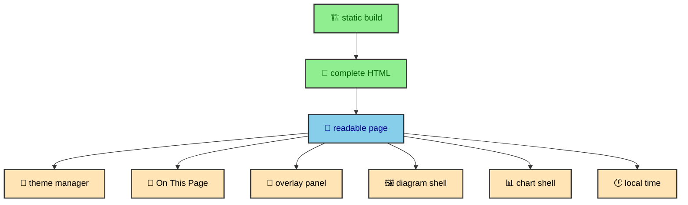

The site is static by default, but it is not inert. A small runtime layer adds the parts that only the browser can know or feel, such as the reader's theme preference, scroll position, focus target, viewport size, local timezone, and a request to inspect a diagram or chart more closely. This is progressive enhancement, which means the HTML works first and browser code improves it afterward. The boundary is the important part. Runtime code improves a page that already exists.

---

## The enhancement boundary

The build creates article routes, renders MDX, calculates manifest context, transforms Mermaid diagrams, generates responsive images, and writes HTML files. Runtime code starts after that work is complete. It should never need to fetch an article body, parse frontmatter, or construct the journal tree.

This boundary gives the site a clear design model. With JavaScript disabled, a reader should still see article text, headings, images, code blocks, tables, breadcrumbs, pagination, inline Mermaid SVGs, static ECharts SVGs, and the basic structure of the page. With JavaScript enabled, the same page becomes more comfortable. Theme state persists. The On This Page list tracks scroll position. Mobile panels trap focus. Mermaid diagrams can expand into popovers. ECharts can hydrate when an article asks for browser inspection. The Atlas schedule can show the reader's local time.

The runtime modules are intentionally boring in the best sense. They are not a second application hidden inside the site. They are small pieces of behavior attached to semantic HTML.

---

## Runtime modules

The runtime code lives under `src/runtime/`.

- `theme_manager.ts` keeps the light and dark theme state synchronized.
- `on-this-page.ts` tracks active article headings while scrolling.
- `overlay-panel.ts` improves mobile panels and modal focus behavior.
- `mermaid-diagram-shell.ts` expands inline diagrams and updates theme-specific links.
- `elements/echart-shell.ts` hydrates static ECharts output only when an article opts in.
- `atlas-schedule.ts` localizes Atlas schedule time in the browser.

Each module is scoped to one concern. Theme management does not know about article headings. The article navigation tracker does not know about overlays. The Mermaid shell does not render Mermaid syntax. The ECharts shell does not create the first visible chart. The Atlas element does not fetch match data. That separation keeps the runtime layer small and makes each behavior easier to reason about.

The import strategy reflects that scope. `BaseLayout.astro` imports the global pieces that should exist across pages, such as the theme manager and Mermaid diagram shell. Components import the runtime behavior they need, such as `OverlayPanel.astro` importing `overlay-panel.ts` and `EChart.astro` importing `echart-shell` only for hydrated charts. Custom elements attach themselves when their tags appear in the document.

That gives the project a practical module boundary. The layout owns site-wide behavior. Components own local behavior. The build owns publication data.

---

## Where runtime meets layout

`BaseLayout.astro` imports the theme manager and Mermaid shell as module scripts. Other runtime elements are loaded by the components that need them. Overlay panels render outside `<main>` through the layout slot, which keeps modal behavior away from the transition stack.

The result is a static page with targeted client behavior, not a full browser app.

This placement is especially important because Astro can swap page content during client-side navigation. Anything inside `<main>` may be replaced. Anything that controls the whole document needs to understand that replacement. The theme manager listens to Astro lifecycle events. The On This Page tracker destroys old instances before a swap and mounts new ones after page load. Overlay behavior resets scroll lock around swaps. Custom elements reconnect as new markup enters the document.

The runtime layer therefore follows the page lifecycle instead of assuming a single load. A traditional static site might only need `DOMContentLoaded`. This site keeps the static output model, but because it uses Astro transitions, the browser experience has more than one page-ready moment.

---

## Theme and document state

Theme state is the most global runtime behavior. It affects the `<html>` element, the `color-scheme` property, the meta theme color, the DaisyUI toggle, and Mermaid asset links. It also needs to be correct before the first paint and after every Astro swap.

The solution is split in two. The inline bootstrap in the document head applies a stored or system theme immediately. The module runtime then manages persistence, toggle binding, and swap behavior. This keeps the first paint fast and keeps later navigation consistent.

The `no-js` class is part of that same contract. The document starts with `class="no-js"` so CSS can describe fallback states. The bootstrap and runtime remove the class when JavaScript is active. This lets the visual system distinguish static fallback from enhanced behavior without making components guess.

Theme work also connects to Mermaid diagrams. The diagram shell watches `html[data-theme]` and updates the Open SVG link to the light or dark asset. That is a runtime concern because the active theme can change after the page is already visible.

---

## Scroll and focus behavior

Some interactions only make sense in the browser because they depend on the current viewport and active element. On This Page uses heading positions, sticky header height, intersection observation, scroll events, hash changes, and click suppression. Overlay panels use focus trapping, focus restore, Escape handling, scroll lock, wheel containment, touch containment, and keyboard scroll routing.

Those behaviors are not content. They are affordances around content. The article headings exist before On This Page mounts. The overlay panel markup exists before focus trapping begins. That distinction keeps the site accessible at the HTML layer and comfortable at the interaction layer.

The implementation also respects where each behavior belongs. A sidebar link can be ordinary anchor markup. The runtime can then add `aria-current` to the active link while the reader scrolls. A modal can start as a DaisyUI checkbox pattern. The runtime can then add focus and scroll control when JavaScript is active.

---

## Browser-only data

The Atlas widget shows why runtime enhancement still matters on a static site. Match data is fetched during the build, but the reader's local timezone is only known in the browser. The component renders a Mexico City fallback time in the HTML. The `atlas-schedule` custom element then formats the same ISO date with `Intl.DateTimeFormat` for the reader's environment.

That is the right split. The build owns the match data. The browser owns the reader's locale. The static page stays meaningful, and the enhanced page becomes more personal without making an API request.

The same idea appears in diagram popovers and ECharts hydration. The build owns the rendered SVG. The browser owns the moment when a reader asks to inspect it, so the Mermaid shell clones diagrams on demand and the ECharts shell replaces a static surface only after the chosen hydration trigger fires.

---

## The shape of a runtime contract

Each runtime feature depends on a small markup contract. The theme manager expects one toggle input ID and the document theme attribute. On This Page expects a navigation container, heading links, and real heading IDs. Overlay behavior expects checkbox toggles, labeled controls, and a modal element beside the input. The Mermaid shell expects diagram source attributes and a popover target. The ECharts shell expects serialized chart data only when hydration is requested. Atlas time localization expects a date element with a raw ISO value.

Those contracts are intentionally visible in the HTML instead of hidden in a framework state tree. A reader sees normal content. A maintainer sees the hooks that attach behavior. CSS can respond to data attributes. JavaScript can bind only the elements that opt into a feature.

This also keeps the runtime layer compatible with Astro's content model. MDX renders to HTML. Astro components decorate that HTML with known classes, IDs, and data attributes. Browser modules then attach behavior after the document exists. The layers cooperate through markup instead of through a shared client-side store.

---

## Why small modules matter

Small modules are easier to place correctly in a static site. A global application script would need to understand every page shape, every component, and every route lifecycle. This site avoids that by giving each behavior a narrow file and a narrow reason to exist.

That matters for performance, but it also matters for authorship. A journal article can introduce a Mermaid diagram without thinking about theme observers. A layout can include article navigation without thinking about overlay scroll lock. A homepage component can localize one date without importing the whole site runtime. The module boundaries follow the user's experience rather than the project's folder structure.

The result is a runtime layer that feels present but not heavy. It makes the site feel cared for while leaving the publishing system in charge of content.

---

## The build lesson

The runtime layer is small because the build layer is strong. Astro, the content manifest, the Mermaid integration, image transforms, and static routes do the durable work first. Browser modules then add state and interaction where the browser has unique information.

This is the site's progressive enhancement rule in practical terms. Build pages that stand on their own. Add runtime behavior that respects that foundation. Keep modules scoped enough that a reader can understand the page even before the enhancements arrive.
