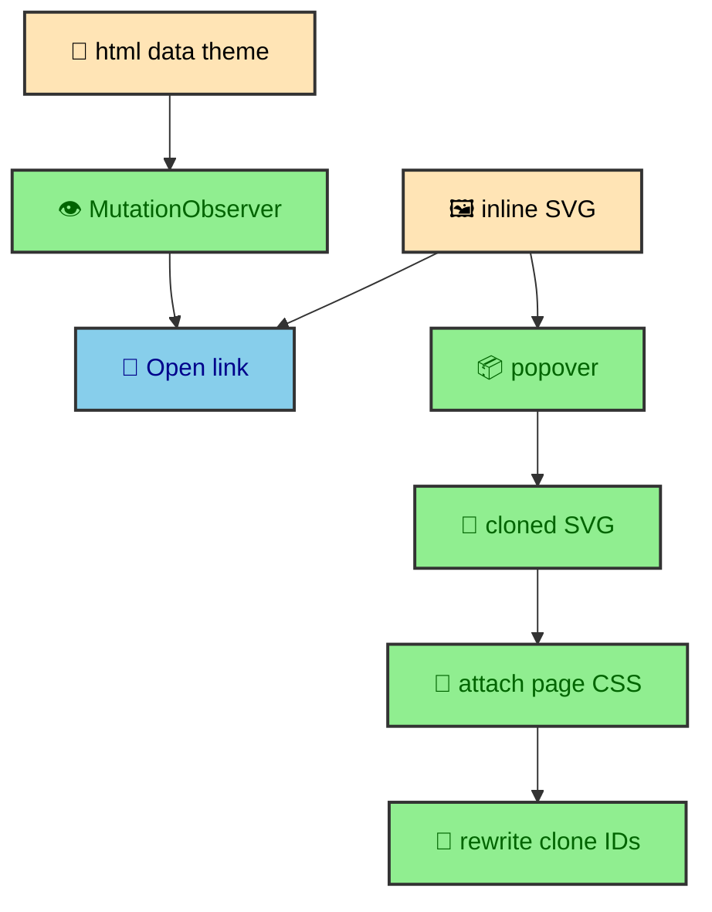

Mermaid diagrams are rendered before the browser gets the page. That is the foundation. The runtime shell does not parse Mermaid syntax, choose a renderer, or build SVG from source. It works with the finished diagram that the integration already inserted into the article. Its job is to update the Open SVG link for the active theme and create a larger popover view from the inline SVG when the reader asks for more room.

---

## No-JS behavior

`MermaidDiagramWrapper.astro` wraps only `.mermaid-diagram-container` divs. The inline SVG is already present in the article, and the Open link points to the standalone light SVG by default.

That means diagrams remain readable without JavaScript. The runtime only improves inspection.

This boundary is important because Mermaid rendering is one of the heavier pieces of the publishing pipeline. The build has enough time to render diagrams, sanitize SVG, rewrite IDs, create light and dark assets, and hoist page CSS. The browser should not repeat that work for every reader. It should receive the result.

The wrapper adds the affordance around the result. It can expose a link to the standalone asset. It can provide a button or popover area for expansion. It can store light and dark asset paths as data attributes. The SVG itself remains article content.

This also makes the diagram experience more resilient. A static inline SVG can be selected, inspected, printed, and read by the browser without waiting for a Mermaid runtime. The enhancement layer is only about convenience.

---

## Theme-specific links

`mermaid-diagram-shell.ts` reads `data-diagram-light-src` and `data-diagram-dark-src`. A `MutationObserver` watches `html[data-theme]` and updates the link whenever the theme changes.

The Open link begins with the light SVG by default because that gives the no-JS baseline a concrete destination. Once JavaScript is active, the shell reads the current document theme and chooses the matching asset. When the theme changes later, the observer updates the link again.

This is another reason the theme system uses `html[data-theme]` as a single contract. The Mermaid shell does not need to know how the toggle works. It only needs to observe the document state that the theme manager owns.

The link update is deliberately small. It does not replace the inline SVG. It does not re-render the diagram. It only changes the asset the reader opens separately. Inline diagrams stay in the article, while standalone assets follow the theme.

---

## Popover cloning

The shell clones the inline SVG only when the popover opens. It attaches page-level Mermaid CSS to the clone, rewrites clone IDs and references with `--expanded`, and clears the clone when the popover closes.

That ID rewrite is necessary because the article already contains the original SVG. The expanded copy needs its own IDs so gradients, markers, and CSS selectors keep pointing to the right elements.

The clone-on-open choice keeps the normal article page lighter. A diagram-heavy article may contain several Mermaid diagrams. If every expanded copy were rendered immediately, the page would carry duplicate SVG trees even when the reader never opens them. Instead, the popover target remains empty until `beforetoggle` announces that it is opening.

When the popover opens, the shell finds the inline SVG inside the current element, clones it, attaches page-level Mermaid CSS, rewrites IDs, and appends the result to the popover content area. When the popover closes, it clears that area. This gives each open request a fresh clone and leaves no hidden duplicate diagram behind afterward.

The ID rewrite handles both attributes and embedded style text. It builds a map from original IDs to expanded IDs, sorts replacements by length, updates element IDs, rewrites attributes containing `#id` references, and updates style blocks. That prevents markers, gradients, clip paths, and CSS selectors from accidentally pointing back to the inline diagram.

---

## Page CSS attachment

The Mermaid build pipeline can hoist diagram CSS into a page-level style tag with `data-mermaid-page-css`. The expanded SVG clone lives inside a popover, so the shell attaches that page CSS back into the cloned SVG. This keeps the expanded copy visually aligned with the inline copy.

The build and runtime cooperate here. The build creates and marks the page CSS. The runtime reads the marked style and inserts it into the clone. Neither side has to understand the whole pipeline alone.

Attaching CSS to the clone also makes the popover self-contained enough for the expanded SVG tree. The inline diagram can depend on the page style. The cloned diagram receives a local copy. That matters because the clone is not the original element and has rewritten IDs.

---

## Custom element boundary

The shell is implemented as a custom element named `mermaid-diagram-shell`. That gives each wrapped diagram its own lifecycle. When the element connects, it finds its popover, target, and Open link. It updates the link theme and starts observing document theme changes. When it disconnects, it stops observing.

This fits Astro transitions well. When an article enters the document, the custom elements connect. When it leaves during a route swap, they disconnect. The shell does not need a global scan with manual bookkeeping. The browser lifecycle does the right thing for each diagram element.

The custom element also keeps the runtime code close to the markup contract. The element expects specific data attributes and child selectors. If a diagram wrapper exists, it owns its own link and popover behavior.

---

## Why rendering stays out of the browser

The runtime shell could have been designed to render Mermaid on demand, but that would move the heaviest part of the diagram feature into the reader's device. It would also make theme generation, SVG sanitation, asset output, and page CSS hoisting much harder to keep consistent.

The site chooses the opposite direction. The integration renders diagrams at build time and stores the results as article HTML and assets. The browser handles only the interactions that require the reader's current context. That means changing theme links, opening a popover, cloning an SVG, and clearing it afterward.

This keeps Mermaid aligned with the rest of the publishing system. Content transformation happens before deployment. Browser code enhances already-rendered content.

---

## The article contract

The shell expects the article to provide a few concrete pieces. The inline SVG lives inside `.mermaid-diagram-container`. The Open link carries `data-diagram-light-src` and `data-diagram-dark-src`. The popover contains a target marked with `data-diagram-popover-content`. The page-level CSS, when present, is marked with `data-mermaid-page-css`.

Those hooks are the handoff between the build integration and the runtime custom element. The integration can change how it renders Mermaid internally as long as it keeps the wrapper contract stable. The shell can change how it clones or expands diagrams as long as it keeps using the generated artifacts rather than source Mermaid text.

This handoff keeps MDX authoring pleasant. An author writes a Mermaid code fence in an article. The build turns it into the wrapper, inline SVG, assets, and CSS. The runtime shell recognizes the wrapper and adds expansion behavior. The author does not have to wire the interaction by hand.

---

## Diagram density

The vault uses diagrams to explain build systems, so a single long article may contain more than one. That density is why the shell avoids eager expanded copies. The inline SVGs are already present because they are content. The enlarged copies are optional, so they are created only when requested.

This is a small performance choice, but it fits the rest of the site. The page should pay for readable content immediately. It should pay for inspection affordances when the reader uses them. The popover clone is useful, but it is not needed for the first read.

---

## Why the clone is disposable

The expanded SVG is treated as disposable UI, not as another source of content. The source of content is the inline SVG generated by the build. The popover copy exists only to give the reader a larger viewing surface. Clearing it on close keeps that role clear.

This also avoids stale expanded diagrams after theme changes or route swaps. The next time the reader opens the popover, the shell clones from the current inline SVG and attaches the current page CSS again. The runtime does not need to preserve a hidden copy or reconcile it with future document state.

That disposable model is a good fit for custom elements. The element owns the copy while it is connected and open. When it closes or disconnects, the extra DOM disappears.

---

## Keep cloned diagrams disposable

The Mermaid shell is small because the build pipeline does the durable work. Inline SVGs already exist. Standalone assets already exist. Page CSS already exists. The runtime only connects those artifacts to the current theme and to the reader's request for a larger view.

That split makes diagrams feel rich without turning article pages into browser-side diagram renderers. The reader gets readable diagrams immediately, theme-aware asset links when JavaScript is active, and a popover expansion that reuses the exact SVG the build produced.
