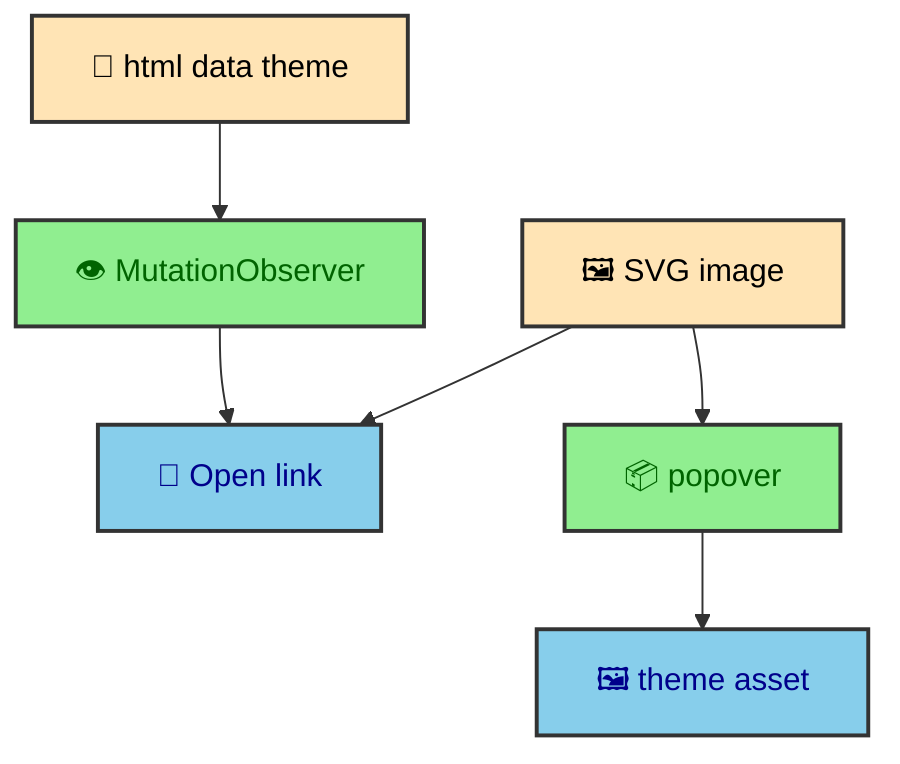

Mermaid diagrams are rendered before the browser gets the page. That is the foundation. The runtime shell does not parse Mermaid syntax, choose a renderer, or build SVG from source. It works with emitted SVG assets that the integration already prepared. Its job is to update the Open SVG link for the active theme while the article and popover display the matching static assets.

---

## No-JS behavior

`MermaidDiagramWrapper.astro` wraps only `.mermaid-diagram-container` divs. The light SVG image is already present in the article, and the Open link points to the standalone light SVG by default.

That means diagrams remain readable without JavaScript. The runtime only improves inspection.

This boundary is important because Mermaid rendering is one of the heavier pieces of the publishing pipeline. The build has enough time to render diagrams, sanitize SVG, rewrite IDs, and create light and dark assets. The browser should not repeat that work for every reader. It should receive the result.

The wrapper adds the affordance around the result. It can expose a link to the standalone asset. It can provide a button or popover area for expansion. It can store light and dark asset paths as data attributes. The SVG image itself remains article content.

This also makes the diagram experience more resilient. A static SVG image can be printed and read by the browser without waiting for a Mermaid runtime. The enhancement layer is only about convenience.

---

## Theme-specific links

`mermaid-diagram-shell.ts` reads `data-diagram-light-src` and `data-diagram-dark-src`. A `MutationObserver` watches `html[data-theme]` and updates the link whenever the theme changes.

The Open link begins with the light SVG by default because that gives the no-JS baseline a concrete destination. Once JavaScript is active, the shell reads the current document theme and chooses the matching asset. When the theme changes later, the observer updates the link again.

This is another reason the theme system uses `html[data-theme]` as a single contract. The Mermaid shell does not need to know how the toggle works. It only needs to observe the document state that the theme manager owns.

The link update is deliberately small. It does not replace the article image. It does not re-render the diagram. It only changes the asset the reader opens separately. Diagrams stay in the article, while standalone assets follow the theme.

---

## Popover assets

The popover uses the same emitted light and dark SVG assets as the article wrapper. CSS chooses which image is visible from `html[data-theme]`, so opening the popover does not need to clone SVG nodes, rewrite IDs, or attach copied CSS.

That keeps the normal article page predictable. A diagram-heavy article may contain several Mermaid diagrams, but each diagram carries only image references and a small popover shell. The heavy SVG bytes live in `_app/mermaid/`, where the browser can cache them independently.

---

## Custom element boundary

The shell is implemented as a custom element named `mermaid-diagram-shell`. That gives each wrapped diagram its own lifecycle. When the element connects, it finds its Open link. It updates the link theme and starts observing document theme changes. When it disconnects, it stops observing.

This fits Astro transitions well. When an article enters the document, the custom elements connect. When it leaves during a route swap, they disconnect. The shell does not need a global scan with manual bookkeeping. The browser lifecycle does the right thing for each diagram element.

The custom element also keeps the runtime code close to the markup contract. The element expects specific data attributes on the Open link. If a diagram wrapper exists, it owns its own theme-aware link behavior.

---

## Why rendering stays out of the browser

The runtime shell could have been designed to render Mermaid on demand, but that would move the heaviest part of the diagram feature into the reader's device. It would also make theme generation, SVG sanitation, and asset output much harder to keep consistent.

The site chooses the opposite direction. The integration renders diagrams at build time and stores the results as article HTML and assets. The browser handles only the interactions that require the reader's current context. That means changing theme links and opening a popover.

This keeps Mermaid aligned with the rest of the publishing system. Content transformation happens before deployment. Browser code enhances already-rendered content.

---

## The article contract

The shell expects the article to provide a few concrete pieces. SVG images live inside `.mermaid-diagram-container`. The Open link carries `data-diagram-light-src` and `data-diagram-dark-src`. The popover contains a target marked with `data-diagram-popover-content`.

Those hooks are the handoff between the build integration and the runtime custom element. The integration can change how it renders Mermaid internally as long as it keeps the wrapper contract stable. The shell can change how it expands diagrams as long as it keeps using the generated artifacts rather than source Mermaid text.

This handoff keeps MDX authoring pleasant. An author writes a Mermaid code fence in an article. The build turns it into the wrapper and theme-specific SVG assets. The runtime shell recognizes the wrapper and keeps the Open link aligned with the theme. The author does not have to wire the interaction by hand.

---

## Diagram density

The vault uses diagrams to explain build systems, so a single long article may contain more than one. That density is why the shell avoids browser-side rendering and SVG cloning. The article image is already present because it is content. The enlarged view reuses the emitted SVG assets instead of creating another SVG tree in the browser.

This is a small performance choice, but it fits the rest of the site. The page should pay for readable content immediately. It should keep inspection affordances simple and asset-backed.

---

## Why the popover is asset-backed

The expanded view is treated as UI, not as another source of content. The source of content is the SVG asset generated by the build. The popover exists only to give the reader a larger viewing surface.

This also avoids stale expanded diagrams after theme changes or route swaps. The light and dark images are already in the wrapper, and CSS chooses the visible one from the current document theme. The runtime does not need to preserve a hidden copy or reconcile it with future document state.

That model is a good fit for custom elements. The element owns the theme-aware link behavior while the browser owns popover display.

---

## Keep runtime narrow

The Mermaid shell is small because the build pipeline does the durable work. Light and dark SVG assets already exist. The runtime only connects those artifacts to the current theme.

That split makes diagrams feel rich without turning article pages into browser-side diagram renderers. The reader gets readable diagrams immediately, theme-aware asset links when JavaScript is active, and a popover expansion that reuses the generated SVG files.
