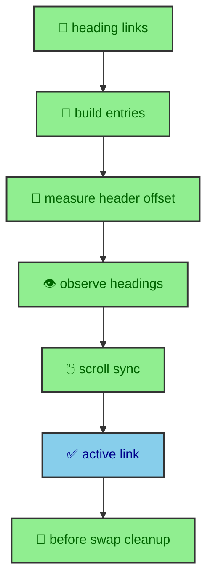

The On This Page navigation begins as ordinary article structure. Astro renders headings from MDX, the route exposes those headings to the layout, and the component prints anchor links. The browser enhancement then turns that static list into a live reading aid. It tracks scroll position, heading geometry, hash changes, touch state, and Astro route swaps without making the article depend on JavaScript.

---

## Rendered inputs

`OnThisPage.astro` and `OnThisPageContent.astro` receive headings from `renderResult.headings`, filtered to H2 and H3 by the route. The runtime module then matches `.onthispage-link` anchors to actual heading elements in the document.

`buildEntries()` is the bridge. It reads links, checks hash targets, and drops links whose target does not exist. A hash target is the part of a URL after `#`, such as `#active-heading-logic`, and it should point to an element ID on the page.

That bridge is useful because the rendered page is the source of truth by the time the runtime starts. The manifest and MDX renderer prepare the headings during the build. The component prints links with hashes. The browser module does not need to know where the headings came from. It only needs to confirm that each link points to an element currently in the document.

This is a good example of progressive enhancement. Without JavaScript, the On This Page list is still a set of anchor links. With JavaScript, those links gain active state and scroll-aware behavior. The HTML remains useful in both cases.

The filtering to H2 and H3 also matters. A long technical article can contain many headings, but a navigation rail should describe the article shape, not every tiny fragment. The component receives a curated list from the route, and the runtime works from that list.

---

## Active heading logic

The tracker measures the sticky header offset, observes headings with `IntersectionObserver`, and also uses a scroll requestAnimationFrame fallback. It handles the top of the page by clearing the active link and handles the bottom by activating the final heading.

The active heading algorithm is intentionally based on the visible document rather than on a guessed table of offsets. It measures the header, uses a line below the sticky top area, and reads current bounding boxes. That allows the tracker to respond to responsive layout changes, font loading, article content, and browser viewport differences.

At the top of the page, no section should be marked active. The reader has not entered the article body yet. At the bottom of the page, the final heading should be active because the reader has passed the last section boundary. Between those edges, the tracker chooses the most relevant heading near the reading line and can advance to the next heading when the previous one has moved above the viewport and the next one is close enough.

The class stores the current active link so it can avoid unnecessary DOM writes. When active state changes, it updates `data-state` and `aria-current="location"`. The data attribute supports styling. The ARIA attribute gives assistive technology a meaningful indication of the current location.

---

## Click and touch behavior

When a reader clicks a link, the code temporarily suppresses scroll-based updates. It releases suppression on `scrollend` when supported, with a timeout fallback for browsers without that event.

That suppression is about respecting intent. If a reader clicks a heading link, the navigation should immediately reflect the chosen target instead of fighting the browser's smooth scroll. The tracker sets the clicked link active, starts a temporary suppression window, then lets scroll-based tracking resume after the movement settles.

Touch receives a small state treatment too. On `pointerdown`, touch links receive `data-state="touched"`. When the pointer ends or cancels, the link returns to active or inactive state. That keeps touch feedback responsive without requiring a separate component.

Hash changes are also handled. If the URL hash changes and the target heading exists, the matching link becomes active. This keeps keyboard navigation, copied anchor links, and direct hash jumps aligned with the side navigation.

---

## Lifecycle cleanup

The module listens for `astro:before-swap` and destroys existing instances. That matters because Astro can replace article content without a full page reload. Any observer tied to old headings must disconnect before the next page takes over.

The runtime keeps instances in a `Set`. Mounting begins by destroying any existing instances, then querying `.onthispage-nav` containers and creating a new tracker for each. The lifecycle binding itself is guarded so event listeners are not added repeatedly.

Destroying an instance clears timers, cancels animation frames, aborts event listeners through an `AbortController`, disconnects the intersection observer, removes visual viewport listeners, and drops entries. That is the right kind of cleanup for client-side navigation because the page may change many times during one browser session.

The important architectural point is that cleanup is tied to the route lifecycle, not to manual page knowledge. A journal article, a vault section index, and another page can all move through the same lifecycle. The module responds to the document shape that exists after each page load.

---

## Header offsets and viewport changes

The active section depends on where the sticky header sits. The tracker measures the header height and keeps a minimum offset of 72 pixels. It adds space below the header so the active line represents where reading begins rather than the very top edge of the viewport.

The code refreshes that offset on resize and visual viewport resize. The visual viewport path matters on mobile browsers where browser chrome can change the usable viewport without a traditional layout resize. After resizing, the tracker rebuilds entries, reconnects the observer, and syncs active state from the current scroll position.

This keeps the article navigation connected to the actual reading environment. A desktop sidebar, a tablet viewport, and a phone with dynamic browser controls can all report different geometry. The runtime accepts that the browser knows the final layout.

---

## Component and CSS contract

The runtime only needs a few stable hooks. The container uses `.onthispage-nav`. Each link uses `.onthispage-link`. Link `href` values point to heading IDs. The runtime then sets `data-state` and `aria-current`.

That small contract keeps the Astro components flexible. The desktop sidebar and mobile overlay can share the same content component while styling and placement differ. CSS can style active, inactive, and touched states without hardcoding runtime logic into the component.

The same approach appears elsewhere in the site. Components render semantic markup with data hooks. Runtime modules attach behavior through those hooks. CSS responds to data attributes. Each layer has a focused job.

---

## Desktop and mobile surfaces

The article navigation appears in more than one place. On wide screens, it can live in a right sidebar beside the article. On smaller screens, the same content can appear inside a mobile overlay panel. The runtime does not need a separate algorithm for each surface. It looks for `.onthispage-nav` containers and creates trackers from the links it finds.

That reuse matters because the article's heading structure should not depend on viewport. The content hierarchy is the same whether the reader has a wide monitor or a phone. Only the presentation changes. The runtime follows the rendered links and actual heading elements, so both surfaces stay tied to the same article.

This also keeps the mobile dock and desktop sidebar from becoming separate products. They are different ways to reach the same generated heading map. The build prepares the heading data once. Components render it where the layout needs it. The browser enhances whichever navigation surface is present.

---

## Why active state is local

The tracker does not store the active heading in a global site state. It writes state directly to the links that belong to the current navigation container. That makes sense because active section is a view concern, not publication data. It changes as the reader scrolls and disappears when the page changes.

Keeping active state local also makes multiple navigation surfaces possible. If the desktop sidebar and mobile panel both exist in the document, each container can receive its own tracker and update its own links. The document headings are shared, but the visual state belongs to the rendered navigation element.

That is a recurring pattern in the site. Build data is centralized when it describes the publication. Browser state stays close to the UI that presents it.

---

## Test the scroll edges

On This Page is not a content generator. It is an enhancement for content that the build already rendered. The route creates a heading list. The component prints navigable anchors. The runtime measures the live document and adds state as the reader moves.

That split lets the article stay readable without JavaScript while still feeling polished when JavaScript is available. It also keeps the logic honest. The build knows the article structure. The browser knows the current scroll position. The implementation lets each side own the information it actually has.
