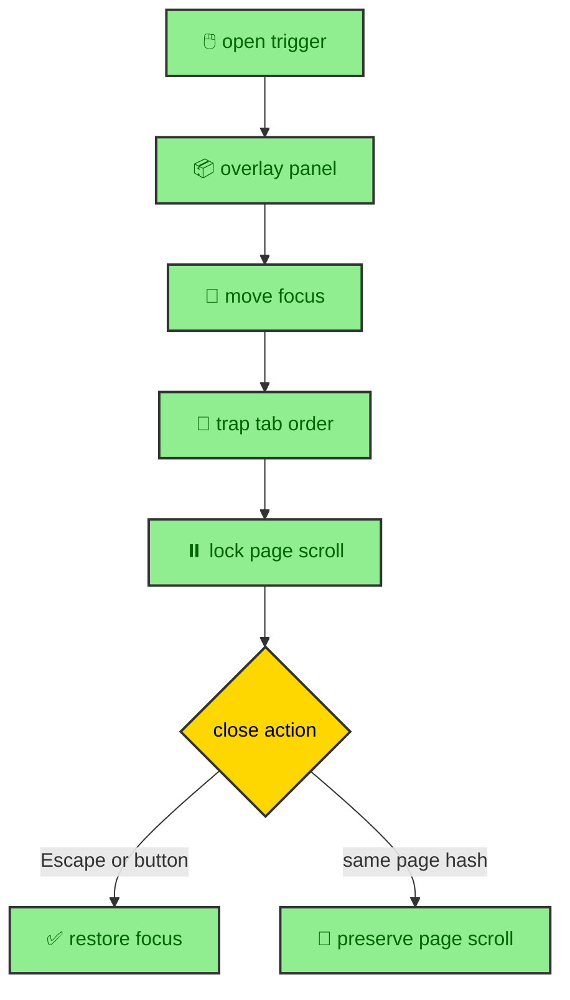

The site's overlay panels serve two kinds of content. Mobile article controls use panels for vault navigation and On This Page links. The homepage uses a modal for the Atlas note. Both need semantic labels, predictable focus, a stable close path, and page scroll behavior that does not fight the reader. The implementation starts with DaisyUI's checkbox modal pattern, where a hidden checkbox controls whether the modal is open, then adds a runtime layer for the browser-only interaction details.

---

## Component contract

`OverlayPanel.astro` is the reusable wrapper. It requires a title, `ariaLabel`, or `ariaLabelledBy`, because a dialog without a label is not a dialog readers can navigate confidently.

Article overlays render through `BaseLayout`'s `overlays` slot. That places them outside `<main>`, which avoids trapping dialogs inside the page transition stacking context.

The component emits an input with `class="modal-toggle ui-overlay-panel-toggle"`, a dialog container with `role="dialog"` and `aria-modal="true"`, a panel box, a close label, a scroll area, and a backdrop label. The toggle ID connects triggers, close controls, and dialog metadata.

This structure gives the overlay a useful baseline. The markup has a labeled dialog. The close control exists in the document. The content is present in the HTML. DaisyUI supplies the modal styling pattern. JavaScript can then improve interaction without inventing the panel from scratch.

The required label rule is part of the architecture. It means every overlay has to declare how it will be announced. A reusable component should make the accessible path the normal path, not an optional afterthought.

---

## Runtime enhancement

The runtime uses a global one-time enhancement guard. It adds keyboard activation for label controls, Escape close, focus restore, focus trap, and page scroll lock with `body[data-overlay-scroll-locked]`.

The script also contains wheel, touch, and keyboard scroll containment so the background page does not move while a panel is open.

---

## Focus flow

Focus handling is the heart of the overlay runtime. When a panel opens, the script records the element that opened it, then moves focus to the close button or first available control inside the dialog. When the panel closes, focus returns to the original trigger if it is still connected to the document. If that element is gone, focus returns to the trigger associated with the toggle.

The focus trap handles Tab and Shift Tab. It collects visible, enabled focusable elements in the current modal. If focus tries to leave the panel, the script loops it to the other end. If the panel has no focusable elements, the dialog itself receives focus. This keeps keyboard navigation inside the active dialog while it is open.

Escape closes the last open overlay. The runtime checks all checked overlay inputs and closes the most recent one. That allows the behavior to stay generic even if more than one overlay pattern exists on a page.

Label triggers also receive keyboard activation. A `label` with `role="button"` can open or close the checkbox modal, and the script makes Enter and Space behave like button activation. That lets the component keep the DaisyUI checkbox structure while still feeling like a real control.

---

## Scroll lock

Scroll behavior is handled at the document level. When at least one overlay input is checked, the script stores the current page scroll position and marks the body with `data-overlay-scroll-locked="true"`. CSS and runtime behavior can then treat the page as locked. When no overlays remain open, the script removes the marker and restores the stored scroll position.

The runtime also prevents background wheel, touch, and keyboard scrolling while a modal is open. It allows scrolling inside `.ui-panel-scroll` when that element can actually move in the requested direction. If the internal scroll area is already at its top or bottom, the event does not leak into the page behind the overlay.

Keyboard scroll keys receive the same treatment. Arrow keys, Page Up, Page Down, Space, Home, and End are routed to the panel scroll area when appropriate. Editable elements are respected so typing contexts do not lose expected keyboard behavior.

This is browser work because it depends on the current input event, current scroll position, active dialog, and visible panel geometry. The component provides structure. The runtime enforces the interaction contract.

---

## Route swaps and hash links

Astro transitions add one more requirement. If a route swap happens while an overlay is open, the runtime resets scroll lock before the page changes. That prevents a body state from the previous page from affecting the next page. On `astro:page-load`, it syncs the lock again based on the current document.

The script also supports same-page hash links inside overlays through `data-overlay-preserve-page-scroll`. When a link points to a target on the same page, the runtime can avoid restoring the old page scroll position after closing. That lets mobile article navigation move the reader to a heading instead of snapping back to where the overlay opened.

This behavior is subtle, but it is part of making mobile article navigation feel like navigation rather than like a modal interruption. The panel opens, the reader chooses a section, the page moves to that section, and the overlay state gets out of the way.

---

## No-JS baseline

The overlay pattern starts from HTML and CSS. Without JavaScript, the checkbox modal can still expose content through the DaisyUI pattern. The runtime is responsible for refinement, not existence. That is consistent with the rest of the site.

The baseline matters most for article navigation panels. The links are real anchors. The content is rendered in the page. JavaScript improves focus, scroll containment, and route lifecycle behavior. It does not decide which headings or vault links exist.

The homepage Atlas note follows the same rule. The story content is present in the HTML, and the overlay component supplies the dialog structure. Runtime behavior makes it more comfortable to open, read, scroll, and close.

---

## Why overlays live outside main

`BaseLayout.astro` exposes an `overlays` slot so article panels can render outside `<main>`. That placement is part of the runtime design. The main region participates in Astro page transitions, while overlays need document-level behavior. A modal should not be trapped inside the element that is being swapped, faded, or measured as article content.

Keeping overlays outside the main content also clarifies layering. The header has its own layer, the mobile dock has its own layer, and modal panels use DaisyUI's modal layer. The overlay runtime can lock the page, focus the dialog, and restore focus without negotiating with the article transition region.

This structure is especially useful for the journal. A mobile reader can open the vault tree or heading list from the dock, choose a link, and return to the article. The overlay is part of navigation, but it is not part of the article prose. The layout slot makes that separation explicit.

---

## Reuse across the site

The same overlay primitive supports different content because the contract is not tied to one page. The Atlas note supplies story content and a close label. Article panels supply navigation content. Future panels can supply their own title or ARIA label and reuse the same focus and scroll behavior.

That reuse is not only convenience. It protects consistency. If every modal invented its own focus handling, keyboard activation, scroll lock, and close behavior, the site would feel different from page to page. A single primitive gives each overlay the same interaction grammar while allowing the content inside to vary.

The runtime enhancement guard supports that reuse by registering document listeners once. Multiple panels can exist on a page without creating duplicate global handlers. The handlers then inspect the active target and the currently open inputs when events happen.

---

## Data attributes as state

The overlay runtime uses document and element state that CSS can understand. The body receives `data-overlay-scroll-locked` while a panel is open. Inputs carry the checked state that DaisyUI already uses. Close controls use `data-modal-close`. Same-page links can opt into scroll preservation with `data-overlay-preserve-page-scroll`.

These attributes keep the behavior readable in the markup. They also avoid a private runtime model that CSS cannot see. The browser already knows which input is checked, which element has focus, and whether the body is marked as locked. The script coordinates those facts instead of maintaining a separate modal store.

That is why the overlay system fits the rest of the codebase. It uses HTML state where HTML state is enough, CSS for presentation, and JavaScript only for the interaction rules that need live events.

---

## Restore focus before cleanup

Overlay panels are built as reusable structure plus document-level behavior. `OverlayPanel.astro` defines the semantic contract, label requirements, DaisyUI modal structure, scroll region, and close controls. `overlay-panel.ts` adds focus flow, keyboard activation, Escape close, scroll lock, scroll containment, route-swap reset, and same-page hash handling.

That split keeps the feature aligned with the site's broader runtime philosophy. The HTML carries the content and labels. CSS handles presentation. JavaScript handles the browser state that only exists once the reader starts interacting.
