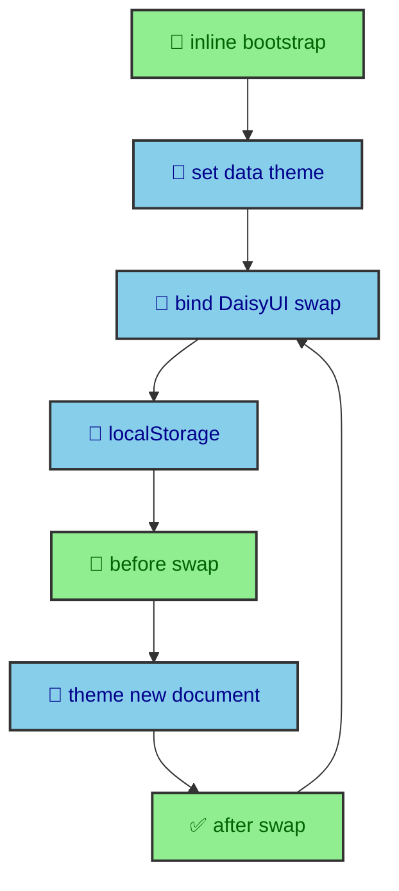

A theme toggle sounds small until a page paints in the wrong palette or a client-side route swap forgets the reader's choice. This site treats theme state as document infrastructure. An inline bootstrap runs before first paint, a runtime manager persists and reapplies the value, DaisyUI provides the visual toggle, and Astro lifecycle events keep navigation visually consistent.

---

## First paint bootstrap

`BaseLayout.astro` starts with `<html class="no-js" data-theme="light">`, then runs an inline script in the document head. The script reads `localStorage.theme`, falls back to `prefers-color-scheme`, writes `data-theme`, sets `color-scheme`, removes `.no-js`, and updates `#meta-theme-color`.

That script exists before module loading. It prevents the page from painting in the wrong theme while the full runtime module downloads.

The bootstrap has a narrow job. It does not bind the toggle. It does not listen for route changes. It does not own the whole theme system. It makes the first document honest as early as possible. That matters because CSS variables, DaisyUI tokens, browser form controls, and the mobile browser chrome can all respond to theme state.

The `data-theme` attribute is the main switch. DaisyUI reads it to choose the active theme. Custom CSS variables can rely on the same state. Mermaid links and runtime modules can observe it. Using one document attribute avoids a scattered theme model where some components read classes, some read local storage, and some use media queries directly.

`color-scheme` is also part of the foundation. It tells the browser whether built-in UI should use light or dark defaults. That includes scrollbars, form controls, and other browser-rendered pieces. A custom theme that ignores `color-scheme` can look correct in the article and still feel off around the edges.

---

## Runtime manager

`theme_manager.ts` owns the storage key, system fallback, toggle binding, and theme application. The toggle uses a `data-bound` guard so Astro page swaps do not attach duplicate listeners.

During route swaps, `astro:before-swap` applies the theme to the incoming document and adds `.theme-switching`. `astro:after-swap` reapplies the theme, removes `.no-js`, and clears transition suppression after two animation frames.

The manager uses a small set of functions. `getStoredTheme()` reads local storage inside a try block. `getSystemTheme()` reads `prefers-color-scheme`. `getTheme()` picks stored preference first, then system preference, then the default. `storeTheme()` writes the chosen value. `applyTheme()` updates the document element, `color-scheme`, and meta theme color. Those functions are ordinary, but their order gives the site a stable theme contract.

The manager also separates applying a theme from storing a theme. A system preference can be applied without writing a value. A toggle change stores a value because the reader made an explicit choice. That keeps the browser preference useful until the reader overrides it.

During `astro:before-swap`, the manager receives the incoming document from Astro and applies the current theme to that document before it becomes visible. It also turns on transition suppression by adding `.theme-switching`. During `astro:after-swap`, it applies the theme to the live document, removes `.no-js`, and clears suppression after two animation frames.

The two-frame delay gives CSS enough time to settle after the swap. It prevents theme changes from animating every color token while the document is being replaced. The reader should see a consistent palette, not a decorative color morph caused by navigation.

---

## DaisyUI toggle

`ThemeToggle.astro` uses DaisyUI `swap` behavior. The runtime manager does not need to know the visual details. It only needs the input ID and checked state.

The input ID is fixed as `theme-toggle-input`, and the manager looks it up on each page load. If the input is already bound, the manager only syncs its checked state. If it is new, the manager attaches a change listener, writes the chosen theme, applies it, marks the input as bound, and syncs it.

That design lets the visual component stay declarative. The component can use DaisyUI classes and SVG icons. The manager can focus on state. Because Astro may replace the content area, the binding code has to be repeatable without creating duplicate listeners. The `data-bound` flag handles that without needing a global registry.

The checked state is derived from the current document theme. That means the toggle reflects theme state after a direct visit, after a stored preference load, after a system fallback, and after a route swap. The control is not the source of truth. The document theme is.

---

## Storage and system preference

The theme manager treats stored preference and system preference differently. A stored value means the reader has made a choice. A system value means the site should follow the browser until the reader chooses otherwise. That distinction keeps the first visit respectful and makes later visits predictable.

The code also wraps storage access in safe reads and writes. Local storage can be unavailable in some browser contexts, and the theme system should still work from the system preference and default value. The visual state should not depend on storage being writable.

---

## Theme tokens

The runtime manager only changes the active theme. The actual colors live in CSS. `_daisyui-themes.css` defines custom light and dark DaisyUI themes with OKLCH values. The tokens cover base surfaces, content colors, primary, secondary, accent, neutral, status colors, borders, glass fallback, and shadow opacity.

`_tailwind-theme.css` maps typography, radius, size, easing, and shadow variables into Tailwind v4's theme layer. Components use DaisyUI and Tailwind classes against that shared vocabulary instead of hardcoding raw colors.

This division is what makes the runtime small. The JavaScript does not decide what dark mode looks like. It only chooses which token set is active. CSS owns the design. JavaScript owns persistence and timing.

The same token model supports the rest of the site. Code blocks, article typography, panels, cards, overlays, Mermaid wrappers, and navigation controls can respond to theme changes because they are connected to the same variable system.

---

## Mermaid and theme assets

Mermaid diagrams add one more theme-sensitive piece. The build produces light and dark SVG asset links. The inline article SVG is already rendered, but the Open SVG link should point to the asset that matches the active theme.

`mermaid-diagram-shell.ts` watches `html[data-theme]` with a `MutationObserver`. When the theme changes, it reads `data-diagram-light-src` and `data-diagram-dark-src` from the link and updates the `href`. This is runtime work because the active theme can change after the page has loaded.

That connection shows why `data-theme` is a useful document-level contract. CSS can use it. DaisyUI can use it. Runtime modules can observe it. The browser chrome can align through `color-scheme`. The theme system is not a toggle floating beside the site. It is a state shared by layout, CSS, components, and generated assets.

---

## Astro navigation

Astro's client router changes the theme problem. A direct page load only has one first paint. A client-side route swap creates a new document fragment that has to inherit the reader's current state before it becomes visible.

The manager listens to `astro:before-swap` for that reason. Astro exposes the incoming document, and the manager writes the current theme into it. This means the next page arrives already aligned with the current palette. After the swap, `astro:after-swap` applies the same state to the live document and clears the transition suppression class.

The theme code also listens to `astro:page-load` so it can bind the toggle that exists on the new page. That keeps the toggle interactive across navigation without assuming the same DOM node survives every route change.

This is the runtime version of the site's build rule. The page should appear complete when it enters the document. Theme state is part of that completeness.

---

## What the CSS receives

Once the manager sets `data-theme`, CSS receives a simple state and does the rest. DaisyUI theme tokens change. Tailwind-facing variables remain connected to those tokens. Shared partials such as glass panels, article typography, code blocks, and overlay panels can express their colors semantically. Components do not need conditional class lists for light and dark versions of every surface.

That simplicity is one reason the theme system belongs in the foundations of the runtime. It is not only a user preference. It is a distribution mechanism for visual meaning. The article page, homepage sections, navigation bars, cards, buttons, badges, code blocks, diagrams, and modals all respond to the same root state.

The approach also keeps authoring calm. A new component can choose `bg-base-100`, `text-base-content`, `border-base-300`, `btn-primary`, or the project panel classes and inherit the theme behavior automatically. The JavaScript stays small because CSS carries the visual complexity.

---

## The build lesson

The theme system works because it is split at the right boundaries. The document starts with a safe default. The inline bootstrap applies the real initial state before first paint. The runtime manager owns persistence, toggle binding, and Astro navigation. DaisyUI and Tailwind tokens own visual meaning. Mermaid shell behavior follows the same document attribute for theme-specific asset links.

That architecture keeps the user-facing behavior simple. The reader chooses light or dark, and the site keeps that choice across pages. Underneath, the build and runtime agree on one source of truth, which makes the theme feel like part of the site rather than an extra feature attached to it.
