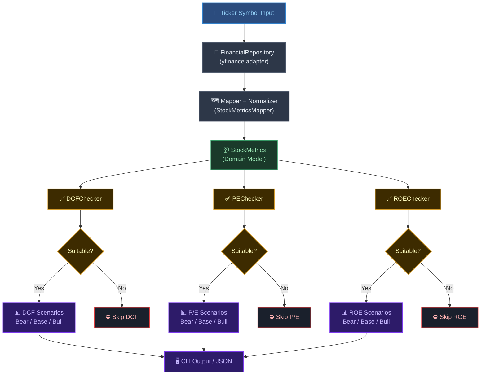
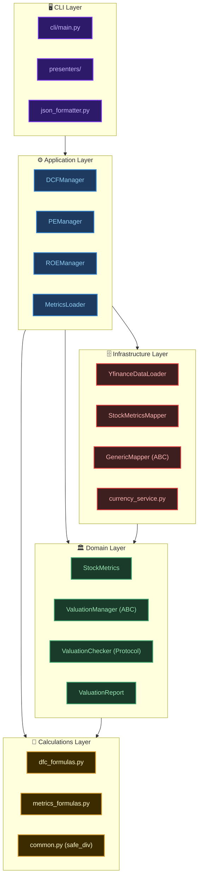
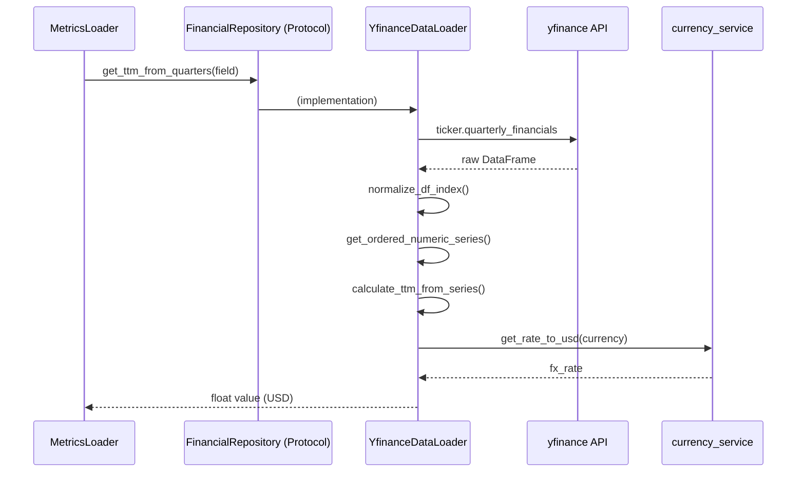
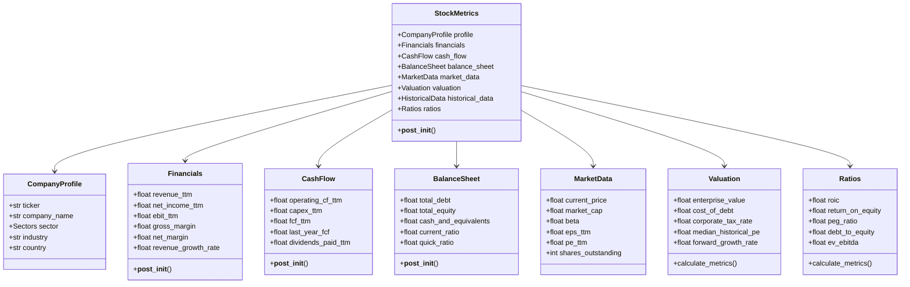
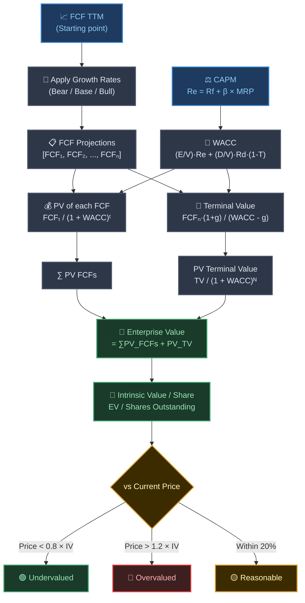
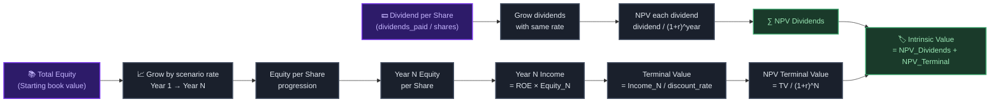
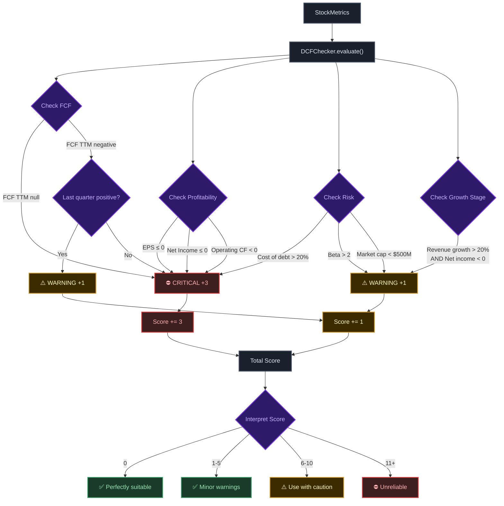
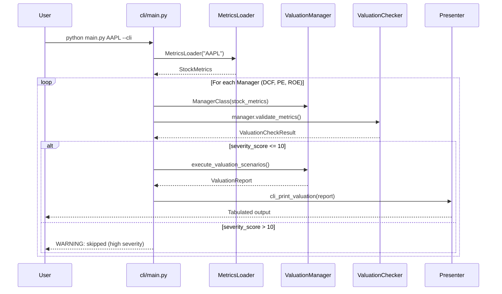

Most equity valuation tools give you a single number and call it done. That number is either a DCF estimate, a quick P/E multiple, or a gut-feel range, none of which tell you when the model itself shouldn't be trusted. This project takes a different approach: a layered Python engine that runs three valuation models in parallel, validates whether each one is even appropriate for the stock in question, and presents bear, base, and bull scenarios for each. By the end of this walkthrough you'll understand not just the math, but how to structure financial software so it stays maintainable as the models evolve.

---

## The valuation problem

Intrinsic value is the idea that a business is worth the present value of all cash it will ever generate. Simple in theory. Messy in practice, because you have to forecast an unknowable future, pick a discount rate that encodes your risk assumptions, and choose a model that actually fits the company you're analyzing.

A high-growth SaaS company with negative free cash flow breaks a standard DCF. A bank with complex balance sheet leverage confuses an ROE model. A startup with no earnings history makes a P/E multiple meaningless. **The biggest mistake in valuation isn't a wrong number, it's applying the right formula to the wrong company.**

This is why single-model tools mislead. They'll happily compute a DCF on a company burning cash, print a confident intrinsic value, and never tell you the result is garbage. The engine built here solves that with explicit suitability checks that run before any valuation math executes.

---

## System overview

Before touching any code, it helps to see the full data flow. A user provides a ticker symbol. That kicks off a pipeline that fetches raw financial data, normalizes it into a shared domain model, runs three independent valuation engines, and outputs results to the CLI or as JSON.

Here's the system from input to output:



The suitability gates between the domain model and the valuation engines are what make this system trustworthy. A model that's mathematically valid but economically meaningless never reaches the output layer.

---

## Architecture and design principles

The codebase is split into five layers, each with a single job.



A few design decisions stand out here and are worth naming.

**Separation of concerns** is enforced structurally, not by convention. The `calculations` layer has no imports from `infrastructure`. The `domain` layer never touches `yfinance`. If you wanted to replace Yahoo Finance with a Bloomberg adapter tomorrow, you'd write a new `FinancialRepository` implementation and change one import in `__init__.py`. Nothing else breaks.

The **repository pattern** in `FinancialRepository` is a Protocol, not an abstract base class. That's an intentional choice. Python Protocols allow structural subtyping, so any class that implements the right methods is a valid repository, whether it inherits from `FinancialRepository` or not.

**Defensive arithmetic** runs throughout via `safe_div` and `safe_sum`. Financial data has more `None` values than you'd expect, especially for smaller companies or recent IPOs. Rather than scattering `if x is None` guards across 30 functions, the calculations layer absorbs missing data gracefully and returns 0.0 as a safe default.

---

## Data ingestion and the repository layer

The `YfinanceDataLoader` is the only class in the project that imports `yfinance`. Everything above it in the stack communicates through the `FinancialRepository` Protocol. That boundary is strict by design.



The loader fetches all statements upfront in `__init__` and caches them. Subsequent calls to `get_ttm_from_quarters`, `get_latest_numeric`, or `get_annual_value` work against those cached DataFrames. This matters because `yfinance` makes HTTP requests, and computing a full `StockMetrics` object can require dozens of field lookups.

### FX normalization

Financial statements and market prices sometimes live in different currencies. A company listed on the London Stock Exchange might report financials in GBP but trade in pence. The `currency_service` module handles this transparently. Each field definition carries a `CurrencyType` tag (`FINANCIAL`, `TRADING`, or `NONE`), and the loader applies the appropriate FX multiplier when returning a value.

The FX rates themselves are fetched via `api.exchangerate.host`, with an in-memory TTL cache and a hardcoded fallback table for common currencies if the API is down. It's a pragmatic solution for a research tool where approximate rates are acceptable.

---

## Mapping and normalization

Raw financial data from Yahoo Finance doesn't use consistent field names. The same concept might appear as `"Total Revenue"`, `"Net Sales"`, or `"Operating Revenue"` depending on the company's reporting style and the library version. The mapper layer solves this once, centrally.

Each mapper class inherits from `GenericMapper` and defines two things: a `target_type` (the dataclass it produces) and a `mapping` dict that connects domain field references to their data source definitions.

```python
class FinancialsMapper(GenericMapper):
    @property
    def target_type(self):
        return Financials

    @property
    def mapping(self):
        return {
            Financials.revenue_ttm: YfFinancialField(
                label=["revenue", "net sales", "total revenue", ...],
                statement=Statement.INCOME,
                action=Action.GET_TTM_VALUE,
                currency_type=CurrencyType.FINANCIAL
            ),
            # ... other fields
        }
```

The `GenericMapper` base class validates mappings at construction time. It checks that all required fields are covered, rejects duplicate output values, and normalizes key types so you can use either field name strings or the actual dataclass field descriptor as the key. Validation failures raise immediately, which makes configuration bugs surface during startup rather than silently producing wrong values at runtime.

The `bindable_dataclass` decorator in `domain/metrics/stock.py` is what makes field descriptor keys possible. It wraps `@dataclass` and additionally sets each field as a class-level attribute, so `Financials.revenue_ttm` refers to the field object itself, not a string.

---

## The core domain model: StockMetrics

Every valuation in the system ultimately reads from a single `StockMetrics` object. It's assembled once from raw data and then treated as immutable for the rest of the run.



The `__post_init__` method on `StockMetrics` does two things after the object is created. First it calls `_compute_derived_valuation_inputs` to calculate `corporate_tax_rate` from EBIT and EBT, and `cost_of_debt` from interest expense and total debt. Then it calls `_compute_ratios` which instantiates and populates the full `Ratios` object. This sequencing matters because `Ratios` depends on `Valuation`, which needs to be computed first.

Several sub-models also have their own `__post_init__` logic. `CashFlow` computes `fcf_ttm` as the sum of operating cash flow and capital expenditure. `BalanceSheet` derives `current_ratio` and `quick_ratio`. These derived fields mean the caller never has to remember to compute them manually.

---

## Shared financial calculations

The `calculations` layer is a library of pure functions. No state, no side effects, no data fetching. Every function takes numbers and returns numbers.

### Safe arithmetic

The foundation is `safe_div`, which returns 0.0 whenever the denominator is zero or either input is `None`. Financial data is riddled with missing values, particularly for smaller companies, and a division-by-zero anywhere in a ratio cascade would crash the entire run. Using `safe_div` consistently means missing inputs produce zero ratios rather than exceptions.

```python
def safe_div(numerator: Optional[float], denominator: Optional[float]) -> float:
    if numerator is None or denominator in (None, 0):
        return 0.0
    return float(numerator) / float(denominator)
```

### Key metrics covered

The `metrics_formulas.py` module computes the formulas that feed into both the `Ratios` and `Valuation` objects:

- **Profitability:** gross margin, operating margin, net margin, EBIT margin, FCF margin.
- **Valuation multiples:** P/E, P/B, P/S, EV/EBIT, EV/EBITDA, price-to-FCF.
- **Return metrics:** ROIC, ROE, ROA.
- **Liquidity:** current ratio, quick ratio.
- **Growth:** `calculate_growth` for period-over-period changes, `cagr_from_series` for compound annual growth rates across a sequence.
- **Historical P/E median:** `median_pe_ratio` pairs price history against EPS history to find the stock's typical earnings multiple, which the P/E model uses as its target multiple.

---

## Scenario generation and assumptions

A single growth estimate isn't a forecast, it's a guess with false precision. The engine always runs three scenarios: Bear, Base, and Bull. Each scenario gets its own growth rate list across the projection window.

The `generate_growth_scenarios` function in `application/valuations/utils.py` drives this. It reads the company's sector from `CompanyProfile.sector` and applies sector-specific multipliers and volatility bounds per scenario. Technology companies get wider Bull/Bear spreads than Utilities, which reflects their higher sensitivity to macro conditions and competitive shifts.

```python
BASE_GROWTH = 0.04
for scenario_name in ["Bear", "Base", "Bull"]:
    multiplier = SECTOR_GROWTH_MULTIPLIERS[scenario_name][sector]
    volatility = SECTOR_VOLATILITY[scenario_name][sector]

    if scenario_name == "Bear":
        multiplier *= (1 - margin_of_safety)
    elif scenario_name == "Bull":
        multiplier *= (1 + margin_of_safety)

    growth_list = []
    for _ in range(projection_years):
        noise = random.uniform(-volatility, volatility)
        growth = BASE_GROWTH * multiplier + noise
        growth_list.append(growth)
```

The margin of safety is also sector-specific. Energy companies carry a 35% margin of safety in DCF, while Consumer Defensive stocks sit at 20%. These defaults live in `defaults.py` for each valuation model and are straightforward to override via the `params` argument.

One thing worth noting: the `random_seed` parameter exists but isn't wired to the CLI yet. The code has a `#TODO` comment noting this. Adding a seed would make results deterministic across runs, which matters for reproducibility in research workflows.

---

## Discounted Cash Flow valuation

DCF is the most comprehensive model here and also the most demanding in terms of data quality. It forecasts free cash flow across a projection window, discounts each year back to present value, adds a terminal value for growth beyond the window, and divides the resulting enterprise value by shares outstanding to get intrinsic value per share.



### WACC computation

The discount rate used in DCF is the Weighted Average Cost of Capital. It blends the cost of equity and the after-tax cost of debt, weighted by how much of each the company uses to finance itself.

Cost of equity is computed via CAPM: the risk-free rate (sector-specific, around 3.8-4.2%) plus beta times the market risk premium (5-6% depending on sector). The WACC function then combines this with the company's actual cost of debt and corporate tax rate from the `Valuation` object.

### Terminal value

The terminal value uses the Gordon Growth Model, which assumes the company grows at a stable long-term rate forever after the projection window ends. This value typically accounts for the majority of DCF intrinsic value in most scenarios, which is both why the model is powerful and why it's sensitive to the terminal growth rate assumption. A 0.5% change in `g` can shift intrinsic value by 20-30%.

### Implied WACC

The system also reverse-engineers an implied WACC from the current market price using binary search. This tells you what discount rate the market is pricing in, and whether it's higher or lower than your computed WACC. It's a sanity check built into every DCF run.

---

## P/E valuation model

The P/E model is simpler and faster. It doesn't need cash flow data, balance sheet leverage, or WACC. It only needs EPS and a target multiple.

The engine projects EPS forward across the scenario growth rates, multiplies the final year's EPS by the company's median historical P/E ratio (computed from price and EPS history), and discounts that future value back to present at a sector-specific discount rate.

```python
def pe_valuation(input: PEValuationInput) -> PEValuationResult:
    eps = input.stock_metrics.market_data.eps_ttm

    for year in range(input.params.projection_years):
        eps *= (1 + input.growth_rates[year])
        eps_progression.append(eps)

    value_in_x_years = eps * input.stock_metrics.valuation.median_historical_pe
    present_value = value_in_x_years / (1 + input.params.discount_rate) ** projection_years
```

The appeal of this model is its transparency. A skeptical analyst can read the EPS trajectory, look at the historical P/E target, and immediately understand the output. Its weakness is that it's entirely dependent on earnings quality. One-time gains, aggressive accounting, or share buybacks can all distort EPS in ways that make the P/E projection optimistic.

The `PEChecker` validator catches the worst cases. Negative EPS is a hard block. A missing P/E ratio is a hard block. Negative PEG ratios (which indicate shrinking earnings) and very high P/E ratios (above 40x) generate warnings that add to the severity score.

---

## ROE-based valuation model

The ROE model approaches value from the equity side rather than the cash flow side. It projects how shareholders' equity per share grows over time given the company's return on equity, accumulates the present value of dividends paid along the way, and adds the NPV of a terminal equity-income value.



This model is well-suited to mature, profitable companies with stable dividends and consistent returns on equity. It's less useful for growth companies that reinvest everything and pay no dividends, since the dividend component becomes zero and the entire valuation rests on the terminal equity income estimate.

One subtle behavior in the implementation: raw dividends from `dividends_paid_ttm` may come through as a negative number (cash outflow), so the code takes `abs(raw_dividends)` before computing dividend per share. This is the kind of sign convention quirk that's easy to miss when consuming financial APIs.

---

## Suitability checks and model validation

Before any valuation runs, a checker class evaluates whether the chosen model is even appropriate for the stock at hand. Each checker has a scoring system: critical factors contribute 3 points to the severity score, warnings contribute 1 point. The interpretation thresholds differ by model because DCF is more sensitive to poor data quality than P/E.



The `run_valuation` function in the CLI skips the valuation entirely if `total_severity_score > 10`. This is a hard gate, not a soft warning. The results would be unreliable anyway, and printing a number with a disclaimer is less honest than printing nothing.

### What each checker looks for

The **DCFChecker** focuses on cash flow quality. Negative FCF is the primary concern because DCF literally discounts future free cash flow. Negative operating cash flow is always critical. Negative TTM FCF with a positive last quarter gets a warning instead of a critical flag, acknowledging a possible one-time event.

The **PEChecker** focuses on earnings quality. Negative EPS makes P/E undefined. A missing trailing P/E ratio blocks the model entirely. Non-positive net income growth triggers a warning because the model assumes earnings grow forward.

The **ROEChecker** focuses on equity quality. Negative total equity makes ROE mathematically meaningless and is an immediate critical flag. Low net margin (below 5%) generates a warning because sustainable high ROE with thin margins is unusual and suggests the ROE may be driven by leverage rather than genuine profitability.

---

## Command-line interface and output

The CLI is deliberately thin. It parses arguments, constructs the right objects, calls the pipeline, and hands results to presenter functions. Business logic doesn't leak into it.



Running a valuation looks like this:

```bash
python src/main.py AAPL --cli
python src/main.py MSFT --json
python src/main.py TSLA --all
```

The `--all` flag prints both CLI tables and the full JSON dump. The JSON output handles the entire `StockMetrics` and `ValuationReport` object graph, recursively converting dataclasses, enums, and floats into serializable form via `_dataclass_tree_to_dict`. Floats are rounded to 4 decimal places in JSON output.

The CLI presenter for each model produces multiple tabulated views. The DCF presenter shows the WACC inputs, then a scenario summary comparing enterprise value and intrinsic value per share across Bear, Base, and Bull cases, then year-by-year FCF projections, then year-by-year present value of each FCF. The P/E presenter shows EPS progression per scenario. The ROE presenter breaks down equity progression, dividend progression, and NPV dividend progression into three separate tables.

---

## Extensibility and future improvements

The architecture makes certain types of extensions straightforward. Adding a new data provider means implementing the `FinancialRepository` Protocol and writing a new `BaseStockMetricsMapper` subclass. The existing mapper validation will catch any mapping errors at startup. The rest of the application never changes.

Adding a new valuation model means creating a new module under `application/valuations/`, writing a `ValuationChecker` subclass, and registering the manager in `VALUATION_MANAGERS` in `cli/main.py`. The scenario generation and output pipeline picks it up automatically.

A few specific improvements that the codebase is already set up for but hasn't fully wired in yet:

- **Deterministic simulations:** the `random_seed` parameter in `generate_growth_scenarios` exists but isn't exposed via the CLI. Adding `--seed INT` to the argument parser would make results reproducible across runs, which is useful for comparing two tickers on the same assumptions.
- **Configuration management:** sector defaults are currently hardcoded as dictionaries in each `defaults.py` file. Moving these to YAML or TOML files would let analysts adjust assumptions without touching Python source.
- **Testing:** pure functions in the `calculations` layer are straightforward to unit test. The mapper validation already runs at construction, so integration tests against the mapper classes would catch regression quickly. The main gap is that `YfinanceDataLoader` needs mock fixtures for the `yfinance` response objects.
- **Growth rate from fundamentals:** the `#TODO implement stock growth` comment in `utils.py` points to a genuine gap. Currently the base growth rate is a flat 4% modified by sector multipliers and scenario noise. Incorporating the company's actual historical revenue CAGR or EPS CAGR from `metrics_formulas.cagr_from_series` would make the scenarios more stock-specific.

---

## What this builds toward

Equity valuation is an exercise in structured uncertainty. The goal isn't to predict the future, it's to make the assumptions explicit and the logic auditable. A good valuation tool lets you see exactly what you're betting on when you call a stock undervalued.

This engine does that. The layered architecture keeps concerns separated so each piece can be understood in isolation. The normalization layer absorbs the messiness of real financial data. The suitability checks prevent models from running on inputs they weren't designed for. The scenario approach replaces false precision with a range, which is honest.

The intersection of software engineering and financial modeling is interesting because both disciplines reward the same habits: clear abstractions, defensive programming, and explicit documentation of assumptions. A function that silently swallows a division by zero is as dangerous in a financial system as a model that silently produces a valuation on negative cash flow.

The code here isn't production-grade yet. There are missing tests, the growth rate logic needs work, and the CLI could be more expressive. But the bones are solid, and the design makes the gaps easy to fill without rewriting anything fundamental.
