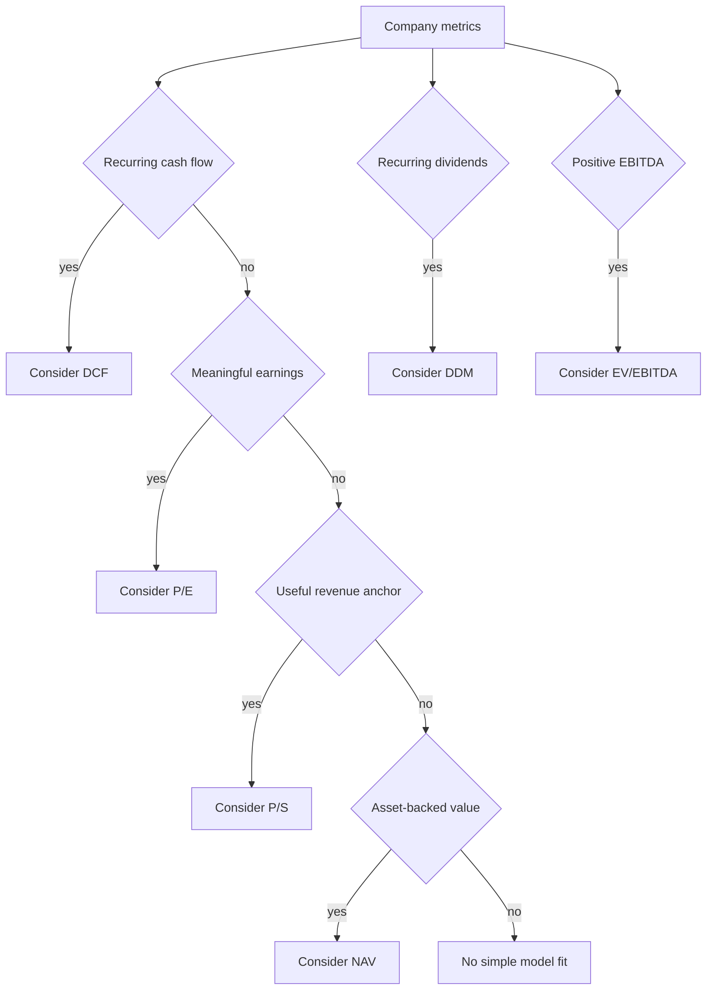

import Callout from "@components/ui/display/Callout.astro";

A profitable software company, a regulated dividend payer, and an asset-heavy holding company can report the same market value. They should not automatically receive the same valuation method. Model choice begins with how the business creates and distributes value, then asks whether the required inputs are stable enough to support the calculation.

---

## Start with the business, not the formula

A valuation model is a compressed story about a company. DCF says future distributable cash matters. P/E says earnings and an appropriate price multiple matter. NAV says the value of assets after liabilities and haircuts matters. Choosing among them means deciding which story fits the economics you are studying.

The engine helps through model-specific checks, but it cannot understand the whole business from numeric fields. It does not read a restructuring plan, distinguish temporary investment from permanent cost, or judge the durability of a competitive advantage. Suitability is a guardrail around inputs, not a substitute for company analysis.

Use this map as a first screen.

| Model | Main question | Stronger fit | Weak fit or main risk | Project guard |
| --- | --- | --- | --- | --- |
| DCF | What are future cash flows worth today | Positive interpretable FCF | Unstable cash generation | FCF and capital-cost checks |
| P/E | What might future earnings support | Meaningful EPS | Losses or poor earnings quality | EPS and multiple checks |
| EV/EBITDA | What is the operation worth before net debt | Positive EBITDA | Heavy reinvestment needs | EBITDA and policy multiple |
| P/S | What might revenue support | Revenue before mature margins | Revenue with no path to profit | Revenue and policy multiple |
| ROE | What can equity and distributions produce | Meaningful book equity | Distorted or negative equity | Equity and return checks |
| DDM | What are dividends worth | Stable recurring dividends | Non-payers and irregular payouts | Dividend checks |
| NAV | What remains from adjusted assets | Asset-backed businesses | Intangible earning power | Balance-sheet checks |
| Reverse DCF | What growth does price imply | Usable DCF inputs | Price treated as truth | Opt-in diagnostic |

No row says that a model is universally correct. Several models may be useful at once, provided you understand that they reuse evidence and answer different questions.

---

## Cash flow and DCF

DCF projects free cash flow and discounts it back to the present. In this repository, free cash flow is the cash remaining after operating cash generation and capital expenditure. The model estimates a finite forecast period and a terminal value, then bridges enterprise value to equity value using debt and cash.

DCF is attractive because it connects value to business economics. It is fragile because small changes in growth, WACC, or terminal growth can move the answer sharply. A mathematically complete DCF can still be unhelpful when the starting cash flow is temporary or the terminal value dominates the result.

A company with positive $250 million free cash flow gives DCF a usable seed. The dedicated DCF article shows how a seed moves through projection and discounting. It also explains the repository's project-specific choice to use a three-year average of projected cash flow as the terminal seed.

Prefer DCF when cash flow is meaningful and you can defend the transition from current economics to a mature state. Treat it cautiously for early-stage firms, deeply cyclical firms at a peak or trough, and companies whose cash flow is dominated by one unusual investment year.

---

## Earnings and P/E

P/E relates equity value to earnings per share. The repository projects EPS, applies a historical or target multiple, and discounts the future price back to the present. The model is easy to communicate because both inputs are familiar, but accounting earnings can contain noncash charges, one-off gains, or capitalized costs that obscure economics.

P/E works best when EPS is positive, representative, and comparable with the period used for the multiple. It works poorly when losses make the ratio undefined or when capital structure and accounting policy change the apparent earnings base.

<Callout variant="warning" title="P/E is excluded from the central example">
  
The audited source pairs daily close prices with a shorter annual EPS list by position rather than date. The historical median can therefore combine unrelated observations. Repair and test date alignment before treating this path as reliable.

</Callout>

That defect illustrates a general lesson. A familiar ratio does not make data alignment optional. The price and earnings denominator must refer to compatible periods and share definitions.

---

## Operating value and EV/EBITDA

EV/EBITDA starts with enterprise value, which represents claims held by equity and debt capital after accounting for cash. EBITDA approximates operating earnings before interest, tax, depreciation, and amortization. The model applies a configured multiple to EBITDA, then subtracts debt and adds cash to reach equity value.

This lens can compare businesses with different financing structures more cleanly than P/E. It can also hide capital intensity. Depreciation may be noncash in the current period, but the assets being depreciated may require real replacement spending. Two companies with equal EBITDA can need very different reinvestment.

For one worked example, $400 million EBITDA and the sample policy produce a $48 Base estimate after the debt and cash bridge. The number differs from a DCF estimate because the multiple view and forecast view encode different expectations.

Use the model when EBITDA represents recurring operation and the peer or policy multiple has defensible provenance. Inspect capital expenditure, leases, acquisitions, and working capital before interpreting the result.

---

## Revenue and P/S

P/S applies a price-to-sales assumption to revenue. It can be useful when a company has substantial sales but current earnings are depressed by growth investment. It is also the easiest model in the set to misuse because revenue does not guarantee margins, cash flow, or shareholder returns.

The same P/S ratio should not be applied casually across businesses with different gross margins, retention, capital needs, or dilution. A dollar of recurring high-margin revenue is economically different from a dollar of low-margin resale revenue.

A $62 Base P/S estimate is a statement about the configured revenue multiple, not proof that a company is cheap. The assumptions page explains why configuration is part of the model and why undocumented sector defaults should be labeled as project policy.

P/S is strongest as a bridge question. If revenue supports a high valuation, what margin and reinvestment path would be required to turn that revenue into distributable cash? Reverse DCF can help test the same tension from the market-price side.

---

## Shareholder returns and ROE

Return on equity relates net income to the book equity attributed to shareholders. This repository's ROE model is not a universal textbook formula. It uses book equity, an ROE assumption with a cap, growth, and shareholder distributions, with optional buyback substitution in its policy.

ROE can be informative when book equity is meaningful and management reinvests or distributes earnings in a stable way. It can be misleading when buybacks have shrunk book equity, accumulated losses make equity negative, or asset accounting makes the denominator unlike economic capital.

In a separate example, a $2 billion equity base and assumed return path support a $53 Base value. Proximity to another estimate does not grant it extra weight. Inspect how debt financing and repurchases changed the equity base before accepting the result.

---

## Dividends and DDM

DDM values expected dividends by discounting them to the present and adding a terminal dividend value. Its question is direct. What are the cash distributions to shareholders worth under a growth and discount policy?

A stable dividend payer can make that question useful. A company that retains all earnings for growth cannot be valued sensibly by inserting zero and pretending the result describes the whole business. A company with irregular special dividends also requires more judgment than a smooth growth path allows.

When a sample company pays no recurring dividend, the engine skips DDM. The absence remains visible in `skipped_models`, so the missing report carries a reason instead of looking like incomplete output.

DDM uses its own dividend-growth path in this repository. Do not assume that the shared earnings or free-cash-flow scenario helper drives every model.

---

## Assets and NAV

NAV begins with assets and liabilities. The repository applies scenario haircuts and limits to selected asset categories, then subtracts liabilities. It asks what the adjusted balance sheet might leave for shareholders.

This approach can suit investment holdings, property companies, financial firms, and businesses where separable assets provide a meaningful anchor. It can understate companies whose value comes from people, software, brands, networks, or future projects that accounting does not recognize as saleable assets.

A $35 NAV result can sit below revenue and cash-flow estimates when expected earning power matters more than adjusted recorded assets. NAV measures a narrower anchor, so its lower answer can still be internally coherent.

Haircuts remain assumptions. The repository stores them in configuration, and the current project does not provide a complete sourced dataset with effective dates. Treat the values as illustrative policy until their provenance is inspectable.

---

## Reverse DCF asks a different question

Forward DCF starts with your growth and risk assumptions and produces an estimated value. Reverse DCF starts with the market price and solves for the free-cash-flow growth needed to reproduce it under the other assumptions.

That does not turn price into truth. It turns price into a hypothesis. If a $50 price requires growth well above historical evidence and sector policy, you have found an expectation worth challenging. If it requires restrained growth, you still need to inspect whether the starting cash flow is sustainable.

The engine runs Reverse DCF only with `--reverse-dcf`. Its report has no scenario collection, so the summary extractor does not include it in the Base composite. That keeps a diagnostic answer from becoming another forward vote.

---

## How suitability gates make the choice

The runner asks every manager for a `ValuationCheckResult`. Each factor has a severity and weight. A score at or above the current threshold causes a skip. Successful models proceed to scenario execution, while skipped models retain their factors and reason.

This diagram is a prompt, not the engine's exact branch logic. The real implementation evaluates models independently rather than choosing only one. That matters because a company can support several useful questions at the same time.

Read a pass as permission to inspect a report, not proof that the report is sound. Read a skip as an explanation of model fit, not a verdict on company quality. The next article follows the evidence beneath these decisions and shows how provider values become the metrics every checker receives.

---

## Practice with three business shapes

Consider a subscription company with high recurring revenue, negative current earnings, and improving cash conversion. P/E has no useful denominator. P/S can frame what the revenue base might support, while DCF can test whether a plausible margin and reinvestment path justify that frame. Reverse DCF can show what the market price already requires.

Now consider a mature utility with stable dividends, regulated investment, and substantial debt. DDM can make distributions explicit. DCF can represent capital spending and financing risk. EV/EBITDA can offer an operating comparison, but it must not hide the cost of maintaining the asset base.

Finally consider an investment holding company whose reported earnings swing with asset marks. NAV may provide the clearest anchor when holdings can be valued and liabilities are known. P/E can confuse accounting volatility with operating change. A cash-flow model may still help when fees and recurring expenses matter.

For each company, write the model question before opening the output. Name the input that could invalidate it and the assumption most likely to dominate. This short exercise makes model selection explicit and reduces the temptation to keep whichever result agrees with your prior view.
