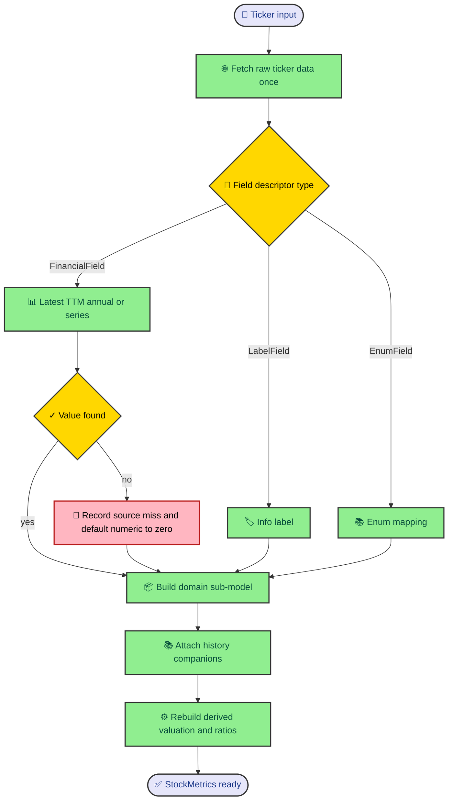

The first hard problem in valuation is not discounting cash flow. It is getting the input shape under control. Market data arrives through labels, quarterly statements, annual statements, price history, EPS history, and sector metadata. This entry follows the path from a ticker symbol to `StockMetrics`, the aggregate every valuation model receives.

---

## The repository boundary

`MetricsLoader` depends on a `FinancialRepository` protocol instead of importing yfinance directly. That small boundary does a lot of quiet work. The application layer asks for labels, TTM values, annual values, series, price history, and EPS history. It does not know which library fetched them.

`YfinanceDataLoader` implements that protocol. When it starts, it fetches raw ticker data once and wraps it with a fetcher, parser, and mapper. After that, the loader reads from memory. That keeps the rest of the build from scattering remote calls through every field lookup.

The repository protocol also gives tests and future adapters a clear contract. A different data source can implement `get_label()`, `get_ttm_from_quarters()`, `get_annual_value()`, `get_latest_numeric()`, `get_series()`, `get_highest_price()`, `get_price_history()`, and `get_eps_history()` without changing the domain model.

That is the first design move. Source-specific complexity lives in infrastructure. The application layer sees a financial repository.

---

## Field descriptors carry intent

The mapper does more than map names. It describes how each field should be loaded. A `FinancialField` knows its source label, its action, and sometimes its period. A `LabelField` reads company metadata. An `EnumField` reads a value and maps it into a domain enum, such as sector.

That means `MetricsLoader.get_from_field()` can dispatch by descriptor rather than by a long chain of hand-written field names. Latest value, TTM value, prior TTM fallback, and series reads all move through the same path.

The loader's `build_model()` method then walks the mapper for a target dataclass. For each descriptor, it asks the repository for a value and builds keyword arguments for the domain model. The field definitions own source knowledge. The dataclass owns domain shape.

Here is the build path at a high level.

The diagram hides many source details, but it shows the important ownership. yfinance knows the raw data. Mappers know how fields should be read. Domain dataclasses know what the engine needs to reason about a business.

---

## Defaults keep the build alive

Financial source data is uneven. Some companies have clean quarterly cash flow. Some have missing rows. Some instruments do not have every field the engine asks for. If every missing value raised an exception, the CLI would fail before the engine could say what went wrong.

The loader makes a different trade. Numeric `FinancialField` misses return `0.0` and record a source miss when a registry exists. Label and enum misses return `None`, because those domain fields are optional. This keeps construction deterministic while preserving the reason a value is absent.

That choice can look suspicious at first. Zero can mean a real zero or no source data. The engine handles that by refusing to treat the default as the whole story. The missing-data registry travels with the run and gives validators enough context to decide whether the zero is harmless, suspicious, or blocking.

The result is practical. The engine can build one `StockMetrics` object even when yfinance lacks a few rows, and the later layers can still explain which fields were weak.

---

## History arrives before derived values

`StockMetrics` contains primary sub-models such as `CompanyProfile`, `Financials`, `CashFlow`, `BalanceSheet`, `MarketData`, `Valuation`, and `HistoricalData`. The loader builds those scalar models first. Then it attaches history companions to the financials, cash flow, and balance sheet sub-models.

That order matters because derived valuation fields use historical context. Forward growth can come from net income history or EPS history. Median historical P/E needs price and EPS pairs. Free cash flow CAGR needs annual FCF. Capex spike detection needs annual capex history to compare TTM capex against a historical median.

The loader calls `_rebuild_derived()` once after history is attached. That method rebuilds `Valuation` and `Ratios`, and those builders emit diagnostics when formulas cannot resolve cleanly. Calling the rebuild once after all history exists avoids partial derived values based on an incomplete object.

The final aggregate is therefore not only a bag of source fields. It is a normalized snapshot with source fields, derived valuation fields, derived ratios, historical context, and diagnostics.

---

## The shape downstream models expect

Valuation models do not ask yfinance for anything. They receive `StockMetrics`. That gives every model a consistent vocabulary. DCF reads free cash flow, debt, cash, shares, beta, tax rate, cost of debt, growth signals, and current price from the same object. P/E reads EPS and median historical P/E. NAV reads assets and liabilities.

This is where the repository boundary pays off. Formula code stays formula-shaped. It does not know which income-statement label produced EBITDA, which yfinance statement period produced operating cash flow, or which parser fixed EPS history. Those source concerns are already settled.

The benefit is not only neatness. It makes errors easier to trace. If a valuation result looks odd, you can inspect whether the source value was missing, whether a derived field fell back, whether a growth signal was clamped, or whether a model should have been skipped.

That is the reason `StockMetrics` is the center of the engine. It turns a noisy source into a domain object without pretending the noise disappeared.

---

## The mapper is the quiet contract

The mapper deserves more attention than it usually gets. It is the translation table between yfinance labels and domain fields. Without it, source labels would leak into model code, and every formula would have to know too much about statement layout. With it, source naming stays at the edge.

That matters because yfinance data is not a stable domain model. It is a data provider surface with labels, statement frames, and info fields. The engine's domain model has different goals. It wants financials, cash flow, balance sheet, market data, valuation helpers, and historical companions in shapes that valuation code can use.

The mapper is also where field intent becomes explicit. A field that needs latest quarterly data is not the same as a field that needs trailing twelve months. A field that needs annual history is not the same as a field that needs a label from the info dictionary. Encoding that intent once keeps the loader small and keeps the dataclasses free of source plumbing.

This is one reason `build_model()` feels generic. It can build `Financials`, `CashFlow`, `BalanceSheet`, `MarketData`, and profile data through the same loop because the mapper already answered the source questions. That is a good kind of generic code. It removes repetition without hiding domain meaning.

---

## What can go wrong here

The data-to-metrics boundary is where source assumptions fail first. A label can be absent. A statement can contain all nulls. A company can report a field in a way that does not match the mapper's preferred label. A price history can be too short to produce median P/E. A sector can fail to map to the enum the config expects.

The engine does not solve every source-quality problem at this layer. It does something narrower and more useful. It records misses, applies safe defaults, and builds a complete aggregate for the layers that know how to judge analytical risk.

That means this layer should stay humble. It should not decide that DCF is invalid because FCF is missing. It should record that FCF was missing. The DCF checker can then decide whether that missing value is critical, downgraded by normalized FCF, or less relevant for a specific sector.

If you add a new field, this is the checklist. Add or update the mapper descriptor. Confirm the repository can load the source shape. Decide whether the target domain field should default to zero or remain optional. Then add a test that proves both the happy path and the missing-data path behave the way validators expect.

That keeps the loader from becoming a policy engine. It should prepare the facts. Later layers argue about what those facts mean.
