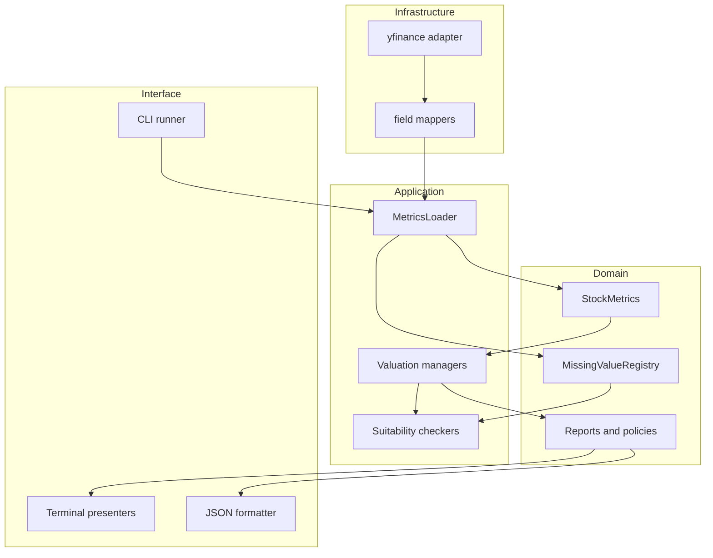

import Callout from "@components/ui/display/Callout.astro";

Adding one metric sounds small until it touches a provider label, mapper, dataclass, derived calculation, missing-data reason, validator, report, JSON payload, and tests. The project keeps those responsibilities separate, which makes the path longer but inspectable. This article is the maintainer map that the old vault tried to place before the product tour.

---

## The contracts that keep the runner small

The CLI does not implement every formula. It asks a repository for metrics, gives one `StockMetrics` object to registered valuation managers, runs suitability, executes scenarios when allowed, and sends outcomes to presenters and JSON formatting.



`FinancialRepository` keeps provider operations behind a protocol. `ValuationManager` gives models a common execution shape. Report dataclasses keep output typed. `ModelRunOutcome` preserves both successful and skipped paths.

The symmetry is valuable, but not complete abstraction. Summary extraction knows several common intrinsic-value field names. Presenters and JSON may need explicit support for a new report shape.

---

## Add or change a source field

Start from the financial meaning. Decide the period, unit, sign, currency, and whether zero is valid. Then add or update the provider label and descriptor in the yfinance mapper. Place the destination on the correct domain submodel.

```python
"revenue_ttm": YfFinancialField(
    INCOME_STMT_LABELS["revenue"],
    Action.GET_TTM_VALUE,
    statement=Statement.INCOME,
)
```

Test a present value, an absent value, an unexpected source shape, and the target period. A mapper test should not be the only protection. Add an application test showing how the loaded value affects `StockMetrics`.

The current repository has one concrete provider adapter. A second adapter would test whether the protocol represents real domain needs or merely yfinance with different names.

---

## Add a derived metric and diagnostic

Derived formulas belong in domain builders or calculation modules, not provider parsing. Return a value and a `BuildDiagnostic` when the calculation cannot support a meaningful result.

```python
if denominator == 0:
    diagnostics.append(
        BuildDiagnostic(
            model="Ratios",
            field="new_ratio",
            reason=MissingReason.ZERO_DENOMINATOR,
            detail="The ratio requires a non-zero denominator.",
        )
    )
    value = 0.0
```

Be explicit about whether `0.0` is a calculation, a fallback, or not applicable. The registry makes that distinction only when a diagnostic is recorded. Label, enum, and optional history misses do not automatically receive the same coverage.

Test positive, zero-denominator, missing-input, and extreme-input cases. Financial formulas often fail at boundaries rather than in the ordinary example.

---

## Add a suitability rule

A checker returns a `ValuationCheckResult` with factors, severity, weights, interpretation, and suitability. The runner currently skips when the total score reaches six.

Keep economic eligibility separate from formula execution. A checker should identify why a model is weak before the valuation module tries to compensate. If the formula supports a documented normalization path, the checker and calculation must agree about it.

The DCF capex-spike behavior is a good example. When normalized free cash flow is valid, the checker can downgrade the raw cash-flow issue and the valuation uses the normalized seed. Blocking the model while its execution path supports the adjustment would create contradictory behavior.

Test a clean pass, warning pass, threshold skip, and hard blocker. Confirm that factors appear in terminal and JSON output.

---

## Add a valuation model

Most model packages contain defaults, handler, validator, and valuation modules. Define parameter and report dataclasses in the domain layer. Implement a manager that accepts `StockMetrics`, exposes defaults, validates metrics, and executes scenarios.

```python
class ExampleManager(ValuationManager[ExampleReport]):
    def validate_metrics(self, registry=None):
        return ExampleChecker.evaluate(self.stock_metrics, registry)

    def execute_valuation_scenarios(self):
        self.report = execute_example_scenarios(
            self.stock_metrics,
            self.params,
        )
        return self.report
```

Register the manager in `VALUATION_MANAGERS`. Use Bear, Base, and Bull scenario names if it should enter the forward summary. If the report is diagnostic like Reverse DCF, omitting `scenarios` keeps it out of summary row extraction.

Decide which report field carries comparable per-share value. The extractor recognizes existing field names, but a novel report may need an explicit adapter. Do not force unlike units into the composite merely to satisfy an interface.

---

## Keep CLI and JSON consistent

Terminal output and JSON serve different readers, but they should describe the same run. Add a presenter for readable output and serializer support for the report. Keep skipped outcomes visible in both modes.

| Change | Main locations | Contract to verify |
| --- | --- | --- |
| Source field | labels, mapper, domain model | Period, unit, missing reason |
| Derived metric | calculation, builder, registry | Boundary behavior |
| Suitability factor | checker, policy tests | Severity and threshold |
| Valuation model | params, report, manager, formula | Scenarios and comparable value |
| Output | presenter, JSON formatter | Same outcome in both modes |
| Summary behavior | row extractor, summary report | Inclusion and weighting |

JSON is an external contract once another tool consumes it. Add fields compatibly when possible and document changes. The project currently has no changelog or formal versioned schema, so downstream consumers should pin a code revision.

---

## Test the clean, warning, and blocked paths

The source snapshot contains unit, application, CLI, JSON, presenter, and integration tests. Run compilation and pytest from the repository environment.

```bash
python -m compileall -q src tests
python -m pytest
```

Formula tests should use round fixtures and assert boundary behavior. Checker tests should cover reasons and scores, not only booleans. CLI tests should confirm skipped models remain visible. JSON tests should confirm report and summary shapes.

Add direct historical P/E tests before relying on that model. They should align dated price and EPS observations, reject incompatible periods, and prove that list order cannot create a ratio.

Currency conversion needs an integration path and tests spanning statement values, market prices, the valuation date, and failure behavior. A currency service existing in isolation is not evidence that valuation is normalized.

---

## Current extension limits

<Callout variant="warning" title="Early project boundaries">
  <p>The package is version 0.1.0 and has no visible license, contribution guide, changelog, security policy, or second repository adapter. Confirm usage rights and expectations before distributing modifications.</p>
</Callout>

Static configuration lacks a complete provenance and refresh process. Treat assumption sourcing as product work rather than documentation garnish. Store source URL, retrieval date, effective date, method, and dataset artifact where a value can be audited.

The equal-weight composite is intentionally simple. Extending it with weights would require a defensible policy, disclosure of dependencies, handling for negative estimates, and tests. Complexity without validation would make the summary harder to challenge.

The best next changes are narrow and testable. Repair P/E date alignment. Connect currency normalization. Version sourced assumptions. Add a second repository adapter. Preserve the project's strongest habit while doing so, which is keeping evidence, policy, calculation, and presentation visible as separate layers.

---

## Plan the P/E repair as a vertical change

The historical P/E issue is a good example because the correct fix crosses layers. Start with a dated observation type rather than two unlabelled numeric lists. Make the repository return price and EPS periods explicitly. Align compatible dates under a documented policy before calculating ratios.

```python
@dataclass(frozen=True)
class DatedValue:
    date: date
    value: float


def align_price_and_eps(
    prices: list[DatedValue],
    eps: list[DatedValue],
) -> list[tuple[DatedValue, DatedValue]]:
    """Return only observations matched by the documented period rule."""
```

Decide whether to use fiscal-year-end price, an average price over the earnings period, or another method. The method must be explicit because each answers a different comparison question.

Add fixtures with shuffled input order to prove that position cannot control pairing. Add missing-year, negative-EPS, restatement, and split-adjustment cases. Then verify the validator, report, terminal presenter, JSON serializer, and summary inclusion.

```text
repair checklist
  dated repository contract
  explicit alignment policy
  period compatibility validation
  shuffled-order test
  missing-period test
  negative-EPS test
  split and share-basis review
  presenter update
  JSON update
  documentation disclosure update
```

This is more work than changing one `zip` call, but it repairs the meaning rather than the symptom.

---

## Plan currency normalization at the boundary

Choose a base currency for each valuation run. Convert statement flows using a documented period policy and point-in-time balance-sheet values using an appropriate date. Price and market capitalization must share the final reporting unit.

Record source currency, target currency, rate, provider, timestamp, and conversion method. Missing or stale exchange rates should create diagnostics and suitability consequences rather than silent fallback.

```text
currency conversion record
  source_currency
  target_currency
  source_amount
  exchange_rate
  rate_date
  converted_amount
  rate_provider
  conversion_method
```

Test identity conversion, ordinary conversion, missing rates, stale rates, unsupported currencies, and mixed statement periods. Confirm that converted metrics and per-share output remain internally consistent.

Keep conversion outside formula modules. Valuation code should receive values already expressed in the run's chosen currency. That preserves the repository and domain boundary while making the currency assumption inspectable.

---

## Use a pull-request evidence table

For any financial change, summarize the contract, behavior, tests, and publication impact in the review description.

| Review item | Evidence |
| --- | --- |
| Financial meaning | Formula, unit, period, sign, and currency |
| Source behavior | Fixture reproducing provider shape |
| Missing behavior | Reason and severity |
| Domain behavior | Clean and boundary tests |
| Model behavior | Pass, warning, and blocked tests |
| Output behavior | Terminal and JSON assertions |
| Editorial behavior | Updated limitation or example |

This table keeps reviewers at the right altitude. A test passing is necessary, but the reviewer also needs to know that the test represents the intended financial meaning.

---

## Keep the public explanation synchronized

A code correction can invalidate an educational example even when the CLI schema stays stable. If P/E alignment, currency conversion, composite policy, or assumption provenance changes, search this vault for the old limitation and update the fixture where needed.

Treat publication examples as contract tests for meaning. Commands must still run, report fields must still exist, and prose must describe the current behavior. Keep frozen numbers labeled when they are not generated directly by a checked-in fixture.

The maintenance rule is modest. Change implementation, tests, and public explanation together whenever a financial claim changes. Readers should not need source archaeology to discover that a warning was fixed or a default was redefined.
