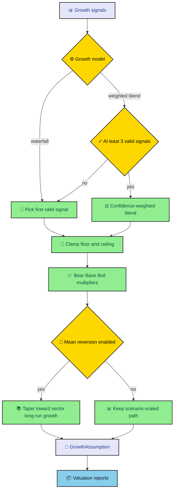

Growth assumptions do more damage than most formulas admit. A small change in projected growth can move a long-horizon valuation by a lot, especially when terminal value is involved. The engine handles growth as an explicit assumption object, so the selected source, diagnostics, scenario paths, and optional mean reversion stay visible.

---

## The base growth decision

The shared growth logic lives in `application/valuations/utils.py`. It serves models that need projected growth paths, mainly DCF, P/E, and ROE. The helper supports two modes. The default mode is `waterfall`. The optional mode is `weighted_blend`.

The waterfall keeps the older behavior. It checks available signals in priority order and uses the first valid one. The order is forward growth, FCF CAGR, net-income growth, revenue growth, and then a fallback base growth value. Each candidate has quality checks before it can become the selected rate.

The weighted blend collects all valid growth signals in parallel, applies confidence weights, and blends them only if at least three valid signals exist. If too few signals are present, it falls back to the waterfall and records a diagnostic explaining why.

That fallback is a good design choice. A weighted blend with one or two signals would look more sophisticated than it is. The engine chooses the simpler path unless the data supports the richer one.

---

## Clamps and quality guards

Growth signals can be mathematically valid and still be bad assumptions. A near-zero FCF base can produce a huge CAGR. Negative net income can make net-income growth misleading. A one-time rebound can create an unrealistic projection seed.

The engine handles those cases with guards. It excludes FCF CAGR when the FCF series contains values below the minimum scale. It disqualifies net-income growth when current net income is negative. It clamps selected values inside a configured floor and ceiling, currently negative twenty percent and positive fifty percent.

Those clamps are not hidden. The growth assumption carries diagnostics when a signal gets clamped or skipped. That matters because a valuation reader should know when the projected growth path was bounded by policy instead of accepted raw.

The flow from signal selection to valuation reports looks like this.

The diagram shows why growth is not a single number. It is a selected assumption plus a set of scenario paths that later models consume.

---

## Bear, Base, and Bull paths

After the engine selects base growth, it builds Bear, Base, and Bull lists for the projection window. The scenario helper reads multipliers and volatility from `scenarios.yaml`. It applies margin of safety by reducing the Bear multiplier and raising the Bull multiplier.

By default, the helper creates deterministic growth paths. It also supports stochastic noise when requested, using a random number generator. The CLI path in this project keeps the normal run deterministic, which is the safer default for repeatable reports and tests.

Each scenario produces a list of annual growth rates. The valuation model receives that list and applies it year by year. DCF uses it to project free cash flow. P/E uses it to project EPS. ROE uses it to project earnings and shareholder returns.

This shared scenario generation prevents three models from inventing three unrelated interpretations of Bear, Base, and Bull. The formulas differ, but the scenario vocabulary stays consistent.

---

## Mean reversion as an option

Mean reversion is opt-in. When enabled and the stock's sector has a long-run growth rate configured, each projected year tapers toward that long-run rate. Bear reverts faster. Base reverts at the standard speed. Bull reverts slower.

That makes intuitive sense. A Bear case should usually converge away from exceptional growth faster. A Bull case can allow above-normal growth to last longer. The important part is that the code records whether reversion actually happened and which long-run growth rate it used.

If reversion is requested but no sector long-run rate exists, the helper records a diagnostic and generates flat, non-reverted paths. That is another small honesty feature. The engine does not pretend a sector assumption exists when config cannot provide one.

The mean-reversion logic also keeps scenario multipliers in the path. It applies reversion to the scenario-scaled base rather than throwing away the Bear or Bull interpretation.

---

## GrowthAssumption as audit data

The output of the growth helper is a `GrowthScenarioSet`. It contains the scenario rate lists and a `GrowthAssumption`. The assumption records the requested mode, selected mode, selected rate, selected source, signal contributions, diagnostics, reversion flag, and long-run growth value.

That metadata matters more than it looks. A DCF report that only says "Base intrinsic value is X" leaves the reader guessing where growth came from. Was it net income CAGR, FCF CAGR, a weighted blend, or the fallback? Did a clamp bind? Did mean reversion apply?

The report can answer those questions because the helper carries the assumption forward. The valuation models do not have to re-explain growth. They include the assumption object in their reports.

This keeps valuation output closer to an argument than a number. You can inspect the selected source, then decide whether the assumption fits the company.

---

## Why this belongs outside any one model

Growth selection could live inside DCF, but that would duplicate logic in P/E and ROE. It would also make the models harder to compare because each formula might choose growth differently.

The shared helper gives the engine one policy surface for growth assumptions. Models can opt into it through their parameters. Defaults keep older behavior. Newer options such as weighted blending and sector mean reversion stay explicit.

That is the theme running through the whole engine. Shared policy belongs in one place. Model-specific math belongs in model modules. Output should carry enough context for the reader to see which path the run took.

---

## The difference between signal and scenario

One useful way to read this code is to separate signals from scenarios. A signal is evidence about growth. Forward net income CAGR, FCF CAGR, EPS CAGR, TTM net-income growth, and revenue growth are all signals. They come from history or current trailing values.

A scenario is a projected path. Bear, Base, and Bull are not source facts. They are applied assumptions based on the selected signal, margin of safety, configured multipliers, optional volatility, and optional mean reversion. Mixing those ideas makes valuation output harder to explain.

The engine keeps them separate through `GrowthSignalContribution` and `GrowthScenarioSet`. Signal contributions describe what evidence was used and how it was weighted. Scenario sets describe the annual rates sent to valuation models. That lets a report say both where growth came from and how it was applied.

This distinction helps with debugging too. If a valuation looks too high, inspect the selected signal first. If the selected signal is reasonable, inspect scenario multipliers and reversion behavior. If those are reasonable, inspect the formula. That order avoids blaming DCF math for a growth policy issue.

---

## Config is part of the model

The scenario helper reads from YAML configuration. That includes sector long-run growth, scenario multipliers, and volatility. Those files are not incidental. They are part of the valuation model because they shape the assumptions sent into formulas.

That is why the config loader has typed accessors such as `get_float()`, `get_int()`, and `get_nested_float()`. The code expects configuration to be imperfect sometimes, so it falls back to defaults when values are missing or invalid. It also logs when a config value cannot be parsed.

If you change market assumptions, start in config and then run tests that cover a known ticker fixture or synthetic `StockMetrics`. A small multiplier change can move every downstream intrinsic value. The change might be correct, but it should be deliberate.

The same caution applies to growth floors and ceilings. They look like constants, but they encode valuation judgment. A fifty percent ceiling stops extreme optimism. A negative twenty percent floor stops runaway contraction. Changing those bounds changes the engine's personality.

---

## Why diagnostics belong in reports

Growth diagnostics should travel into reports because they explain why a projection path looks the way it does. If a signal was clamped, the reader should see that. If weighted blend fell back to waterfall, the reader should see that. If mean reversion was requested but skipped due to missing sector config, the reader should see that too.

This is especially useful when comparing models. DCF, P/E, and ROE can share the same growth assumption object, but their formulas respond differently. If all three disagree, the issue might be formula structure. If all three move together, the issue might be the shared growth assumption.

The engine's report shape gives future presenters room to expose that context. A CLI table might show only the selected source and rate. JSON can carry the full object. A future web view could show the signals, weights, and diagnostics as an expandable panel.

The point is to keep assumption history available. Valuation output ages better when someone can reconstruct why the model chose its path.
