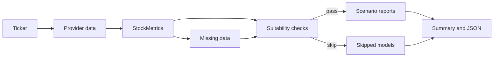

I had invested conservatively for several years and earned good returns, but expanding my portfolio raised a harder question. If I was going to invest more, I wanted a better way to identify companies that might be fairly valued or undervalued instead of leaning on a familiar ratio or a persuasive story.

That need became the equity valuation engine. It compares several ways of valuing a company, keeps their assumptions visible, and explains when the available data does not support a model. The software does not make investing safe. It gives me a structured argument to inspect before taking a risk that would otherwise rest on less evidence.

---

## One ticker, several arguments

Intrinsic value is not a fact waiting inside a financial statement. It is an estimate built from cash flows, earnings, assets, dividends, growth, and risk. Change the evidence or the assumptions and the estimate changes. A useful valuation tool therefore needs to show its reasoning, not merely print a number with two decimal places.

The equity valuation engine is a Python command-line project built around that idea. It loads public market data, maps it into a common set of business metrics, checks whether each model has suitable inputs, calculates Bear, Base, and Bull cases, and returns terminal tables or structured JSON.

The standard run includes seven forward-looking lenses. DCF begins with free cash flow. P/E begins with earnings per share. EV/EBITDA begins with operating profit before financing and selected accounting charges. P/S begins with revenue. The ROE model begins with book equity and shareholder distributions. DDM begins with dividends. NAV begins with assets and liabilities.

Reverse DCF is available as an additional diagnostic. It does not produce another forward scenario to average. It solves for the growth rate that would make a DCF match the current market price. That turns the usual valuation question around and lets you inspect what the price appears to require.

These methods are not seven independent witnesses observing the same event. They reuse company data and sometimes share assumptions. Their disagreement is still useful because each method exposes a different dependency. A revenue multiple can look generous while cash-flow valuation looks restrained. That gap tells you where to investigate.

---

## What the engine gives you

The project gives you more than a composite price. A run includes the normalized company metrics, missing-data records, suitability factors, scenario reports, skipped-model reasons, and a summary of successful Base estimates. The JSON representation keeps those pieces together for later inspection or automation.

The following output is a frozen, anonymous example created to explain the report shape. The sample uses matching reporting and trading currencies, round financial inputs, five successful models, one skipped model, and one model excluded because of a known data-alignment problem.

```daisyui
{
  "component": "mockup-window",
  "ariaLabel": "Fictional valuation summary",
  "bodyClass": "p-5 font-mono text-sm",
  "header": [{ "type": "text", "text": "Anonymous sample summary" }],
  "content": [
    {
      "type": "pre",
      "text": "Current price                 $50.00\nModels run                         5\nModels skipped                    2\n\nBase estimates\nDCF                            $58.00\nROE                            $53.00\nEV/EBITDA                      $48.00\nP/S                            $62.00\nNAV                            $35.00\n\nEqual-weight Base composite    $51.20\nModel dispersion               $ 9.37\nDispersion band          $41.83 to $60.57"
    }
  ],
  "caption": [
    {
      "type": "text",
      "text": "A fictional teaching fixture shaped like the engine output, not a live market result."
    }
  ]
}
```

The composite is close to the market price, but the underlying range is wide. That is the point of the sample. If you saw only $51.20, you might conclude that the market had already found fair value. Once you see $35 and $62 beside it, the useful question becomes why the models disagree by so much.

The engine calls the serialized interval `confidence_band`. This vault calls it a model dispersion band because the calculation is the Base average plus or minus one population standard deviation. It is not a statistical confidence interval, and it does not describe the probability that an unknown true value lies inside the range.

---

## The path from source data to a result

The runtime follows a traceable sequence. A ticker starts the process. The data adapter reads several yfinance surfaces, including company labels, statements, market data, and price history. A mapper converts source labels into a `StockMetrics` aggregate. The engine then builds derived ratios and records selected raw or derived failures.



Suitability sits before formula execution. A DDM without dividends should not invent a dividend valuation. A DCF with unusable free cash flow should not quietly convert a missing input into a persuasive-looking price. Each model evaluates its own requirements and either runs or produces a visible skip reason.

The source adapter creates one ticker container for a run, but that does not mean one network request. It reads several provider surfaces and reuses their results from memory. This distinction matters when diagnosing provider failures or considering a second data adapter.

The architecture also keeps output separate from calculation. A report object can be rendered as tables for a person or serialized as JSON for another program. The valuation formulas do not need to know which presentation was requested.

---

## Why models disagree

DCF values future cash that can be distributed after operating and investment needs. P/E values a claim on accounting earnings. EV/EBITDA compares operating value before debt and cash are assigned to shareholders. P/S uses revenue when earnings or cash flow are not yet representative. NAV asks what remains after applying scenario haircuts to assets and subtracting liabilities.

Each starting point creates a different vulnerability. DCF is highly sensitive to growth, discount rates, and terminal value. P/E depends on the quality of earnings and the chosen multiple. P/S can reward revenue that never becomes profitable. NAV may miss valuable earning power that does not sit neatly on a balance sheet.

In the sample, the $62 P/S estimate says revenue could support a higher equity value under the configured multiple. The $35 NAV estimate says the recorded asset base offers a weaker anchor. The gap reflects a business whose expected earning power matters more than its net recorded assets.

The engine's Base composite gives each successful model equal weight. It does not weight models by suitability score, model family, sector fit, or demonstrated forecast error. Equal weighting is easy to inspect, but it is only a policy choice. Negative estimates can also enter the average if a successful model produces them.

---

## What the project makes visible

Missing values remain attached to reasons such as absent source data, an unusable denominator, insufficient history, a failed derived calculation, or a value that is not applicable. This prevents a zero default from carrying its meaning alone. A zero dividend for a non-payer and a zero caused by an unavailable field are different facts.

The registry does not capture every possible absence. Numeric financial-field misses and selected derived failures are its main coverage. Missing labels, enum values, and optional history may not appear in it. Some top-level failures, such as invalid shares outstanding, can still stop metric construction rather than produce a partial valuation.

Suitability factors preserve the next part of the chain. A model can explain which condition raised a warning or caused a skip. The CLI and JSON keep skipped models visible, which is more informative than silently omitting a report. In many runs, the skip reason is a better finding than one more estimate.

Scenario reports then reveal how assumption changes move the result. Bear, Base, and Bull are named policy cases, not probability forecasts. Their job is to make sensitivity legible. The assumptions article later in this vault shows how historical signals, configured limits, and mean reversion shape those paths.

---

## Where the engine stops

```daisyui
{
  "component": "callout",
  "variant": "warning",
  "title": "Educational software, not investment advice",
  "content": [
    {
      "type": "paragraph",
      "text": "This project organizes valuation calculations and diagnostics. It does not know your objectives, constraints, tax position, portfolio, or tolerance for loss. Verify source filings and assumptions before relying on any output."
    }
  ]
}
```

yfinance is convenient, but provider data can be incomplete, mislabeled, delayed, or revised. The engine's configuration can also age. Sector multiples, risk-free rates, market risk premiums, growth limits, and asset haircuts are stored as project defaults without a complete publication-grade provenance trail or formal refresh policy.

Currency conversion is not connected to the valuation path. The domain records financial and trading currencies, and a currency service exists, but the current run does not normalize statement values and share prices into one currency. Use same-currency examples until that path is implemented and tested.

The current historical P/E construction also has a date-alignment problem. Daily closing prices are paired positionally with a much shorter annual EPS series. The sample excludes P/E from its composite and treats the model as a code path that needs correction before its historical multiple should be trusted.

The package is version `0.1.0`. The repository does not currently present a license, contribution guide, changelog, or security policy. The code is worth studying and extending in a controlled environment, but the publication does not claim a mature supported release.

For background on reading company accounts, the [SEC guide to financial statements](https://www.investor.gov/introduction-investing/investing-basics/glossary/financial-statements) is a useful primary starting point. For valuation theory and datasets, Aswath Damodaran's [valuation resources at NYU Stern](https://pages.stern.nyu.edu/~adamodar/) show how assumptions and model choice shape the result.

---

## Choose your path through the vault

Read [Your first valuation run](./first_valuation_run/) if you want to see the CLI before learning the formulas. It walks through installation, the output modes, a skipped model, the scenario table, and a short review checklist.

Read [How to choose a valuation model](./choosing_a_valuation_model/) when DCF, P/E, EV/EBITDA, P/S, ROE, DDM, and NAV are still unfamiliar. It maps each model to the business question it can answer and the conditions that should keep it silent.

The middle of the vault follows the evidence chain. [From market data to usable metrics](./trusting_the_inputs/) explains provider boundaries and missing data. [Assumptions, scenarios, and honest uncertainty](./assumptions_and_scenarios/) explains forward policy. [DCF and reverse DCF](./dcf_and_reverse_dcf/) performs the main worked calculation. [Six other ways to value a company](./other_valuation_models/) compares the remaining lenses.

Finish with [How to read a valuation result](./reading_the_results/) for the composite, dispersion, and JSON audit trail. Developers can then move to [Extending the engine](./extending_the_engine/) for repository contracts, metrics, validators, models, presenters, and tests.

The route through the material is deliberate. First experience the output. Then learn the financial questions. Only after that should you inspect how the implementation keeps those questions separate. A valuation project earns trust when the answer is easy to challenge.

---

## A question to carry through the series

Imagine that a share price rises from $50 to $60 while the company's statements and configuration remain unchanged. The forward estimates do not automatically rise with it. Implied upside falls, price labels can change, and Reverse DCF solves for a more demanding growth rate. That separation between market observation and valuation assumption is worth preserving.

Now imagine that revenue is corrected downward by 10 percent. P/S changes directly, margins may change, and any derived growth history can move. NAV might barely react. The composite will move, but the more useful result is the map of which models responded and why.

Finally imagine that the missing dividend was a provider error. Correcting it might allow DDM to run, which adds another Base estimate to the equal-weight average. The composite changes because the model set changed, not necessarily because the business changed.

These three cases give you a practical test for every page. Ask whether a change belongs to market price, company evidence, project policy, or model availability. If the output cannot tell you which category moved, the apparent precision is doing more harm than good.
