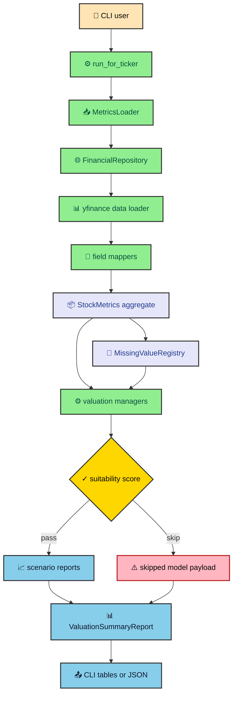

Valuation tools get weird fast when they pretend every input is clean. A ticker lookup might return missing cash flow, a sector multiple might not fit the company, and one unusual capex year can make a perfectly good business look broken. This vault explains how the equity valuation engine keeps those problems visible while it turns raw market data into model checks, scenario reports, and a consolidated intrinsic-value summary.

---

## The shape of the system

The engine is a Python command-line application organized around one main flow. A user provides a ticker. The CLI builds a `StockMetrics` aggregate from yfinance-backed data, records missing or weak inputs, runs model-specific suitability checks, executes the eligible valuation models, and emits either human-readable tables or compact JSON.

That sounds like a finance calculator, but the interesting part lives in the boundaries. The engine separates source loading from domain modeling, modeling from validation, validation from formula execution, and execution from presentation. Each boundary gives the code one place to say what it knows and what it does not know.

The first pass through the system looks like this.

The diagram is intentionally pipeline-shaped. Most bugs in this kind of project come from smearing responsibility across layers. If source loading knows too much about valuation policy, changing a formula becomes risky. If presentation code recalculates summary rules, CLI output and JSON output drift apart.

The engine avoids that by making `run_for_ticker()` an orchestrator rather than a formula dump. It asks each layer to do its own work and pass forward a structured result. That is why a skipped model still shows up in output with a reason. It is also why the JSON payload can include metrics, suitability checks, valuation reports, skipped model details, and the final summary in one object.

---

## The core idea

The core idea is simple enough to say plainly. **A valuation result should carry its assumptions and weaknesses with it.** A discounted cash flow output without the growth source, WACC inputs, missing-data context, and suitability factors is too easy to overread. It looks precise because the number has decimals. The engine pushes back against that false precision.

That starts in the data loader. Numeric source misses become defaults so the program can keep running, but they also become `MissingValueRegistry` records. Derived formula misses become `BuildDiagnostic` records and then enter the same registry. The result is a domain object that has usable values and an audit trail beside it.

Suitability checks then turn that audit trail into model decisions. A DCF model cares about free cash flow, WACC, tax rate, and forecast stability. A dividend discount model cares about dividends. A P/E model cares about earnings and a usable historical multiple. The engine does not ask one generic validator to judge every model.

After a model passes, it runs scenarios. The growth helper chooses a base growth signal through a waterfall or an optional weighted blend, clamps unreliable extremes, and can taper growth toward sector long-run assumptions. That gives DCF, P/E, and ROE a common scenario engine without forcing every model to share the same formula.

---

## What the vault covers

This vault follows the runtime path rather than the package tree. That order matters. If you start with formulas, the reader sees valuation as math first and data quality second. The engine is better understood the other way around.

| Entry | Main question |
| --- | --- |
| `data_to_metrics` | How does source data become the `StockMetrics` aggregate? |
| `missing_data_diagnostics` | How does the system keep missing values visible? |
| `suitability_gates` | How does a model decide whether it should run? |
| `growth_scenarios` | How are Bear, Base, and Bull growth paths selected? |
| `model_execution` | How do managers isolate formulas behind one contract? |
| `summary_outputs` | How do scenario reports become CLI and JSON output? |

Read them in that order if you are changing the engine. The first two entries explain the data contract. The next two explain why a model is allowed to run and which assumptions it receives. The final two explain how the engine produces results and makes them comparable.

---

## The models in play

The engine supports DCF, P/E, ROE, EV/EBITDA, P/S, DDM, NAV, and Reverse DCF diagnostics. Those names can make the project sound broader than it is. The point is not to claim every valuation method answers every business. The point is to give each method a clear lane.

DCF projects free cash flow and discounts it by WACC. P/E projects earnings and applies a historical or target multiple. ROE projects earnings through return on equity and shareholder distributions. EV/EBITDA and P/S use configured multiples. DDM discounts dividends. NAV works from assets and liabilities. Reverse DCF back-solves what growth the current price implies.

Reverse DCF deserves a separate mention because it is diagnostic by design. The runner can include it when the user passes `--reverse-dcf`, but it does not contribute to the composite intrinsic value. That restraint matters. Reverse DCF answers a different question from the forward models. It asks what the market is pricing in, not what the engine thinks the company is worth.

---

## Where the code lives

Most of the project lives under `.agents/context/equity-valuation-engine/src/`. The application layer holds metrics loading and valuation managers. The domain layer holds `StockMetrics`, valuation reports, policies, and diagnostics. The infrastructure layer owns yfinance adapters and field mapping. The CLI layer decides how to run the system and how to print the result.

The most useful files to keep open while reading this vault are these.

- `src/cli/main.py` shows the orchestration loop, model skip threshold, summary extraction, and output payload.
- `src/application/metrics_loader/metrics_loader.py` shows the source-to-domain build path.
- `src/domain/metrics/stock.py` shows derived valuation and ratio construction.
- `src/domain/core/missing_registry.py` shows how raw and derived misses stay available.
- `src/domain/valuation/valuation_manager.py` shows the manager contract.
- `src/application/valuations/utils.py` shows growth signal selection and scenario generation.
- `src/domain/valuation/models/summary.py` shows how model outputs become a composite view.

The rest of the vault expands those files into a readable map. It is not a replacement for the source. It is the guide I wanted before changing the formulas, because the dangerous parts are rarely the formulas alone.

---

## Responsible reading

The engine produces analytical estimates based on available data and configuration assumptions. It is not investment advice. That sentence belongs in the root because valuation software has a habit of sounding more certain than it is.

The better reading is to treat each run as a structured argument. The metrics tell you what the source provided. The registry tells you what was missing or derived from weak inputs. The suitability checks tell you which models were allowed to speak. The scenario reports tell you what each model concluded under its assumptions. The summary tells you how those conclusions compare.

That structure is the engine's real product. The final intrinsic value is useful, but the path to it is what makes the number worth inspecting.

---

## How to read the code

If you are opening the project for the first time, start with `src/cli/main.py`. It is the shortest route to the system's intent. The file shows argument parsing, ticker normalization, model registration, result collection, summary construction, and output selection. Once that flow makes sense, the package tree stops feeling like a maze.

After the CLI, read `MetricsLoader.build_stock_metrics()`. That method explains why the engine builds scalar models first, attaches history second, and rebuilds derived values after history exists. It is one of those functions where order is the design. Moving a line too early can change growth, ratios, diagnostics, and every valuation after that.

Then read one manager end to end. DCF is the best candidate because it exercises the whole system. The handler is thin, the validator is opinionated, the defaults read config, and the valuation module uses shared growth scenarios. Once DCF clicks, the other managers are easier to scan because they follow the same shape with narrower formulas.

Finally, read the summary model. `ValuationSummaryReport.build()` is where the run turns back into a reader-facing answer. It chooses Base scenario values, computes the composite, calculates agreement, and writes the note. That is the moment the engine stops being a set of independent reports and becomes one coherent valuation run.

This reading path also gives you a useful debugging habit. If output looks odd, walk backward from the summary to the model report, then to suitability, then to the missing-data registry, then to `StockMetrics`, and only then to yfinance. That order usually finds the real cause faster than staring at the final number.
