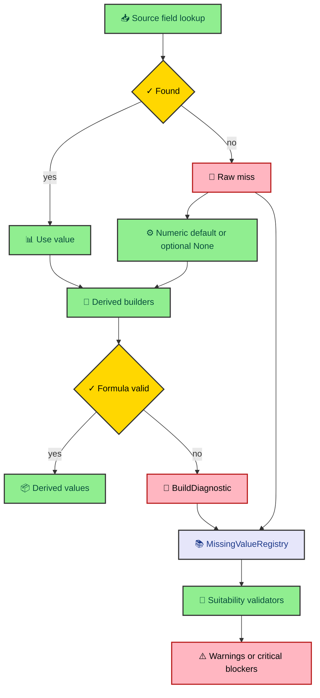

Defaults are useful until they start lying. A missing cash-flow field and a true zero can both look like `0.0` if the program only keeps the value. The engine avoids that trap by carrying missing-data context through the run, from source loading to derived formulas to model suitability checks.

---

## The two kinds of missing data

The engine records two categories of missing data. The first category is a source miss. That happens when the data loader asks yfinance for a field and receives no usable value. The second category is a derived miss. That happens when a formula cannot produce a meaningful result because its inputs are missing, zero, too small, or not applicable.

`MissingValueRegistry` keeps those categories in separate internal buckets named `_raw` and `_derived`. Consumers do not need to care about the buckets most of the time. They can iterate over the registry, group by model, or ask for a specific `(model, field)` pair. The split exists so the lifecycle stays clear.

Source misses are recorded during field loading. Derived misses are recorded after `StockMetrics._rebuild_derived()` runs. That order matches the actual build. First the system learns what the source did not provide. Then it learns which formulas could not work from the values it built.

The flow looks like this.

That diagram is the engine's safety net. Defaults let construction continue. Registry entries stop those defaults from becoming invisible.

---

## Why reasons matter

The registry does not only record field names. Each entry carries a `MissingReason`. The current reasons are `not_in_source`, `zero_denominator`, `insufficient_data`, `derived_failed`, and `not_applicable`.

Those labels are small, but they change how validators should behave. A value missing because yfinance did not expose it has a different meaning from a value that is mathematically undefined because the denominator is zero. A field marked not applicable should often produce a warning rather than a critical error.

That distinction shows up in DCF validation. The checker can ask the registry why a value is missing before assigning severity. Missing free cash flow is usually critical. A debt-related field for a debt-free company can be informational or a warning. Without a reason, the checker would either overblock good companies or let bad data pass too easily.

The same idea applies to derived metrics. `Valuation.build()` records when cost of debt looks unusable because a computed rate exceeds a sector ceiling. `Ratios.build()` records when PEG cannot be computed because no growth denominator is available. The value may still be set to `0.0`, but the registry remembers why.

---

## Build diagnostics preserve formula context

`BuildDiagnostic` is the bridge between domain builders and the missing-data registry. It contains the model name, field name, missing reason, and a human-readable detail string. `Valuation.build()` and `Ratios.build()` emit these diagnostics when derived values fall back or fail quality guards.

That keeps formula code from reaching into the registry directly. The domain builder can say what happened while building a value. The loader can later feed those diagnostics into the registry. The registry then becomes the shared diagnostic surface for validators and output.

One useful example is free cash flow CAGR. The engine avoids using tiny FCF bases because a small denominator can make growth explode. If annual FCF history contains values below the minimum scale, the valuation builder records a diagnostic instead of silently accepting a distorted CAGR.

Another example is capex normalization. If TTM capex is far above historical median capex, the engine can mark `capex_spike_detected` and compute `normalized_fcf`. The diagnostic explains why normalized FCF exists. Later, DCF validation and DCF execution both know how to treat that adjusted seed.

---

## Diagnostics change model behavior

The registry is not a report-only feature. It affects whether models run. `run_suitability_check()` passes the registry into each manager's `validate_metrics()` method. The checker can inspect missing fields, add weighted factors, and produce a `ValuationCheckResult`.

That result includes factors, severities, weights, a total severity score, and an interpretation. The CLI runner then compares the score to the skip threshold. If the score is too high, it records the model as skipped and preserves the reason in JSON.

This is where the pipeline becomes useful for readers. A skipped model is not a crash. It is a statement. The engine is saying the model is a poor fit for the available data or the company's current financial shape.

The JSON output includes the missing-data payload, suitability results, valuation reports that ran, skipped model reasons, and the final summary. That makes downstream consumers better off than they would be with one intrinsic value and no context.

---

## The discipline behind the design

The discipline is to never let a fallback erase the reason it happened. The program can use `0.0` as a practical construction default, but the analytical layer has to remember whether that zero came from source data, a failed formula, a zero denominator, a tiny sample, or a field that does not apply.

That makes the engine less fragile. It can keep running on imperfect source data while still telling the user where the output is weak. It also makes the test surface clearer. Tests can assert both the computed value and the diagnostic reason.

In valuation work, that honesty matters more than a polished number. The number is only useful when the system can explain what it ignored, substituted, downgraded, or refused to run.

---

## Reading diagnostics in practice

A registry entry has four useful pieces. The model tells you which domain area owns the field. The field tells you the exact attribute that failed. The reason tells you the category of failure. The detail explains the local cause in a sentence written for a human, not only for a log parser.

That combination helps when a validator produces a surprising result. Suppose DCF reports a critical cost-of-debt issue. You can inspect the registry entry for `Valuation.cost_of_debt` and see whether the source lacked interest expense, the company had no debt, or the computed value exceeded the sector ceiling. Those cases should not all carry the same meaning.

The registry summary is useful for broad reporting, but the precise lookup is what validators need. `registry.get(model, field)` gives a checker direct access to the first matching entry. `registry.has_missing_field(model, field)` gives a simpler yes-or-no path when the checker only needs to know whether the source was absent.

The design also preserves insertion order. That is helpful for diagnostics output because the order follows the build path. You can read the missing values in roughly the order the engine discovered them, which makes debugging feel less like reading a shuffled deck.

---

## Why the registry is per run

`MissingValueRegistry` is meant to be created once per metrics build. It should not be reused across tickers or repeated runs. The class documentation says that directly because stale diagnostics would be dangerous. A missing field from one ticker should never affect another ticker's suitability check.

This sounds obvious, but it is an easy mistake in long-lived services. A registry is state. If the engine later grows a web API, each request needs its own registry instance. The current CLI flow does the right thing by creating the registry inside `fetch_stock_metrics()` and passing it through the current run.

That per-run lifecycle also keeps JSON output clean. The missing-data payload describes the ticker that was just evaluated. It does not describe the application process, the cache, or any prior run.

The same lifecycle explains why derived diagnostics enter the registry only after `_rebuild_derived()`. Before that point, the engine does not yet know which formula-level misses occurred. After that point, the registry can represent both source loading and domain-building problems in one surface.

---

## What to test when this changes

Changes to diagnostics need tests at two levels. First, test the domain builder that emits the diagnostic. If a cost-of-debt guard is supposed to record `derived_failed`, the builder test should assert the field, reason, and detail. That catches formula policy drift.

Second, test the validator that consumes the diagnostic. If a not-applicable field should become a warning instead of a critical factor, the checker test should construct that registry state and assert the severity score. That catches interpretation drift.

The registry itself is intentionally simple, so it should not need clever tests. Its value is in the discipline it enables. Source loading records facts. Domain builders record formula failures. Validators turn those facts into model decisions. Output shows the result.
