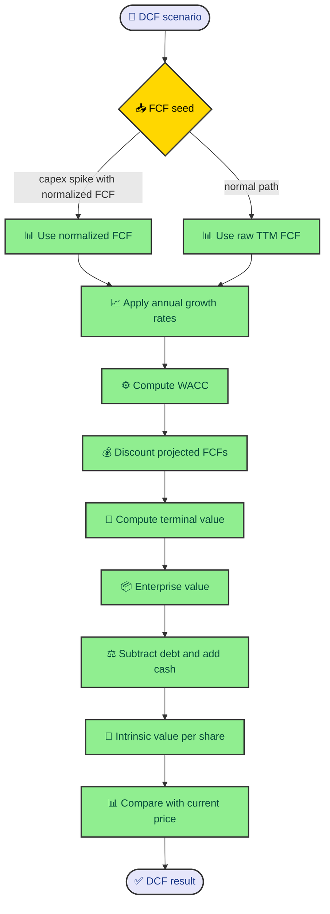

The engine supports several valuation methods, but the runner does not know each formula in detail. That is the point of the manager layer. Each model package hides its defaults, validation, and calculation behind the same contract, so the CLI can run a portfolio of models without becoming a pile of special cases.

---

## One interface for many formulas

`ValuationManager` defines the common shape. A manager can set valuation inputs, execute valuation scenarios, return default parameters, and validate metrics. The abstract class is small, but it gives the CLI the exact methods it needs.

The CLI owns a `VALUATION_MANAGERS` list. In the standard run, it includes DCF, P/E, ROE, EV/EBITDA, P/S, DDM, and NAV. When the user passes `--reverse-dcf`, the runner appends `ReverseDCFManager`.

Each manager receives the same `StockMetrics` object. Each manager creates or accepts parameters. Each manager exposes `validate_metrics()` and `execute_valuation_scenarios()`. That symmetry keeps orchestration boring, which is a compliment in a valuation engine.

The package layout reinforces the same idea. Most model packages have `defaults.py`, `handler.py`, `validator.py`, and `valuation.py`. Defaults load assumptions. The handler implements the manager. The validator decides fit. The valuation module performs the math.

---

## DCF as the deeper path

DCF shows the full pattern because it touches growth, WACC, free cash flow projections, terminal value, equity bridge, sensitivity, and implied WACC diagnostics. The manager itself stays thin. It resolves parameters, calls the checker, and delegates scenario execution to `execute_dcf_scenarios()`.

The valuation path starts by choosing the free-cash-flow seed. The normal seed is raw TTM free cash flow. If the valuation builder detected a capex spike and computed positive normalized FCF, DCF uses that normalized seed instead. The result records whether the seed was raw or normalized.

Next, DCF computes cost of equity through CAPM, then WACC through market cap, debt, cost of equity, cost of debt, and tax rate. With WACC in hand, it generates Bear, Base, and Bull growth paths. Each path produces projected free cash flows.

The forward DCF calculation discounts projected FCFs, computes a Gordon Growth terminal value, discounts that terminal value, and sums the pieces into enterprise value. Then it subtracts debt, adds cash, and divides by shares outstanding to get intrinsic value per share.

The central DCF execution path is easier to inspect as a workflow.

That workflow is formula-heavy, but it still follows the same manager boundary. The CLI does not need to know any of it.

---

## Multiples and asset models

The multiples models have shorter execution paths. EV/EBITDA applies a sector multiple to EBITDA, then bridges enterprise value to equity value by subtracting debt and adding cash. P/S applies sector price-to-sales assumptions to revenue. P/E projects EPS, applies a historical or target multiple, and discounts the future value back to present value.

ROE projects earnings from return on equity and shareholder distributions. DDM discounts projected dividends and terminal dividend value. NAV applies scenario haircuts to assets and subtracts liabilities. These models are different enough to deserve their own validators and report dataclasses.

The shared manager contract keeps those differences from leaking into the runner. The runner asks for suitability, then asks for scenarios. A report can contain `intrinsic_value_per_share`, `present_value`, or `intrinsic_value`, and the summary extractor knows how to pull scenario rows from those common result fields.

That gives the engine a practical extension path. Adding a model means adding a package that follows the manager shape, defining a report shape, registering a manager, and adding a presenter or JSON support if needed.

---

## Reverse DCF as a diagnostic

Reverse DCF flips the question. Instead of asking what the stock is worth under a growth assumption, it asks which constant FCF growth rate would make the DCF equal the current market price.

The solver chooses the same raw or normalized FCF seed logic as forward DCF. It computes WACC, then binary searches over a configured growth range. For each candidate growth rate, it runs a forward DCF calculation and compares the resulting intrinsic value with the current price.

After solving, the report compares implied growth with the engine's forward growth rate. The interpretation tells the user whether the market price appears to assume higher, similar, or lower growth than history suggests.

That is useful, but it is not the same as a forward valuation model. The runner excludes Reverse DCF from the composite intrinsic value. It can appear in JSON when requested, but it does not vote in the final average.

---

## Sensitivity and diagnostics

DCF also builds a sensitivity report. It derives WACC and terminal-growth spreads from beta and sector configuration, then produces a matrix of intrinsic values. Cells become `None` when WACC is less than or equal to terminal growth because Gordon Growth would be invalid.

That matrix helps readers see how much the result depends on discount rate and terminal growth. It also keeps invalid combinations visible instead of forcing a number where the math does not work.

The same diagnostic habit appears elsewhere. DCF exposes `fcf_seed_source` and the terminal-value FCF seed. Growth reports expose selected source and diagnostics. Reverse DCF exposes verification intrinsic value and verification error. These fields make the output less tidy, but more useful.

---

## What the manager layer buys

The manager layer gives the project a stable rhythm. Load metrics once. Create managers. Validate. Execute. Collect outcomes. Summarize. The formula details can grow without turning the CLI into a finance textbook.

That matters because valuation code changes over time. Sector multiples change. Growth assumptions change. Formula guards improve. A clean manager boundary lets those changes happen inside the model package while preserving the run contract.

The user sees a consistent run. The codebase keeps the formulas in their own rooms. Everybody breathes a little easier.

---

## Report shapes are part of execution

Each model returns a report dataclass rather than a loose dictionary. That gives the engine a stable shape for scenario results, parameters, and model-specific metadata. DCF returns scenarios, WACC, growth assumption, and sensitivity. P/E and ROE return scenarios and growth assumptions. EV/EBITDA and P/S return scenarios and the input metric they used.

Those report classes are more than serialization helpers. They define what the model promises to explain. If DCF uses normalized FCF, the result includes the seed source. If Reverse DCF solves implied growth, the result includes the verification intrinsic value and error percentage. If a model depends on a multiple, the result records the multiple used.

That discipline makes the JSON formatter simpler. It can recursively serialize dataclasses because the model modules already chose explicit fields. It also makes CLI presenters easier to write because each presenter receives a known report shape instead of a generic object.

When adding a field, ask whether it helps the reader audit the valuation. Intermediate values such as WACC, terminal value, selected multiple, or seed source usually help. Internal loop counters and helper-only values usually do not.

---

## Formula helpers keep math reusable

The calculations package holds reusable formula helpers. `safe_div()` and `safe_sum()` keep basic arithmetic tolerant of missing values. `compute_wacc()` centralizes WACC construction. `compute_discounted_cash_flow()` centralizes present value and terminal value calculation. `intrinsic_value_per_share()` guards against invalid share counts.

These helpers do not know about CLI output or suitability policy. They should stay small, direct, and testable. The valuation modules decide when to call them and how to interpret errors. That division keeps math reusable without turning helpers into mini managers.

The DCF helper returning both `DiscountedCashFlow` and `fcf_tv_seed` is a good example. The formula helper exposes a detail that matters for transparency. The model result can then carry that seed into reports. The helper does not decide how to display it.

This is the right level of sharing. Shared formulas live in calculations. Model orchestration lives in valuation modules. Run orchestration lives in the CLI.

---

## Failure behavior should stay boring

Model execution catches exceptions inside `run_valuation()`. If a model passes suitability but fails during execution, the runner records an errored skipped outcome instead of taking down the whole run. That behavior is practical because one model failure should not erase every other model's result.

The error still reaches output. `_skipped_models_payload()` includes the error string and the suitability context. That tells the user that the model was attempted and failed, which is different from failing suitability before execution.

This gives developers a useful debugging surface. A validation skip points toward checker policy or source quality. An execution error points toward formula assumptions, parameter defaults, or an unhandled edge case. The payload makes that distinction visible.

The rule to preserve is simple. Model modules should raise when a formula cannot proceed. The runner should catch at the model boundary and convert the failure into a structured outcome. That keeps one broken model from silencing the rest of the valuation run.
