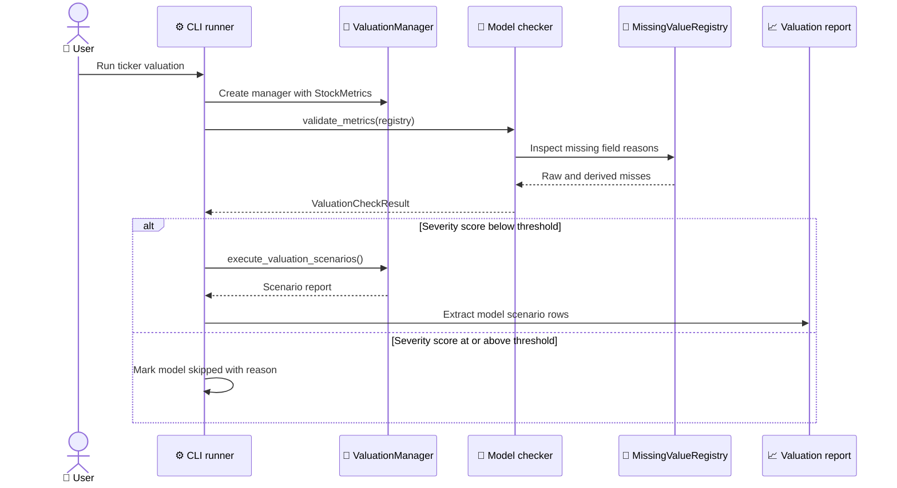

Every valuation method has a favorite kind of company. DCF wants credible cash flow and usable capital-cost inputs. P/E wants earnings and a sensible multiple. DDM wants dividends. The engine treats that as a runtime decision, so each model has to earn the right to produce a report for the current ticker.

---

## The check result contract

Suitability checks return a `ValuationCheckResult`. That object carries the ticker, a boolean `is_suitable`, a total severity score, an interpretation, and a list of `CheckFactor` entries. Each factor has a name, message, severity, weight, and optional value.

That contract keeps validation separate from execution. A checker can explain why a model is weak without trying to run the formula. The CLI can use the same result for logs, JSON, skipped-model payloads, and future presentation changes.

The policy types live in `domain/valuation/policies.py`. They are intentionally small. `FactorSeverity` has `CRITICAL`, `WARNING`, and `INFO`. `ValuationChecker` defines the `evaluate()` protocol. Concrete checkers implement the actual model logic.

The CLI runner treats the total score as the gate. In `run_valuation()`, it runs `validate_metrics()`, logs the factors, and skips the model if the score is greater than or equal to the threshold. The threshold is currently six.

---

## How a model passes or skips

The sequence is the same for each manager. The manager receives `StockMetrics`, the runner passes the missing-data registry into the checker, and the checker returns a result. If the score stays below the threshold, the manager executes scenarios. If not, the runner records a skipped outcome.

The important bit is that skipping is a first-class outcome. It travels into `ModelRunOutcome`, then into the skipped-model payload, then into JSON. That gives the user a readable answer instead of a missing key or a stack trace.

---

## DCF as the concrete example

DCF has the richest checker because it is sensitive to several assumptions at once. It checks free cash flow, profitability, cost of debt, tax rate, beta, market cap, capex spikes, and growth-stage risk. Some of those checks are hard blockers. Others become warnings.

The dual-negative free-cash-flow case shows why model-specific checks matter. If both TTM FCF and prior-year FCF are negative, a DCF that compounds from that base can produce output that is financially meaningless. The checker uses a hard-block sentinel in that case.

There is a careful exception. If the valuation builder detected an anomalous capex spike and computed positive normalized FCF, the checker downgrades the raw-FCF problem to a warning. That matches the valuation path, which uses normalized FCF as the projection seed. Blocking on raw FCF would contradict the model's own execution logic.

This is a good example of why the checker must know the domain, not only the formula. A generic "negative FCF means fail" rule would reject companies where the engine already has a more precise explanation.

---

## Different models need different gates

Each valuation method has a different failure mode. DDM should be cautious when dividends are missing or unstable. P/E should reject missing EPS or missing historical P/E. EV/EBITDA needs usable EBITDA and a sector multiple. P/S needs revenue and a configured multiple. NAV needs a balance sheet that makes asset-based valuation meaningful.

The shared manager contract makes those differences manageable. Each package follows the same rough shape with defaults, handler, validator, and valuation modules. The handler exposes `validate_metrics()` and `execute_valuation_scenarios()`. The validator owns model fit. The valuation module owns calculation.

That structure keeps the runner from knowing every rule. It only needs to know how to ask the manager whether it can run and how to collect the result afterward.

The result is a useful kind of symmetry. The models are not forced into the same validation logic, but they all return the same validation shape.

---

## Why skipped models belong in output

When a model skips, the run still learned something. A skipped DDM tells you the company does not fit a dividend model with the available data. A skipped P/E tells you earnings or historical multiples are not usable. A skipped DCF tells you cash-flow or capital-cost assumptions are too weak.

The engine records those outcomes because omission creates confusion. If a JSON consumer sees only four valuation models, it should not have to guess whether the other models failed, were disabled, or did not apply. The skipped-model payload answers that directly.

This also protects the consolidated summary. The composite intrinsic value uses models that produced Base-scenario intrinsics. It should not average in fake zeros from skipped models. It should also tell the user which models were left out and why.

That is the real job of the suitability gate. It does not make valuation certain. It makes the system honest about which tools it used.

---

## The score is a communication tool

The severity score is not a statistical truth. It is a compact communication tool. The weights tell the runner how much concern a factor should add, and the interpretation tells the user how to read that concern. That split matters because a raw score without a sentence is too easy to misread.

DCF uses small warning weights for softer concerns and larger critical weights for blockers. A high beta can make forecasts less reliable, but it does not automatically make DCF impossible. Missing or unusable cash flow can block the model because the formula has no credible base to project from.

The hard-block sentinel for dual-negative FCF is intentionally loud. It tells the runner to stop rather than continue stacking smaller factors. That makes sense because the problem is structural. If both current and prior-year FCF are negative and no normalized substitute exists, the DCF model does not have a meaningful positive cash-flow base.

The capex-spike exception proves why scores need domain context. A raw negative FCF value caused by one unusual investment cycle is different from persistent cash burn. The checker can downgrade the concern only because the domain builder already detected the spike and produced normalized FCF.

---

## How to add a checker safely

A new checker should start from the model's economic requirements, not from available fields. Ask what must be true for the model to produce a meaningful estimate. Then map those requirements to `StockMetrics` fields and registry entries.

For example, a model that depends on book value should check total equity, shares outstanding, and any derived book-value fields it uses. A model that depends on revenue multiples should check revenue, sector mapping, and configured multiples. A model that depends on dividends should check dividend history and payout behavior.

After that, decide which failures are critical, which are warnings, and which are informational. A missing value can be critical for one model and irrelevant for another. That is why the checker belongs beside the model rather than in one global validation file.

Tests should cover three paths. The clean path should produce a low score. The warning path should run but explain risk. The blocking path should skip and produce a clear interpretation. If a checker consumes registry reasons, tests should include different reasons for the same field.

---

## The runner stays simple

The runner's job is intentionally small. It logs the factors, compares the score to the threshold, executes the model if allowed, and captures the outcome. It does not interpret individual factors. It does not know that DCF has a capex-spike exception or that DDM needs dividends.

That division is what lets the engine grow. Model packages can change their own checks without rewriting the CLI loop. The CLI can change output modes without rewriting model policy. JSON can include every suitability result because they all share the same dataclass shape.

This is the pattern to preserve. Put model knowledge in the checker. Put orchestration in the runner. Put final explanation in the output payload. The code stays easier to test because each layer has one job.

---

## The useful failure mode

A good suitability gate should fail in a way the user can act on. "DCF skipped" is not enough. "DCF skipped because both TTM and prior-year FCF are negative, and no positive normalized seed is available" gives the user a next step. They can choose another model, inspect cash-flow data, or decide the company is outside the model's useful range.

That is why factor messages should name the business issue, not only the field. A missing field is a data problem. A model that depends on that field is an analytical problem. The checker is the place where those two facts meet.

This also helps future UI work. A terminal log, JSON consumer, or web article can all show the same factor message. Clear checker messages reduce the need for every presenter to invent its own explanation.
