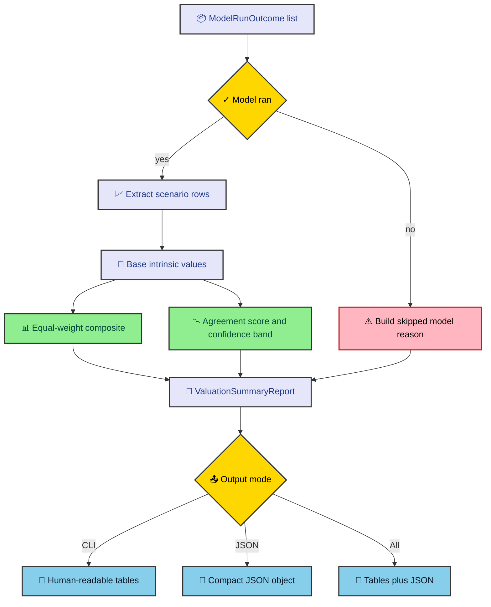

A valuation run needs detail and a usable final answer. Too much detail and the user gets lost in model internals. Too little detail and the final number becomes a black box. The engine handles that by collecting every model outcome, extracting comparable scenario rows, and building one summary beside the full reports.

---

## Outcomes are collected first

`run_for_ticker()` is the center of the output path. After it builds `StockMetrics`, it loops over the registered managers. For each manager, it calls `run_valuation()`, stores a `ModelRunOutcome`, and then sorts the model into either `models_run` or `models_skipped`.

That outcome object carries the model name, suitability result, valuation report, skip flag, and optional error. It is deliberately broader than a valuation report. A failed or skipped model still has information the user needs.

Successful reports are then reduced into `ModelScenarioRow` entries. The extractor looks for a `scenarios` attribute and reads each scenario result. It accepts common intrinsic fields such as `intrinsic_value_per_share`, `present_value`, or `intrinsic_value`.

This keeps the summary layer model-aware enough to compare results without becoming a second formula implementation.

---

## The summary math

`ValuationSummaryReport.build()` receives all scenario rows, the current price, models that ran, and models that skipped. It then computes the composite view from Base scenario intrinsics.

The composite intrinsic value is an equal-weight average of Base intrinsics from models that ran. If only one model ran, the agreement score is zero and the confidence band collapses to that model's value. If multiple models ran, the report computes standard deviation across Base intrinsics.

The model agreement score is that standard deviation divided by current price. Lower means the models broadly agree. Higher means the output is dispersed and deserves more caution. The confidence band is the composite plus or minus the raw standard deviation.

The summary also computes implied upside from the composite intrinsic value and current price. Then it writes a note that explains how many models ran, what the composite says, and whether agreement is low.

The path from outcomes to output looks like this.

The summary is not trying to hide disagreement. It is trying to make disagreement measurable.

---

## Skipped models stay visible

Skipped models become a dictionary keyed by model name. Each entry includes the reason, total severity score, suitability boolean, and any execution error. That payload is built from `ModelRunOutcome`, so it can represent both validation skips and runtime failures.

This is important for machine-readable output. If a downstream consumer receives JSON without a DDM report, it should know whether dividends were missing, validation failed, or the model was never requested. The skipped-model payload answers that directly.

It also protects the composite. Skipped models do not contribute fake zeros. They remain visible beside the composite instead of corrupting it.

That sounds small, but it is one of the engine's better habits. Missing output should have an explanation. Silent absence is where bad dashboards are born.

---

## CLI and JSON have different jobs

The CLI output is for a human scanning a terminal. Model presenters print compact tables and the summary presenter prints the consolidated view. This mode favors readability. It helps a user inspect one run without parsing nested objects.

The JSON output is for tools. `_build_json_payload()` assembles ticker, stock metrics, missing data, suitability, valuations, skipped models, and summary. The JSON formatter recursively converts dataclasses, enums, lists, tuples, and dictionaries. It rounds floats and excludes `historical_data`, which can contain large price series that helped build derived values but add little to the final payload.

The `--all` mode prints CLI tables first, then a final labeled JSON document. That gives a human-friendly view and a copyable machine-readable result in one run.

Keeping these paths separate avoids a common mistake. Human tables should not define the data contract. JSON should not be formatted like a terminal report. Both outputs consume the same structured run result.

---

## What the final answer means

The composite intrinsic value is a synthesis. It is not a verdict. Equal-weight averaging is simple and readable, but it assumes each successful Base scenario deserves the same vote. That is defensible as a starting point, not a law of finance.

The agreement score helps balance that simplicity. If models cluster tightly, the composite is easier to trust. If models spread widely, the note warns the user to interpret the result carefully. Wide dispersion can mean the company is hard to model, the assumptions conflict, or some model is technically eligible but economically weak.

The missing-data payload and suitability results are part of that interpretation. A composite built from several models with clean checks means something different from a composite built from one surviving model after several skips.

That is why the output path keeps so much context. The final number matters, but it should never arrive alone.

---

## A compact contract

The engine's output contract can be summarized as one idea. Every run should tell the user what it knew, what it doubted, what it skipped, what it calculated, and how the surviving models compared.

That contract gives the CLI and JSON modes a shared backbone. It also gives future features a place to attach. A web UI, report export, or API endpoint can read the same payload without duplicating model logic.

Good valuation software should resist false certainty. This output layer does that by making the summary readable, the details inspectable, and the weak spots hard to miss.

---

## Why Base drives the composite

The summary uses Base scenario intrinsics for the composite because Base is the model's central case. Bear and Bull are useful for range reading, but averaging all three scenarios from every model would mix scenario dispersion with model dispersion. Those are different questions.

Model dispersion asks how much the methods disagree under their central case. Scenario dispersion asks how sensitive each method is to assumption changes. The current summary focuses on model dispersion. DCF sensitivity and scenario reports still preserve the scenario range for readers who want it.

That choice keeps the composite easier to explain. If five models produce Base values, the composite is the equal-weight average of those five central values. The agreement score then says how spread out those five values are relative to current price.

There are other defensible approaches. The engine could weight models by suitability score, sector relevance, or analyst preference. It could compute a trimmed mean. It could exclude models with low confidence. Those changes would need a clear policy, tests, and output fields that explain the weighting. Equal weight is simple enough to audit today.

---

## JSON as an integration surface

The JSON payload is intentionally wider than the final summary. It includes `stock_metrics`, `missing_data`, `suitability`, `valuations`, `skipped_models`, and `summary`. That gives another tool enough context to decide what to display or store.

For example, a dashboard might show the composite first, then let a user expand suitability factors. A batch job might store skipped-model reasons separately for data-quality reporting. A notebook might compare DCF sensitivity against the agreement score. None of those consumers should need to scrape terminal tables.

The formatter excludes `historical_data` because it can contain long price arrays. Those arrays matter during build time, but they are rarely helpful in the final JSON result. Keeping them out reduces payload size and keeps the response focused on fields a consumer can act on.

The recursive dataclass conversion also makes report evolution less painful. If a model adds a dataclass field, JSON can usually include it without custom serialization work. That is another benefit of using explicit report models rather than ad hoc dictionaries.

---

## What to verify after output changes

Output changes should be tested at the summary and CLI layers. Summary tests should cover no-model, one-model, and multi-model cases. The no-model case should produce a clear note and no composite. The one-model case should create a collapsed confidence band. The multi-model case should compute agreement and implied upside correctly.

CLI or integration tests should confirm that JSON contains skipped models, suitability results, missing data, valuations, and summary. They should also confirm that Reverse DCF appears only when requested and does not enter the composite.

Build checks matter too because the journal renders these outputs as documentation. If a field is renamed in code, this vault should change with it. Documentation that describes an old JSON contract is worse than no documentation because it trains readers to trust the wrong shape.

The output layer is where the engine meets users. Keep it plain, structured, and honest about what happened upstream.
