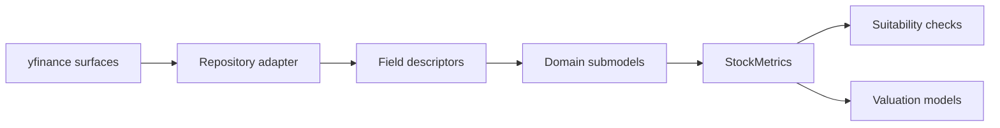

import Callout from "@components/ui/display/Callout.astro";

A missing cash-flow row can become `0.0` inside a typed model. If you see only the zero, you cannot tell whether the company generated nothing, the provider omitted the row, or a calculation failed. This engine keeps selected failure reasons beside the values, which is essential because every valuation is only as interpretable as its inputs.

---

## The provider is not the domain model

yfinance speaks in provider labels, tables, and history objects. A valuation model needs financial concepts such as trailing revenue, diluted shares, total debt, free cash flow, and book equity. The repository boundary separates those vocabularies.

`FinancialRepository` defines the reads needed by the application. The yfinance adapter implements them. `MetricsLoader` asks for values through descriptors and builds `StockMetrics`, the shared aggregate passed to all valuation managers. Formula code therefore does not search provider tables or remember source labels.



This boundary improves testability and makes a future provider adapter possible. It does not make yfinance data authoritative. The normalized object can be consistently wrong when a source label is absent, a unit is unexpected, or periods do not align.

---

## What yfinance surfaces the engine reads

The adapter builds one raw container for a ticker and reads several source surfaces. Those include `info`, `fast_info`, annual and quarterly income statements, balance sheets, cash-flow statements, and five years of price history. EPS history is derived separately.

Each required surface is fetched and reused during the run. Describing that as one network request would be inaccurate. Provider libraries can perform distinct calls behind properties, and one surface can fail while another succeeds.

The source tree maps labels for company identity, currencies, sector, price, market capitalization, beta, shares, statement values, and histories. The mapper owns provider vocabulary. Domain dataclasses own the shape that calculations use.

For serious analysis, compare normalized values with the issuer's filings. The [SEC guide to reading financial statements](https://www.sec.gov/files/beginners-guide-to-financial-statements.pdf) explains the relationship among the income statement, balance sheet, cash-flow statement, and shareholder equity statement.

---

## How fields become StockMetrics

Descriptors tell the loader which source label, statement, action, and period belong to a field. Actions include latest values, trailing values, prior trailing values, and series. Labels and enum fields follow their own mapping paths.

The loader assembles domain submodels for company facts, income, cash flow, balance sheet, market data, valuation metrics, and ratios. It then attaches historical companions and rebuilds derived metrics. The final aggregate gives every model one consistent interface.

| Source idea | Domain field | Example | Main consumers |
| --- | --- | ---: | --- |
| Current share price | `current_price` | $50 | Summary and price comparison |
| Diluted shares | `shares_outstanding` | 100 million | Per-share conversions |
| Trailing revenue | `revenue_ttm` | $2 billion | P/S and ratios |
| Operating cash flow | `operating_cf_ttm` | $350 million | Free-cash-flow build |
| Capital expenditure | `capex_ttm` | $100 million | Free-cash-flow build |
| Total debt | `total_debt` | $600 million | WACC and equity bridge |
| Cash | `cash_and_equivalents` | $200 million | Equity bridge |

Free cash flow is derived from operating cash flow and capital expenditure. If either input is absent, a zero alone would conceal the path. The diagnostic registry gives validators more context.

---

## TTM, annual, quarterly, and historical data

TTM combines the most recent four quarters. It provides a current operating view when the last fiscal year is already old. Latest quarterly balance-sheet values describe a point in time. Annual histories can smooth one quarter's noise and support growth calculations.

These periods are not interchangeable. Revenue TTM covers an interval, while cash and debt from a quarterly balance sheet describe one date. Price history uses trading dates. EPS history in the audited code is annual and short. Pairing those sources requires deliberate alignment.

The P/E issue shows what happens when period meaning is lost. The current helper zips daily closing prices with annual EPS observations by list position. It truncates to the shorter series but does not align dates. The resulting ratios can be numerically valid and economically unrelated.

Historical series are also treated as optional in several loader paths. Their absence may not enter the missing registry. A model that relies on history deserves a direct check of length, period, and alignment rather than an assumption that normalization already proved them.

---

## Raw misses and derived failures

`MissingValueRegistry` separates raw source misses from derived failures. A raw miss says the requested numeric source field was unavailable. A derived diagnostic says a formula could not produce a meaningful value after construction.

Reasons include `not_in_source`, `zero_denominator`, `insufficient_data`, `derived_failed`, and `not_applicable`. Those labels let a checker distinguish a missing debt field from a debt-free company and an unavailable ratio from a mathematically undefined one.

```text
raw
  CashFlow.operating_cf_ttm
  reason  not_in_source

derived
  Valuation.free_cash_flow_cagr
  reason  insufficient_data
  detail  history cannot support a stable growth calculation
```

Derived builders emit `BuildDiagnostic` records rather than mutating the registry directly. The loader collects them after rebuilding valuation and ratio objects. This keeps formula code responsible for explaining failure while the registry owns storage and lookup.

---

## Why some defaults are zero

Numeric defaults let `StockMetrics` finish construction when a provider field is absent. That allows validators to produce a readable skip instead of a stack trace. It also creates a risk because `0.0` is both a legitimate value and a placeholder.

The registry carries the distinction when the miss is covered. Validators can ask for the reason before choosing severity. A debt-free business should not be punished as though the provider failed to report debt. Missing free cash flow can block DCF because the model's central input is unknown.

Defaults are a continuity mechanism, not imputation. They do not estimate the missing economic value. Any downstream formula that consumes a zero must either understand its reason or accept the possibility of a misleading result.

---

## What the registry does not record

<Callout variant="information" title="Diagnostic scope">
  <p>The registry preserves many important numeric and derived failures, not every absence. Label and enum misses can return None without entries. Optional historical series may also remain unrecorded.</p>
</Callout>

Some failures stop construction. Market data rejects missing or non-positive shares, and a failed top-level metrics build exits the CLI. That is different from a model skip because no trustworthy per-share valuation can be built without a valid share count.

The practical rule is simple. Absence from `missing_data` does not prove completeness. Inspect the metrics required by the model, especially labels, currency, sector policy, and historical series.

---

## How one missing field changes several models

Missing shares can stop the whole run. Missing revenue weakens P/S and ratios. Missing EBITDA blocks EV/EBITDA. Missing free cash flow affects DCF and Reverse DCF. Missing dividends should skip DDM. Missing book equity weakens ROE and can change balance-sheet interpretation.

Debt and cash flow through several paths. They affect enterprise-to-equity bridges, capital structure, cost of capital, and per-share estimates. A single raw issue can therefore create several warnings. Do not count repeated warnings as independent evidence of poor quality.

Trace one problem from its source field into derived metrics, suitability factors, and valuation reports. The JSON document is useful here because those layers remain in one payload. The extension article later shows the source contracts behind that trace.

---

## The currency boundary that still needs work

<Callout variant="caution" title="Use matching currencies">
  <p>The engine records financial and trading currency labels, but the valuation path does not call the existing currency service. Statement values and share prices can therefore be combined without conversion.</p>
</Callout>

The worked examples avoid the problem by using US dollars for both statements and trading. Real international listings may not. A million units of reporting currency cannot be compared with a dollar share price until the amounts share a currency and an appropriate conversion date.

This is a useful extension target because it crosses the data boundary, domain model, diagnostics, and tests. Until it is connected, same-currency selection belongs in the pre-run checklist.

Once inputs are credible enough to use, uncertainty moves to the next layer. Historical growth, sector defaults, discount rates, and scenario limits are evidence and policy, not facts. The next article shows how the engine turns them into forward paths.

---

## Audit one metric from source to model

Free cash flow is a useful audit because it crosses several layers. Begin with the issuer's cash-flow statement. Identify operating cash flow and capital expenditure for the same period. Confirm the provider's sign convention. Some sources report capital spending as a negative outflow, while a formula may expect a positive magnitude to subtract.

```text
source review
  operating cash flow label
  operating cash flow period
  capital expenditure label
  capital expenditure period
  source sign convention
  source currency

domain review
  operating_cf_ttm
  capex_ttm
  free_cash_flow_ttm
  normalized_fcf
  capex_spike_detected

consumer review
  DCF suitability
  Reverse DCF suitability
  DCF seed source
  scenario report
```

Suppose operating cash flow is $350 million and the provider returns capex as negative $100 million. If the mapper or formula assumes a positive magnitude, blindly subtracting negative capex produces $450 million rather than $250 million. The resulting DCF can look polished while starting 80 percent too high.

Check the derived diagnostic after verifying signs. A capex-spike flag should correspond to a visible historical pattern and a documented normalization rule. If normalized free cash flow becomes the seed, the report should say so. The validator and execution path should agree about that choice.

Repeat the exercise for shares outstanding. Confirm whether the field is basic, diluted, or a current market count. A mismatch between total equity value and share definition directly changes per-share value. Unlike a small ratio difference, this error can affect every model at once.

Revenue provides a period audit. Compare TTM revenue with the sum of the four quarters and with the latest annual statement. Differences may be valid when the fiscal year has moved forward. They may also reveal duplicate quarters, restatements, or unit changes.

Debt and cash provide a point-in-time audit. Use values from compatible balance-sheet dates. Confirm whether debt includes current maturities and leases under the project's definition. Confirm whether restricted cash should be treated like available cash in the enterprise-to-equity bridge.

The engine cannot answer all of these accounting questions from one provider schema. Its contribution is to give each answer a stable place in the pipeline and to preserve selected failures. The analyst still owns semantic verification.

---

## Design a provider correction test

When a mapped field is wrong, add a fixture that reproduces the source shape before changing the mapper. Assert the raw label, action, period, normalized value, and missing-data behavior. Then add a higher-level test showing the corrected metric in `StockMetrics`.

```python
def test_capex_sign_is_normalized_for_free_cash_flow():
    repository = FakeRepository(
        operating_cash_flow_ttm=350_000_000,
        capex_ttm=-100_000_000,
    )

    metrics, missing = MetricsLoader(repository).load("SAMPLE")

    assert metrics.cash_flow.free_cash_flow_ttm == 250_000_000
    assert not missing.has("CashFlow", "free_cash_flow_ttm")
```

The exact APIs may differ from this teaching sketch. The test intention is stable. One test proves source normalization, another proves domain construction, and valuation tests prove downstream behavior. That layered evidence makes a provider correction safer than patching the final formula.
