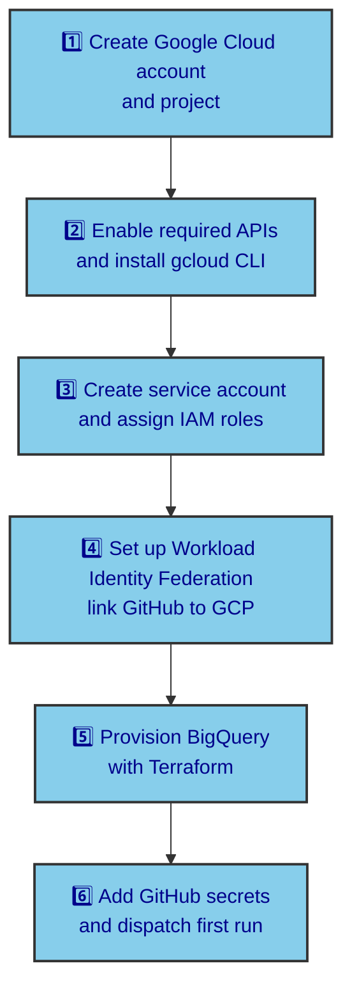
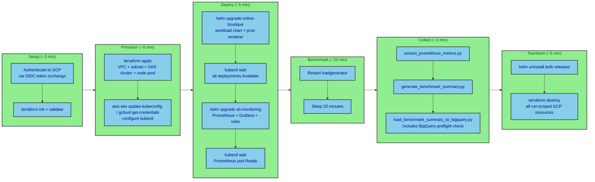

Most cloud setup guides start at the point where you already have a project, a billing account, a service account, and somehow already understand Workload Identity Federation. This one doesn't. If you've never opened the Google Cloud console and you want SiliconBoutique running fully automated benchmark jobs on GCP by the end, this is the guide. Every command is spelled out, every IAM concept is explained before you're asked to use it, and by the last section you'll have a workflow that provisions a GKE cluster, collects performance metrics, and stores results in BigQuery without a single manual step.

---

## The overall setup path

Before touching any command, it helps to see the full picture. There are five distinct setup stages, and each one builds on the previous. Skipping ahead typically means backtracking.



Stages 1 through 4 are one-time setup steps. Stage 5 provisions the durable BigQuery table and only needs to run once unless you want to change the dataset location or table schema. Stage 6 is what you repeat every time you want a benchmark run.

---

## Stage 1: Creating your Google Cloud account and project

### Create the account

Go to [cloud.google.com](https://cloud.google.com) and click **Get started for free**. Google offers a 90-day free trial with $300 in credits, which is more than enough to run several benchmarks on spot VMs.

You need a Google account to sign up. If you already have a Gmail account, use that. During registration, Google asks for a credit card to verify your identity. You won't be charged during the free trial, and you won't be charged after it ends unless you explicitly upgrade to a paid account. Keep that in mind before you enter your card details.

Once registration completes, you land in the Google Cloud console. The URL looks like `console.cloud.google.com`. Keep this tab open throughout the setup.

### Create a project

Google Cloud organizes everything inside projects. A project is the billing and permissions boundary for all the resources you create. SiliconBoutique needs one project to hold the ephemeral GKE benchmark clusters and the durable BigQuery history table.

In the console, click the project selector dropdown at the top of the page. It might say "Select a project" or show an existing project name.

**Important:** Google Cloud may have automatically created a default project for you during account setup. If you see an existing project listed, inspect it first. If you're comfortable using that auto-created project (most users are), note its Project ID and skip to the next section. Otherwise, proceed to create a new one.

To create a new project, click **New Project**.

Fill in the fields:

- **Project name** — something like `silicon-boutique` or `my-benchmarks`. This is just a display name.
- **Project ID** — GCP auto-generates one from your project name. You can edit it, but once you create the project the ID is permanent. Choose something memorable because you'll type it in many commands. A format like `silicon-boutique-yourname-2026` works well. The ID must be 6 to 30 characters, lowercase letters, numbers, and hyphens only, and must start with a letter.
- **Organization** — leave as "No organization" if you're working from a personal account.

Click **Create**. After a few seconds the console switches into your chosen project.

Write down your project ID. You'll need it frequently.

### Link a billing account

APIs and cluster creation won't work until billing is enabled on the project, even during the free trial.

In the console, open the navigation menu (the three horizontal lines in the top left), go to **Billing**, then click **Link a billing account**. If you just created your account, you'll have one billing account available from registration. Select it and click **Set account**.

You can confirm billing is active by running this command after installing `gcloud` in the next stage.

```bash
gcloud beta billing projects describe YOUR_PROJECT_ID
```

The field `billingEnabled` should show `true`.

---

## Stage 2: Enable required APIs and install the gcloud CLI

### APIs you need to enable

Google Cloud APIs are disabled by default on a new project. SiliconBoutique uses seven of them. Enable them all now so you don't hit "API not enabled" errors mid-setup.

When searching for APIs in the Google Cloud console, always look for the full service name listed below. The search interface may return multiple results with similar names—use the API ID (the `googleapis.com` identifier) to confirm you're enabling the correct one.

| API ID                                | Full service name                        | What it powers                                        |
| ------------------------------------- | ---------------------------------------- | ----------------------------------------------------- |
| `compute.googleapis.com`              | Compute Engine API                       | VPC networks and subnets for GKE                      |
| `container.googleapis.com`            | Kubernetes Engine API                    | GKE cluster and node pool creation                    |
| `iam.googleapis.com`                  | Identity and Access Management (IAM) API | Service account and role management                   |
| `iamcredentials.googleapis.com`       | Service Account Credentials API          | Workload Identity token exchange                      |
| `sts.googleapis.com`                  | Security Token Service API               | Security Token Service (required for OIDC federation) |
| `bigquery.googleapis.com`             | BigQuery API                             | Durable benchmark summary storage                     |
| `cloudresourcemanager.googleapis.com` | Cloud Resource Manager API               | Project metadata, used by Terraform                   |

**To enable via console:** Go to **APIs & Services** > **Library**. For each API above, search by the API ID (e.g., `compute.googleapis.com`). The search results may show several options—select the one whose full name matches the table above, then click **Enable**.

**To enable via command line:** Use the single command below once `gcloud` is installed (easier and less error-prone).

### Install and configure the gcloud CLI

The `gcloud` CLI is how you manage GCP resources from your terminal or the devcontainer. If you're working inside the SiliconBoutique devcontainer, the Google Cloud SDK is already installed. Verify it with:

```bash
gcloud version
```

If you're working on your own machine, follow the [gcloud CLI installation guide](https://cloud.google.com/sdk/docs/install) for your OS. On macOS it's a package download. On Linux, a curl script handles it.

After installation, initialize the CLI and log in:

```bash
gcloud init
```

The `init` command walks you through logging in with your Google account and selecting your project. When it asks you to choose a project, pick the one you created (or validated) in Stage 1. When it asks about a default compute region, enter `us-central1`.

After `init` completes, run one more login command that provides application default credentials. Terraform uses these when you run it locally.

```bash
gcloud auth application-default login
```

A browser window opens and asks you to authorize the SDK. Click **Allow**. This writes a credentials file to `~/.config/gcloud/application_default_credentials.json`.

Now enable all the required APIs in a single command. Replace `YOUR_PROJECT_ID` with your actual project ID.

```bash
gcloud services enable \
  compute.googleapis.com \
  container.googleapis.com \
  iam.googleapis.com \
  iamcredentials.googleapis.com \
  sts.googleapis.com \
  bigquery.googleapis.com \
  cloudresourcemanager.googleapis.com \
  --project YOUR_PROJECT_ID
```

This takes about 30 seconds. You'll see each API listed as it enables. If you get an error about billing not being enabled, go back and complete the billing setup from Stage 1 first.

---

## Stage 3: Create the service account and assign IAM roles

### What a service account is

A service account is an identity that a program uses to authenticate to Google Cloud APIs. Unlike a human account, it doesn't have a password or a browser login. Instead, programs prove their identity by holding a short-lived token issued by Google. The GitHub Actions workflow acts as this program during benchmark runs.

The service account you create here will be granted exactly the permissions SiliconBoutique needs, nothing more.

### Create the service account

```bash
gcloud iam service-accounts create silicon-boutique-sa \
  --display-name="SiliconBoutique Benchmark Runner" \
  --project YOUR_PROJECT_ID
```

This creates the account. Its full email address will be `silicon-boutique-sa@YOUR_PROJECT_ID.iam.gserviceaccount.com`. You'll use this email in several commands, so store it in a variable to avoid typing it repeatedly.

```bash
SA_EMAIL="silicon-boutique-sa@YOUR_PROJECT_ID.iam.gserviceaccount.com"
PROJECT_ID="YOUR_PROJECT_ID"
```

### Assign IAM roles

The service account needs four roles to run benchmarks and load results into BigQuery.

**Compute Admin** lets the account create and delete GKE clusters, node pools, VPCs, and subnets during each run.

```bash
gcloud projects add-iam-policy-binding $PROJECT_ID \
  --member="serviceAccount:$SA_EMAIL" \
  --role="roles/compute.admin"
```

**Kubernetes Engine Admin** grants control over GKE operations.

```bash
gcloud projects add-iam-policy-binding $PROJECT_ID \
  --member="serviceAccount:$SA_EMAIL" \
  --role="roles/container.admin"
```

**Service Account User** allows the account to act as itself when creating clusters.

```bash
gcloud projects add-iam-policy-binding $PROJECT_ID \
  --member="serviceAccount:$SA_EMAIL" \
  --role="roles/iam.serviceAccountUser"
```

**BigQuery Job User** allows it to submit queries and load jobs.

```bash
gcloud projects add-iam-policy-binding $PROJECT_ID \
  --member="serviceAccount:$SA_EMAIL" \
  --role="roles/bigquery.jobUser"
```

Verify the bindings with:

```bash
gcloud projects get-iam-policy $PROJECT_ID \
  --flatten="bindings[].members" \
  --filter="bindings.members:serviceAccount:$SA_EMAIL"
```

You should see four role entries.

---

## Stage 4: Set up Workload Identity Federation (link GitHub to GCP)

### What Workload Identity Federation is

In a traditional setup, you'd create a long-lived key for the service account and store it as a GitHub secret. Every time the workflow runs, it uses that key to authenticate. Keys are static credentials, and static credentials are a security liability—if someone finds the key, they can impersonate the service account forever.

Workload Identity Federation (WIF) is a better approach. Instead of storing a key, GitHub Actions gets a short-lived token from Google that's valid for exactly one workflow run. The token is tied to a specific GitHub repository, branch, and workflow, and expires in hours. This reduces the blast radius if a token is leaked.

### Create the Workload Identity Provider

A Workload Identity Provider is the bridge. It tells Google: "I trust tokens from GitHub Actions in _this_ repository, issued for _this_ GitHub repository context. Exchange them for short-lived GCP service account tokens."

Create the workload identity pool first:

```bash
gcloud iam workload-identity-pools create "github-pool" \
  --project=$PROJECT_ID \
  --location="global" \
  --display-name="GitHub Actions pool"
```

Now create the provider inside that pool. This is where you specify which GitHub repository can authenticate.

```bash
gcloud iam workload-identity-pools providers create-oidc "github-provider" \
  --project=$PROJECT_ID \
  --location="global" \
  --workload-identity-pool="github-pool" \
  --display-name="GitHub provider" \
  --attribute-mapping="google.subject=assertion.sub,assertion.aud=assertion.aud,assertion.repository=assertion.repository" \
  --issuer-uri="https://token.actions.githubusercontent.com" \
  --attribute-condition="assertion.repository == 'GITHUB_OWNER/GITHUB_REPO'"
```

**Replace:**

- `GITHUB_OWNER` with your GitHub username (e.g., `octocat`).
- `GITHUB_REPO` with your repository name (e.g., `silicon-boutique`).

The attribute condition is case-sensitive. It must match your GitHub URL exactly, in lowercase, in the format `owner/repo`.

Retrieve the full provider resource name (you'll need this for GitHub secrets):

```bash
gcloud iam workload-identity-pools providers describe "github-provider" \
  --project=$PROJECT_ID \
  --location="global" \
  --workload-identity-pool="github-pool" \
  --format="value(name)"
```

Save this output. It looks like `projects/PROJECT_NUMBER/locations/global/workloadIdentityPools/github-pool/providers/github-provider`. You'll need it in Stage 6.

### Grant the provider permission to impersonate the service account

The provider can now validate GitHub tokens, but it can't use them to impersonate the service account yet. Grant that permission:

```bash
gcloud iam service-accounts add-iam-policy-binding $SA_EMAIL \
  --project=$PROJECT_ID \
  --role="roles/iam.workloadIdentityUser" \
  --principal="principalSet://goog/workload-identity-pool/github-pool/attribute.repository/GITHUB_OWNER/GITHUB_REPO"
```

**Replace** `GITHUB_OWNER/GITHUB_REPO` with the same owner and repo name from above.

Verify the binding:

```bash
gcloud iam service-accounts get-iam-policy $SA_EMAIL \
  --project=$PROJECT_ID
```

You should see one binding for `principalSet://goog/workload-identity-pool/...`.

---

## Stage 5: Provision BigQuery with Terraform

### What this stage does

This stage creates the BigQuery dataset and benchmark summary table that stores your results. It uses Terraform to define the resources as code so they can be versioned and recreated if needed.

Before running Terraform, create a secure environment file to manage your credentials. This is a best practice that keeps sensitive values out of shell history and makes scripts more portable.

### Create a credential environment file

In the root of the SiliconBoutique repository, create a file named `credential.env`:

```bash
# credential.env
# Source this file before running Terraform or GCP commands
# NEVER commit this file to version control

export PROJECT_ID="YOUR_PROJECT_ID"
export GCP_SERVICE_ACCOUNT="silicon-boutique-sa@YOUR_PROJECT_ID.iam.gserviceaccount.com"
```

Replace the values with your actual project ID and service account email (from Stage 3).

**Important:** Add `credential.env` to your `.gitignore` to prevent accidental commits:

```bash
echo "credential.env" >> .gitignore
```

### Load the environment file and run Terraform

Before running Terraform, load your environment file. This approach keeps credentials out of your shell history:

```bash
# Load the environment file
set -a
source credential.env
set +a

# Verify the variables are loaded
echo "PROJECT_ID: $PROJECT_ID"
echo "GCP_SERVICE_ACCOUNT: $GCP_SERVICE_ACCOUNT"
```

Now initialize Terraform:

```bash
cd infra/terraform/gcp-bigquery
terraform init
```

Terraform downloads the Google Cloud provider and prepares the workspace. This completes quickly.

Validate the configuration:

```bash
terraform validate \
  -var="project_id=$PROJECT_ID"
```

If validation passes, apply the configuration to create the BigQuery dataset and table:

```bash
terraform apply -auto-approve \
  -var="project_id=$PROJECT_ID" \
  -var="summary_writer_service_accounts=[\"$GCP_SERVICE_ACCOUNT\"]" \
  -var="static_validation_mode=false"
```

This command does three things:

1. **Creates the BigQuery dataset** named `silicon_boutique` in the US region.
2. **Creates the benchmark summary table** named `benchmark_summaries` with the schema defined in the Terraform module.
3. **Grants your service account two permissions on the dataset:**
   - `roles/bigquery.jobUser` at the project level (permission to run queries and load jobs).
   - `roles/bigquery.dataEditor` on the dataset (permission to create, read, and delete tables).

The second grant is critical. It allows the workflow to create and delete the scratch table used during the BigQuery preflight check (a step that verifies write access before attempting to load the full results). Without this grant, the workflow will fail with a "Permission denied" error when trying to create the preflight table.

Terraform outputs the created resource names:

```
Outputs:

dataset_id = "silicon_boutique"
table_id = "benchmark_summaries"
project_id = "YOUR_PROJECT_ID"
```

Verify the grants were applied correctly:

```bash
bq show --format=prettyjson silicon_boutique | jq '.access'
```

You should see your service account listed with `EDITOR` role in the output.

### If the Terraform apply fails with BigQuery permission errors

If you see an error like `Permission denied on dataset silicon_boutique`, it means the Terraform `summary_writer_service_accounts` variable wasn't applied correctly with your service account email. This often happens if:

- The service account email is missing or malformed.
- The Terraform was applied without the service account variable in a previous run.

**Fix:** Re-run the apply command with the correct service account email:

```bash
# Load the environment file again if in a new shell
set -a
source credential.env
set +a

# Re-apply with explicit service account
cd infra/terraform/gcp-bigquery
terraform apply -auto-approve \
  -var="project_id=$PROJECT_ID" \
  -var="summary_writer_service_accounts=[\"$GCP_SERVICE_ACCOUNT\"]" \
  -var="static_validation_mode=false"
```

After apply completes, verify the bindings again with `bq show`.

---

## Stage 6: Add GitHub secrets and dispatch the first run

### Add secrets to your GitHub repository

The workflow needs three secrets to authenticate and know which GCP project to use. Go to your GitHub repository settings, then **Secrets and variables** > **Actions**.

Create three secrets:

1. **`GCP_PROJECT_ID`** — the value from Stage 1 (your project ID, e.g., `silicon-boutique-yourname-2026`).

2. **`GCP_SERVICE_ACCOUNT`** — the email from Stage 3 (e.g., `silicon-boutique-sa@YOUR_PROJECT_ID.iam.gserviceaccount.com`). Do not include the `serviceAccount:` prefix.

3. **`GCP_WORKLOAD_IDENTITY_PROVIDER`** — the full resource name from Stage 4. It looks like:
   ```
   projects/PROJECT_NUMBER/locations/global/workloadIdentityPools/github-pool/providers/github-provider
   ```

Paste the exact output from `gcloud iam workload-identity-pools providers describe`. Do not edit or abbreviate it.

### Trigger the first benchmark run

In your GitHub repository, go to **Actions**. You should see the SiliconBoutique workflow listed. Click on it, then click **Run workflow**. GitHub shows a dropdown menu—leave it on the default branch and click the green **Run workflow** button.

The workflow begins immediately. Watch the job logs in real time by clicking the job name.

The workflow has six phases, each with multiple steps. Here's what to expect:



If any step fails, the teardown phase still runs because all cleanup steps use `if: always()`. The workflow fails the job at the end if Terraform destroy reported a non-zero exit code. This prevents orphaned GKE clusters from accumulating costs.

### Watch the run in the console

While the job is running, you can watch the GKE cluster appear in the Google Cloud console. Go to **Kubernetes Engine** > **Clusters**. You'll see a cluster named `sb-gha-{run-id}` appear during the provision phase and disappear after teardown completes.

The VPC and subnet are visible under **VPC network** > **VPC networks**, named `sb-{run-id}-vpc` and `sb-{run-id}-subnet`.

All of these resources carry the `run_id` label set by Terraform. If a run fails mid-way and teardown doesn't complete, you can find the orphaned resources with:

```bash
gcloud container clusters list \
  --project $PROJECT_ID \
  --filter="labels.run_id:*"

gcloud compute networks list \
  --project $PROJECT_ID \
  --filter="labels.run_id:*"
```

Delete them manually with the values from `terraform output teardown_check_commands` if needed.

---

## Verifying the results in BigQuery

After the workflow completes successfully, the benchmark row is in BigQuery. Query it from the console or the `bq` CLI.

```bash
# Load environment file if needed
set -a
source credential.env
set +a

bq query --nouse_legacy_sql \
"SELECT
  run_id,
  machine_type,
  processor_family,
  benchmark_start,
  ROUND(avg_cpu_utilization_pct, 2) AS avg_cpu_pct,
  ROUND(max_cpu_utilization_pct, 2) AS max_cpu_pct,
  ROUND(max_memory_used_gb, 3) AS memory_gb,
  ROUND(frontend_latency_p99_ms, 1) AS p99_ms,
  ROUND(avg_requests_per_second, 1) AS rps,
  ROUND(cost_per_1m_requests_usd, 4) AS cost_per_1m,
  summary_status
FROM \`$PROJECT_ID.silicon_boutique.benchmark_summaries\`
ORDER BY benchmark_start DESC
LIMIT 5"
```

A complete run produces a `summary_status` of `complete`. A `partial` status means something was missing from the metric extraction, which is usually caused by a very short benchmark window or a Prometheus warmup issue.

You can also download the full `benchmark-summary.json` from the workflow artifacts. In the GitHub Actions UI, open the completed run and look for the artifact named `benchmark-gha-{run_id}-1`. It contains the summary JSON, the raw Prometheus metrics, load-generator stats, comparability report, BigQuery load report, teardown logs, and the acceptance demo report if you enabled it.

### Compare two runs

Once you have more than one benchmark row in BigQuery, you can compare them directly.

```bash
bq query --nouse_legacy_sql \
"SELECT
  machine_type,
  processor_family,
  pricing_model,
  COUNT(*) AS run_count,
  ROUND(AVG(avg_cpu_utilization_pct), 2) AS avg_cpu_pct,
  ROUND(AVG(frontend_latency_p99_ms), 1) AS avg_p99_ms,
  ROUND(AVG(avg_requests_per_second), 1) AS avg_rps,
  ROUND(AVG(cost_per_1m_requests_usd), 4) AS avg_cost_per_1m
FROM \`$PROJECT_ID.silicon_boutique.benchmark_summaries\`
WHERE summary_status = 'complete'
GROUP BY 1, 2, 3
ORDER BY avg_p99_ms ASC"
```

Or use the `generate_comparison_report.py` script to get a ranked Markdown table:

```bash
python3 automation/scripts/generate_comparison_report.py \
  --project-id $PROJECT_ID \
  --dataset-id silicon_boutique \
  --table-id benchmark_summaries \
  --location US \
  --schema automation/templates/benchmark-summary.schema.json \
  --report-output artifacts/comparison-report.json \
  --markdown-output artifacts/comparison-report.md

cat artifacts/comparison-report.md
```

---

## Troubleshooting common setup issues

A few things go wrong regularly on first setup. Here's what to check before filing a bug.

**The workflow fails at the "Authenticate to Google Cloud" step**

This almost always means the Workload Identity Provider resource name in the `GCP_WORKLOAD_IDENTITY_PROVIDER` secret is wrong. The value must include the full `projects/PROJECT_NUMBER/...` path, not just the provider ID. Re-run the `gcloud iam workload-identity-pools providers describe` command from Stage 4 and copy the exact output.

Also confirm the `attribute-condition` in the provider matches your actual repository name. The `assertion.repository` claim uses the format `owner/repo`, lowercase, exactly as it appears in the GitHub URL.

**Terraform apply fails with "required APIs are not enabled"**

Run the `gcloud services enable` command from Stage 2 again. Sometimes one API takes longer to propagate than expected. Wait 60 seconds and retry the workflow.

**The node pool creation fails with a quota error**

GCP enforces per-region CPU quotas on new accounts. For a single `e2-standard-4` node, the default quota is usually sufficient, but spot VM quotas are separate from on-demand quotas. If you hit a quota error, either switch `pricing_model` to `on_demand` for the first run, or request a quota increase from the GCP console under **IAM & Admin** > **Quotas**.

**The BigQuery load step fails with "Access Denied" or "Permission denied"**

This means the table-level permissions from Stage 5 weren't applied correctly. The error message typically looks like:

```
Permission denied: Dataset silicon_boutique:silicon_boutique:
Permission bigquery.tables.create denied on dataset silicon_boutique
(or it may not exist)
```

This happens when the BigQuery Terraform root hasn't been applied with your service account email, or the `summary_writer_service_accounts` variable is missing or malformed.

**Fix:** Re-apply the BigQuery Terraform with the correct service account:

```bash
# Load the environment file if in a new shell
set -a
source credential.env
set +a

# Navigate to the BigQuery Terraform directory
cd infra/terraform/gcp-bigquery

# Re-apply with explicit service account (no serviceAccount: prefix)
terraform apply -auto-approve \
  -var="project_id=$PROJECT_ID" \
  -var="summary_writer_service_accounts=[\"$GCP_SERVICE_ACCOUNT\"]" \
  -var="static_validation_mode=false"
```

This Terraform root grants two permissions to each service account in the list:

- `roles/bigquery.jobUser` at the project level (permission to run load jobs).
- `roles/bigquery.dataEditor` on the dataset (permission to create, read, and delete tables).

The second grant is critical for the preflight write probe step, which creates and deletes a scratch table to verify write access before loading the full results.

After apply completes, verify the grants were applied:

```bash
bq show --format=prettyjson silicon_boutique | jq '.access'
```

You should see your service account email listed with `EDITOR` role. Then re-trigger the workflow.

**Terraform destroy fails and the job shows red**

The workflow is designed to fail the job when destroy doesn't succeed. Check the `teardown-destroy.log` file in the uploaded artifacts to see the actual error. Common causes are IAM permission gaps on specific resource types and GKE node pool deletion timeouts. The Terraform state file is preserved in the job workspace, so you can inspect and retry destroy from the workflow logs rather than hunting for orphaned resources manually.

---

## Next steps

Once your first benchmark completes and the results land in BigQuery, you have several options:

- **Run benchmarks on different machine types** by editing the workflow dispatch inputs.
- **Schedule automated runs** on a cron schedule by adding a `schedule` trigger to the workflow.
- **Compare multiple runs** using the `generate_comparison_report.py` script.
- **Export results** to Google Sheets or a dashboard using BigQuery's export tools.

For questions or issues beyond this guide, check the SiliconBoutique repository issues or documentation.
