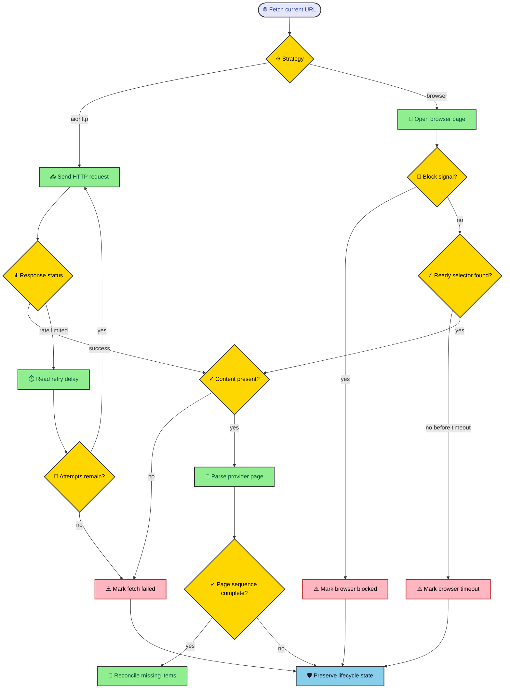

A response can contain HTML and still be useless. The page may be a login gate, a traffic challenge, a half-rendered application shell, or a result template whose product data never arrived. MLScraper treats page usability as a policy decision rather than a truth implied by status code 200. This chapter follows both fetch strategies, the signals that mark a cycle incomplete, and the backoff layers that slow one request without freezing unrelated stores.

---

## Fetch strategy belongs to motor policy

Every motor receives `FETCH_STRATEGY` from `config/motors.yaml`. The shared default is `aiohttp`, while a provider can override it with `browser`. The shared motor asks a fetcher registry for the configured implementation and otherwise follows the same page algorithm.

```yaml
defaults:
  FETCH_STRATEGY: aiohttp
  FETCH_TIMEOUT_SECONDS: 45
  MAX_RATE_LIMIT_RETRIES: 3
  RATE_LIMIT_SLEEP_CAP: 300

MercadoLibre:
  FETCH_STRATEGY: browser
  FETCH_TIMEOUT_SECONDS: 30
  BROWSER_WAIT_SELECTOR: "section.ui-search-results"
  BLOCKED_BACKOFF_SECONDS: 3600
```

This keeps fetching independent from parsing. A Mercado Libre parser should describe result data and recognized gates. It should not launch Chromium. The motor should select a fetch strategy without learning provider selectors.

HTTP mode is cheaper and easier to operate when the response contains usable product data. Browser mode earns its cost when the page needs JavaScript rendering or readiness checks. Choosing browser mode for every provider would add process weight without removing the need for parser validation.

The strategy is observable configuration. Operators can inspect one provider’s timeout, page delays, block cooldown, and concurrency beside its fetch mode. Those settings describe how politely and cautiously the service approaches that source.

---

## The guarded path has several exits

The motor only reconciles missing products after a complete page sequence. Fetchers and providers can stop that sequence for different reasons, but every incomplete exit protects saved history.



The diagram’s important branch is the last one. A failed fetch does not return an authoritative empty catalogue. It marks `_scrape_incomplete`, sets a reason when needed, and bypasses missing-item reconciliation.

---

## HTTP mode handles transient network behavior

`AioHttpFetcher` sends requests with a randomized browser-style header profile. It can reuse the motor’s session across pages or receive a fresh session for each page, depending on provider policy.

Successful responses return text. Empty content, exhausted request exceptions, and nonrecoverable responses eventually return `None`. The shared motor translates that result into an incomplete cycle and records `fetch_failed` unless a more specific reason already exists.

Rate limits have a focused retry path. For status 429, the fetcher reads `Retry-After` when available, accepts seconds or a date form, applies defaults for invalid values, and caps the delay with `RATE_LIMIT_SLEEP_CAP`. It also marks the motor blocked for that delay.

The configured retry count limits how many rate-limit attempts occur. Ordinary request exceptions use short exponential waits between attempts. These mechanisms address one page request. They do not change the recurring provider scheduler’s broader backoff state.

HTTP mode cannot prove that returned HTML contains a real catalogue. Provider parsing still decides whether expected products or supported empty signals exist. Palacio, for example, marks a page incomplete when no product tiles appear because a selector miss may represent a changed template.

---

## Browser mode waits for evidence of readiness

The browser fetcher lazily starts Playwright Chromium and reuses one browser context. The context uses a randomized header profile, Spanish Mexico locale, Mexico City timezone, and a desktop viewport. Each fetch opens and later closes an individual page.

Navigation waits for `domcontentloaded`, but that event does not make the result usable. The fetcher polls until the provider’s readiness selector exists, a block signal appears, or the configured deadline passes.

Block signals can be CSS selectors or `url*=` fragments. Mercado Libre policy checks account verification and suspicious-traffic patterns. A match records `browser_blocked` and applies the motor’s blocked cooldown.

If the readiness selector never appears, the motor records `browser_timeout`. Empty page content after readiness becomes `browser_empty_content`. Browser startup and navigation errors receive their own reasons. These labels let health distinguish missing dependencies from store gates and slow rendering.

The browser context does not make automation invisible, and the project does not claim otherwise. Its value is rendering and readiness inspection. A store can still block the request, change a selector, or return a page shape the provider does not support.

---

## Parsing can reject a successfully fetched page

A nonempty body reaches `scrape_page`, where provider code can identify conditions that the generic fetcher cannot understand. Mercado Libre parsing can return a blocked or incomplete reason. Liverpool marks missing or malformed `__NEXT_DATA__` incomplete. Palacio treats missing valid product tiles cautiously.

Parser exceptions also stop the page sequence. The motor catches them, records `parse_error`, and avoids reconciliation. A malformed individual item can sometimes be skipped while valid siblings remain, but a broken page-level structure must not become a complete empty result.

An empty page followed by a next URL is suspicious in shared code. The motor marks that sequence incomplete and can apply the provider cooldown. Continuing pagination after zero parsed items could waste requests and later reconcile from a partial result set.

Completeness therefore comes from several layers. The fetcher says whether it obtained usable content. The provider says whether the page shape was understood. The motor says whether the whole page sequence finished without an incomplete signal.

---

## Backoff has three different scopes

Request retry handles a transient failure around one URL. Rate-limit hints and short exception delays live here. The goal is to avoid abandoning a page after one temporary network event.

Motor cooldown handles a watch that encountered a block or gate. `blocked_until` prevents that motor from fetching again before its deadline. The provider loop can continue running other motors while the blocked watch waits.

Scheduler backoff handles an exception that escapes a provider cycle. The loop starts with `BACKOFF_INITIAL`, doubles the delay after repeated failures, and caps it at `BACKOFF_MAX`. A successful cycle resets the provider delay.

These delays should not be merged. A 429 response may include a precise short retry hint. A known browser gate may deserve a longer provider cooldown. An orchestration failure may need exponential scheduler recovery. Each signal has a different owner and blast radius.

The normal cycle interval is separate again. After a successful provider cycle, the loop currently sleeps for 400 seconds. That is periodic scheduling, not punishment for failure.

---

## Tune from evidence instead of impatience

When a provider appears slow, begin with health. Compare active and queued jobs with `CONCURRENCY_LIMIT`. Read block reasons, cycle duration, and the most recent provider error. Then inspect logs for request attempts, page readiness, and parser messages.

| Signal                  | First configuration or code to inspect                                    |
| ----------------------- | ------------------------------------------------------------------------- |
| `browser_startup_error` | Playwright installation and browser dependencies.                         |
| `browser_timeout`       | Timeout value, readiness selector, and current page rendering.            |
| `browser_blocked`       | Block selectors, cooldown, and whether the source is refusing automation. |
| `fetch_failed`          | Network errors, response status, retries, and URL correctness.            |
| `parse_error`           | Provider fixture, page-level parser assumptions, and current markup.      |
| Persistent queue        | Provider limit, page count, delays, and cycle duration.                   |

Increasing timeouts can help a slow page and hide a bad selector. Increasing concurrency can shorten a queue and increase source pressure. Removing cooldown can produce more requests while learning nothing new. Every tuning change needs a signal and a way to verify the result.

Provider-specific settings keep experiments contained. A Mercado Libre browser timeout change should not alter Amazon’s lightweight HTTP behavior. Defaults remain useful for common policy, while provider overrides document exceptional needs.

---

## Similar symptoms can require opposite responses

Suppose browser health reports `browser_timeout` after every Mercado Libre attempt. Increasing the timeout is reasonable only if logs or a controlled inspection show that the readiness selector eventually appears. If the selector no longer exists, more waiting only lengthens every failed cycle.

Now suppose HTTP requests receive status 429 with a valid retry hint. Replacing `aiohttp` with a browser does not address the source’s request limit. The useful response is to honor the delay, review job volume and provider concurrency, and decide whether the watch should continue.

A parser can return zero items from a page that visually contains products. That points toward markup or payload assumptions. Lowering page delays cannot repair it. The provider needs a small fixture reproducing the new shape and a parser change that keeps incomplete behavior safe while the fix is reviewed.

The opposite case also occurs. A valid complete search may contain no products. Providers need a reliable source signal before treating that result as authoritative. Without one, conservative incomplete handling preserves old state but can delay legitimate missing-item transitions.

Repeated `fetch_failed` on one explicit URL can begin in configuration. Preview confirms the string MLScraper will request but not whether redirects, expired tokens, or copied session parameters make sense. Inspect the route before changing retries.

Browser startup errors are local environment failures. Store selectors are irrelevant until Chromium can launch. Installing the supported browser and system packages is the first fix, followed by the fetcher tests that exercise startup handling with fakes.

These examples show why failure labels matter. The visible outcome may always be an absent product list, yet the corrective action ranges from waiting to stopping a job, repairing an environment, changing a parser, or fixing configuration.

---

## Responsible fetching is part of correctness

Page delays, conservative concurrency, rate-limit handling, and visible cooldowns reduce unnecessary requests. They also make behavior easier to reason about because the service records when it is waiting instead of disguising delay as a hang.

These mechanisms do not establish permission to scrape a source. Operators must review the source’s terms, applicable requirements, and the effect of their job volume. An explicit browser mode is a technical capability, not an instruction to bypass access controls.

The safest response to a persistent block may be to stop the job. Repeated retries cannot turn a refusal into valid product data. MLScraper’s health signals are useful partly because they make that decision visible.

The project’s core safeguard remains simple. When the service cannot establish a complete observation, it preserves existing product meaning. [How a product becomes price history](/thejournal/mlscraper/persistence_and_lifecycle/) explains the lifecycle protected by that choice. [Operating MLScraper and adding a store](/thejournal/mlscraper/operations_and_extension/) turns these signals into a diagnostic routine.
