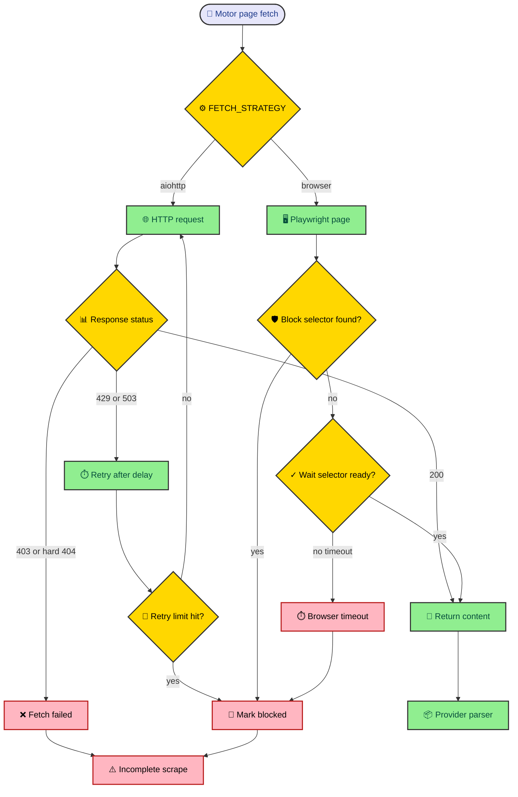

Scraping failure is not an edge case. A store can rate-limit HTTP, serve a transient Liverpool 404, gate Mercado Libre behind browser checks, or return a page that looks valid until the parser finds no products. MLScraper treats those outcomes as state. Fetchers report failure, motors skip unsafe reconciliation, and health exposes block reasons.

---

## Fetch strategy is a policy choice

Every motor receives fetch policy from `config/motors.yaml`. Defaults apply first, and provider-specific sections override them. The important switch is `FETCH_STRATEGY`, which chooses between `aiohttp` and `browser`. The default is lightweight HTTP. Browser mode uses Playwright Chromium for pages that need rendered content or selector-based readiness checks.

That choice belongs in config because provider behavior can change without changing the public motor contract. Mercado Libre currently uses browser mode in the sample config with a wait selector for search results and blocked selectors for account verification or suspicious traffic pages. Amazon uses longer page delays and fresh sessions.

The fetch path is easiest to understand as a guarded loop.

This diagram leaves out provider parsing on purpose. Fetching should answer one question. Did the motor receive page content it can safely parse? If not, the motor should know the scrape is incomplete so it does not turn missing fetch data into finished products.

---

## HTTP mode handles ordinary network failure

`AioHttpFetcher` sends requests with a random browser-like header profile and an explicit timeout. It treats status `200` as success. Status `429` and `503` enter rate-limit handling. The fetcher reads `Retry-After` when available, sleeps, and retries until the motor's configured rate-limit retry count is reached.

When the rate-limit count is exhausted, the fetcher marks the motor blocked with a reason such as `http_429_rate_limited` or `http_503_rate_limited`. The cooldown uses the larger value between the retry wait and `BLOCKED_BACKOFF_SECONDS`, which lets provider policy decide how long to pause after a rate limit.

Other statuses are quieter. The fetcher logs unexpected responses when debug logging is enabled. Status `403` and most `404` responses break the retry loop because they are unlikely to succeed through immediate retry. Liverpool gets a special transient `404` exception because valid token routes can sometimes return that response.

The fetcher also retries client errors and timeouts with exponential sleeps. That path handles ordinary network noise without making provider code catch low-level exceptions. The motor receives `None` when fetch ultimately fails and marks the scrape incomplete.

---

## Browser mode waits for usable pages

`BrowserFetcher` creates one shared Playwright Chromium context with a browser-like profile. It opens a new page for each fetch, loads the URL with `domcontentloaded`, and then polls until the configured wait selector exists or the timeout expires.

While it waits, it checks blocked selectors. A blocked selector can be a CSS selector or a URL fragment rule written as `url*=needle`. If any blocked selector matches, the fetcher marks the motor blocked with `browser_blocked` and returns no content.

Browser startup failure, navigation errors, empty content, and timeout each become specific blocked reasons. Those reasons flow into motor state and then into the provider health map. That gives an operator a better hint than "fetch failed." A browser startup error suggests environment setup. A blocked selector suggests provider access. A timeout suggests readiness or latency.

Browser mode costs more than HTTP mode. It starts browser machinery, waits on selectors, and can become the slowest part of a provider loop. MLScraper keeps it explicit so a provider uses it only when ordinary HTTP cannot provide a reliable parse surface.

---

## Incomplete pages protect product state

The dangerous part of scraping is not a failed request. It is treating a failed request as a complete empty result. If the scraper believes a real page had no items, it will move previously active products toward `on_hold` and eventually `finished`.

`Motor._scrape_page()` guards against that. When fetch returns no content, the motor marks `_scrape_incomplete`, sets a blocked reason when needed, and returns no next URL. When provider parsing raises, the motor records `parse_error` and marks the scrape incomplete. When a page has no items but still reports a next page, the motor treats that as suspicious and can mark a cooldown.

After pagination ends, `Motor.scrape()` reconciles missing items only when the scrape completed. If `_scrape_incomplete` is true, it skips missing-item reconciliation and logs a warning. That is one of the most important safety decisions in the project. A temporary provider failure should not rewrite product history.

This is why provider parsers need to report gates and incomplete pages honestly. A blocked Mercado Libre page is not an empty search. A missing Liverpool `__NEXT_DATA__` tag is not proof that every product vanished. The runtime needs that distinction to protect persisted state.

---

## Backoff happens at two levels

Motor-level backoff marks one job blocked until a loop time in the future. `Motor.scrape()` checks `blocked_until` before it fetches. If the cooldown has not expired, the motor skips itself and leaves provider state visible through health.

Provider-level backoff happens in `_run_provider_loop()`. If the provider loop raises outside the motor-level handling, the loop records an error and sleeps for `BACKOFF_INITIAL`. Repeated failures double that wait until `BACKOFF_MAX`. A successful cycle resets the provider backoff to the initial value.

The two levels answer different questions. Motor backoff says one job or provider access path is temporarily blocked. Provider scheduler backoff says the whole provider loop hit an error that should slow the next cycle. Keeping both levels avoids punishing every provider for one motor's rate limit while still protecting the runtime from rapid repeated loop failures.

Concurrency is a third control. `CONCURRENCY_LIMIT` decides how many jobs for a provider can scrape at once. The health endpoint reports active and queued counts, so an operator can see whether work is waiting behind that limit.

---

## Failure should be visible

MLScraper's fetch design does not make scraping reliable in the fantasy sense. Stores can still change markup, serve gates, throttle requests, and timeout. The design makes those states visible and keeps them from corrupting product history.

The operator path is direct. Check `/health`, read provider block reasons, inspect the configured fetch strategy and selectors, then run focused provider tests. If a parser changed, update parser fixtures. If a route changed, preview the URL. If the provider is gating browser requests, adjust policy or slow down.

The important part is that the system has names for failure. `browser_timeout`, `browser_blocked`, `fetch_failed`, `parse_error`, and rate-limit reasons are small labels, but they turn a stalled scraper into something a maintainer can reason about.

---

## Tuning without guessing

Fetch policy has several knobs, and they should not be changed blindly. `PAGE_DELAY_RANGE` affects pagination pace. `FRESH_SESSION_PER_PAGE` changes session reuse. `MAX_RATE_LIMIT_RETRIES` and `RATE_LIMIT_SLEEP_CAP` affect HTTP backoff. `BLOCKED_BACKOFF_SECONDS` controls cooldown after known blocks. `CONCURRENCY_LIMIT` controls provider pressure.

### Signals to check first

Use observed state before changing policy.

- If the provider shows queued jobs, inspect `CONCURRENCY_LIMIT` before changing selectors.
- If the motor shows `browser_timeout`, inspect `FETCH_TIMEOUT_SECONDS` and the wait selector.
- If the motor shows `browser_blocked`, inspect blocked selectors and provider access behavior.
- If rate-limit reasons appear, reduce concurrency or increase backoff before adding parser fallbacks.
- If persisted results are empty after a complete scrape, inspect parser tests and source markup.

**The fetcher should describe what went wrong before a maintainer changes policy.** A vague failure invites random tuning. A precise blocked reason points at the next configuration value or provider fixture.

There is also a difference between slowing down and hiding failure. Increasing timeouts can help slow pages, but it will not fix a selector that never appears. Increasing retries can help transient HTTP errors, but it will not fix a provider gate. A good change should match the health signal that motivated it.

Browser mode deserves special caution. It can solve pages that need rendering, but it can also make cycles slower and operational setup heavier. Use it when the provider needs rendered state or blocked-page selectors. Keep HTTP mode for pages that return parseable content directly.

When fetch behavior changes, update tests close to the behavior. `tests/test_fetchers.py` should cover timeout, rate-limit, blocked selectors, and browser failures with fakes. Provider parser tests should cover markup changes. Motor flow tests should cover incomplete scrapes and reconciliation guards.

That testing split mirrors runtime ownership. Fetchers decide whether content is usable. Providers decide whether content contains items. Motors decide whether missing items can be reconciled. Tuning is safer when each layer proves its part.
