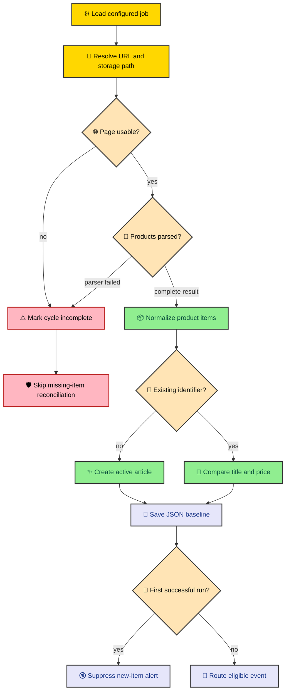

The safest way to understand a scraper is to follow one piece of data through it. We will configure an illustrative Nintendo Switch watch, preview the Amazon Mexico route, trace its first saved observation, and see how a later price change can become an alert. No live store request is part of this walkthrough. The examples come from the project’s contracts, so we can study the behavior without pretending today’s page returned a particular product.

---

## Start with the words the project uses

A **job** describes one watch. It names the provider, gives the watch a stable identity, and supplies either structured search options or a complete URL. Jobs live in `config/jobs.yaml`, where a person can review them without reading Python constructors.

A **provider** is the store adapter. Amazon Mexico uses `az`, Mercado Libre uses `ml`, Liverpool uses `lv`, and Palacio de Hierro uses `ph`. The provider understands how its store builds routes and exposes product data. Shared code does not need to learn those store details.

A **motor** is the runtime object built from a valid job. It knows the final URL, the relative JSON storage path, and the provider parsing method. The name is unusual, but its role is familiar. It is the worker that repeatedly runs one configured watch.

An **article** is the saved product record. It contains a stable provider identifier, title, price, optional product URL, timestamps, lifecycle status, and history. The term does not mean a blog article here. It is the project’s persisted representation of one listing.

Those four terms form the beginner map. YAML defines a job. A factory turns the job into a provider motor. The motor gathers normalized products. Each normalized product becomes or updates an article on disk.

---

## Describe one watch in YAML

The project’s example catalogue includes an Amazon search refined to the documented Nintendo brand. We can reduce that idea to one job.

```yaml
jobs:
  - provider: az
    job_id: Nintendo Switch 2
    query: nintendo switch 2
    brand: nintendo
```

The `provider` field selects the Amazon factory. The `query` supplies search text, while `brand` selects a known Amazon refinement. The loader converts the string `nintendo` into the provider’s `Brand.nintendo` enum before the factory builds the route.

The most important field is `job_id`. It labels runtime output and contributes to the storage filename. Changing it later can make the same watch appear to be a new stream with a new file. A useful job ID therefore describes the watch and stays stable after data begins to accumulate.

This example uses generated options rather than a copied URL. Generated fields make intent visible. A reviewer can see the search phrase and brand without decoding a long query string. The provider builder also rejects unknown brand keys instead of silently requesting a different route.

The example does not claim that Amazon currently returns a particular console, price, or result count. Store inventory is external and can change at any time. We are examining how MLScraper represents the request and handles whatever complete or incomplete response follows.

---

## Preview the route before starting the service

The preview command loads the same job file used by the runtime, finds one provider and job ID match, and resolves its final URL. It does not create the FastAPI application, start provider loops, scrape product pages, or write history.

```bash
python app.py preview-url --provider az --job-id "Nintendo Switch 2"
```

For the documented options in this example, the Amazon builder produces the following route shape with encoded query and brand refinement values.

```text
https://www.amazon.com.mx/s?k=nintendo+switch+2&rh=p_123%3A218247
```

The exact encoded value comes from the provider’s documented `Brand.nintendo` option. Preview is useful because it exposes that result while the change is still configuration. If the job cannot be found, if more than one entry matches, or if the generated options are invalid, the command stops with an error instead of starting a recurring task.

The factory also derives a storage path from the provider, stable job ID, and generated qualifier. For this example, the path is predictable.

```text
amazon/nintendo-switch-2__nintendo.json
```

That filename lives below `DATA_PATH`, which defaults to `./data`. The double underscore separates the normalized job identity from route context. The article does not ask you to create this file by hand. The repository writes it after the motor has useful state to save.

Preview checks routing, not store compatibility. A URL can be well formed while the remote page is blocked, changed, empty, or unavailable. That distinction is healthy. Configuration can prove what MLScraper intends to request, while fetch and parser signals explain what happened when it tried.

---

## Follow the first cycle without making the request

This diagram traces the paths implemented by the service. The successful branch establishes product state, while failure branches preserve existing history by marking the cycle incomplete.



When the motor begins, it loads any existing articles from its JSON file. A new file means the motor has no baseline, so `is_first_run` starts as true. The motor then fetches pages until the provider returns no next URL or a failure stops the cycle.

Amazon parses result cards marked as search results. It skips cards without an ASIN, title, or price. Valid cards become dictionaries with the ASIN as `identifier`, a canonical product URL, the parsed title, and a numeric price. The shared motor converts those dictionaries into articles.

A hypothetical parsed item might look like the following. The values are intentionally fictional and demonstrate the normalized contract rather than a captured store result.

```json
{
  "identifier": "EXAMPLE-ASIN",
  "title": "Example console listing",
  "price": 12000.0,
  "url": "https://www.amazon.com.mx/dp/EXAMPLE-ASIN/"
}
```

The identifier matters more than the title. Store titles can gain promotional words or small formatting changes. The stable identifier tells lifecycle code that the new observation belongs to the same listing, so a changed title or price updates history instead of creating a second product.

---

## The first result becomes a quiet baseline

Suppose a complete first cycle returns the illustrative item above. The article begins as active, receives a first-seen timestamp, and is included in the motor’s JSON file. A simplified saved record would have this shape.

```json
{
  "identifier": "EXAMPLE-ASIN",
  "title": "Example console listing",
  "price": 12000.0,
  "url": "https://www.amazon.com.mx/dp/EXAMPLE-ASIN/",
  "datetime": "2026-06-20 12:00:00",
  "status": "active",
  "history": [],
  "status_history": [],
  "hold_misses": 0,
  "last_updated": null
}
```

The timestamp is illustrative too. What matters is the empty history and active status. There is no earlier observation to compare, and the product appeared in a complete cycle. The repository serializes active, on-hold, and finished streams into one list when it saves.

The first baseline does not send a flood of Telegram new-item messages. Every product is technically new to an empty file, but those messages would only announce that the watch was created. MLScraper attaches an `is_initial_scrape` flag to new-item events and notification routing ignores them.

> The first complete scrape establishes what already exists. Notifications become useful only after the service has something earlier to compare.

The motor clears `is_first_run` after it saves useful state. On a later complete cycle, a genuinely new identifier can become a new-item notification. Existing identifiers follow the update path instead.

---

## A later price change becomes evidence

Imagine that a later complete cycle returns `EXAMPLE-ASIN` at `10000.0`. The identifier matches the active article, so the lifecycle updates the same object. Before replacing the current price, the article records the old value in its history and updates `last_updated`.

The reduction from 12000 to 10000 is about 16.67 percent. Notification routing reads the most recent history entry, parses the earlier and current values, and computes the percentage change. Because the reduction is at least the implemented 14-percent threshold, the event can become a Telegram price-drop message when credentials are configured.

A smaller reduction still becomes saved history. It simply does not pass the current notification rule. This separation keeps observation and messaging distinct. The repository should remember a changed price even when the notification channel decides that the change is not large enough to send.

An updated record would resemble this simplified example after the lifecycle preserves the earlier price and accepts the new observation.

```json
{
  "identifier": "EXAMPLE-ASIN",
  "title": "Example console listing",
  "price": 10000.0,
  "status": "active",
  "history": [
    {
      "price": 12000.0,
      "datetime": "2026-06-20 12:00:00"
    }
  ],
  "last_updated": "2026-06-20 18:00:00"
}
```

The Telegram formatter adds the provider, watch name, first-seen time, update time when present, previous price, current price, calculated savings, percentage reduction, and product link. Provider parsers do not format chat messages. They only report normalized observations.

Telegram remains optional. If `config/telegram.yaml` is missing or blank, startup logs a warning and notification sending stays disabled. The watch can still fetch, reconcile, persist, and report health. An integration failure does not erase the underlying product history.

---

## A failed page must not look like a missing product

Now consider a less cheerful cycle. The request times out, the browser sees a gate, or the parser cannot find the expected page data. The motor marks the cycle incomplete and stops pagination. It may also set a block reason and cooldown.

The saved product remains active because MLScraper skips missing-item reconciliation after an incomplete cycle. That decision prevents a fetch failure from counting as evidence that `EXAMPLE-ASIN` disappeared. The service can still save existing state, but it does not advance the product toward `on_hold` or `finished`.

A complete cycle with no matching identifier means something different. The service saw a usable result and did not observe the product. The first such miss moves the active article to `on_hold` with `hold_misses` set to one. Repeated complete misses can reach the default threshold of three and move it to `finished`.

If the identifier returns while on hold or finished, lifecycle code reactivates the existing record. It resets the miss count and applies any title or price change. Temporary absence therefore does not create a second history when the listing comes back.

This distinction is one of the strongest parts of the project. A naive tracker asks whether an item appeared in the latest list. MLScraper also asks whether the latest list was complete enough to support that conclusion.

---

## Read health before reading selectors

The health endpoint gives an operator the next clue. While the service is still starting, `GET /health` returns `503`. After startup, it exposes top-level state and a sorted provider map with job counts, configured limits, active work, queued work, blocks, reasons, cycle timing, and recent errors.

```bash
curl http://localhost/health
```

An illustrative Amazon fragment might look like the following response. Every field value is an example chosen to explain the health contract rather than captured runtime output.

```json
{
  "status": "ok",
  "motor_count": 1,
  "providers": {
    "az": {
      "status": "ok",
      "job_count": 1,
      "configured_limit": 1,
      "active_jobs": 0,
      "queued_jobs": 0,
      "blocked_jobs": 0,
      "block_reasons": []
    }
  }
}
```

If `blocked_jobs` is nonzero, inspect the reasons before changing a parser. If jobs remain queued, compare the queue with provider concurrency and cycle duration. If the provider reports success while one result shape is wrong, move toward parser fixtures. Health narrows the search before code changes begin.

The same principle applies to local JSON. Read the identifier, status, miss count, latest history entry, and timestamps before editing anything. Runtime data is evidence. Manual changes can hide the sequence that produced a bad state and make the next cycle harder to interpret.

---

## What this one watch reveals

Our example began as four YAML fields. It became a deterministic URL and storage path, a provider motor, normalized products, a quiet first baseline, durable history, an optional alert, and observable runtime state. Each transformation belongs to a different boundary because each answers a different question.

Configuration answers what to watch. The provider answers how to request and parse one store. The motor answers whether a cycle completed. Lifecycle answers what an observation means over time. Persistence answers how that meaning survives a restart. Notifications answer whether one saved change deserves attention.

That division is why MLScraper works as an engineering case study. It does not remove the uncertainty of scraping. It limits how far that uncertainty can travel. A blocked page becomes a health signal rather than a mass disappearance, and a changed price becomes history before it becomes a message.

Continue with [how a YAML job becomes a store URL](/thejournal/mlscraper/job_configuration/) to compare generated and explicit routes across all four providers. After that, [what happens during one scrape cycle](/thejournal/mlscraper/runtime_flow/) explains how many watches run together without sharing one global failure state.
