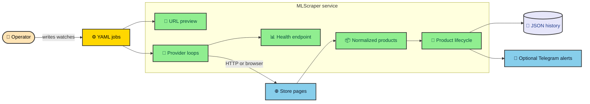

I saved a product after finding it at an unusually low price. Five minutes later I came back ready to buy it, but it was sold out. The disappointment turned into a habit: I kept reopening the store, found more bargains, and watched several disappear within minutes. Eventually I stopped asking only whether I could catch the next one. I wanted to know how many discounted products appeared while I was not looking.

That question became MLScraper. It started as a way to watch searches for me and grew into a service that tracks four Mexican storefronts, remembers price changes, and distinguishes missing products from incomplete pages. There was an unintended result too. The tracker found enough deals that I began buying things I did not need, so I eventually made myself stop using it.

---

## From deal hunting to dependable monitoring

Automating the search was only the first step. A useful tracker needed to remember earlier observations, notice meaningful changes, and survive long enough for those changes to matter. A script that printed the current price once would not answer the question that started the project.

That turns one shopping query into a repeated process. The service must decide what page to request, fetch it without putting needless pressure on the store, translate store-specific markup into a common product shape, compare that shape with saved state, and report what happened. Any weak step can make the final alert misleading.

The hardest bug is often a believable result. An empty response is easy to store. It is also easy to misread as proof that every listing vanished. MLScraper therefore treats fetching, parsing, reconciliation, persistence, scheduling, and notifications as separate decisions. A failure in one stage does not get to impersonate success in another.

That became the main engineering problem behind the project. A scraper that works once proves that a page can be parsed. A tracker has to preserve meaning across many imperfect runs and explain why its saved data changed.

---

## The service in one picture

The system has one human input and two useful outputs. An operator describes a watch in YAML. MLScraper visits the relevant store pages, records product state in JSON, exposes runtime health, and can send selected changes to Telegram.

FastAPI provides the process boundary and the `GET /health` route. The scraper runtime starts in the application lifespan, loads configured watches, groups them by provider, and runs an independent loop for each store. HTTP requests do not start scrapes. They only reveal whether the background work is starting, running, waiting, blocked, or recovering.

The local JSON files are operational state rather than a public database. Each configured watch owns a file below `DATA_PATH`. Records retain the current title and price, earlier values, lifecycle status, and enough timestamps to reconstruct what changed. That modest storage choice keeps the project easy to run while still demanding careful write and recovery behavior.

---

## One product shape hides four different stores

MLScraper currently supports Amazon Mexico, Mercado Libre, Liverpool, and Palacio de Hierro. Those names look like a simple provider list. In practice, each store exposes product information through a different page shape and a different routing vocabulary.

| Provider          | Key  | Product source                         | Important difference                                                        |
| ----------------- | ---- | -------------------------------------- | --------------------------------------------------------------------------- |
| Amazon Mexico     | `az` | HTML search result cards               | Stable ASIN values identify products and pagination follows result links.   |
| Mercado Libre     | `ml` | DOM cards or embedded Nordic state     | Browser gates and partial responses can carry explicit incomplete reasons.  |
| Liverpool         | `lv` | The `__NEXT_DATA__` JSON payload       | Generated page routes can require seller-filter resolution before scraping. |
| Palacio de Hierro | `ph` | Constructor product attributes in HTML | Pagination advances through a `start` offset and reported result count.     |

Every provider returns the same small item contract. A product needs a stable `identifier`, a `title`, and a numeric `price`. A product URL is optional but useful for notifications. The provider also returns the next page URL when pagination should continue.

That common shape lets the rest of the service ignore store markup. Lifecycle code compares identifiers. Persistence serializes articles. Notification routing examines history. Scheduler code counts active and blocked jobs. None of those layers needs to know what an Amazon result card or Liverpool payload looks like.

This boundary is also the project’s best extension point. A store change stays near its parser and URL helpers. A new provider implements the same page contract and registers a factory. The scheduler does not gain a new branch for every store, which keeps the shared path understandable as the provider list grows.

---

## Failure is recorded before it can damage history

Network failure, browser blocking, parser failure, and a valid empty result are different events. Treating them all as an empty list would make the code shorter and the history less trustworthy. MLScraper marks failed or suspicious cycles as incomplete and skips missing-item reconciliation for those cycles.

That guard matters because reconciliation changes product status. After a complete scrape, an active product that was not observed moves to `on_hold`. Repeated complete misses can move it to `finished`. A blocked page should never trigger that progression, because the service did not gather enough evidence to say the product was absent.

The fetch layer supplies several signals. Lightweight requests handle ordinary pages and retry transient failures. Browser mode waits for a configured selector and checks known block selectors or URL fragments. Motors can record reasons such as `fetch_failed`, `browser_timeout`, `browser_blocked`, or `parse_error`. Health aggregates those reasons for the operator.

Backoff happens at the scope where the problem appears. A rate-limited request pauses its own fetch path. A blocked motor can enter a cooldown. A provider loop that raises outside an individual motor sleeps and increases its scheduler backoff. Other provider loops continue because one store should not freeze every watch.

---

## Product history needs more than the latest price

A listing enters the service as an observation. The stable provider identifier decides whether that observation belongs to a new product or an existing record. If the title or price changed, the article keeps the prior value in history before accepting the new one.

Absence also becomes evidence, but more cautiously. The first complete miss moves an active product to `on_hold`. The default threshold is three misses, after which the product moves to `finished`. If it returns before then, the same record becomes active again instead of creating a duplicate product.

This lifecycle gives notification routing better information. The first successful scrape establishes a baseline and suppresses new-item messages. Later new products can notify. A price update only becomes a price-drop alert when history contains a usable previous price and the reduction reaches the implemented threshold of 14 percent.

The threshold is a code decision, not a claim about the ideal bargain. Its value in this case study is architectural. Providers report normalized facts, lifecycle code decides what changed, and notification code decides whether that change deserves an external message. Those responsibilities can evolve independently.

---

## The health endpoint is part of the product

A process can answer HTTP while its useful work is stuck. MLScraper’s health response therefore includes more than a top-level status. It reports each provider’s cycle state, configured concurrency, job count, active work, queued work, blocked jobs, block reasons, timing, and recent errors.

Those fields shorten diagnosis. A growing queue points toward the provider concurrency limit or slow page work. A `browser_blocked` reason points toward browser policy or a store gate. A parser error points toward provider fixtures and selectors. A service with no loaded motors exposes `idle_no_motors` rather than crashing into a restart loop.

This is one place where the project sells itself through restraint. It does not promise that scraping is stable. It gives the operator a vocabulary for instability. That makes maintenance less like guessing at a blank terminal and more like following a signal to the layer that produced it.

---

## What the project proves and what it does not

MLScraper demonstrates how I organize a changing external dependency. The provider adapters isolate store knowledge. The runtime isolates provider failures. The lifecycle protects meaning across observations. Persistence protects local state. Health explains what the background process is doing. Offline tests exercise those boundaries with fixtures and fakes.

The project does not include a hosted dashboard, user accounts, a relational database, or a general notification platform. Telegram is optional and currently the only external channel. The scheduler interval and price-drop threshold are code constants. The stores can change without warning, so a checked-in parser can never guarantee future live compatibility.

Those limits make the case study more useful. They distinguish implemented behavior from plausible future work. A dashboard could consume the same article and health data. Another notification adapter could sit behind the broadcast boundary. A database could replace JSON through a repository change. None of those possibilities needs to be presented as finished work.

Responsible operation matters too. Conservative provider limits, page delays, visible cooldowns, and explicit browser mode reduce needless source pressure. They do not grant permission to scrape a particular site. Anyone running the project remains responsible for reviewing the source’s terms, local requirements, and the effect of their configuration.

---

## Why I kept the first version operationally small

A local JSON store and one FastAPI process are modest choices, but they expose the central problem without requiring infrastructure to carry the story. The project can demonstrate identity, lifecycle, failure isolation, and recovery while remaining possible to run on one machine.

The in-process scheduler also makes ownership visible. FastAPI controls lifetime, provider loops control recurring work, and motors control page sequences. A queue or external scheduler could replace parts of that arrangement later, but adding one now would introduce delivery semantics that the current use case does not need.

The same restraint applies to notifications. Telegram proves that normalized change events can leave the scraper through a separate boundary. Adding email, webhooks, and push messages before the event contract was clear would create more integrations without improving the meaning of the underlying state.

There is a cost to this simplicity. One process owns scheduling and writing, JSON is unsuitable for concurrent writers, and health lives in memory. The service does not offer distributed coordination or historical operational metrics. Those are explicit limits rather than hidden capabilities.

For a portfolio case study, this shape keeps attention on judgment. The interesting question is not how many services can surround a scraper. It is whether one failed observation can be prevented from damaging saved product meaning, and whether an operator can understand the decision afterward.

---

## Choose a path through the case study

Readers new to scraping should begin with [your first MLScraper price watch](/thejournal/mlscraper/first_price_watch/). It introduces jobs, providers, product identifiers, baselines, health, and alerts through one example before opening the internal modules.

The next step is [how a YAML job becomes a store URL](/thejournal/mlscraper/job_configuration/). That chapter explains why `job_id` is durable identity, when a generated route is safer than a copied URL, and how preview reveals the final route before the scheduler starts.

Readers interested in execution can continue with [what happens during one scrape cycle](/thejournal/mlscraper/runtime_flow/) and [why every store needs its own adapter](/thejournal/mlscraper/provider_boundaries/). Together they show how shared runtime behavior meets provider-specific parsing without mixing the two.

The failure and data chapters cover the heart of the design. [When a store blocks the scraper](/thejournal/mlscraper/fetching_and_backoff/) follows fetching, incomplete pages, cooldowns, and backoff. [How a product becomes price history](/thejournal/mlscraper/persistence_and_lifecycle/) follows one stable identifier through updates, temporary absence, recovery, and alerts.

Finish with [operating MLScraper and adding a store](/thejournal/mlscraper/operations_and_extension/). It turns the earlier concepts into a diagnostic routine and an extension checklist. By that point, the repository should feel less like four unrelated scrapers and more like one service with four adapters.

The source is available through the project’s GitHub link above. The most interesting code is not the selector that works today. It is the set of decisions that limit what a failed selector is allowed to damage tomorrow.
