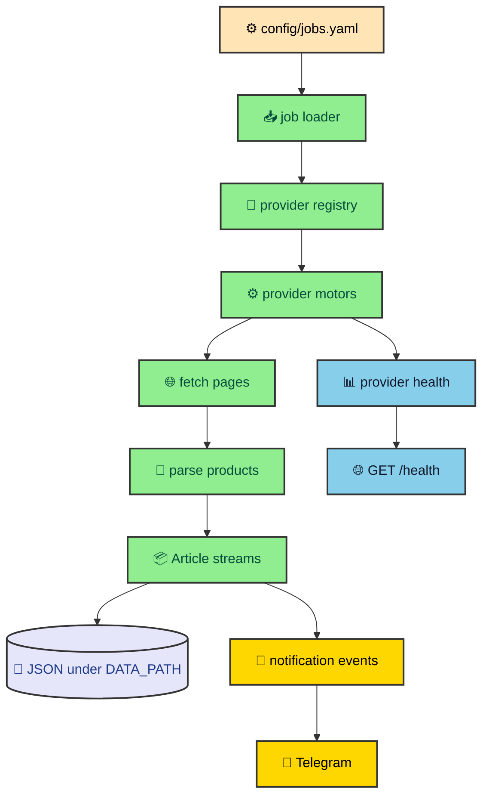

Price trackers sound simple until a store blocks a request, a listing disappears for one cycle, and a copied URL stops matching the generated route rules. MLScraper is useful because it treats those problems as normal operating conditions. This vault follows the service from YAML jobs to provider loops, product state, health checks, and alerts so the architecture reads like a system instead of a pile of scrapers.

---

## The shape of the service

MLScraper is a scheduled scraper service with a small FastAPI shell. The app exposes a readiness endpoint, starts the scraper in the lifespan hook, and lets the background runtime own the long-running work. That split keeps HTTP routing small while the scraper handles provider loops, concurrency, retries, persistence, and notifications.

The runtime path is easiest to read as one pipeline.

That shape matters because scraping code gets messy when the provider parser, scheduler, storage layer, and notification code all know about each other. MLScraper avoids that by making each boundary pass a small contract forward. Jobs become motors. Motors produce normalized items. Streams reconcile state. Notifications receive serialized product payloads with motor context attached.

The FastAPI app is deliberately quiet. `app.py` creates the application, starts `Scrapper.run()` as an async task, and exposes `GET /health`. When the service is still starting, the endpoint returns `503`. After the runtime starts, the endpoint reports the top-level status and per-provider details such as active jobs, queued jobs, blocked jobs, block reasons, cycle count, and recent cycle timing.

---

## What the vault covers

This vault follows the maintainer path through the system. It does not start with provider selectors because selectors are only one piece of the design. The more useful order begins with how a job enters the runtime, then moves through provider ownership, fetch behavior, state reconciliation, and operations.

| Entry                       | Main question                                                                           |
| --------------------------- | --------------------------------------------------------------------------------------- |
| `runtime_flow`              | How does the FastAPI process keep scraping in the background and report service health? |
| `job_configuration`         | How does a YAML job become a provider motor with a stable URL and storage path?         |
| `provider_boundaries`       | How do store packages own parsing while sharing one scheduler contract?                 |
| `fetching_and_backoff`      | How does the scraper handle rate limits, browser gates, timeouts, and blocks?           |
| `persistence_and_lifecycle` | How does product state move through active, hold, and finished records?                 |
| `operations_and_extension`  | How should a maintainer run the service, enable alerts, and add another provider?       |

Read the first two entries before changing configuration. Read the provider and fetching entries before changing selectors or URL rules. Read the persistence entry before touching runtime JSON. Read the operations entry before adding a store. That order saves the future maintainer from debugging the wrong layer first.

---

## The project boundaries

The repository has a clear ownership map. `app.py` owns the FastAPI entrypoint and the command-line URL preview command. `scraper/` owns job assembly, scheduling, provider concurrency, health aggregation, and notification routing. `shared/` owns product records, streams, motor behavior, fetchers, config coercion, and persistence contracts used by every provider.

Provider packages own the store-specific pieces. Amazon, Mercado Libre, Liverpool, and Palacio de Hierro each keep URL construction, option enums, parser helpers, and motor parsing close to their store package. That lets a Liverpool JSON change stay in Liverpool code instead of leaking into shared scraper logic.

`utils/` holds supporting pieces that cut across runtime boundaries. File persistence resolves safe paths under `DATA_PATH`, writes through temporary files, and keeps a backup copy. Header helpers provide browser-like request profiles. Telegram helpers read ignored local credentials and turn notification payloads into chat messages.

The config directory is another boundary. `jobs.yaml` defines what to scrape. `motors.yaml` defines motor policy such as fetch strategy, delay ranges, concurrency, browser selectors, and block cooldowns. `scrapper.yaml` defines scheduler backoff. That separation keeps a product monitor from carrying scheduler policy inside a provider parser.

---

## Where the current source differs

The older Product Tracker article described an earlier version of the project. The current snapshot no longer presents the same public dashboard story. The current source emphasizes scheduled provider loops, `/health`, URL preview, YAML job validation, browser fetch mode, blocked-page reporting, JSON persistence, and Telegram notifications.

That difference changes the writing angle. A single architecture tour would flatten the useful parts. The current project is better as a vault because every boundary deserves its own page. The root gives the map. The child entries explain the contracts that make the system maintainable.

The old route has been removed rather than redirected. The public project surface is now `/thejournal/mlscraper/`, with child entries below that path. Internal project links should point to the vault root so readers land on the map before choosing the detail they need.

---

## How to read the code

Start with `app.py`. It shows the smallest public surface of the service. The lifespan hook creates `Scrapper`, starts `run()` in the background, and cancels the task on shutdown. The same file also exposes the `preview-url` command, which is the safe way to inspect one configured job without starting the scraper loops.

Next read `scraper/jobs/loader.py`, `scraper/jobs/factories.py`, and `scraper/jobs/registry.py`. Those files explain how plain YAML becomes concrete motors. The loader validates the shared job contract and coerces provider-owned options. Factories build provider URLs and storage paths. The registry keeps provider keys mapped to motor factories.

After jobs, read `scraper/runtime/orchestrator.py`. It groups motors by provider, starts one loop per provider, applies provider semaphores, updates health, and routes notifications. `provider_runtime.py` is worth reading beside it because that helper makes queued and active job counts visible instead of leaving concurrency as an invisible semaphore.

Then read `shared/scraping/motor.py`. That file is the center of the scraper contract. It owns pagination, fetch dispatch, parse calls, item saving, incomplete scrape guards, reconciliation, and serialized notification payloads. A provider motor has one main responsibility inside that larger algorithm. It parses one fetched page into items and a next URL.

Finish with one provider and one persistence path. Liverpool is a good provider to read first because it parses product data from `__NEXT_DATA__`. `shared/articles/lifecycle.py`, `shared/articles/stream.py`, and `utils/file_manager.py` then show how a product becomes history on disk instead of a temporary result from one scrape cycle.

---

## Responsible scraping

MLScraper watches public store pages, but that does not make scraping free of operational judgment. The project keeps concurrency conservative, makes browser mode explicit, stores runtime data locally, and treats blocks as visible health signals. That posture is part of the architecture, not a footnote.

The point of the system is not to pretend every fetch succeeds. The point is to know which provider is blocked, which job is queued, which product disappeared for a cycle, and which price change is worth a notification. Once those facts are visible, the scraper becomes easier to operate and easier to change.

---

## What to change first

When a maintainer opens MLScraper with a bug report, the safest first move is to identify the boundary that owns the symptom. A broken product title usually belongs to a provider parser. A missing route usually belongs to URL generation or YAML coercion. A finished product that should still be active belongs to lifecycle or incomplete scrape handling.

### A maintainer reading path

Use the codebase in this order when you need to change behavior.

- Start with `app.py` only when the public service surface or URL preview command changed.
- Start with `scraper/jobs/loader.py` and `scraper/jobs/factories.py` when a YAML field or generated route changed.
- Start with `shared/scraping/motor.py` when pagination, reconciliation, or notifications changed.
- Start with the provider package when selectors, item fields, pagination URLs, or blocked-page detection changed.
- Start with `utils/file_manager.py` only when persisted JSON, backups, or path safety changed.

That reading order is deliberately boring. It keeps a maintainer from fixing the symptom at the layer that noticed it rather than the layer that caused it. **The best MLScraper changes preserve the boundary that made the bug easy to locate.**

The same rule applies to writing this vault. Each child entry follows one ownership boundary instead of copying package names into a tour. The goal is not to document every function. The goal is to give a future reader enough context to predict where a behavior lives before they open the source.

This is also why the vault root should stay short compared with its children. The root is the map. It tells readers which paths matter and warns them away from the old standalone story. The child pages do the slower work of explaining contracts, failure modes, and maintenance habits.

The project can grow from here without changing that shape. A future dashboard would become another runtime or interface entry. A new provider would extend the provider boundary entry. A new storage backend would expand persistence. The vault should grow by ownership, not by release chronology.
