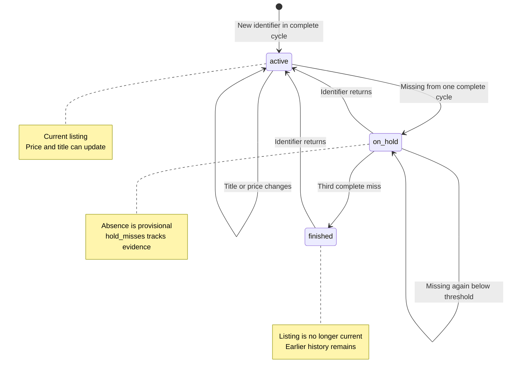

A store listing does not become history because the scraper saved it once. History appears when later observations can be connected to the same product without mistaking a title edit for a new item or a blocked page for a disappearance. MLScraper uses stable provider identifiers, explicit lifecycle states, and guarded reconciliation to preserve that connection. This chapter follows the record from its first sighting through price changes, temporary absence, recovery, and safe JSON writes.

---

## Identity comes before state

Every provider returns an `identifier`, `title`, and `price`. The identifier decides whether two observations describe the same listing. Amazon uses an ASIN, while other providers expose their own stable product or listing keys.

Titles are poor identity. Stores add campaign text, punctuation, color names, or shipping claims. Prices are worse because change is the event we want to record. A provider-owned stable key lets the article accept those changes without splitting one history into several records.

The persisted `Article` contains current values and enough context to interpret when they were first seen, changed, or temporarily absent.

```json
{
  "identifier": "provider-stable-id",
  "title": "Product title",
  "price": 123.45,
  "url": "https://example.test/product",
  "datetime": "2026-06-20 12:00:00",
  "status": "active",
  "history": [],
  "status_history": [],
  "hold_misses": 0,
  "last_updated": null
}
```

`datetime` records first sighting. `last_updated` changes when title or price changes. `history` holds prior values, while `status_history` records important lifecycle transitions. `hold_misses` counts complete cycles that failed to observe an on-hold product.

Article equality and hashing use only the identifier. Streams can therefore find, delete, reactivate, or update a product even when its current descriptive fields differ from the saved record.

---

## Three streams make absence explicit

The motor keeps active, on-hold, and finished streams. These are in-memory views loaded from one JSON list and saved together after useful cycles.

The lifecycle below separates a current listing, a provisional absence, and a listing that has passed the configured missing threshold.



The first complete miss moves an active article to `on_hold` and sets `hold_misses` to one. A second complete miss keeps it on hold. The default `HOLD_MISS_THRESHOLD` is three, so the third miss moves the record to `finished` and resets the counter.

If an identifier returns from either on-hold or finished state, lifecycle reactivates the existing object. It resets misses, records a transition when returning from finished, and applies any new title or price. The product does not lose its earlier first-seen time and history.

The threshold is a project default rather than proof that three cycles fit every store. Its purpose is to avoid treating one temporary omission as a final disappearance. A future configuration surface could make that policy adjustable per provider or watch.

---

## Complete results are required for reconciliation

Lifecycle only knows that a product was missing when the motor supplies a complete set of observed identifiers. A fetch timeout, browser gate, parser failure, or suspicious empty paginated page cannot support that conclusion.

The motor starts every cycle with `_scrape_incomplete` set to false. Fetch and provider paths set it when they cannot establish a usable page sequence. After pagination, the motor calls missing-item reconciliation only when that flag remains false.

This guard prevents destructive false evidence. Imagine a watch with 40 active products. If a browser gate returned zero parsed items and reconciliation ran, every active record would move toward finished. The next successful cycle would spend its time reactivating products that never left the store.

A valid complete page can still return no match for a particular identifier. That absence counts. The design does not ignore missing products. It requires the observation to be trustworthy before changing their status.

Provider code contributes to this decision. Liverpool marks missing `__NEXT_DATA__` incomplete. Mercado Libre can report a blocked or unsupported result. Palacio treats missing product tiles as incomplete. Shared fetch failures and parse exceptions do the same.

---

## Updates preserve old values before replacing them

When a matching active article changes, `Article.update()` compares the incoming title and price with current values. Unchanged observations return false and add no history noise.

For changed fields, the method captures old values in an `ArticleHistory` record, applies the new values, and sets `last_updated`. If both title and price change in one observation, the same history entry can preserve both earlier values.

History order puts the latest change first. Notification routing reads the first entry when evaluating a price change. The article caps history at `MAX_HISTORY`, currently 100 entries, so a frequently changing listing cannot grow its local file forever.

Status history serves a different purpose. It records lifecycle changes that matter to finished and reactivated behavior. Mixing those transitions with price history would make both harder to read.

An update callback receives the serialized article after lifecycle applies the change. The payload also includes motor context such as `job_id` and provider. That gives notification code enough information to format a message without opening the JSON file again.

---

## Notifications consume history rather than inventing it

New-item and update events leave the motor through the same broadcast boundary. The notifier routes them according to event type and optional Telegram configuration.

The first successful run suppresses new-item messages. An empty file makes every observation new to MLScraper, but those products probably existed before the watch. Silencing the baseline avoids treating setup as a burst of discoveries.

Later updated items only trigger price-drop evaluation when the newest history entry contains a prior price. The router parses both prices, ignores unusable or nonpositive earlier values, and computes percentage change.

The implemented threshold is a reduction of at least 14 percent. A price moving from 1000 to 900 is saved as history but does not notify. A move from 1000 to 860 reaches the threshold and can send when Telegram is enabled.

This order protects the data model from notification preferences. The article remembers every supported title or price change. Notification routing selects a smaller set for external attention. Changing the alert threshold should not rewrite product history.

---

## One JSON file contains all three states

Each motor owns a relative storage path below `DATA_PATH`, which defaults to `./data`. The repository loads the JSON list and routes records into active, on-hold, or finished streams according to status.

Malformed records and duplicate identifiers are skipped during load. Missing or invalid hold counts normalize to a nonnegative integer. Unknown status values fall back through the article creation and stream rules instead of receiving arbitrary state.

When saving, the repository serializes streams in a consistent order. The file remains a list of article dictionaries, which keeps inspection straightforward with ordinary tools.

```bash
jq '.[] | {identifier, price, status, hold_misses, history}' \
  data/amazon/nintendo-switch-2__nintendo.json
```

Runtime files are not source fixtures. The repository’s `data/.gitignore` keeps ordinary scrape output out of version control. Tests use temporary directories and patched data roots so regression runs do not rewrite operational history.

---

## Writes defend the local file boundary

The file manager reads `DATA_PATH` once and resolves every normal write beneath it. Storage paths must be relative. Absolute paths outside the root and parent traversal are rejected.

Writes go through a temporary file in the destination directory. When a primary file already exists, the writer copies it to a `.bak` path before replacement when possible. The temporary file then replaces the primary path atomically at the filesystem level.

Reads expect a JSON list. If the primary file is invalid and a usable backup exists, the loader recovers from that backup. A non-list payload without recovery becomes an empty list rather than a collection of malformed articles.

These protections do not turn JSON into a transactional database. Two processes should not write the same motor file concurrently, and backups only preserve the previous version. Within the project’s single-service model, they reduce the chance that an interrupted write or corrupt primary destroys the last usable state.

Do not edit runtime data as part of ordinary code changes. Manual changes can break identifier continuity, history ordering, lifecycle counts, and recovery evidence. Copy a file before investigation and prefer a temporary `DATA_PATH` for experiments.

---

## Debug a surprising record from the inside out

Begin with the identifier. Confirm that the provider parser still returns the same key for the same listing. A changed identity explains duplicates and histories that appear to restart.

Then inspect current status and `hold_misses`. An on-hold record should correspond to at least one complete miss. If the source was blocked, inspect motor completeness and block reasons because reconciliation should have been skipped.

Read the newest history entry beside current title, price, and `last_updated`. That reveals what the update method believed changed. If a price alert looks wrong, verify the prior value is numeric and occupies the latest history entry.

Finally, inspect the primary and backup files, storage path, and job ID. A newly slugged filename can explain missing old records even when lifecycle code is correct. A recovered backup can explain why the latest cycle appears absent.

Tests mirror this order. Article tests cover equality and history. Lifecycle tests cover hold, finish, and reactivation. Motor tests cover complete and incomplete reconciliation. Persistence tests cover path safety, backups, malformed records, and stream ordering. Notification tests cover exact threshold behavior.

---

## JSON keeps the model visible and sets a ceiling

One file per watch makes product state easy to inspect, copy, and back up. It also avoids a database service during local setup. For a personal scheduled tracker, that transparency is useful because the stored model remains legible during debugging.

The same choice limits concurrent operation. The repository does not coordinate multiple writers, merge competing cycles, or lock records across processes. Two service instances targeting the same file could overwrite each other’s view even if each individual replacement is atomic.

Querying across watches is also manual. Finding every active Nintendo product or calculating a long-term price series requires reading many files and interpreting history. A database would support those queries better if analytics became a product goal.

Migration needs care because JSON records outlive code versions. Adding a required field, renaming a status, or changing history shape must preserve older files or include an explicit conversion. The current loaders already normalize some malformed values, but that is not a general schema migration system.

Backup recovery protects the previous file, not every historical version. Important operational data still deserves external backup appropriate to its value. The `.bak` copy is a local recovery aid for replacement or primary corruption.

These limits do not weaken the lifecycle design. They clarify its boundary. Stable identity, guarded reconciliation, and explicit transitions can survive a future storage adapter, while file-specific safety remains inside repository and file-manager behavior.

---

## Product memory is the project’s useful output

Fetching creates observations. Stable identity connects them. Lifecycle interprets absence. History preserves change. The repository makes that state survive restarts, and notifications consume it without becoming its owner.

This chain is why incomplete-page handling matters so much. A tracker cannot control store availability, but it can refuse to turn missing evidence into a destructive state transition. That restraint makes the saved JSON more valuable than a collection of latest prices.

For the request conditions that protect reconciliation, return to [when a store blocks the scraper](/thejournal/mlscraper/fetching_and_backoff/). To run the service, inspect health, and extend the same lifecycle to another store, continue with [operating MLScraper and adding a store](/thejournal/mlscraper/operations_and_extension/).
