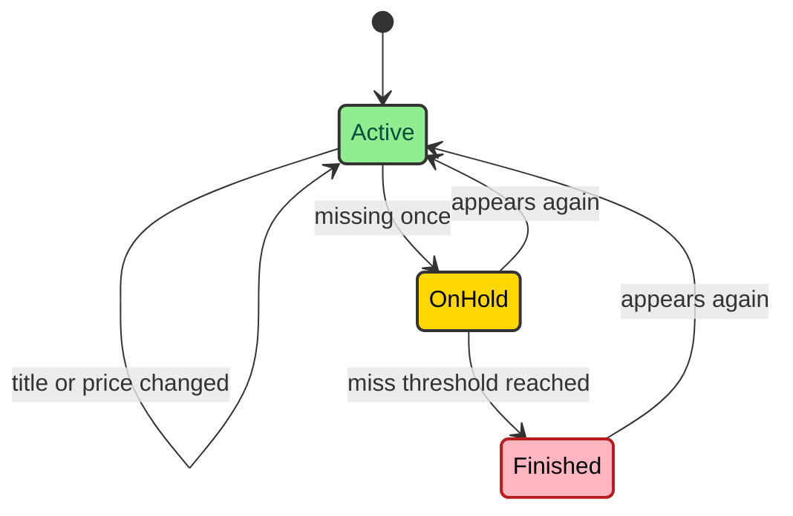

The hardest part of a price tracker is memory. A product that is missing today might be sold out, blocked by a partial page, or hidden behind a provider glitch. MLScraper keeps current products, temporary misses, finished listings, price history, and status transitions separate so one bad cycle does not erase the story.

---

## Article is the persisted unit

Every provider returns plain dictionaries with `identifier`, `title`, `price`, and usually `url`. The shared motor turns those dictionaries into `Article` instances. The identifier is the stable key. It lets the scraper decide whether an incoming item is new, changed, missing, or returning after a gap.

The persisted JSON record has a small required core.

```json
{
  "identifier": "MLM123",
  "title": "Nintendo 3DS",
  "price": 3200.0,
  "url": "https://example.test/item",
  "datetime": "2026-05-16 12:00:00",
  "status": "active"
}
```

Optional fields carry history. `last_updated` records the latest title or price change. `history` stores prior title and price values. `status_history` stores meaningful lifecycle transitions. `hold_misses` counts how many completed scrape cycles have missed a product while it is on hold.

The `Article` class does not store `job_id`. That belongs to the motor. A product record describes the listing. The motor describes the configured monitor that found it. Notification payloads can combine both when needed, but persisted product JSON stays focused on product state.

---

## Streams keep states separate

Each motor owns three streams. `active` contains products that appeared in the latest complete scrape or returned after a gap. `on_hold` contains products that were active but went missing in a complete scrape. `finished` contains products that stayed missing long enough to cross the hold threshold.

The lifecycle looks like this.



The hold state is the pressure valve. Without it, a single complete scrape that misses a product would finish that product immediately. With it, the scraper can tolerate temporary gaps while still cleaning up listings that remain gone.

`ArticleLifecycle` owns these transitions. Saving an active article checks whether it was previously finished, on hold, already active, or new. Returning products reset `hold_misses`. Changed products record title or price history. Products that cross the hold threshold record a finished status transition and move to `finished`.

---

## History records old values

When an active product changes title or price, `Article.update()` compares incoming values to the stored values. Only changed fields enter history. The history entry stores the old values and a timestamp. Then the current article receives the new values and updates `last_updated`.

That means the first record in `history` is the previous state, not the current state. Notification code uses that shape for price-drop checks. It reads the latest previous price, parses the current price, calculates the percentage change, and sends a Telegram message only when the reduction crosses the threshold.

History is capped by `MAX_HISTORY`, currently one hundred entries. That cap keeps long-running monitors from growing JSON without limit. The cap applies to both price and title history and status history.

Status history is more selective. The code intentionally skips `on_hold` entries because hold can be noisy. It records meaningful transitions such as finished and reactivated. Consecutive duplicate statuses are ignored so replayed lifecycle work does not fill the record with repeated state.

---

## Reconciliation runs only after complete scrapes

After a motor finishes pagination, it has a `results` list with the products seen during that scrape. If the scrape completed, the motor reconciles missing items. Active products not present in the new result list move to `on_hold`. On-hold products that remain missing increment `hold_misses`. Once the threshold is reached, they move to `finished`.

If the scrape did not complete, reconciliation is skipped. This check protects state when fetch failed, browser mode hit a gate, parser code raised, or a suspicious empty paginated page appeared. A partial scrape should not decide that hundreds of existing products disappeared.

That single guard is the difference between product history and scrape noise. The scraper can still store new or updated products it safely parsed before the failure, but it will not punish products that were absent from an incomplete result set.

The threshold lives on `Motor` as `HOLD_MISS_THRESHOLD`, currently three. The number is small enough to retire stale listings, but large enough to absorb short provider gaps. Different providers can override motor behavior if a store needs different policy later.

---

## JSON writes stay below DATA_PATH

Product records live below `DATA_PATH`, which defaults to `./data`. Factories pass relative storage paths such as `amazon/macbook__amazon-mx.json` or `palacio_de_hierro/macbook.json`. The file manager resolves those paths under `DATA_PATH` and rejects parent-directory traversal.

Writes go through a temporary file. If a target file exists, the writer first tries to copy it to a `.bak` file. Then it writes the temporary content and replaces the target atomically. Reads expect a JSON list. If the primary file is invalid, the loader attempts to recover from the backup.

That is a modest persistence system, but it fits the project. MLScraper does not need a database to remember product histories for configured jobs. It needs safe file paths, predictable JSON, backup recovery, and async writes that do not block the event loop.

Runtime data is not source code. The repository keeps `data/.gitignore`, and the docs repeat the rule because it matters. Product histories are operational state. They can include local monitoring choices and should not be changed as part of ordinary code edits.

---

## Debugging starts from the record

When output looks wrong, start with the JSON record and work backward. Check the status. If a product is on hold, look at `hold_misses` and whether recent provider health showed incomplete scrapes. If a price-drop alert fired, inspect the current price and the first history entry.

Then move to the motor. The motor tells you which provider, job, URL, and storage path produced the record. From there, inspect the provider parser and the fetch policy. A title parsing issue belongs near the provider. A premature finished status belongs near lifecycle or incomplete scrape handling. A missing file belongs near storage path generation.

This debugging order keeps the final symptom from becoming the first assumption. The persisted article tells you what state MLScraper believed. The lifecycle tells you why it moved. The provider and fetcher tell you whether that belief came from a complete page.

---

## What not to edit by hand

Runtime JSON is tempting because it is readable. A maintainer can open a file, see the current price, and change a status by hand. That should be the rare exception. The JSON is a record of scraper decisions, and hand edits can hide the path that created a bad state.

### Safe persistence habits

Use these habits during maintenance.

- Change provider parsing when incoming product fields are wrong.
- Change lifecycle code when state transitions are wrong.
- Change factory storage paths only when a job's identity model changes.
- Preserve `.bak` files while investigating JSON corruption.
- Use temporary `DATA_PATH` values in tests instead of tracked runtime data.

**The safest persistence fix changes the rule, not one record.** If one product moved to `finished` too early because a provider returned a blocked page, the durable fix is incomplete scrape handling or provider block detection. Editing the JSON only makes the symptom disappear once.

There are valid manual recovery cases. A local file can be repaired after an interrupted experiment. A backup can be restored after invalid JSON. A one-off local monitor can be cleaned up by the operator who owns it. Those actions should stay local and should not become repository changes.

The backup behavior exists for recovery, not version control. The writer copies an existing file to `.bak`, writes a temporary file, and replaces the target. If the primary JSON cannot be read later, the reader attempts the backup. That gives the service a second chance after a bad write or local edit.

Tests should model persistence without touching real product history. `TemporaryDirectory` and `PatchedDataPath` let tests exercise path safety, backup recovery, repository load, and repository save against disposable files. That keeps the production-shaped behavior without bringing operational state into source.

This is why the vault treats persistence as part of architecture. Product history is the value the scraper creates. The code around it should be careful, boring, and easy to test.
