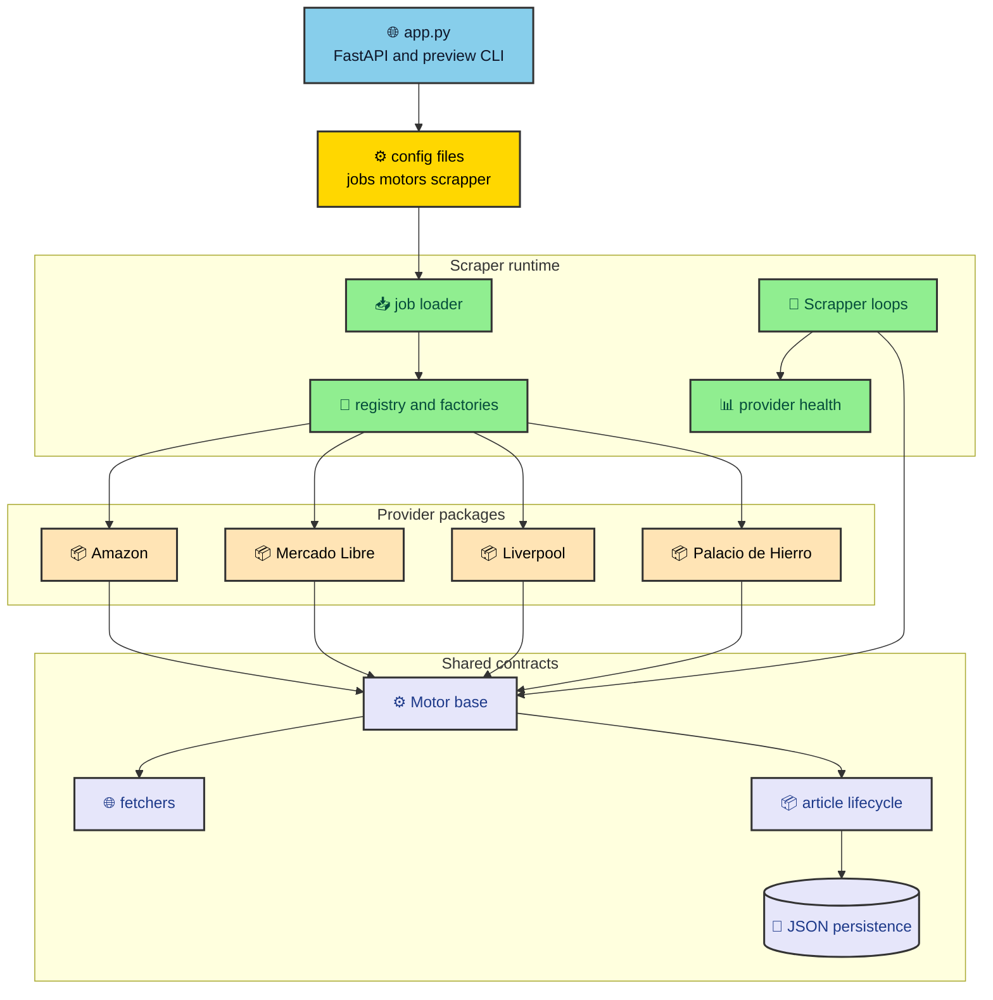

Store scrapers age at different speeds. Amazon changes result markup, Liverpool moves data through a Next.js payload, and Mercado Libre can gate a search behind browser behavior. MLScraper survives that variety by keeping provider knowledge inside provider packages while every store still implements the same motor contract.

---

## The boundary is intentional

The project has two kinds of code. Shared code owns the scrape algorithm, lifecycle rules, fetch strategy, config coercion, and persistence. Provider code owns URL rules, option enums, selectors, parser fallbacks, and store-specific blocked-page behavior. The repository is built so those two groups meet at a narrow contract.

The component map looks like this.



The key dependency rule is simple. `shared/` must not import from `provider/` or `scraper/`. Shared code should be reusable by every provider and by the runtime. Provider packages can depend on shared contracts because they implement those contracts. Scraper runtime code can assemble providers because runtime orchestration is its job.

That rule prevents a small parser fix from pulling the scheduler into provider code or a provider selector into shared code. It also gives tests cleaner targets. Parser tests can focus on provider output. Motor tests can focus on lifecycle and fetch behavior. Job tests can focus on configuration and factories.

---

## Every provider implements one page contract

The main provider method is `scrape_page`. The shared motor fetches content, builds a body with the current URL, calls the provider, and receives normalized items plus an optional next page URL. The provider does not save JSON, reconcile missing items, send Telegram messages, or schedule the next cycle.

The contract is intentionally small.

```python
def scrape_page(self, body: dict) -> tuple[list[dict], str | None]:
    return (
        [
            {
                "identifier": "provider-stable-id",
                "title": "Product title",
                "price": 123.45,
                "url": "https://example.test/product",
            }
        ],
        next_url,
    )
```

`identifier`, `title`, and `price` are required. `url` is optional but useful for alerts. `next_url` is `None` when pagination ends. If a provider sees a blocked or incomplete page, it should mark that state through existing motor behavior rather than returning an empty page that looks like a real disappearance.

This contract gives the shared motor enough information to update streams. A new identifier becomes an active product. A matching identifier with a different title or price records history. A previously active identifier that does not appear in a complete scrape moves toward hold and eventually finished.

---

## Providers parse different source shapes

Amazon parses HTML search result cards. It reads `data-component-type="s-search-result"`, uses the ASIN as the stable identifier, skips items without prices, and builds canonical product URLs from the ASIN. That parser is defensive because Amazon search pages include sponsored or incomplete cards.

Mercado Libre delegates most work to `provider/mercado_libre/parser.py`. The motor receives a parsed result that can include items, a next URL, a blocked reason, or an incomplete reason. Blocked pages set motor state and cooldown. Incomplete pages skip reconciliation so a gated or partial response does not finish real products.

Liverpool reads product records from the `__NEXT_DATA__` script tag. That makes it less dependent on visible HTML classes. If the script tag is missing, empty, malformed, or shaped differently than expected, the motor marks the scrape incomplete and stops pagination for that cycle.

Palacio de Hierro parses Constructor-backed product tiles from data attributes. It reads identifiers, names, prices, product links, total count, and page size from the HTML. Pagination increments the `start` query parameter until the page would exceed the reported total.

The providers are different because the stores are different. The shared contract is what keeps those differences contained.

---

## URL generation is also provider code

Provider packages own route generation because store route rules are not generic. A Mercado Libre seller category route has different constraints from an Amazon brand refinement or a Liverpool seller-filtered page route. Factories call provider URL builders instead of assembling route strings inside the loader.

That split keeps the loader from becoming a second provider layer. The loader validates shared structure and coerces known provider values. The factory decides how those values become a motor. The provider URL module decides how route pieces become a final URL.

The same boundary helps preview. `preview_job_url()` calls provider preview helpers with the same fields the factories use. The preview command can therefore show the final URL without constructing motors or starting a runtime loop.

When adding a provider, follow the same shape. Create `provider/<name>/`, implement a motor subclass, set `PROVIDER_KEY`, add URL and option helpers as needed, register a factory with a short key, and add parser plus configuration tests. Avoid shared scraper logic under the provider package.

---

## The registry keeps assembly boring

`MotorRegistry` maps provider keys to factory functions. It validates that each factory declares `job_id`, `url`, and `query`. That validation is small, but it stops a common drift where one provider slowly stops accepting the shared job contract.

The registry stores job entries separately from factories. `get_motors()` registers default factories once, loads jobs, clears old entries, registers current entries, and builds motors. If a provider key has no factory, the registry logs an error and skips that entry rather than crashing the whole application.

This behavior makes provider addition incremental. A provider can add its package, URL helpers, factory, docs, and tests without changing the scheduler. Once the factory is registered, the runtime sees it through the same path as every other provider.

The result is not glamorous, which is exactly the point. The provider boundary turns store-specific mess into one predictable motor list. After that, the runtime can apply the same concurrency, health, persistence, and notification rules to every store.

---

## Changing providers without crossing the line

Provider work usually starts from a store change. A selector stops matching, a JSON payload moves, a route builder needs another documented option, or pagination behaves differently. The right fix should stay close to the provider package unless the shared motor contract itself is wrong.

### Boundary rules for provider edits

Use these rules when reviewing provider work.

- Keep selectors, store payload assumptions, route builders, and option enums inside the provider package.
- Keep retry policy, fetch strategy selection, lifecycle transitions, and file persistence in shared code.
- Keep YAML validation in the loader only when a provider option needs coercion before factory construction.
- Keep storage naming in factories so provider parsers do not know about files.
- Keep notification formatting outside providers so stores only report normalized product items.

**A provider should explain the store, not the scraper runtime.** If a provider import starts reaching into scheduler helpers, health maps, Telegram code, or file-manager internals, the boundary has leaked. That leak makes the next provider harder to add and the current provider harder to test.

This boundary also affects test design. Provider parser tests should use tiny HTML or JSON fixtures and assert normalized items plus pagination. They should not start the scheduler. Motor flow tests should use fake providers to exercise shared behavior. Job tests should construct motors without hitting store pages.

Some changes really do belong in shared code. If every provider needs a new item field, update the shared article contract. If every provider needs a new fetch failure state, update the motor or fetcher. If only one store changed its payload, keep the fix under that store.

The practical payoff appears during incidents. A Mercado Libre gate should lead you to Mercado Libre parsing or browser policy. A Liverpool missing script should lead you to Liverpool. A duplicate job ID should lead you to the loader. A price history issue should lead you to lifecycle. Boundaries make those paths short.
