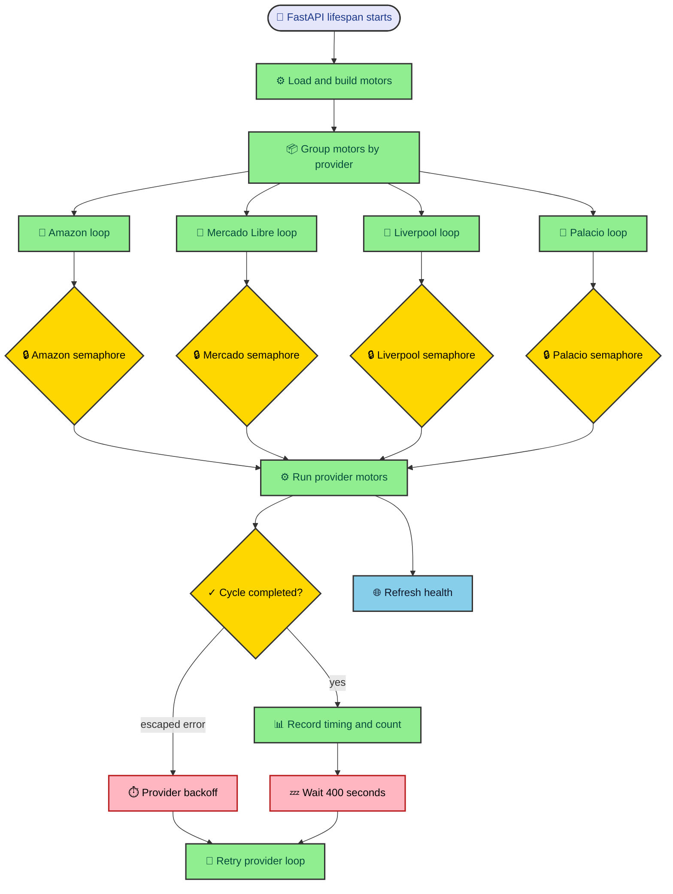

Background work is easy to start and surprisingly hard to explain. A task can be alive while every useful job waits, one store can fail while the others are healthy, and a green HTTP response can hide a blocked browser. MLScraper keeps those states separate. This chapter follows one scheduled cycle from FastAPI startup through provider queues, motor execution, backoff, and the health response an operator can inspect.

---

## FastAPI gives the scraper a place to live

The application entrypoint has two jobs. It owns the HTTP service and the lifetime of one `Scrapper` instance. The FastAPI lifespan hook creates the orchestrator, starts `Scrapper.run()` as an asynchronous task, and cancels that task when the process shuts down.

This does not make scraping request driven. Calling `GET /health` never starts a product fetch. The background task runs independently, while the route reads the latest health dictionary. That separation prevents web traffic from deciding when stores are contacted.

During construction, the orchestrator loads scheduler configuration, creates the optional Telegram notifier, builds motors from `config/jobs.yaml`, groups them by provider key, establishes provider limits, and initializes cycle health. The work happens before the recurring provider tasks begin so the runtime knows its complete starting inventory.

If no motors load, the web process stays alive and reports `idle_no_motors`. It logs a critical explanation and sleeps instead of crashing. A restart loop would say that the process cannot live. The idle state says the process is available but has no valid work.

The health route returns `503` only while the global scraper is absent or still marked `starting`. Once `run()` begins, top-level state changes to `running`. Provider entries then carry the detailed truth about current cycles.

---

## One provider gets one independent loop

The orchestrator groups all motors with the same provider key before starting recurring work. Amazon watches enter the `az` group, Mercado Libre watches enter `ml`, and the Liverpool and Palacio groups follow the same pattern.

The runtime relationship below shows how one process creates independent provider loops and gives each group its own concurrency gate.

Each loop records its start time, marks the provider as running, refreshes public health, and runs the provider’s motors. A successful group records finish time, duration, cycle count, and an `ok` status. It then sleeps for the orchestrator’s current 400-second interval.

An escaped provider-loop error records the message, sleeps for scheduler backoff, doubles that delay up to the configured maximum, and tries the provider again. A successful cycle resets backoff to the initial value. Other provider tasks continue because `asyncio.gather` lives inside each group loop.

This design prevents a Mercado Libre gate from delaying Amazon by default. Store policies and failure modes differ, so their schedules need separate recovery state. The service remains one process, but its useful work does not share one global pause button.

---

## Async work is concurrency, not magic speed

An asynchronous task can wait for network or sleep without blocking every other task. That makes `asyncio` a good fit for scheduled page work, where much of the cycle waits for responses, page readiness, configured delays, or cooldowns.

Concurrency still needs limits. Starting every configured watch at once could increase source pressure and make block behavior harder to diagnose. MLScraper creates one semaphore per provider and reads its limit from the motors in that group.

The current configuration gives Amazon and Mercado Libre a limit of one, while Liverpool and Palacio use two. These are project settings rather than universal recommendations. They reflect the service’s conservative default posture and can be changed in `config/motors.yaml`.

The first motor seen for a provider establishes that provider’s limit. If another motor asks for a different value, the runtime keeps the original and logs a warning. Invalid or nonpositive values fall back to one. A provider should have one coherent concurrency policy for the cycle.

Before waiting for the semaphore, a motor increments the provider’s queued counter. After it acquires capacity, the counter moves from queued to active. A `finally` block removes the active count whether the scrape returns normally or raises. Health therefore describes pressure around the semaphore instead of hiding it inside the event loop.

---

## One motor failure stays local

The provider runtime wrapper catches exceptions from `motor.scrape()` and logs the failing job. That catch matters because `asyncio.gather` would otherwise let one motor cancel the provider cycle’s ordinary success path.

The motor itself also contains failure boundaries. Fetch failure marks the scrape incomplete. A provider parser exception records `parse_error`. These expected scraping failures return from the motor without escaping into scheduler backoff. They remain visible through motor block state and logs.

Provider-level backoff handles broader failures that escape the motor task group or provider loop. The distinction keeps a broken watch from making the whole store look unavailable, while still giving the provider loop a recovery path for unexpected orchestration errors.

There is a tradeoff here. Catching motor errors keeps other jobs running, but it also means top-level provider status can finish `ok` while one motor reported a local block or parser failure. The provider health entry includes blocked job counts and reasons so the operator can see that mixed result.

This is why a single status word is not enough. Healthy scheduling and healthy store access are related but separate facts. The runtime reports both instead of compressing them into one green or red answer.

---

## The motor owns the page-to-state algorithm

Once a motor acquires its provider semaphore, the shared scrape algorithm takes over. It starts at the motor’s configured URL, selects the configured fetch strategy, asks the provider to parse one page, saves normalized items, and follows the returned next URL.

The motor can reuse one HTTP session across pages or create a fresh session for each page. Amazon currently requests a fresh session per page, while the shared default reuses one. Every next page waits for a randomized delay inside the configured range.

Results accumulate for the complete cycle. After pagination ends, the motor reconciles saved active and on-hold products against identifiers observed in those results. It skips that step whenever fetching or parsing marked the cycle incomplete.

The motor then saves article streams and clears first-run state. New and updated articles can call the runtime broadcast callback along the way. The payload includes job and provider context so notification routing never needs to inspect the motor object later.

This algorithm explains why provider classes stay small. Their main contract parses one fetched body into items and a next URL. Scheduling, concurrency, session handling, lifecycle, persistence, and notification context belong to shared code.

---

## Health is a compressed execution trace

The public response begins with top-level status, motor count, last completed cycle time, and duration. The provider map adds the information needed to separate scheduling state from source behavior.

| Health field       | What it tells an operator                                                              |
| ------------------ | -------------------------------------------------------------------------------------- |
| `status`           | Whether the provider is running, completed successfully, or hit an escaped loop error. |
| `job_count`        | How many configured motors belong to the provider.                                     |
| `configured_limit` | How many provider jobs can hold the semaphore together.                                |
| `active_jobs`      | How many motors currently own provider capacity.                                       |
| `queued_jobs`      | How many motors are waiting for that capacity.                                         |
| `blocked_jobs`     | How many motors currently carry a block reason or cooldown.                            |
| `block_reasons`    | Which fetch or parse conditions explain blocked motors.                                |
| `cycle_count`      | How many provider cycles completed successfully.                                       |
| `last_error`       | The most recent escaped provider-loop error.                                           |

Queue values need context. Two queued Liverpool jobs may be normal when the configured limit is two and four jobs began together. A queue that remains high across long cycle durations deserves investigation. Compare it with active counts, page delays, network behavior, and logs before increasing concurrency.

Block reasons also need scope. `browser_timeout` suggests the expected readiness selector never appeared. `browser_blocked` means a configured block selector or URL fragment matched. `fetch_failed` points toward exhausted request attempts. `parse_error` means fetched content reached provider code and failed there.

The endpoint is most useful as a routing table for attention. It does not replace logs or saved records. It tells you which evidence to read next and which layer is least likely to be responsible.

---

## Read a slow or failed cycle in order

Start with provider status and timestamps. Confirm that the loop began and whether it completed. A provider still marked running may simply be inside page work, a configured delay, or a slow browser wait.

Then compare active and queued jobs with the configured limit. If all capacity is active, queueing is expected. If no jobs are active and block reasons exist, inspect cooldown state and fetch policy. If neither counter moves, look for a provider-loop error or process-level cancellation.

Next read block reasons before editing selectors. A timeout can come from an incorrect readiness selector, slow navigation, or missing browser dependencies. A rate-limit cooldown calls for patience and configuration review, not a new product parser.

Finally, inspect provider fixtures and stored articles. A complete but wrong product set belongs near parser assumptions. A product moving to hold after a genuinely complete miss belongs to lifecycle. A new file with no history often points back to job identity or storage naming.

Following this order avoids the most common diagnostic mistake in scraper work, changing the parser because the visible symptom was missing products. The runtime may already know that no usable page reached the parser.

---

## An in-process scheduler has clear tradeoffs

Running the scheduler inside FastAPI keeps deployment small. One process starts the HTTP probe and provider loops together, so local operation needs no separate worker command, queue, or cron definition. Shutdown can cancel the task through the same lifespan boundary.

The arrangement also couples their fate. A process crash removes both health access and scheduled work. Restarting reconstructs motors from configuration and JSON, but in-memory cycle counters and recent errors begin again. Health is current state rather than a durable operational history.

There is no distributed lock preventing two service instances from running the same jobs against the same data directory. Operators should treat the current deployment as one scheduler process per storage root. Scaling HTTP replicas independently would require separating or coordinating background ownership.

The fixed successful-cycle sleep is easy to understand and limited in expression. It does not offer per-job calendars, missed-run recovery, or persisted schedules. Those features would justify a dedicated scheduler only when the use case needs them.

These limits are acceptable for the current project because they remain visible. The architecture demonstrates provider isolation and observable state without claiming distributed execution. A future queue or scheduler should preserve those properties instead of merely moving the loop elsewhere.

---

## The runtime makes background work reviewable

FastAPI starts and stops the service. The orchestrator groups work by provider. Semaphores limit concurrent jobs. Motors own page-to-state execution. Provider loops own recurring timing and broad backoff. Health turns those moving parts into inspectable state.

None of this guarantees that a store responds. It gives failure a scope. One job can be incomplete, one provider can back off, and another provider can finish normally. That is a better operating model than one scheduler status that hides every distinction.

Continue with [why every store needs its own adapter](/thejournal/mlscraper/provider_boundaries/) to see what happens after a usable page reaches provider code. For the lower-level request and block behavior, read [when a store blocks the scraper](/thejournal/mlscraper/fetching_and_backoff/).
