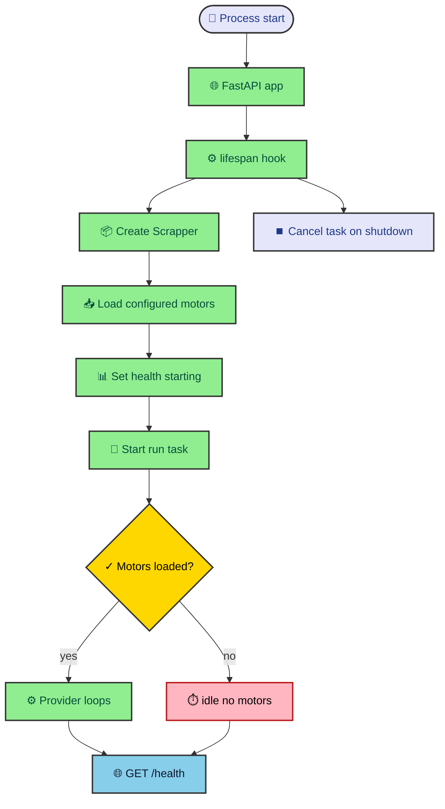

A scraper that lives inside a web server can turn strange fast. One request handler starts doing background work, another handler starts reading half-built state, and shutdown forgets to stop the job it started. MLScraper keeps that surface small. FastAPI owns startup and health. The scraper runtime owns the loops, provider limits, backoff, and notification routing.

---

## Startup has one job

The FastAPI entrypoint does very little by design. `app.py` creates a global `scrapper` slot, defines a lifespan hook, creates `Scrapper()`, starts `scrapper.run()` with `asyncio.create_task`, and cancels that task during shutdown. That is the whole bridge between the HTTP process and the scheduled scraper runtime.

That bridge is narrow for a practical reason. Web requests should not decide which providers exist, which jobs are active, or how often a provider retries after a failure. Those decisions belong to the runtime. FastAPI only gives the runtime a process to live in and a health endpoint that orchestrators can call.

The startup path looks like this.

`Scrapper.__init__()` does the first real runtime work. It loads scheduler config, creates a `TelegramNotifier`, builds motors from `config/jobs.yaml`, groups them by provider, records provider job counts, configures provider limits, creates provider health records, and initializes the public health dictionary.

When no motors load, the runtime does not crash the web process. It marks the service as `idle_no_motors` and sleeps. That choice makes misconfiguration visible through logs and health instead of turning a missing jobs file into a restart loop with less context.

---

## Provider loops are independent

`Scrapper.run()` changes top-level health from `starting` to `running`, then starts one async task per provider. The grouping happens before the loop starts, so all jobs for `az`, `ml`, `lv`, and `ph` run under their own provider loop. One provider can back off after an error without forcing every other provider into the same wait.

Each provider loop records its start timestamp, marks itself running, refreshes public health, and runs all of that provider's motors through `_scrape_with_limit()`. If a provider loop raises, it records the error, sleeps for the current scheduler backoff, doubles that backoff up to the configured maximum, and tries again.

Successful cycles reset the provider backoff. The loop records finish time, duration, cycle count, and clears the last error. Then it sleeps for `Scrapper.sleep_time` before the next cycle. The code currently sets that interval to 400 seconds, which makes the scheduler periodic without needing an external cron process.

This structure gives the health endpoint real operational meaning. A provider can show `running`, `ok`, or `error`. It can also report how long the last cycle took, how many cycles completed, and what the last error was. Those details are more useful than a single process-level green light.

---

## Concurrency stays provider scoped

MLScraper does not use one global semaphore for every job. `provider_runtime.py` creates semaphores per provider, with each provider receiving its configured limit from the motors it owns. If a provider asks for an invalid limit, the helper clamps it to one. If later jobs for the same provider ask for a different limit, the first configured value wins and the runtime logs a warning.

That behavior is intentionally conservative. Store limits tend to be provider-specific, and one aggressive provider should not starve another provider. Separating provider semaphores lets Amazon run at one job while Liverpool or Palacio de Hierro can use their configured limit.

`scrape_with_limit()` also updates active and waiting counters around semaphore acquisition. A job increments the queued count before it waits. Once it acquires the semaphore, it moves from queued to active. When `motor.scrape()` returns or fails, the active count drops. The health endpoint can then show pressure in the queue rather than hiding it inside the event loop.

The function catches motor exceptions and logs them. A single failing motor should not cancel the provider cycle. The provider loop still has its own outer error path for failures that escape the motor task group, but ordinary motor failures stay local and leave the rest of the provider's jobs available.

---

## Health is built for operators

The `/health` endpoint reads the runtime health dictionary. It returns `503` while `scrapper` is missing or the runtime still reports `starting`. After that, it returns the scraper status, last cycle finish time, last cycle duration, motor count, and a sorted provider map.

Each provider entry combines cycle state with live queue state. It includes configured limit, job count, active jobs, queued jobs, blocked jobs, and block reasons. Blocked jobs are counted from motor state, which means browser gate signals and rate-limit cooldowns show up beside scheduler health.

That detail is the difference between "the app is alive" and "the scraper is usable." A process can answer HTTP while every Mercado Libre job is blocked. MLScraper makes that distinction visible so an operator can decide whether to adjust browser selectors, increase a timeout, lower concurrency, or simply wait out a cooldown.

Health data also acts as a debugging map. If the top-level status is `ok` but one provider shows blocked jobs, start with fetch policy and provider parser tests. If queued jobs stay high, look at `CONCURRENCY_LIMIT`. If cycle duration jumps, inspect provider logs and page delays. The endpoint points you toward the next file to read.

---

## Notifications stay behind the runtime

The runtime receives item events from motors through the `caller` callback passed into `motor.scrape()`. The motor does not import Telegram. It builds an article payload, attaches `job_id` and provider context, and calls the broadcast function with either `new_element` or `is_updated`.

`TelegramNotifier` then routes the event through notification helpers. New items are skipped on the first scrape baseline. Price updates only become Telegram messages when the latest history entry contains a previous price and the reduction crosses the configured notification threshold in the routing helper.

This arrangement keeps the provider parser from knowing about chat messages. A parser returns product fields. The motor decides whether the item is new or changed. The notifier decides whether that change deserves a Telegram call. Each step has enough context to do its job without owning the whole chain.

The runtime article in this vault focuses on that ownership because it is the part future changes are most likely to stress. Adding a dashboard, a webhook, or another notification channel should start at the broadcast boundary, not inside provider packages.

---

## Reading failures from the loop

The provider loop gives failures a timeline. A cycle starts, a provider status changes to running, motors attempt work under the semaphore, and the provider either records success or records an error plus backoff. That means runtime debugging should begin with time, not with selectors.

### Runtime checks before parser edits

Use this order before changing provider code.

- Check whether the provider loop is running, ok, idle, or in error.
- Check whether jobs are active or waiting behind the provider semaphore.
- Check whether block reasons came from motors rather than the scheduler.
- Check the last cycle duration before changing page delays or timeouts.
- Check whether the provider loop backoff is growing after repeated errors.

These checks separate parser failure from scheduler pressure. A provider can be healthy while one motor reports `browser_blocked`. A provider can also look slow because too many jobs are queued behind a limit of one. Those situations need different fixes.

**The runtime should explain enough for the next file to be obvious.** If it does not, improve health context before adding more logs inside provider code. Logs are useful while you are debugging. Health is useful every time the service runs.

One subtle detail is the first successful startup state. The top-level health changes from `starting` to `running` before provider cycles finish. The readiness endpoint returns `503` only while the scraper is missing or still starting. After that, provider-level state carries the details. That gives orchestrators a simple gate and gives maintainers richer provider data.

Another detail is the no-motors branch. The process keeps running because an empty config is an operational problem, not a Python import problem. Returning health in that state is more useful than crashing because it can be inspected by the same deployment and monitoring tools as a normal run.

When this runtime grows, keep those choices intact. Add new outputs through the runtime boundary. Keep provider loops independent. Make new scheduler state visible through health. That habit keeps the service understandable even when the number of stores and jobs increases.
