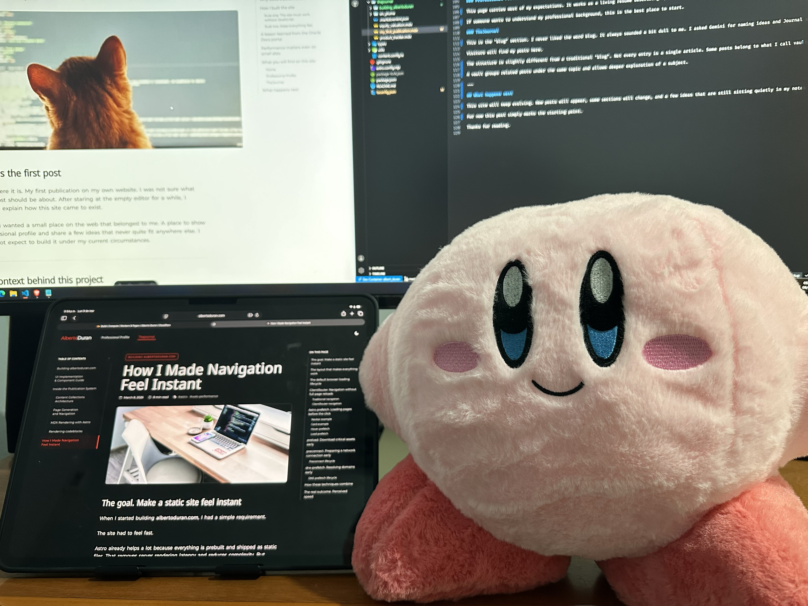

Hi. Well… here it is. My first publication on my own website. I was not sure what the first post should be about. After staring at the empty editor for a while, I decided to explain how this site came to exist.

For years I wanted a small place on the web that belonged to me. A place to show my professional profile and share a few ideas that never quite fit anywhere else. I just did not expect to build it under my current circumstances.

---

## The context behind this project

Last August I was laid off after almost five years with my company. The interesting detail is that the layoffs were not caused by a shrinking business. Around ten percent of the global workforce was affected even though the company was still growing.

The boom of AI hit hard.

I will not hide it. The past months have been difficult. The timing could not have been worse for me, and at the same time the job market became extremely competitive.

Every week new layoffs appear in the industry and more experienced professionals enter the same hiring pool.

So this is where I stand right now, trying to move forward while still holding on to my dreams.

---

## Why build a personal site now

During this period I kept thinking about something. A CV and a LinkedIn profile only tell a small part of the story, and a short interview rarely shows what a person is truly capable of.

This site gives me a place to show that work. It also gave me something else that turned out to be just as important. Momentum. Working on it gave structure back to my routine and reminded me that building things is still what I enjoy the most.

---

## How I built the site

Before writing a single line of code I had a few clear principles.

### Rule one. The site must work without JavaScript

The core experience must work even if scripts are blocked. Content should load and remain readable with plain HTML and CSS. Scripts can enhance the experience later, but they should never be required for basic functionality.

### Rule two. Keep everything fast

All pages must be prebuilt and ready to load immediately. There is no unnecessary work happening in the browser and no heavy runtime logic. Just static content delivered quickly to the visitor.

### Rule three. A simple deployment system

The deployment process should remain simple. Updating the master branch should trigger the deployment automatically.

During the build process the site should generate its structure dynamically. This avoids tedious manual configuration, such as setting navigation buttons between publications. The build process should handle those details for me.

---

## A lesson learned from the Oracle Docs portal

While working on the frontend of the Oracle documentation portal, one thing always bothered me. The pages depended heavily on scripts.

The documentation pages are a good example. When you visit one, the initial HTML is already delivering the content. But a CSS rule hides it, and it can only be removed by a script.

The behavior was intentional so the framework could render the UI. Guess what happens if you block scripts. You open the page, and that important guide you needed is simply not there.

For a documentation portal, that design never felt right. I mentioned it several times as a drawback. But fixing it required backend changes, and since I worked on the frontend side the behavior stayed the same.

> I even asked DevOps for permission so I could stop this nonsense.

That experience stayed with me. When I built this site, avoiding mandatory scripts became a priority. A tiny site like this should not depend entirely on frameworks and heavy runtime logic.

> The automatic highlight in the "On This Page" navigation uses a small script. Without it the navigation still works. It just stops being fancy.

---

## What you will find on this site

Right now the site contains three main sections.

- Home
- Professional Profile
- TheJournal

Each one has a specific role.

### Home

The homepage does what a homepage should do. It helps visitors understand what they can find across the site.

At the top there is a hero section with the site name, which happens to be my name, a short welcome message, and a link to my professional profile.

Below that there is a component highlighting key points of my professional background. It might feel slightly redundant but it helps guide visitors toward the profile page.

Then comes my favorite section of the entire homepage.

The informative and absolutely essential statistics of my team and its next match with the latest available data. I felt visitors deserved access to this critical information as soon as possible.

And finally there is a small section highlighting recent posts from TheJournal. Slightly less important than football statistics of course.

### Professional Profile

This page carries most of my expectations. It works as a living resume describing my skills, experience, education, and personal projects.

If someone wants to understand my professional background, this is the best place to start.

### TheJournal

This is the "blog" section. I never liked the word blog. It always sounded a bit dull to me. I asked Gemini for naming ideas and Journal appeared on the list. I liked it and kept it.

Visitors will find my posts here.

The structure is slightly different from a traditional "blog". Not every entry is a single article. Some posts belong to what I call vaults, similar to the concept used in Obsidian.

A vault groups related posts under the same topic and allows deeper exploration of a subject.

---

## What happens next

This site will keep evolving. New posts will appear, some sections will change, and a few ideas that are still sitting quietly in my notes will eventually make their way here.

For now this post simply marks the starting point.

Nobody stopped me from adding this photo of my Kirby.

Thanks for reading ❤️
